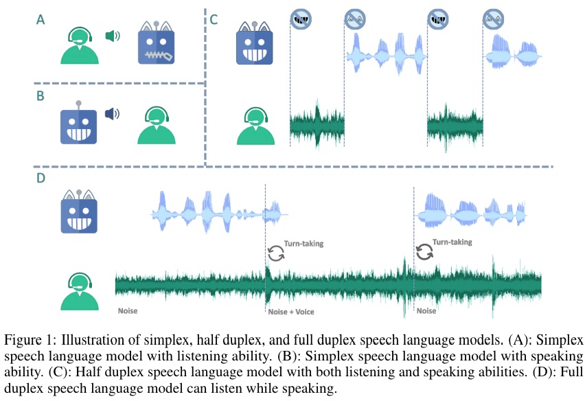
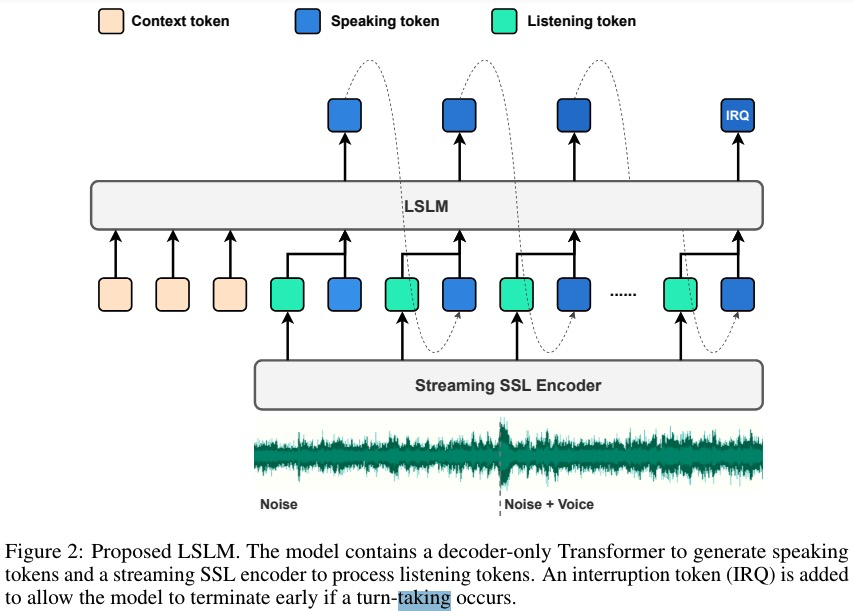
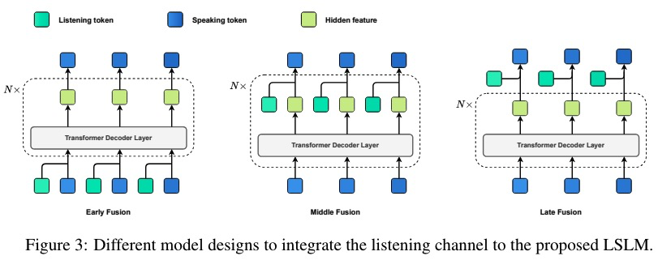

# Language Model Can Listen While Speaking

8月发布的全双工对话模型论文，同时建模TTS和ASR，交互式对话建模中的全双工模式，增强实时互动；
为此提出了一个新的模型结构，listening-while-speaking language
model，这是一个同时具备听和说两个链路的端到端的系统。对于对话生成采用的是基于token的纯解码器的结构。
对于音频输入采用的是一个流式的自监督编码器；论文实验了三种不同的融合方式，早期融合、中期融合和后期融合，其中
中期融合的效果最优（achieving an optimal balance between speech generation and real-time interaction）；
在command-based FDM 以及voice-based FDM上进行实验；
真实场景下的交互对话系统有两个重要的特点：

* Listening channels are not always clean：比如高频噪声（手机铃声），低频噪声（白噪声）；
* It is possible that the iSLM interacts with an unseen speaker.
  提出了两个场景：基于命令的FDM，与特定的指令交互；Voice-based FDM：与未知speaker进行交互；实验结果表明，
  具有监听通道的 LSLM 对噪声输入具有鲁棒性，并且对话轮转换很敏感。
  
  现有的模型都不支持打断，说话turn转换；
  在全双工的模型中，模型不仅需要根据当前的context已经当前的回复而且需要另一个channel的信息来产生下一个回复的token。
  $ R ,S,C$
  比如在预测过程中，时刻$t-1$当前的speak流会生成一个输出$r_{t-1}$并且listen流会获得一个输入$s_{t-1}$该输入会同时输入模型，从而影响speak流的下一个输出$r_t$；这种方式能够很好的在对话中融入不同channel的信息，同时提升实时交互的准确性和流畅度；

  ## Speak流
* 这里用的是一个自回归的基于token的TTS模型。不同于VALL-E类型的模型-使用多层RVQ的方式并结合自回归和非自回归方法；该模型使用了一个简单的网络层用于离散化speak tokens。这种设计更符合实时交互的要求，因为他不需要等待AR token完成后在执行NAR操作。

  $$
  R = Enc(X^{R});
  R^{q} = Qnt(R)
  $$

  学习目标是给定上下文预测下一个音频token。预测时根据计算好的下一个token的概率进行采样，并输出到解码器得到最终的输出；

  ## Listening 流

  给定一个音频输入$X^{S}$，SSL编码器（这里和Speak流共用一个编码器），但是会过一个映射层而不是VQ层。

  

这里其实是通过一个encoder不同的映射产生不同的输出流，然后在AR的时候，综合这两个流的结果。这里还实验了不同阶段混合不同流的效果，早期混合是在AR预测之前就混合，中期混合是在每个transformer-block中都混合，后期混合指的是在输出logits前混合即softmax操作之前；

**为了建模对话turn转换的情形，这里额外添加了一个打断token，如果发生了打断（说话人切换）现象就需要预测该token**如果打断发生了，那个模型需要停止speak同时检测时间间隔，比如需要停止多少秒；

## 模型细节

12层transform，12个注意力头，768维的hidden，3072的中间层维度，总计106M的参数量；

SSL encoder vq-wav2vec(34M的参数)用来抽取音频feature并转成audio-token.

A GAN-based token-to-waveform vocoder：用来将离散的音频token转成speech的waveform；

**训练数据：**

Command-based FDM：检测到特定的关键词就进行打断；

Voice-based FDM：可以被不同的词打断；

对于每个样本，噪声以50%的概率，打断也以50%的概率添加至listening tokens。如果一个样本被选择应该包含打断，我们会要求在打断开始后输出IRQ token u=0.5 second 然后停止输出后面的token；This ensures that the model can correctly handle different audio signal combinations in the listening channel.采样的时候采用temperature 1.0以及top-p 0.99;

🤔：一个编码器可以输出不同的工作流，用于处理不同的任务，最终预测的时候再将他们综合起来；
