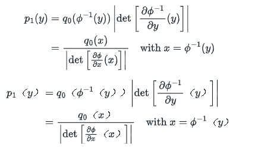

# An Introduction To Flow Matching

介绍：

*流匹配 （FM）* 是最近的一种生成建模范式，在深度概率 ML 社区中迅速流行起来。流动匹配结合了*连续归一化流 （CNF）* 和*扩散模型 （DM）* 的各个方面，缓解了两种方法都存在的关键问题。在这篇博文中，我们将从基础知识开始介绍 FM 模型的主要思想和独特属性。

生成建模：

假设我们有一些样本，来自于一个未知分布P1，我们需要用这些样本学习出一个分布来近似P1.实践中，通过从近似分布中快速采样，生成新的样本。

---

流匹配本质上与连续归一化流（CNF）关系最密切：首先讨论CNF相关知识，然后说明CNF的困难以及FM模型如何解决这些困难；

Normalising Flows:

$\phi$是一个连续可微的函数，并且具有可微的逆函数。通过$x = q_0, y = \phi(x)$从q0采样得到p1,通过变量替换我们可以计算p1的概率密度：

我们可以通过变换从一个分布进入到另一个分布。

通过变换 ϕ 将一个基础分布 q0 转换为另一个 p1 很有趣，但它在生成建模中的直接应用是有限的。在生成建模中，目标是仅使用可用样本来近似分布。因此，这个任务需要转换 ϕ 来将样本从 “简单” 分布（例如 N（0，I））映射到近似数据分布。然而，由于数据分布的高度非高斯性质，如前面的示例所示，简单的线性变换是不够的。这将我们带到了作为灵活转换 ϕθ 的神经网络。**然后，关键任务变成了优化神经网络的参数 θ。**

---

通过最大似然来学习流参数：

让我们将流动 ϕθ 诱导的参数密度表示为 p1≜[ϕθ]#p0。

一个自然的想法是最大化似然函数：

$argmax_{\theta} \mathbb{E}_{x\sim \mathcal{D}} [\log p_1（x）]. $

将 ϕθ 参数化为深度神经网络会导致几个约束：

* 我们如何强制执行**可逆性**？
* 我们如何计算它的逆？
* 我们如何有效地计算**雅可比行列式**？

因此，设计流 ϕ 需要权衡（流的表达性，从而权衡概率模型的表达性）与上述考虑因素，以便可以有效地训练流。

依赖于残差连接的表达流已被提议作为表达性和有效行列式估计之间的一个有趣的中间地带。它们采用以下形式：

$$
\phi_k（x） = x + \delta ~u_k（x）
$$

其中可以获得对数似然的无偏估计. 与自回归流（Huang et al.， 2018， Larochelle and Murray， 2011， Papamakarios et al.， 2017）和低秩残差归一化流（Van Den Berg et al.，2018）相反，*全秩*雅可比矩阵的更新通常会导致更具表现力的转换。

我们还可以组合这样的 flow 来获得一个新的 flow：

$$
\phi = \phi_K \circ \ldots \circ \phi_2 \circ \phi_1。
$$

然后，通过对每个流的贡献求和来给出模型的对数似然:

$$
\log q（y） = \log p（\phi^{-1}（y）） + \sum_{k=1}^K \log \det\left[\frac{\partial \phi_k^{-1}}{\partial x_{k+1}}（x_{k+1}）\right]
$$

其中：$x_k=\phi^{-1}_K \circ \ldots \circ \phi_k^{-1}(y)$.

---

视频讲解：https://www.bilibili.com/video/BV1Wv3xeNEds/?spm_id_from=333.337.search-card.all.click&vd_source=5cb76fc819dfeef02803a9a43048512c

Flow-Matching -> Rectified Flow(直流)
