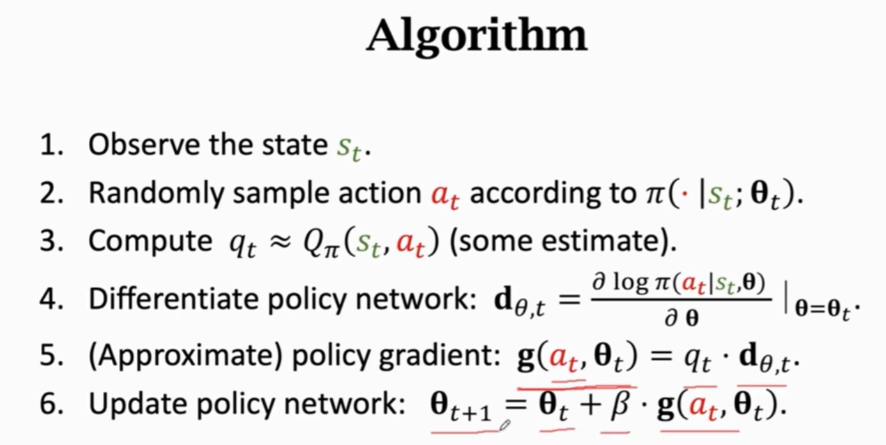
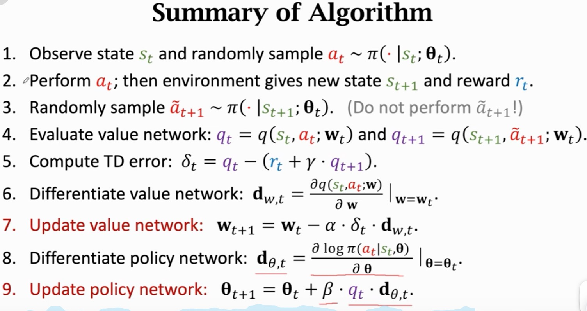

### 基本概念

* 概率
* 概率密度函数
* 期望
* 采样
* 专业术语：
  * state：
  * policy：根据观测到的状态进行决策
  * Reward：不同的情况可能有不同的奖励
  * state transition：$p(s`|s, a)$
  * 累积折扣奖励： U_t = R_t + rR_{t+1} + ...
  * 动作价值函数：$Q_{\pi}(s_t, a_t) = E[U_t|S_t=s_t, A_t=a_t]$
  * 最优动作价值函数：$Q^{*}(s_t, a_t) = max_{\pi}Q_{\pi}(s_t, a_t)$
  * 状态价值函数：$V_{\pi}=E[Q_{\pi}(s_t, A)] = \sum_{a}\pi(a|s_t).Q_{\pi}(s_t, a)$

#### DQN:

$$
a^{*} = argmax_a Q^{*}(s, a)
$$

学习一个函数来近似Q*，network:Q(s,a;w) -> Q*(s, a)

TD 算法（不需要游戏结束在更新参数，使得每一步都能更新参数，引入每一步的执行结果），开始的预测应该与执行N步后的预测一致，用执行N步后的结果更新一开始的预测：

$$
Q(s_t, a_t; w) \approx r_t + r * Q(s_{t+1}, a_{t+1};w)
$$

TD target:$y_t=r_t + r . Q(s_{t+1}, a_{t+1}; w_t) = r_t + r .max_aQ(s_{t+1}, a; w_t) $

loss: $L_t = 1/2[Q(s_t, a_t; w) - y_t]^{2}$

#### Policy Gradient

policy network： Use a neural net to approximate $\pi (a|s)$

$$
V_{\pi}(s_t) = E_A[Q_{\pi}(s_t, A)] = \sum_{a}\pi(a|s_t) . Q_{\pi}(s_t, a)
$$

目标函数最大化：$J(\theta)=E_s[V(S;\theta)]$

---

#### Actor - critic

Policy network (actor): $\pi (a|s; \theta)$

s -> f_s -> Dense(f_s)

Value network (critic): $q(s,a; w)$

s -> f_s, a -> f_a, x=concat(f_s, f_a) -> Dense(x) -> q(s,a;w)

训练：

$$
V(s; \theta, w) = \sum_a \pi(a|s; \theta).q(s,a; w)
$$

更新参数$\theta$和w

* 更新策略网络用来增大state-value $V(s; \theta, w)$
* 更新价值网络q(s, a; w) 使得更好的估计回报

训练过程：

* 观测状态S
* 根据策略采样动作a_t, $\pi(.|s_t;\theta)$
* 执行动作a_t，观测到新的状态s_{t+1}同时获得回报r_t
* 使用TD更新W(价值网络)

  * 计算$q(s_t, a_t; w_t),q(s_{t+1}, a_{t+1}; w_t)$
  * TD目标：$y_t=r_t+r.q(s_{t+1}, a_{t+1}; w_t)$
  * Loss: $L(w)=1/2[q(s_t,a_t;w)-y_t]^{2}$
* 使用policy gradient 更新$\theta$（策略网络）

  * 根据策略采样a(蒙特卡洛近似)
  * 执行梯度上升
    * $$
      \theta_{t+1} = \theta_{t} + \beta . g(a, \theta_{t})
      $$
    * $$
      g(a, \theta) = \frac{\partial log \pi(a|s; \theta) }{\partial \theta} . q(s_t, a; w)
      $$

---

#### 蒙特卡洛

#### Random Permutation

所有序列都可能出现且出现的概率相同

Uniform Random Permutations: 任意位置上出现N个候选值之一的概率都是1/N

Fisher-Yates Shuffle:

输入: n

输出：均匀随机生成[0, n-1]的数
