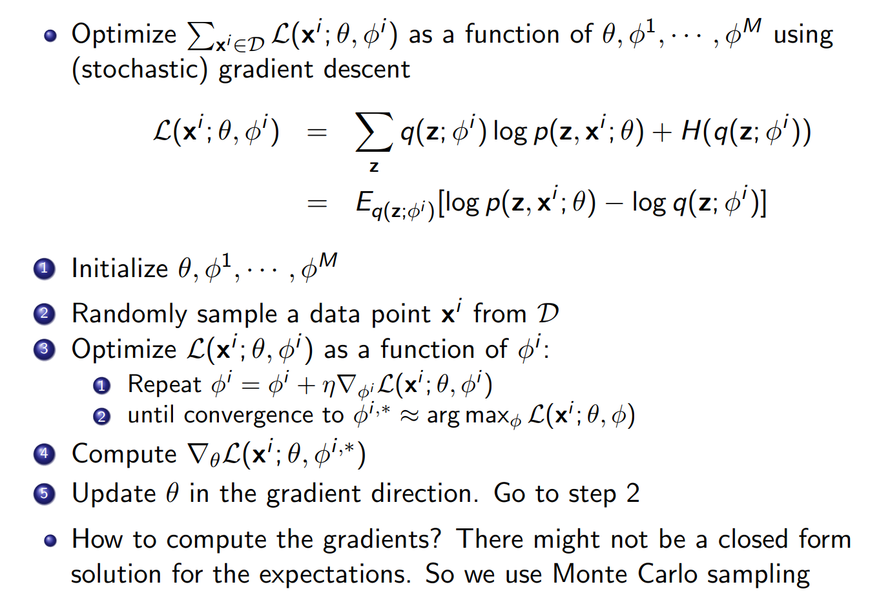
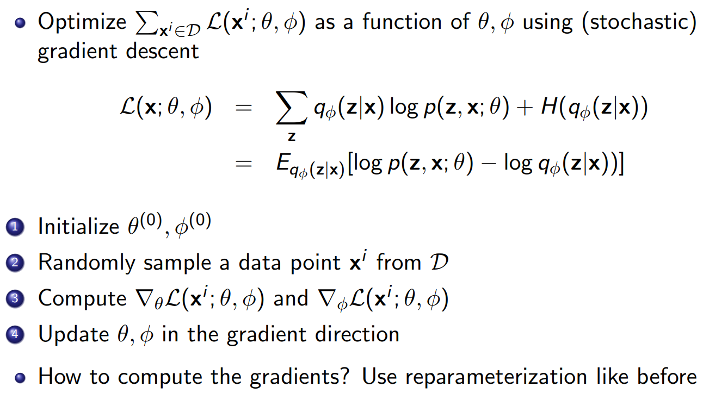
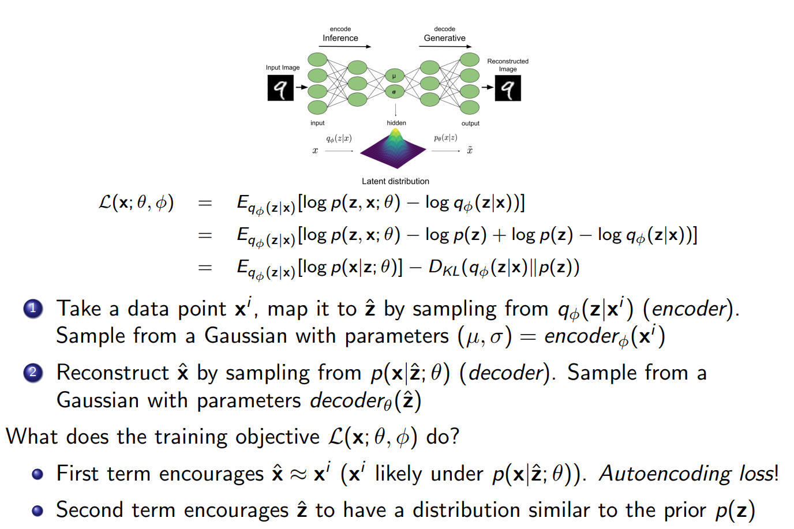
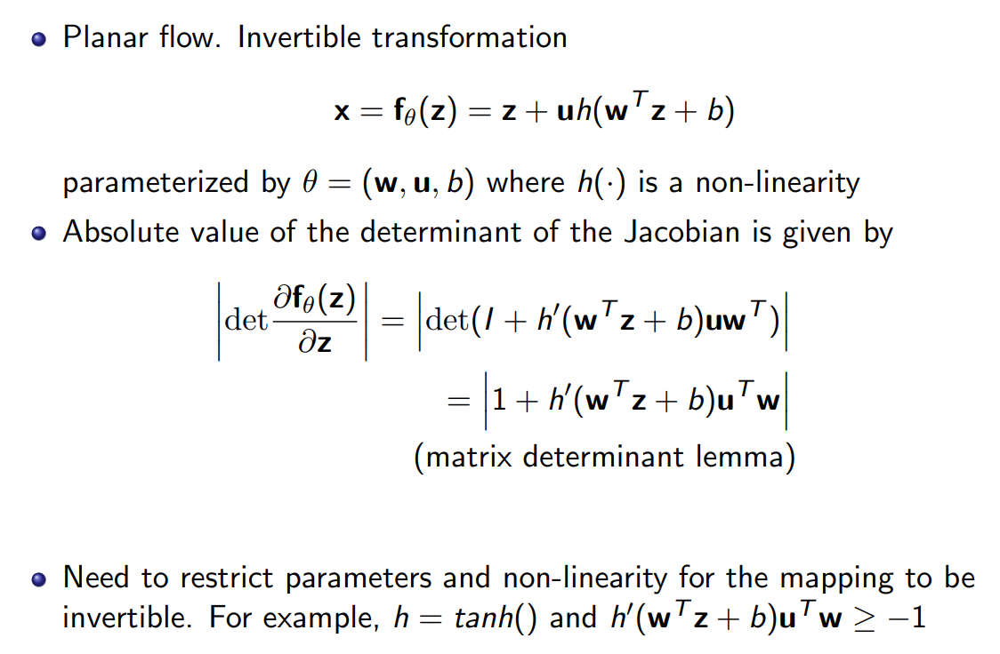

# VAE 学习笔记

首先和自回归的模型对比一下：

自回归模型：

* 基于链式法则的概率分解具有通用性
* 通过条件独立或者神经网络参数化来压缩表示

优点：

* 容易获得likelihoods
* 容易训练

缺点：

* 需要定义顺序
* 序列的生成
* 没法通过无监督的方式学习特征

---

隐变量模型

动机：比如人物图片长什么样，其实由有很多的变量，比如性别，年龄，眼睛颜色，头发颜色等因素控制，然后除非有人工标注，不然这些变量是不可知的（latent variable）观察不到。能否使用隐变量Z，显式建模这些因素？

一般高级别的特征是难以被直接观测的，图片上能直接观测的都是像素点，我们用Z表示这些高级别的特征，如果Z选择合适的话，建模$P(x|z)$比直接建模P(X)要简单得多。同时，如果我们训练了这个模型，我们可以通过P(Z|X)生成这些高级别的特征。

问题是：难以手动的选择这些特征条件（发型，年龄等）一种比较容易想到的方式就是使用神经网络来建模这些条件：

* 选择Z的初始分布为高斯分布（z-N(0, 1)）。
* p(x|z) = N (u(z), h(z)), u和h都是神经网络。

初始化采用简单的分布，通过神经网络将他变成复杂的分布，并且我们希望经过训练后,Z能够对应有意义的特征因子，并且能够通过p(z|x)

得到。这里有一个比较简单的例子就是混合高斯模型：

* z是多项式分布
* P（x|z=k）= N(u_k, h_k)

根据多项式分布进行采样生成高斯分布的参数，通过混合高斯分布进行采样得到数据点。这里的不同的高斯可以看成是不同的聚类中心（可用于做无监督的聚类）。

考虑一个图像他的可观测部分是x,不可观测部分是z,那么如果我们如果要得到完整的X，就必须考虑Z的所有可能选择，并取其中概率最大的。

$$
\sum_z p(X=x,Z=z;\theta) = \sum_z p(x^{-},z;\theta)
$$

考虑对一个数据集进行最大似然估计：

$$
\log \prod_{x\in D} p(x;\theta) = \sum_{x\in D} log p(x;\theta) = \sum_{x\in D} log \sum_{z} p(x,z;\theta)
$$

这里面最大的问题是需要对z求和，这基本上是无法计算的，对于离散变量来说无法穷举所有的可能，对于连续变量来说没法计算积分，也无法计算梯度。因此需要做近似，并且近似的成本要尽可能的小。在这里首先想到的是蒙特卡洛近似：

* 首先均匀的采样Z，然后通过$ \sum_z p_{\theta} \approx |Z| \frac{1}{k} \sum_{j=1}^{k}p_{\theta}(x,z^{j})$近似。

但是这样做的问题是效率很低，因为对于大多数Z而言P(x, z)都是很微小的值。不同的Z带来的结果的方差也会很大，我们需要一个更加聪明的方法采样Z。顺带提一下，当我们采样的Z是X本身就具有的属性的时候，是最高效的即根据分布P(z|x)来采样。考虑从分布q（z）采样，上述对数似然的计算方式如下：

$$
log P_{\theta}(x) = log (\sum_{z\in Z} p_{\theta} (x, z)) = log(\sum_{z\in Z} \frac{q(z)}{q(z)}p_{\theta}(x,z)) = log(E_{z \sim q(z)}[\frac{p_{\theta}(x,z)}{q(z)}]
$$

因为log是一个凸函数，使用Jensen不等式：

$$
log (E_{z \sim q(z)}[f(z)]) = log(\sum_{z} q(z)f(z)) >= \sum_z q(z) logf(z) = E_{z \sim q(z)} [log f(z)]
$$

$$
f(z) = \frac{p_{\theta}(x,z)}{q(z)}
$$

因此：

$$
log(E_{z \sim q(z)}[\frac{p_{\theta}(x, z)}{q(z)}]) >= E_{z \sim q(z)}[log \frac{p_{\theta}(x,z)}{q(z)}]
$$

上式也被称为ELBO。

如果$q(z) = p(z|x;\theta)$则等式成立，也就是说我们如果选择从最有可能的后验中采样是最有效的：

$$
\sum_{z} p(z|x,\theta) log \frac{p(x,z;\theta)}{p(z|x;\theta)} = \sum_{z} p(z|x;\theta) log \frac{p(z|x;\theta)p(x;\theta)}{p(z|x;\theta)} = \sum_{z} p(z|x;\theta) logP(x;\theta) = log p(x;\theta)
$$

$$
D_{KL}(q(z)||p(z|x;\theta)) = -\sum_{z}q(z)logp(z,x;\theta) + logp(x;\theta) - H(q) >= 0
$$

当q(z) = p(z|x)的时候KL散度为零，则有：

$$
log p(x;\theta) = \sum_{z}q(z)logp(z,x;\theta) + H(q)
$$

如果q(z)与p(z|x)越接近那么ELBO与真实的likelhood也越接近。

---

如何在整个数据集上优化ELBO：

这里隐变量z的分布由M个参数定义，先固定$\theta$只优化$\phi$然后在优化$\theta$,EM算法的步骤。先估计隐变量的分布，然后再计算数据似然。**如何计算梯度？**

使用蒙特卡洛采样z1...zk,得到对ELBO的估计：

$$
E_{q(z;\phi)}[logp(z,x;\theta) - logq(z;\phi)] \approx \frac{1}{K} \sum_k log p(z^{k}, x; \theta) - log q(z^{k}; \phi)
$$

假设$q(z,\phi)$是可以计算且易于采样，那么对于$\theta$的梯度可以直接计算，**但是对于$\phi$的梯度没法直接计算因为期望项的下标包含有$\phi$** 可以使用更通用的REINFORCE算法来计算。对于一些比较简单且连续的Z，可以使用重参数化技巧来计算。

**自编码器视角：**

附录：

对于想要计算一个期望有参数的项的梯度如：

$$
E_{q(z;\phi)}[r(z)] = E[q(z;\phi)r(z)dz]
$$

可以将r当成是奖励函数，最通用的做法是使用REFORCE算法来估计。

---

# Normalizing Flow

自回归模型能够计算对数似然，但是没法学习隐藏特征，VAE能够学习隐藏特征但是没法直接计算似然，能否设计一个能够计算似然的隐变量模型？

对于一个模型分布$p_{\theta}(x)$我们希望它具有两个特点：首先方便评估具有确定的概率密度形式（方便训练），其次易于采样（方便生成）；

流模型：通过可逆变换将简单的初始分布（方便采样和密度估计）变换成复杂的数据分布！

回顾一下VAE模型，我们先从一个简单的分布中采样隐变量Z，然后估计P(x|z)，但是这个概率很难计算因为要穷举所有可能的产生数据X的Z，这在实际中基本上是不可能的，然而使用蒙特卡洛采样估计会有方差大的问题。如果$x=f_{\theta}（z）$是一个确定且可逆的函数，那么对于任意的x有唯一确定的z(避免了对所有可能的z进行采样。)

假设X=f(Z), Z = f(-1)(x) = h(x),我们知道Z的概率分布如何计算X的概率分布？根据变量替换可以有：

$$
p_x(X) = p_z(h(x))|h^{'}(x)|
$$

对于通用情形,用于计算likelihood,z与x要求连续且具有相同的维度：

$$
p_x(x) = p_z(f^{-1}(x)) |det(\frac{\partial f^{-1}(x)}{\partial x})|
$$

Normalizing：在应用一个可逆变换之后，通过变量替换能够计算出变换后的概率密度。

Flow：可逆变换可以相互叠加；

最大化似然估计：

$$
max_{\theta} logp_x(D;\theta) = \sum_{x\in D} log P_z(f_{\theta}^{-1}(x)) + log|det(\frac{\partial f_{\theta}^{-1}(x)}{\partial x})|
$$

数据似然估计：x->z

数据采样:z->x

隐藏表示（数据编码）:$z=f_{\theta}^{-1}(x)$

理论上是可以计算的，但是实际操作中要尽量满足以下要求：

* 先验分布Z要尽量简单，便于从中进行采样和计算似然。
* 对数似然的估计需要能够很快的评估x->z的mapping。
* 采样要求z->x的mapping要高效。
* 计算对数似然要计算n x n大小矩阵的雅可比行列式，复杂度为$O(n^{3})$，选择具有特定雅可比矩阵结构的变换，比如上三角结构（行列式为对角线值的乘积，O(n)）。

列如：

