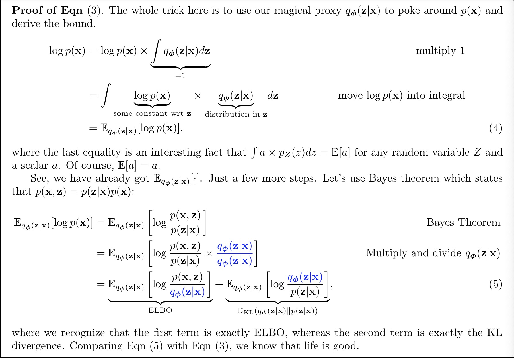
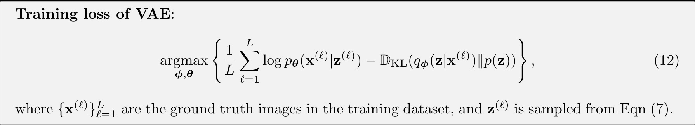
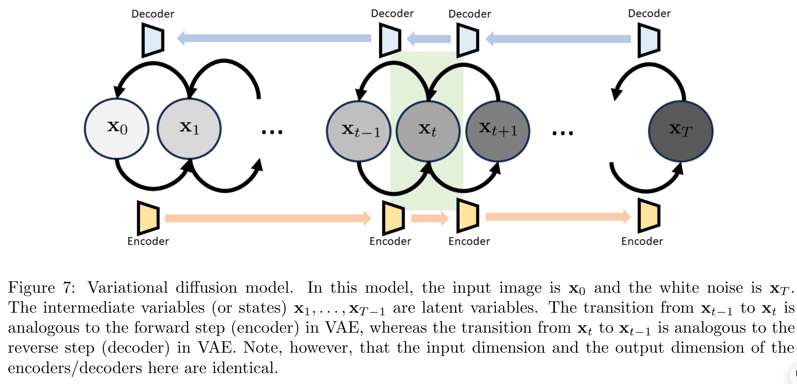
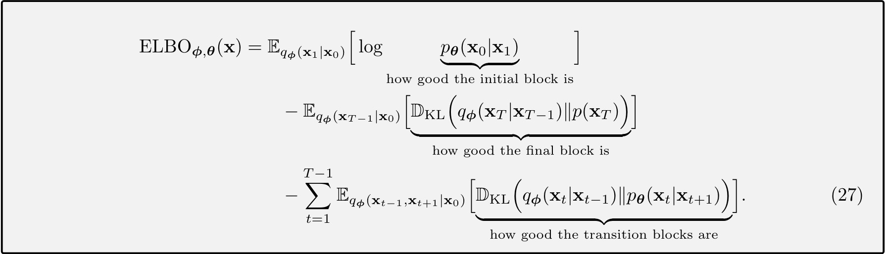

# Tutorial on Diffusion Models for Imaging and Vision

今年5月发表的一篇扩散模型的教程，适用于对扩散模型感兴趣的本科或者研究生同学；首先介绍了一些VAE的基础然后是DDPM以及score-matching模型以及SDE（随机微分方程）

## VAE

首先介绍了一些VAE的基础；从Latent code生成图片的方法；

VAE:

* p(x) 输入x的分布；p(z)隐变量的分布；p(z|x) encoder，p(x|z) decoder.

考虑高斯混合模型：$P_z(k) = P[Z=k], \sum_{k=1}^{K} \pi_k = 1 $

隐变量：$z\in{1, ..., K}$则P(x|z):

$$
p_{x|z}(x|k) = N(x|u_{k},\sigma_{k}^{2}I)
$$

边缘分布P(x):

$$
p_x(x) = \sum_{k=1}^{K}p_{x|z}(x|k)p_z(k) = \sum_{k=1}^{K}\pi_kN(x|u_k, \sigma_{k}^{2}I)
$$

这里为了简化问题假设mean和variance都是已知且固定的（也可以通过EM算法来估计）；

**Encoder**：从x中采样获得z,P(z|x) = argmax_z P(z|x)

Decoder: 从z中采样x, P(x|z) = N(x|u_k, sigma_kI)

训练loss(ELBO):

$$
ELBO(x) = E_{q_\phi(z|x)}[log\frac{p(x|z)}{q_\phi(z|x)}]
$$

首先ELBO是logp(x)的下界：

$$
logp(x) = E_{q_{\phi(z|x)}}[log\frac{p(x,z)}{q_{\phi(z|x)}}] + D_{kl}(q_{\phi(z|x)}|p_{z|x}) \\
>= E_{q_{\phi(z|x)}}[log\frac{p(x,z)}{q_{\phi(z|x)}}] = ELBO(x)
$$

how good the lower bound is：确保q(z|x)与p(z|x)接近，参数先验

$$
ELBO(x) = E_{q_\phi(z|x)}[log\frac{p(x|z)}{q_\phi(z|x)}] \\
        = E_{q_{\phi(z|x)}[logp\theta(x|z)] - D_{kl}(q_{\phi}(z|x)||p(z))}
$$

第一项可以看出是decoder（重构），第二项是encoder（匹配先验）；

### VAE的训练

训练需要样本（x, z）,问题在于如何获取z,输入x,使用一个神经网络来估计mean和variance，然后从高斯分布中采样得到z.采样过程(从采样技巧)：

$$
x = u + \sigma N(0, I)
$$

如果我们假设重构误差符合高斯分布：

$$
(x^{-} -x \sim N(0, \sigma_{dec}^{2}) )
$$

则：

$$
logp_{\theta}(x|z) = logN(x|decode_{/theta}(z), \sigma_{dec}^{2}I) = -\frac{||x- decode_{\theta}(z)||^{2}}{2\sigma_{dec}^{2}}
$$

### Loss function

approximate the expectation by Monte-Carlo simulation

---

## DDPM

扩散模型是增量更新，整体的组装为我们提供了编码器-解码器结构。从一种状态到另一种状态的转变是通过降噪器实现的。

variational diffusion model:

x0: 原始图片，例如VAE中的x;

xT: latent变量，VAE中的z,这里假设xT符合高斯分布N（0， 1）；

x1,...xt-1: 中间state，也是隐变量但是不是白噪声了；

### Building Blocks

**转移过程：**

前向过程：x_t-1 -> x_t: p(x_t|x_t-1),类似于VAE使用高斯分布$q_{\phi}(x_{t}|x_{t-1})$来近似；

逆向过程：x_t+1 -> x_t: p(xt+1|xt), 使用另一个高斯分布来近似：pθ(xt+1|xt)

**初始过程：**

只需要考虑逆向：p(x0|x1),通过一个高斯分布来近似：pθ(x0|x1)，均值通过一个神经网络来计算；

**最终过程：**

只需要考虑前向：p(xt|xt-1),approximated by qϕ(xT |xT −1),

---

转移分布的定义：$q_{\theta}(x_t|x_{t-1})=N(x_t|\sqrt{a_t}x_{t-1}, (1-a_t)I)$

**为什么是$\sqrt{a_t}at$和$1-a_t1−at$?**因为他们够保证当t足够大时，x_t的分布趋近于N(0, I);

给定x_0和时间t,x_t的分布情况如何？

$$
q_{\theta}(x_t|x_0) = N(x_t|\sqrt{a_t^{-}x_0, (1-a_{t}^{-})I}
$$

$$
a_{t}^{-} = \prod_{i=1}^{t}a_i
$$

### Evidence Lower Bound

包括了三项：

* Reconstruction：基于初始过程，使用$p_{\theta}(x_0|x_1)$来度量具有参数pθ的神经网络从x1中复原原始图像的能力；
* Prior Matching：基于最终过程，使用KL散度来度量，希望前向过程中的最后一个step,qϕ(xT −1|x0)得到的分布能够解决x_t的先验高斯(N(0, 1))分布;
* Consistency: 两条路径，逆向预测的分布要与前向定义的分布一致
  * 前向：qϕ(xt|xt−1) （定义总步数，a就已经确定了）
  * 逆向：通过神经网络来决定，pθ(xt|xt+1)
