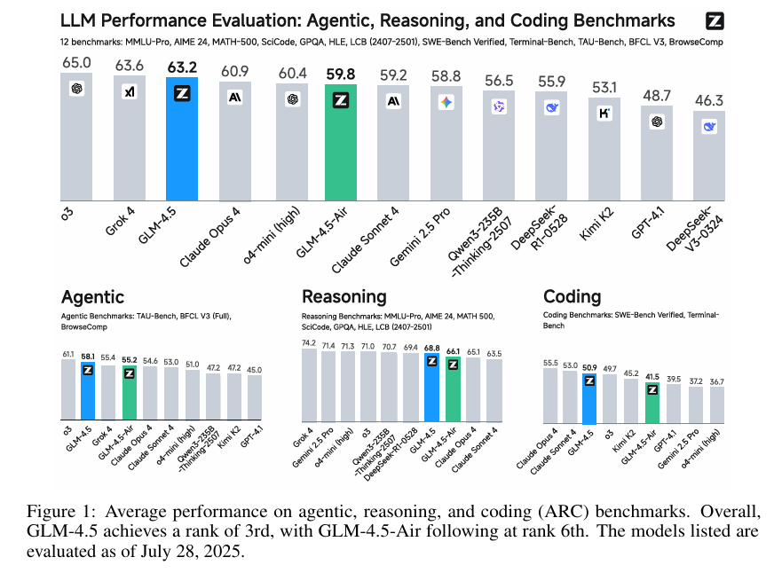
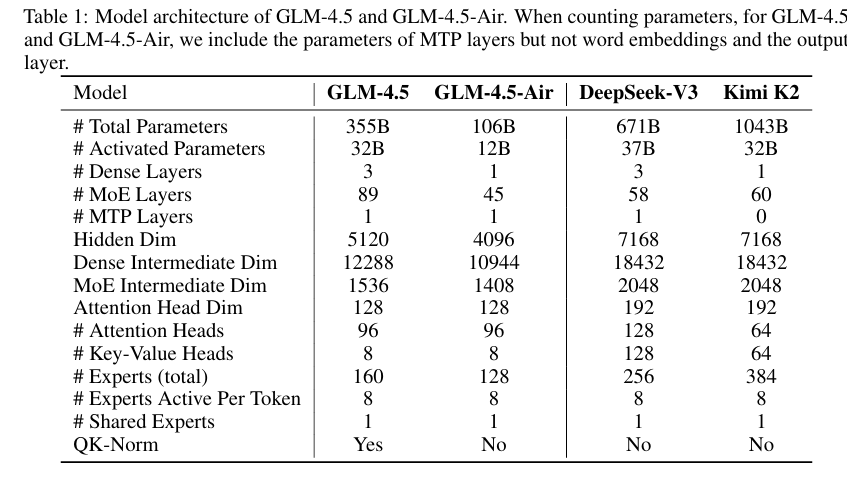

# GLM-4.5: Agentic, Reasoning, and Coding (ARC)  Foundation Models

摘要：GLM4.5，MOE模型355B参数有32B的激活参数，支持混合推理模式，在23T token上进行多阶段的混合预训练。通过全量的专家模型迭代后训练和强化学习。GLM-4.5 在智能体任务、推理任务和编程任务（ARC 任务）中均表现出色，在 TAU-Bench 基准测试中得分 70.1%，在 AIME 24 基准测试中得分 91.0%，在 SWE-bench Verified 基准测试中得分 64.2%。与多家竞争对手的模型相比，GLM-4.5 的参数数量少得多，但在所有参与评估的模型中总体排名第三，在智能体基准测试中排名第二。我们同时发布了 GLM-4.5（3550 亿参数）及其精简版本 GLM-4.5-Air（1060 亿参数），旨在推动推理和智能体人工智能系统领域的研究进展。

解决复杂的专业任务，关键在于培养特定的核心能力。我们将三项关键且相互关联的能力视为衡量真正通用型模型的标准：

* **与外部工具及现实世界交互的智能体能力**（Agentic abilities）；
* **解决数学、科学等领域多步骤问题的复杂推理能力**（complex Reasoning）；
* **处理现实世界软件工程任务的高级编程技能**（advanced Coding skills）。

尽管像 OpenAI 的 o1/o3 [18] 和 Anthropic 的 Claude Sonnet 4 等最先进的专有模型，已在特定的 ARC 领域（如数学推理或代码修复 [20]）展现出突破性性能，但在这三个领域均表现卓越的单一、强大的开源模型仍未出现。

本文介绍了两个新模型 ——GLM-4.5 和 GLM-4.5-Air，旨在实现所有不同能力的统一。这些新模型全面超越了现有的开源大型语言模型 [13; 34; 47]，在智能体、推理和编程任务中均取得了显著提升。GLM-4.5 和 GLM-4.5-Air 均具备混合推理模式：针对复杂推理和智能体任务的 “思考模式”，以及针对即时响应的 “非思考模式”。GLM-4.5 是我们的首个混合专家模型（MoE），总参数为 3550 亿，激活参数为 320 亿。该模型在以下 ARC 基准测试中表现优异：

* 智能体能力：GLM-4.5 在 TAU-Bench 基准测试中得分 70.1%，在 BFCL v3 [26] 中得分 77.8%，与 Claude Sonnet 4 相当；在网页浏览智能体任务中，其在 BrowseComp [45] 中得分 26.4%，明显优于 Claude Opus 4（18.8%），接近 o4-mini-high（28.3%）。
* 推理能力：GLM-4.5 在一系列高难度推理基准测试中表现突出，在 AIME 24 中得分 91.0%，在 GPQA [30] 中得分 79.1%，在 LiveCodeBench（2407-2501）[19] 中得分 72.9%，在 HLE（Humanity’s Last Exam）[28] 中得分 14.4%。
* 编程能力：GLM-4.5 在 SWE-bench Verified [20] 中得分 64.2%，在 Terminal-Bench [35] 中得分 37.5%，超越了 GPT-4.1 和 Gemini-2.5-pro，接近 Claude Sonnet 4。

## 预训练：

模型结构：

在 GLM-4.5 系列中，我们采用了混合专家（MoE）架构，这一架构提升了训练和推理的计算效率。我们在 MoE 层中使用了无损失平衡路由 [40] 和 sigmoid 门控机制 [23]。与 DeepSeek-V3 [23] 和 Kimi K2 [34] 不同的是，**我们缩减了模型的宽度（隐藏维度和被路由专家的数量），同时增加了模型的深度（层数），因为我们发现更深的模型具有更强的推理能力。**

在自注意力组件中，我们采用了分组查询注意力（Grouped-Query Attention）并结合部分旋转位置编码（partial RoPE）。此外，我们使用的**注意力头数量是同类模型的 2.5 倍（在 5120 隐藏维度下设置了 96 个注意力头）。出乎意料的是，尽管与注意力头数量较少的模型相比，增加头数并未降低训练损失，但在 MMLU 和 BBH 等推理基准测试中，模型性能却得到了持续提升。** **我们还引入了 QK-Norm** [15] 来稳定注意力对数的范围。

对于 GLM-4.5 和 GLM-4.5-Air，我们均添加了一个 MoE 层作为多 token 预测（MTP）层 [12]，**以支持推理过程中的投机解码**（speculative decoding）。

**预训练数据：**

我们的预训练语料库包含来自网页、社交媒体、书籍、论文和代码仓库的文档。我们为不同来源的数据精心设计了数据处理流程。

* **网页数据**：我们的预训练文档大部分是从互联网上爬取的英文和中文网页。受 Nemotron-CC [32] 的启发，我们将爬取的网页按质量分数划分到不同的桶中。我们对质量分数较高的桶中的文档进行过采样，同时丢弃质量分数最低的桶中的文档。质量分数最高的桶在预训练过程中贡献了超过 3.2 个 epoch。通过这种方式，预训练语料库既能突出推理任务所需的高频知识，又能提高对长尾世界知识的覆盖度。我们还发现存在大量由模板自动生成的相似网页，且这些网页被赋予了较高的分数。这类网页无法通过 MinHash 去重方法移除。因此，我们额外应用了 SemDedup [1] 流程，基于文档嵌入来移除这些相似网页。
* **多语言数据**：为了支持更多自然语言，我们在预训练语料库中纳入了多语言文档。多语言语料既来自我们爬取的网页，也来自 Fineweb-2 [27]。我们使用一个质量分类器来判断文档的教育价值，并对高质量的多语言文档进行过采样。
* **代码数据**：我们从 GitHub 和各种代码托管平台精选了源代码数据。代码语料首先经过基于规则的初步过滤，然后使用特定于语言的质量模型进行分类，将样本分为高、中、低三个质量等级。在训练过程中，我们对高质量代码进行过采样，同时排除低质量样本。此外，所有源代码数据都采用了 “中间填充”（Fill-In-the-Middle）[5] 训练目标。对于与代码相关的网页文档，我们从文本预训练语料库中采用两阶段检索流程：首先根据两个标准筛选文档，一是存在 HTML 代码标签，二是被经过训练的 FastText [22] 分类器识别为与代码相关的内容；随后，使用专门的模型对检索到的文档进行质量评估，同样将其分为高、中、低三个等级，并采用与源代码相同的基于质量的采样策略；最后，使用细粒度解析器对选定的网页进行重新解析，以更好地保留代码的格式和内容。
* **数学与科学数据**：为了提升推理能力，我们从网页、书籍和论文中收集了与数学和科学相关的文档。我们使用大型语言模型根据文档中数学和科学相关教育内容的占比为候选文档评分，并训练了一个小规模分类器来预测这些分数。预训练语料库中分数超过特定阈值的文档会被过采样。

**GLM-4.5 的预训练过程分为两个阶段。第一阶段，模型主要在来自网页的通用文档上进行训练；第二阶段，我们对来自 GitHub 的源代码以及与编程、数学和科学相关的网页文档进行过采样。**

2.3 中期训练：提升推理与智能体能力

预训练完成后，我们增加了多个训练阶段，以进一步提升模型在重要应用领域的性能。与传统基于大规模通用文档的预训练不同，这些训练阶段采用中等规模的特定领域数据集（包括指令数据）。因此，我们将这些训练阶段称为 “中期训练”，具体包括以下内容：

* **仓库级代码训练**：在这一训练阶段，我们将同一代码仓库中的代码文件拼接起来，以帮助模型**学习跨文件依赖关系**。为提升模型的软件工程能力，我们还纳入了经过模型筛选的 GitHub 问题（issues）、拉取请求（PRs）和提交记录（commits），**将相关的问题、拉取请求和提交记录拼接为一个上下文，并将提交记录以类似代码差异（diff）的格式组织。**我们将训练序列长度从 4K 扩展至 32K，以容纳大型代码仓库。
* **合成推理数据训练**：在这一阶段，我们加入了针对数学、科学和编程竞赛的合成推理内容。我们从网页和书籍中收集了大量与推理任务相关的问题及答案，并**通过推理模型合成了推理过程。**
* **长上下文与智能体训练**：为进一步提升模型的长上下文处理性能，我们**将训练序列长度从 32K 扩展至 128K，并对预训练语料库中的长文档进行过采样。此外，这一阶段还纳入了大规模的合成智能体轨迹数据。**

在图 3 中，我们展示了预训练和中期训练的完整阶段。预训练阶段的最大序列长度保持为 4096，而中期训练阶段的序列长度从 32768 扩展至 131072。预训练过程中，我们未采用 “最佳拟合打包”（best-fit packing）[11] 策略，因为随机截断对预训练文档而言是一种有效的数据增强方法。对于中期训练的数据集，我们则应用了最佳拟合打包策略，以避免截断推理过程或仓库级代码。

2.4 超参数

除词嵌入、偏置项和 RMSNorm 权重外，我们对所有参数均采用 Muon 优化器 [21; 24]。在超参数设置方面，我们将牛顿 - 舒尔茨（Newton-Schulz）迭代步数 N 设为 5，动量 μ 设为 0.95，并将 Muon 的更新均方根（RMS）缩放至 0.2。我们发现，Muon 优化器能够加速收敛，且可兼容更大的批量大小。

学习率调度采用余弦衰减策略，而非热身 - 稳定 - 衰减（WSD）调度 [17]。早期实验表明，使用 WSD 调度训练的模型在通用基准测试（如 SimpleQA、MMLU）中表现较差，这表明模型在稳定阶段存在欠拟合问题。学习率先经过一个从 0 热身至 2.5e-4 的阶段，随后进入衰减阶段，直至中期训练结束时降至 2.5e-5。

批量大小采用热身策略：在训练前 5000 亿 token 时，批量大小从 1600 万 token 逐步增加至 6400 万 token，剩余训练过程中保持这一批量大小不变。

正则化方面，我们将权重衰减率设为 0.1，且未使用 dropout。

预训练阶段的最大序列长度设为 4096，中期训练阶段则按图 3 所示扩展至 32768 和 131072。当序列长度扩展至 32K 时，我们将 RoPE 的基频从 10,000 调整为 1,000,000，以增强长上下文建模能力。

对于无损失平衡路由，在前 15 万亿 token 的训练中，偏置更新率设为 0.001，剩余训练过程中则设为 0.0。我们还应用了序列级辅助平衡损失（权重为 0.0001），以避免单个序列内出现极端不平衡。多 token 预测（MTP）损失权重 λ 在前 15 万亿 token 训练中设为 0.3，剩余训练过程中设为 0.1。

---

3. 训练后处理：专家模型迭代

我们将训练后处理过程分为两个不同阶段。在阶段 1（专家训练）中，我们构建了专注于三个领域的专家模型：推理、智能体和通用对话。在阶段 2（统一训练）中，我们采用自蒸馏技术整合多个专家模型，最终得到一个能够通过深思熟虑的推理和直接响应两种模式生成回答的综合模型。

3.1 有监督微调

在阶段 1（专家训练）和阶段 2（统一训练）的起始阶段，我们都会进行有监督微调（SFT）。在专家训练阶段，**有监督微调的主要作用是提供一个冷启动，让模型具备基本的对话、推理和工具使用能力，这些能力随后会在后续的专家强化学习训练中得到进一步增强，从而实现性能提升。**在统一训练阶段，有监督微调的目的是将不同专家模型的能力蒸馏到一个混合推理的通用模型中，使其能够处理不同类型的任务。**

冷启动有监督微调：在冷启动阶段，我们使用一小组带有扩展思维链（CoT）响应的有监督微调数据。这种方法确保每个专家模型在进入强化学习阶段之前都具备足够的基础能力。

整体有监督微调：在整体有监督微调阶段，我们从之前训练的专家模型中收集了数百万个样本，涵盖推理任务（数学、代码、科学等）、通用对话（写作、翻译、总结、闲聊等）、智能体任务（基本工具使用、特别是针对实际项目开发的编码能力等）和长上下文理解任务，并使用最大上下文长度为 128K token 的基础模型进行训练。通过从不同专家的输出中进行蒸馏，模型学会为每个任务应用最有效的长思维链推理，以得出准确的答案。特别是，考虑到在某些需要快速响应的领域（如闲聊），冗长的思考过程是不必要的，**我们精心平衡了包含完整推理的训练数据和缺乏明确思考过程的数据。这种方法使模型能够在反思模式和即时响应模式下运行，从而形成一个混合推理模型。**

此外，我们发现以下策略有助于准备有监督微调数据以获得最佳性能：

减少函数调用模板中的字符转义：尽管在当代实现中，函数调用参数主要以 JSON 格式表示，但当这些参数包含代码片段时，会出现一个显著的挑战。在这种情况下，代码中的很大一部分字符需要转义，这迫使模型生成大量的转义字符，从而增加了模型的学习负担。对于主要设计用于通用对话的模型来说，这个问题影响不大，但对于以函数调用为核心能力的智能体基础模型而言，这是一个不容忽视的挑战。**为了缓解这一限制，我们提出了一种新颖的函数调用模板，该模板将函数调用的键和值封装在类 XML 的特殊令牌标签中。**这种方法大大减少了代码片段中字符转义的必要性，因为绝大多数代码都可以以其原生形式表示，无需转义。实验结果表明，所提出的函数调用模板在减少转义的同时，不会影响函数调用执行的性能。以下示例（图 4）说明了我们提出的函数调用模板的结构。详细的代码实现可在我们的开源仓库中找到。

拒绝采样：从专家模型中采样时，我们采用了一个全面的多阶段过滤流程，包括：（1）移除重复、过短、截断的样本以及不符合有效推理格式的样本；（2）对有客观答案的样本进行正确性验证；（3）**利用奖励模型过滤对主观问题的响应；**（4）对于工具调用场景，确保遵循正确的工具调用协议，并验证轨迹是否达到预期的终端状态。

提示选择和响应级缩放（Response-Level Scaling）：过滤具有挑战性的提示并对其进行响应缩放（Response-Level Scaling）被证明是有效的。我们尝试移除响应长度处于后 50% 的提示，结果发现，尽管仅使用一半的数据进行训练，数学和科学任务的性能仍提升了 2%-4%。值得注意的是，我们发现对这些较难的提示应用响应缩放（Response-Level Scaling）可以带来进一步的提升。**每个提示生成四个响应，额外带来了 1%-2% 的改进。**

自动智能体有监督微调数据构建：智能体有监督微调数据的构建包括四个步骤：

1. 智能体框架和工具收集：我们**收集了一组智能体框架、现实世界的工具 API 和 MCP 服务器**，同时还利用大型语言模型自动构建和模拟一批工具。
2. 任务合成：基于这些框架和工具，我们自动合成一组智能体任务。一方面，对于相对成熟的框架，我们利用大型语言模型理解其功能并自动生成相关查询或任务。另一方面，对于更分散或不同的工具，我们首先选择一个有代表性的子集，并同样利用大型语言模型构建关于这个子集的任务。这些任务包括单步和多步工具调用场景。
3. 轨迹生成：对于每个合成的任务，我们利用现有的大型语言模型生成工具调用轨迹。此外，**通过将大型语言模型用作用户模拟器，多步工具调用任务被转换为涉及多轮对话的轨迹。**
4. 质量过滤：对于每个轨迹，我们**使用多个评判智能体来评估任务是否完成。只保留成功的轨迹。**

---

这句话描述了在构建智能体训练数据时，将 “多步工具调用任务” 转化为 “多轮对话轨迹” 的具体方法，核心在于利用大型语言模型（LLM）模拟用户角色，从而生成更贴近真实场景的交互数据。可以从以下几个层面理解：

1. **核心目的**：
   多步工具调用任务（如 “查询天气→根据天气推荐出行路线→预订交通票务”）需要智能体与外部工具多次交互，但真实场景中，用户可能不会一次性把所有需求说清楚，而是会根据智能体的反馈逐步补充信息（例如智能体问 “你想查询哪个城市的天气？”，用户回复 “北京”）。因此，需要将单一的 “任务流程” 转化为包含用户与智能体来回沟通的 “多轮对话”，以训练智能体处理动态交互的能力。
2. **实现方式**：
   用 LLM 扮演 “用户” 的角色，与正在训练的智能体（或另一个模型）进行对话。例如：
   * 初始任务是 “帮我规划从上海到广州的周末旅行”（多步工具调用任务，涉及查高铁、订酒店、推荐景点等）。
   * LLM 作为用户，可能先回复智能体的初步方案：“我更想坐周五晚上的高铁，酒店希望靠近地铁站”（模拟真实用户的需求调整）。
   * 智能体根据这个反馈继续调用工具（查周五晚高铁票、筛选地铁附近酒店），LLM 再进一步反馈（如 “酒店价格能否控制在 500 元以内？”）。
     这个过程中，LLM 会模仿人类用户的提问习惯、需求变化甚至模糊表达，从而让原本的 “单向工具调用流程” 变成包含追问、调整、确认的 “多轮对话轨迹”。
3. **价值意义**：
   这种方法生成的训练数据更贴近真实世界的交互场景 —— 用户需求往往是动态的，而非静态的 “指令清单”。通过 LLM 模拟用户，既能批量生成多样化的对话轨迹（避免人工设计的局限性），又能让智能体在训练中学习如何处理模糊需求、跟进用户反馈，最终提升其在实际应用中的灵活性和实用性。

简单来说，就是让 AI “假装” 成用户，与智能体 “聊天”，把原本需要一步步完成的工具调用任务，变成像真人对话一样的你来我往，从而让智能体学会在互动中解决复杂任务。

---

3.2 推理强化学习

推理强化学习（Reasoning RL）致力于提升模型在需要逻辑推演、结构化问题解决和可验证准确性的领域中的能力，包括数学、代码生成和科学推理等关键领域。这些任务的一个显著特点是奖励信号的高精度 —— 其正确性通常可以通过编程方式判定或具有客观明确的标准。在这些领域的熟练掌握不仅对提升模型的原始智能至关重要，也是构建更复杂、多步骤智能体行为的基础。

鉴于推理强化学习的独特挑战与机遇，我们开发了一系列专门技术来有效训练模型。以下详细介绍的这些方法旨在解决训练效率、样本多样性和数据质量等问题。我们的整体强化学习算法基于 GRPO 框架 [31]，但剔除了 KL 损失项。本节所示的对比曲线基于我们的小型实验模型，而非 GLM-4.5。

#### 基于难度的课程学习

在强化学习过程中，模型的熟练度会不断提升，这与静态训练数据之间会产生不匹配。在训练后期，随着模型能力增强，过于简单的数据会导致所有轨迹的奖励都为 1；而在训练初期，过于困难的数据则常导致批量样本的奖励都为 0。这两种情况中，奖励缺乏方差会导致没有有用的梯度信号，严重阻碍训练效率。

为解决这一问题，我们在强化学习中采用了两阶段的基于难度的课程学习。通过在小型模型上进行对照实验（便于快速迭代和精确的消融研究），验证了该策略及以下其他策略的有效性。如图 5 所示，这种两阶段方法能让模型持续突破自身性能上限。关键的是，为保证信号质量并减少噪声，第二阶段使用的所有问题都严格来自具有已验证正确答案的题库。

#### 64K 输出长度的单阶段强化学习

以往研究 [25] 建议分多个阶段进行强化学习，逐步增加最大输出长度。但我们的实验表明，这种多阶段方法的效果不如直接在目标最大长度（64K）上进行单阶段强化学习。由于初始有监督微调（SFT）已让模型适应生成 64K 长度的响应，引入较短最大长度的强化学习阶段可能导致模型 “遗忘” 长上下文能力，这往往会导致性能显著且不可逆的下降（如模型的平均输出长度缩短）。而这种退化在最终的 64K 长度强化学习阶段难以恢复，从而限制进一步提升。

实验证实了这一观察：如图 6 所示，直接在完整的 64K 长度上进行强化学习，能持续突破模型极限并获得更好的性能。

#### 动态采样温度

在强化学习中，采样温度是控制轨迹多样性的关键参数。温度过低会导致输出趋同、探索性不足；温度过高则会引入低质量、带噪声的样本，损害模型准确性和训练效率。使用固定采样温度并非最优选择，因为它无法适应策略分布变得更集中（即熵值更低）的过程，常导致训练后期探索不足。

因此，我们提出动态调整采样温度，以在准确性和探索性之间保持良好平衡。具体而言，当轨迹的平均奖励趋于稳定时（判定为收敛阶段），我们提高采样温度以鼓励更大的多样性。为降低引入过多噪声的风险，我们实施了质量控制机制：定期在预留的验证集上评估模型在不同温度下的性能，下一训练阶段的温度则设为不导致性能较当前最优值下降超过 1% 的最大值 [2]。

#### 代码与科学领域的强化学习

与数学领域相比，代码和科学领域的强化学习在文献中受到的关注较少。我们在这些领域进行了大量对照实验，得出以下经验结论：

* **代码强化学习**：损失计算的选择对训练效率至关重要。如图 7（左）所示，与传统的序列均值损失相比，采用令牌加权均值损失更为有效。这种令牌加权方法能提供更细粒度、更稳定的梯度信号，显著加快收敛速度，还能缓解序列级奖励中固有的长度偏差，并有效抑制训练中过于简单或重复的 “基础案例” 样本的生成。
* **科学强化学习**：在 GPQA-Diamond 基准测试中的发现表明，数据质量和类型是首要因素。如图 7（右）所示，仅使用专家验证的选择题进行强化学习，比使用混合质量或未验证数据的训练效果显著更好。这一结果强调，即使对于选择题这类格式简单的任务，严格过滤强化学习数据池以仅保留高质量、高难度样本，对模型的有效提升也至关重要。

3.3 智能体强化学习

基于人类反馈的强化学习（RLHF）有助于语言模型更忠实地遵循人类指令。将强化学习应用于数学和编程竞赛，进一步揭示了模型在结果可客观验证的任务中具备强大的推理能力和良好的缩放特性。基于这些见解，我们聚焦于智能体场景 —— 特别是网页搜索和代码生成智能体，这些场景中每个动作或答案都能被自动检查。这种内置的可验证性提供了密集、可靠的奖励信号，使我们能够更有效地扩展强化学习训练。

3.3.1 智能体的数据收集与合成
**针对网页搜索任务和开放域信息检索，我们开发了一个数据合成流程，生成需要跨多个网页源进行多步推理的高难度问答对。** 该语料库旨在提升 GLM 在互联网上挖掘隐蔽、交织信息的能力。数据集构建融合了两种方法：

（1）基于知识图谱的多跳推理驱动的自动化流程；

（2）人机协作从多个网页中提取内容并进行选择性模糊处理，以准备强化学习的训练信号。

对于软件工程任务，我们精心整理了大量 GitHub 拉取请求和问题，创建了一个包含用户提示和可执行单元测试的真实软件开发基准。所有评估均在硬化沙箱中进行，依托分布式系统提供水平扩展性和强隔离保障。

3.3.2 通过强化学习和迭代自蒸馏突破性能极限
我们采用分组策略优化算法进行强化学习训练。对于每个问题 x，从先前的策略 πold 中采样 K 个智能体轨迹 {y1,...,yk}，并通过以下目标函数优化模型 πθ：

LRL(θ) = Ex∼D [1/K Σ（r(x,yi) − ¯r(x)）]

其中，¯r (x) = 1/k Σ r (x,yi) 是采样响应的平均奖励。需要注意的是，仅使用模型生成的令牌进行优化，损失计算中忽略环境反馈。

**基于结果的监督与过程格式惩罚**
对于网页搜索任务，我们将最终答案的准确性作为整个智能体轨迹的奖励。**对于编码智能体，我们主要利用带有可验证测试用例的 SWE 数据进行强化学习训练。实验表明，在网页搜索和 SWE 任务上的强化学习训练，能带来其他任务和基准（如通用工具使用和 Terminal-Bench 等编码任务）的泛化性能提升。**此外，我们施加过程格式惩罚以确保模型生成正确的工具调用格式：若模型在生成智能体轨迹时未能产出正确的工具格式，过程将被终止，且该轨迹会获得零奖励。

**迭代蒸馏**
由于智能体任务的强化学习训练耗时较长，我们采用自蒸馏方法**在继续强化学习训练前，迭代提升 SFT 冷启动模型的性能。具体而言，首先对初始冷启动模型进行强化学习训练以提升智能体性能；当训练达到特定步数或进入平台期后，用强化学习训练后的模型生成的响应替代原始冷启动数据，完成自蒸馏，得到更优的 SFT 模型；随后在该增强模型上进行进一步强化学习训练，并逐步提高训练难度。**这种迭代策略使我们能够高效突破强化学习训练模型的性能极限。

**通过交互轮次扩展测试时计算量**
对于智能体任务，我们观察到随着与环境的交互轮次增加，性能显著提升。与推理模型通过扩展输出令牌实现测试时缩放不同，**智能体任务通过与环境持续交互利用测试时计算量 —— 例如，反复搜索难以获取的网页信息，或为编码任务编写测试用例进行自我验证和自我修正。**图 8 显示，随着浏览 effort 的变化，准确性随测试时计算量平稳提升。

---

3.4 通用强化学习

通用强化学习（General RL）旨在全面提升模型的整体性能、修正潜在问题并强化核心能力。我们方法的核心是构建一个**多源反馈系统，将基于规则的反馈、人类反馈（RLHF）和模型反馈（RLAIF）协同结合。这种混合框架能提供更稳健的训练信号，并充分利用各反馈源的独特优势：自动化规则的精确性、人类标注者的细致判断，以及 AI 驱动评估的可扩展性。**

#### 全面强化学习（Holistic RL）

全面强化学习致力于在多个领域实现广泛的性能提升。为此，我们首先构建了一个包含约 5000 个提示词的平衡数据集，覆盖 7 个一级类别、33 个二级类别和 139 个三级类别。全面强化学习的奖励信号来自人类反馈和 AI 反馈：

* 对于人类反馈，我们基于偏好标注训练奖励模型。标注者会对比模型的响应，并从指令遵循度、安全性、事实准确性等多个维度进行综合评估，进而分配偏好标签。
* 对于模型反馈，我们会根据提示词是否有客观的真实答案，设计不同的评分标准。

将两种反馈源融合后，能得到更可靠、更具表达力的奖励信号，从而缓解单一方法固有的局限性。

#### 指令遵循强化学习（Instruction Following RL）

指令遵循强化学习用于提升模型理解和满足复杂指令的能力。我们为此构建了一个细粒度分类体系，包含 7 个主要约束类型和 151 个次要约束类型，涵盖内容要求、格式规则等方面。基于该分类体系，我们收集了一组包含挑战性指令的专用训练集，覆盖所有约束类型。反馈系统由确定性验证规则、训练好的奖励模型和评判模型组成。这种混合反馈系统的稳健性在 GRPO 训练中至关重要 —— 我们发现奖励作弊现象得到缓解，策略模型在指令遵循能力上实现了持续稳定的提升（如图 9 所示）。

#### 函数调用强化学习（Function Calling RL）

函数调用强化学习分为分步规则式强化学习和端到端多轮强化学习。由于分步规则式强化学习与通用强化学习在输出长度和收敛速度上相似，我们将其直接纳入通用强化学习框架；对于端到端多轮强化学习，我们先训练专门的专家模型，再将这些专家能力蒸馏到主模型中：

* **分步规则式强化学习**：对于工具调用流程明确的任务，我们会在训练数据中为每个步骤 / 轮次标注真实的函数调用。给定任务和前序步骤 / 轮次的函数调用，模型需生成下一个助手响应（可能是函数调用或对用户的回复）。我们通过基于规则的奖励引导模型在连续轮次中生成正确的函数调用，并设计了如下严格的奖励函数：
  Reward = 1，若格式正确（at）且与真实调用（a∗t）匹配
  0，其他情况
  其中，at 表示模型生成的第 t 个函数调用，a∗t 表示对应的真实函数调用。只有当 at 格式正确且与真实调用完全匹配（包括名称、参数及每个字段）时，才会给予 1 的奖励，否则奖励为 0。这种严格的奖励规则不仅能引导模型生成正确的函数调用，还能强制规范输出格式，提升模型在实际交互中的可用性和稳健性。
* **端到端多轮强化学习**：分步规则式强化学习将任务分解为静态、预设的决策流程，在此过程中，模型缺乏与环境的动态交互，无法自主探索、规划或处理复杂情况，导致其实际问题解决能力受限。为解决这些问题，我们引入端到端多轮函数调用强化学习：模型先生成完整轨迹，再根据任务完成情况获得奖励。通过这种方式，模型能借助工具反馈不断试错，优化行动策略，显著提升自主规划和决策能力。具体而言，端到端多轮函数调用强化学习针对两类复杂任务：

  1. 单轮多步骤任务：模型需进行多步函数调用并与环境交互以完成任务。我们使用基于 MCP 服务器自动合成的复杂任务，以及部分带有可运行环境的开源智能体数据集（如 Agentgym [46]）。
  2. 多轮多步骤任务：除与工具执行环境交互外，模型还需与 LLM 模拟的用户智能体交互，以获取完整任务信息并完成整体任务。

  端到端多轮函数调用强化学习的奖励计算如下：
  Reward = 1，若格式正确（a1,...,aT）且任务完成（I,o0,a1,o1,...,aT,oT）
  0，其他情况
  其中，I 表示原始复杂任务，at 表示第 t 个函数调用，ot 表示工具反馈或用户信息。任务完成情况（I,o0,a1,o1,...,aT,oT）由环境根据预设规则或 LLM 评判智能体判定。

#### 缺陷修正强化学习（Pathology RL）

作为训练后处理的最后阶段，通用强化学习需要修正模型的潜在问题，如语言混杂、过度重复、格式错误等。尽管在上述通用强化学习任务中对这类行为进行惩罚是有效的，但这些缺陷的发生率较低（通常不到输出的 1%），导致这种优化策略的样本效率不高。因此，我们为缺陷修正强化学习精心构建了一个目标数据集 —— 通过识别极有可能触发这些缺陷行为的提示词，在该数据集上训练可实现高效惩罚，进一步降低这些问题行为的残留错误率。

### RL架构

我们的强化学习（RL）基础设施基于 Slime1 构建，这是我们自主研发的一个开源框架。该框架通过多项关键优化提升了灵活性、效率和可扩展性。

#### 灵活的混合训练与数据生成架构

我们基础设施的核心特性是在单一统一系统中支持高度灵活的训练模式和数据生成策略。这种设计通过支持 “协同定位的同步模式” 和 “分离式的异步模式”，能够满足不同强化学习任务的独特需求。这种数据生成灵活性对于将强化学习能力扩展到新领域和更复杂的智能体环境至关重要。

我们发现，不同的强化学习任务适用于不同的调度方式：

* 对于通用强化学习任务或旨在提升模型推理能力的任务（如数学和代码生成），**同步协同定位架构**更有效。在这种设置中，训练和推理引擎位于同一工作节点，结合动态采样技术，可显著减少 GPU 空闲时间并最大化资源利用率。
* 对于智能体任务（如软件工程任务），数据生成过程通常耗时较长，且涉及复杂的系统交互。为确保智能体环境能持续运行并最大化数据吞吐量，我们采用**分离式异步模式**：强化学习框架的轨迹生成组件直接对接智能体环境，而用于训练和推理的 GPU 则独立调度。这种解耦设计使智能体环境能不断生成新数据，不受训练周期的阻塞。

借助 Ray 框架的资源调度和异步能力，我们可灵活地将推理和训练引擎部署在同一 GPU 或不同 GPU 上。这种对同步与异步训练的双重支持，使各类强化学习任务能共享一套底层的训练与推理优化方案。

#### 混合精度推理加速轨迹生成

轨迹生成效率是强化学习训练中的一个长期瓶颈。为解决这一问题，我们的基础设施在训练中支持 BF16 精度，同时**在推理中采用 FP8 精度以加速数据生成阶段。在每次策略更新迭代中，模型参数在被用于轨迹生成前会经过在线的分块 FP8 量化。**这种动态量化技术实现了高效的 FP8 推理，显著提升了数据收集过程的整体吞吐量。

#### 面向智能体的强化学习基础设施设计

为开展智能体任务的强化学习，我们设计了一套全异步、解耦的基础设施，能高效处理长周期智能体轨迹，并支持在多样化智能体框架中进行灵活的多任务强化学习训练。

智能体的轨迹生成通常需要与复杂环境进行长时间交互，这会显著拖慢整体强化学习训练进程。为解决这一问题，我们首先设计了一个高并发的基于 Docker 的运行时环境，为每个任务提供隔离环境，大幅降低轨迹生成的开销。此外，我们实现了**全异步的强化学习训练循环：由于智能体任务的类型和轨迹长度可能差异很大，同步强化学习训练常会因工作节点等待最慢的轨迹生成而导致 GPU 利用率严重不足。我们的方案将 GPU 划分为专用的轨迹生成引擎和训练引擎 —— 轨迹生成引擎持续生成轨迹，训练引擎则更新模型权重并定期将其同步回轨迹生成引擎。**这种解耦设计避免了长轨迹或多样化轨迹对整个训练流程的阻塞，尤其在智能体交互高度可变的场景中，能保持稳定的高吞吐量。

另一关键挑战是现有智能体框架的多样性（不同框架针对不同任务定制）。利用这些框架不仅能提升特定任务的性能，还能保持训练与推理的一致性。为此，**我们引入了统一的 HTTP 端点接口，并搭配一个集中式数据池：由于大多数智能体框架以消息列表格式输出轨迹，所有轨迹都存储在该数据池中，作为训练的共享数据源。**这种架构将任务特定的轨迹生成逻辑与强化学习训练过程彻底解耦，实现了异构智能体框架的无缝集成。此外，数据池支持可定制的、任务特定的过滤和动态采样策略，确保在多样化任务中提供高质量的强化学习训练数据。

通过这两项核心设计，我们的系统为长周期智能体强化学习提供了一个可扩展、灵活且高性能的解决方案，能支持长周期轨迹生成并适应广泛的智能体任务。
