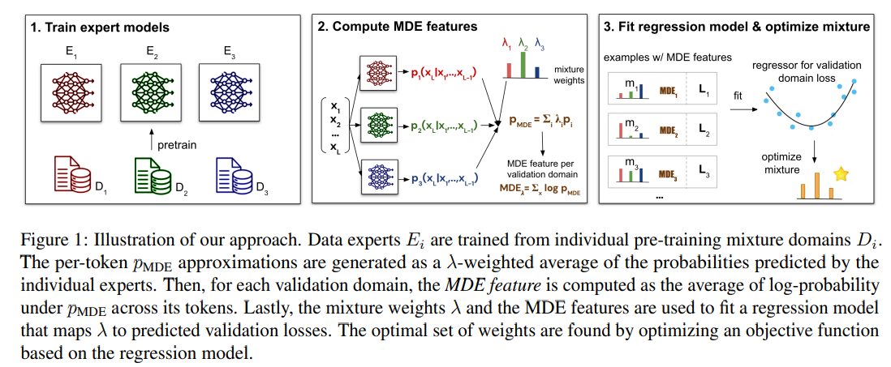

# Optimizing Pre-Training Data Mixtures with Mixtures of Data Expert Models

**摘要：**我们提出了一种方法，通过利用“数据专家混合体”（MDE）对每个候选数据混合方案对应的交叉熵损失进行高效近似，来优化语言模型的预训练数据混合方案。我们将这种近似结果作为回归模型中额外特征的来源，该回归模型是根据对少量数据混合方案的模型损失的观察结果来训练的。在SlimPajama数据集上，针对参数数量在7000万到10亿之间的仅含Transformer解码器的语言模型进行的实验表明，与那些仅将混合比例作为输入特征来训练回归模型的方法相比，我们的方法取得了显著更好的性能。**将这种改进的优化方法与一个考虑了最终任务数据上的交叉熵的目标函数相结合**，在少样本下游评估中能够实现更优异的性能。我们还从理论层面阐释了为什么对数据专家的预测结果进行聚合能够很好地近似数据混合方案的模型损失。

---

问题：source sampling proportions have a large impact on the generalization performance of the model

具有k个源领域的数据混合体的采样比例定义了k - 1个实值超参数。实际大模型训练的时候，只会再一个最优的数据配比上来进行，同时进行数据配比优化和预训练模型优化会导致巨大的计算量。一般的方式是，通过一些小模型（少了训练token）来进行模拟实验。

基于代理模型，数据混合可以通过一种在线算法进行优化，或者通过观察多个已训练的代理模型的泛化损失，以离线的方式进行优化，并通过回归模型来预测其他数据混合的损失。根据已训练的回归器，对数据混合进行优化，以最小化损失。

**不同的数据配比训练proxy 模型会得到不同的generalization loss，根据这些样本做为回归模型的训练数据。目标是预测未知数据混合的generalization loss （不需要再新的数据配比上训练proxy model了）**

**本文通过MDE来优化回归模型的预测效果。** 需要训练K个proxy model, k是源领域的数目。每个proxy model都是由对应的领域数据训练得到的。泛化损失的定义是：通过使用混合权重lambda的（由）数据专家（组成）的集成模型所得到的损失。

测试集中的每一个样本都使用不同的proxy模型进行预测，然后加权不同模型的打分得到最终的结果。

一项简单的理论分析证明，对来自数据专家的预测结果进行聚合以近似模拟使用数据混合权重\\(\\lambda\\)实际训练语言模型的结果是合理的，并且该分析确定了改进“数据专家混合体”（MDE）的方向。
