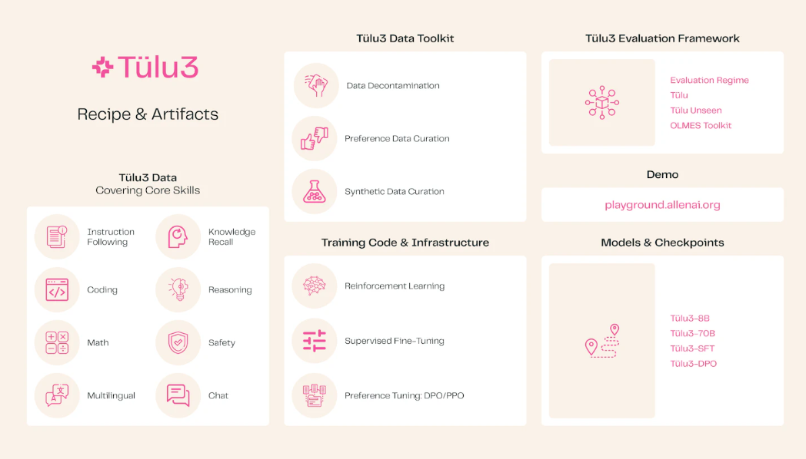
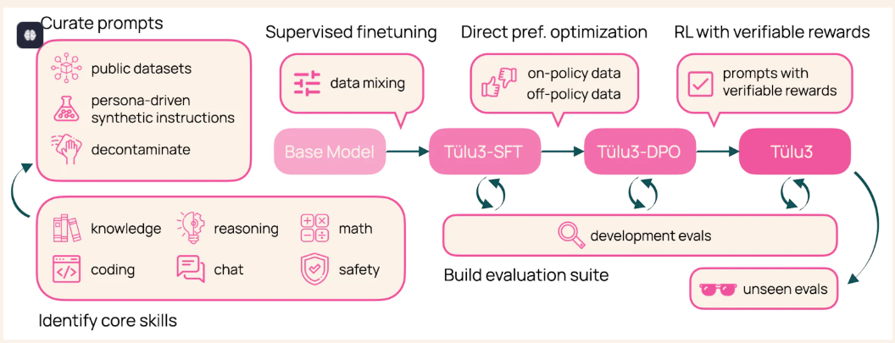
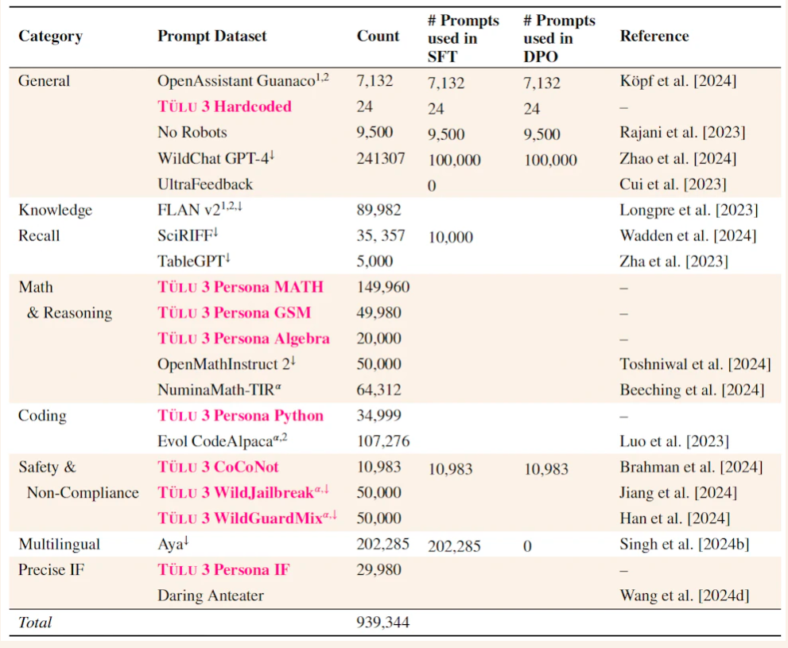
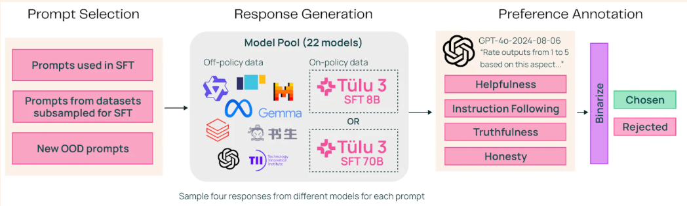

# Tülu 3: The next era in open post-training

论文开放了一系列的后训练方法，基于llama3，训练出来一个更优的指令模型，并且将训练方法、模型文件以及训练数据完全开源。

后训练 — 包括指令调整和根据人类反馈进行强化学习在内的一系列技术 — **已成为改进语言模型行为和解锁新功能的重要步骤**。自 InstructGPT 和最初的 ChatGPT 等早期方法以来，后训练方法的复杂程度和复杂性不断提高，朝着多轮训练、模型合并、利用合成数据、AI 反馈以及多种训练算法和目标（如 Llama 3.1 报告）发展。

**在 Tülu 3 中，我们发布了最先进的后训练模型，其中每个步骤都是开放的——训练数据集、数据管理工具、数据净化脚本、训练代码、评估套件等。我们相信，这既将缩小与训练后封闭配方的差距，又为开放训练后研究的下一章奠定基础。**

Tülu 3 的进步归功于精心的数据管理，从而产生了 Tülu 3 Data、针对核心技能的新许可训练数据集、改进的训练基础设施、Tülu 3 代码、可重复的评估工具包 Tülu 3 Eval，以及通过培训阶段的创新方法和指导，Tülu 3 Recipe。

我们在预训练语言模型（即 Llama 3 Base）之上，通过一个由五部分组成的训练后配方来生成 Tülu 3 模型（8B 和 70B）。这包括：

* **针对核心技能的仔细提示管理和综合**:指令跟随，知识recall，编码，推理，数学，安全，多语言，对话
* 对我们精心挑选的提示**及其回答**的组合情况进行**监督微调 （SFT**）
* 针对非策略和策略偏好数据的**直接偏好优化 （DPO）**
* 一种新的**基于 RL** 的方法，通过可验证的奖励来增强特定技能
* 用于开发、净化和最终评估阶段的标准化**评估套件**。

---

数据：

提示代表了用户与模型交互的不同方式，是所有训练后阶段的基本组成部分。为了瞄准所需的核心技能，我们从具有明确来源的公开数据集中策划了一组*多样化*和*高质量的*提示，**并使用数据合成以填补任何空白。**

**开源数据。**我们首先对公共数据集进行了广泛的调查，包括由专职工作人员注释的数据集、来自真实用户并与模型合成的数据集。然后，我们手动审查每个单独的数据集，并在考虑以下因素的同时选择这些数据集：（1） **多样性**以增强模型的泛化，（2） **针对具有挑战性的技能**，例如复杂推理、编码和精确的指令遵循，（3） **数据来源**，只允许具有正确和明确许可证的数据集，（4） 通过删除任何与我们的评估套件超过 2% 重叠的训练集来**严格净化**。

**合成数据管理**。为了满足对多样化和技能特定数据集日益增长的需求，我们将合成数据生成作为一种补充方法。我们的合成数据生成工作在 [Chan 等人 2024](https://arxiv.org/abs/2406.20094) 年采用了角色驱动的方法。关键思想是使用不同的角色（例如，“专注于神经网络的机器学习研究人员”）和数据合成提示（例如，“创建编码问题”）来引导 LLM 以相应的视角合成数据。使用这种方法，我们为特定技能生成提示，例如**精确指导遵循、数学**和**编码**。

我们总共收集了 **939,344个提示**，用于我们以后的训练配方，其中 57% 来自公共资源，43% 是内部合成生成的。

SFT数据筛选：

为了设计最终的 SFT 组合，我们首先构建特定于技能的数据混合和模型，保留导致单个技能最佳表现的混合，忽略其他评估。采用此策略来近似每种技能的性能上限。然后，我们将这些混合物组合起来，创建我们最初的 Tülu 3 预览混合，并迭代添加/删除数据集以提高滞后技能，根据我们的评估进行净化，并对特别大的数据集进行下采样。我们发现，对我们精心策划的改进最终混合物进行 SFT 会导致多项任务的性能得到显著提升，如表所示。我们所有新的合成 SFT 数据集都包含由 GPT-4o 或 Claude 3.5 Sonnet（用于编码）创建的回答，从而产生最高质量的回答。

偏好数据集构建：

我们使用 on-policy（Tülu 3 套件）和非 policy 模型（其他可用的 instruct 模型）将收集的提示子集 （\~2-300K） 转换为偏好数据。我们扩展了 [UltraFeedback](https://arxiv.org/abs/2310.01377) 管道来扩展我们的偏好数据。我们首先从提示数据池中对提示进行采样（在此阶段，我们特意选择已使用和未使用的 SFT 提示）。 对于给定的提示，我们从模型池中随机选择多个模型来生成响应。为了包含符合政策的数据，我们还从 Tülu 3 SFT 模型生成响应。最后，我们使用 LLM 作为法官，特别是 GPT-4o-2024-0806，从四个不同方面对每个回答进行 1 到 5 的评分：帮助、遵循指示、诚实和真实。在计算平均分数时，我们将评分最高的响应作为选定的响应，并从均值较低的响应中随机抽样作为被拒绝的响应。

我们试验了几种偏好算法，例如 DPO 和 PPO 的变体。我们发现，结果大致相似，超参数调整和长度归一化更好。因此，我们在实验中优先考虑简单性和效率，并在整个开发过程和训练我们的最终模型中使用 DPO，而不是对基于 PPO 的方法进行成本更高的研究。我们执行了几轮数据混合消融和广泛的超参数调整，类似于我们的 SFT 步骤，以最大限度地提高开发评估的平均性能，同时在目标技能方面也表现出色。以下是我们发现的摘要：

* 与包括 PPO 、 DPO 和 SimPO 在内的几种偏好优化算法相比，长度归一化 DPO 实现了更好的性能。
* 扩展唯一提示的数量提高了下游 DPO 性能。
* DPO 组合中存在新提示（而不是重复使用来自 SFT 的提示）有助于提高下游 DPO 性能。
* 与从其他模型采样完成情况的完全非策略数据集相比，包括符合策略的数据提高了聚合的下游 DPO 性能。

---

可验证奖励的强化学习：

在 Tülu 3 中，我们引入了具有可验证奖励的强化学习 （RLVR），这是一种用于训练语言模型执行具有可验证结果的任务（例如数学问题解决和指令遵循）的新方法。RLVR 利用现有的 RLHF 目标，但将奖励模型替换为验证函数。当应用于具有可验证答案的领域时，例如数学和可验证指令任务，RLVR 展示了对 GSM8K 等基准测试的针对性改进，同时保持其他任务的性能。RLVR 可以看作是现有方法的简化形式，用于引导 LM 推理（[Eric Zelikman 等人](https://openreview.net/forum?id=_3ELRdg2sgI)，[Du Phan 等](https://openreview.net/forum?id=a147pIS2Co)人），或者是[具有执行反馈的 RL](https://arxiv.org/abs/2410.02089) 的简单形式，其中我们简单地使用答案匹配或约束验证作为二进制信号来训练模型。换句话说，仅当策略生成的响应可验证正确时，策略才会获得奖励。

我们发现，将 RLVR 作为通才训练管道的一个组成部分，与 MATH、GSM8K 和 IFEval 上的 DPO 检查点相比，可以提高 1.7 、 3.3 和 1.3 个百分点。从 SFT 开始 RVLR 会带来更大的收益，但我们发现最高的最终模型来自 RVLR 之前的 DPO 训练。令人惊讶的是，RLVR 还改进了其他未针对其优化的任务，包括 BigBenchHard、Drop 和 AlpacaEval 2。

---

评估：

我们培训后方法成功的一个关键因素是建立明确的绩效目标和评估工具，以指导这些阶段的改进。在 **Tülu 3 Eval** 中，我们发布了统一的标准化评估套件和工具包，以指导最终模型的开发和评估，并根据评估基准对训练数据进行净化。
