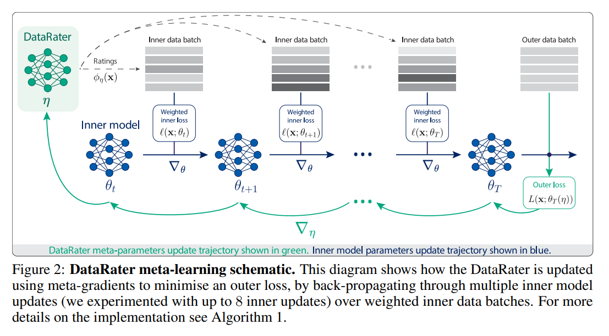
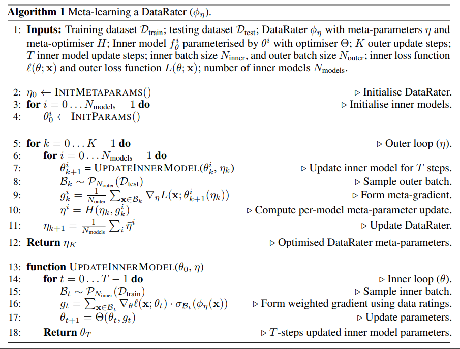
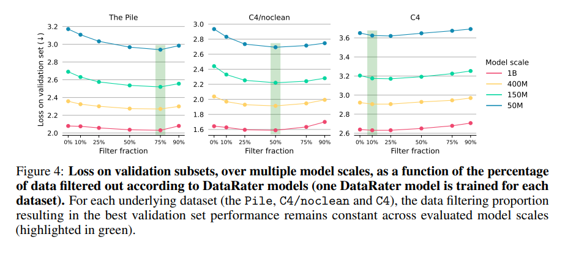

# DataRater: Meta-Learned Dataset Curation

摘要：基础模型的质量在很大程度上依赖于其训练数据。因此，人们在数据集构建方面付出了巨大努力。然而，**大多数方法依赖于对大型数据桶的粗粒度混合进行手动调优，或通过手工制定的启发式规则进行过滤**。最终，一种更具可扩展性（更不用说更令人满意）的方法是学习哪些数据实际上对训练有价值。这种元学习可以实现更复杂、更细粒度且更有效的数据构建。我们提出的DataRater就是这一理念的实例。**它通过元学习使用“元梯度”来估计任何特定数据点的训练价值，目标是提高对保留数据的训练效率。**在一系列模型规模和数据集上的大量实验中，我们发现使用DataRater过滤数据非常有效，可显著提高计算效率。

---

在机器学习领域，人们普遍认为模型的质量从根本上取决于用于训练它的数据。在大型基础模型时代，预训练会摄入海量数据，这些数据来源广泛且可靠性参差不齐。事实反复证明，对这些数据进行精心过滤和构建对于提升模型效率和能力至关重要[Hoffmann等人，2022；Llama 3作者，2024；Parmar等人，2024]。尽管这一挑战规模巨大，但目前的主流做法仍是耗时费力的人工构建：通常而言，数据通过手工设计的启发式规则进行过滤，最终各来源数据的粗粒度混合比例也需人工调优。

在短期内，这些数据挑战只会愈发严峻：下一个前沿是合成数据——其生成量不受限制，但可能存在**偏差、冗余或质量低下**等问题。因此，采用能够摄入任意数量和类型的未过滤数据的系统至关重要，同时需要处理这些合并的数据流以最大化学习效率。要解决这一问题，就需要自动化的数据流过滤和优化方法。一种高度可扩展的过滤方法应允许人类仅指定训练目标（例如基于验证损失），而无需规定实现方式（即无需手动构建数据流）。这正是元学习作为解决方案所具备的能力——也是我们在研究中采用的方法。元学习无需手动指定过滤流程，而是能够以数据驱动的方式自动学习过滤或混合数据流的标准。如果我们给予其足够空间，数据本身就能揭示自身的价值。

为此，我们提出了DataRater（数据评估器）方法，用于评估任何特定数据片段在训练中的价值：DataRater会为**每个数据项分配一个（通过元学习得到的）偏好权重，该权重可用于过滤或重新加权数据。其核心基于一个非常简单的元目标：提高模型在保留数据上的训练效率（第2节）**。DataRater通过元梯度进行训练，这使其与那些只能观察数据影响结果、却无法洞察数据与性能之间关联函数的黑盒方法相比，具有更高的样本效率。在实践中，它能有效减少达到同等性能所需的训练计算量，尤其在过滤低质量训练数据集时效果显著（第3节）。最后，DataRater背后的原理为进一步提升性能和拓展应用场景开辟了道路，例如在训练过程中进行在线自适应调整、增强模型对数据分布变化的鲁棒性，或根据特定偏好定制数据流，如附录A中所讨论的内容。

本研究的主要贡献如下：

• \*\*DataRater框架\*\*：我们提出了DataRater，这是一种新颖的元学习框架，旨在评估单个数据点对基础模型训练的价值。该方法通过元学习数据价值来实现数据集构建的自动化。

• \*\*可扩展的元目标\*\*：DataRater模型通过元梯度优化一个简洁明确的目标——提升模型在保留数据上的训练效率（第2节）。

• \*\*显著的计算效率与性能提升\*\*：大量实验表明，经DataRater过滤后的数据可大幅降低训练所需的FLOPS（最高实现46.6%的净计算增益，见图1），并在多种预训练语料库（如The Pile、C4/noclean）中持续提升语言模型的最终性能（如图6所示）。

• \*\*数据价值评估的跨规模泛化能力\*\*：关键在于，**使用固定规模内部模型（400M参数）进行元训练的DataRater模型，能够有效将学习到的数据价值评估策略泛化到不同目标模型规模（50M至1B参数，见图6）。此外，实验显示最优数据丢弃比例在这些模型规模下具有一致性（图4）。**

• \*\*数据质量洞察\*\*：我们的分析（第3节）表明，DataRater能够学习识别并降低符合人类直觉的低质量数据权重，例如错误文本编码、OCR错误和无关内容。

---

有一个非常大的集合D，目的是从中选出一个子集$D_{train}$,使其能够在目标集合上$D_{test}$上表现更优（Loss更低）。

$$
L(\theta_{T}(D_{train}); D_{test}) = E_{x \sim D_{test}}[L(x;\theta_{T}(D_{train}))]
$$

在集合D中的子集训练出来的参数，在test集合上要最小。

如何选取：NP-hard

三个步骤：

* 首先，我们不再直接优化公式 (3) 中的最优训练数据子集 $(D_{\text{train}})$，而是改为优化梯度计算 $(g_t)$ 中（从更大的小批量数据中）**应包含哪些数据点**；这等价于为小批量中的每个数据点引入一个二值权重。
* 根据计算出来的每个样本权重，对梯度进行加权求和，一个batch内的权重和为1.
* 使用一个函数来近似估计样本权重，在一个batch内输入样本x,输出softmax后归一化的权重值，对应训练参数n

目标就是优化参数n，使得目标集合上的loss最低

如何优化：

使用元梯度算法：

η通过随机梯度方法进行优化，其中损失函数L（在本文中称为"外部损失"）相对于η的梯度是通过反向传播计算的。具体来说，这一过程涉及对θ进行多次优化器更新（相对于所谓的"内部损失"ℓ），然后再将梯度反向传播回η。

元学习目标。

我们在上面介绍了通用的DataRater框架。在论文的其余部分，包括所有实验评估，我们选择关注最广泛适用的目标：**训练数据集和测试数据集共享相同的数据分布。**这一选择并不要求我们必须关注针对某个特定下游任务的优化，而是假设我们只是希望在给定数据集上最大化训练效率。

因此，用于定义DataRater外部损失的保留数据，是输入训练数据的一个不相交子集。**换句话说，我们的目标是生成一个给定原始数据集的精选变体D，使得在D上进行训练能够在原始训练数据集上实现更快的学习。**在这种情况下，内部损失(ℓ)和外部损失(L)具有相同的函数形式，即关于下一个标记预测的交叉熵损失，ℓ(x; θ) = L(x; θ) = − log Pθ(x) = −∑|x|i=0 log Pθ(xi|xi−1, . . . , x0)。

实现细节：
我们将DataRater实例化为非因果Transformer，并使用元梯度下降优化其参数η，即通过展开内部模型的优化过程进行反向传播。我们通过2次内部模型更新的截断窗口进行反向传播来计算元梯度³。这需要计算与二阶导数（Hessian矩阵）的向量积，这在计算上极具挑战性。为了使该计算可行，我们采用了Kemaev等人[2025]提出的可扩展双层优化重参数化方法MixFlowMG。该方法利用双层梯度优化问题中的对称性，通过混合模式微分显著降低RAM（HBM）使用量。即使对于50M参数的DataRater模型和400M参数的内部模型，它也能支持我们在多个内部模型更新步骤中进行反向传播时高效优化DataRater元参数。

为了稳定元梯度计算，我们采取以下措施：（1）使用内部模型种群；（2）将每个内部模型的元梯度通过单独的Adam优化器[Kingma和Ba，2015]，并对得到的元梯度更新进行平均；（3）**定期重新初始化内部模型以分层学习进度。**

#### 数据筛选

对于数据筛选任务，在训练好DataRater后，我们采用**批量级别的Top-K过滤策略**：不进行数据加权，而是直接移除预测价值低的数据。为了在批量级别实现Top-K过滤，对于给定的目标丢弃比例ρ∈[0,1)和名义批量大小N，我们会将数据上采样为更大的批量，其大小为$\frac {N\rho} {1-\rho}$，然后使用DataRater对这些数据点评分，并过滤掉评分最低的(100·ρ)%样本。

DataRater的评分也可以等效地用于**单独筛选数据点**，而无需依赖批量数据。这需要利用评分分布的累积分布函数（CDF）$F_\Phi: \mathbb {R} \to [0,1]$。若要模拟批量大小为B的Top-K过滤决策，对于数据点x，其评分累积概率为$p = F_\Phi(\phi(x))$，则保留该数据点的概率可表示为：   $P_ {\text{accept}}(x) = \sum_ {s=0}^ {K-1} \binom {B-1} {s} (1-p)^s p^ {B-s-1}$   （当批量中最多选择K-1个“更优”数据点时，该点会被保留）。这种方法适用于构建大规模并行数据过滤管道（如使用Apache Beam），因为过滤决策可在本地独立完成。

实验结论：

### 相关工作

训练数据的构建在机器学习和大语言模型领域始终至关重要[Touvron等人，2023；Zhou等人，2023；Albalak等人，2024]。自动化数据选择策略包括启发式过滤、基于学习的方法[Albalak等人，2024；Jiachen Wang，2024]，以及双层优化方法的新兴趋势[Pan等人，2024；Wang等人，2020；Shen等人，2025；Dagréou等人，2022]。

**启发式数据过滤**

通过预定义规则清洗大规模原始语料库的方法仍占主流。例如，C4数据集[Raffel等人，2020]应用了诸如使用简单分类器（如fastText[Joulin等人，2016]）进行语言识别、删除无句末标点的行，以及基于n-gram的去重等规则。更近期的大规模工作（如FineWeb[Penedo等人，2024]和Dolma[Soldaini等人，2024]）则详细设计了多阶段流程，包括URL过滤、质量启发式规则（如改编自Gopher[Rae等人，2021]或C4的规则）、内容过滤（去除模板文本、导航菜单、错误信息、个人身份信息、毒性语言），以及使用哈希（如SHA1、带LSH的MinHash）、后缀数组（用于精确子串匹配）或布隆过滤器等技术进行各种形式的去重。这些启发式方法的常见类别包括文档长度限制、符号-单词比率和模板移除等，已被广泛认可[Albalak等人，2024；Jiachen Wang，2024]。尽管有效，但其需要手动调优，且可能无法考虑难以人工解释或直观理解的特征。

**基于学习的数据选择方法**

为突破固定启发式的限制，研究者提出了多种机器学习技术。数据价值评估和基于影响的技术试图量化数据点对模型性能或能力的贡献，其基础思想包括影响函数[Hampel，1974；Koh和Liang，2017]、Cook距离[Cook，1977]和Shapley值[Shapley等人，1953；Ghorbani和Zou，2019；Wang等人，2025]。近期，JST[Zhang等人，2025]通过两阶段评估优化高质量数据选择，首先利用已识别的低质量数据进行筛选；PreSelect[Shum等人，2025]量化“预测强度”（即数据对下游能力的预测能力）以指导选择；类似地，Gu等人[2025]将数据选择建模为广义最优控制问题，并针对大语言模型进行近似求解。部分方法训练分类器区分高质量和低质量文本[Shum等人，2025；Penedo等人，2024]，另一些则利用预训练模型的信号（如困惑度分数）[Wenzek等人，2020]，或通过与基线预测器对比进行筛选[Lin等人，2024；Mindermann等人，2022；Sow等人，2025]。动态方法则旨在在训练过程中直接选择数据，例如GREATS[Wang等人，2024]提出了一种基于数据质量泰勒近似的在线批量选择算法。我们的方法与这些研究共享“学习数据价值”的目标，但通过元学习直接优化学习过程的最终结果。

**用于数据选择的双层优化与元学习**

与DataRater最相似的方法将数据选择建模为双层优化问题，以学习选择或加权策略。Maclaurin等人[2015]证明了通过反转学习动态来计算验证性能相对于超参数的精确梯度；许多工作（如[Pedregosa，2016；Lorraine等人，2020]）利用隐函数定理高效近似求解类似的双层优化问题。可微数据选择[Wang等人，2020]明确采用双层框架，通过评分网络学习数据实例的权重，以优化主模型在开发集上的性能，并将梯度对齐作为奖励。其他工作则通过类似的双层框架显式学习域迁移下的训练数据分布[Grangier等人，2024]。

同期研究中，SEAL[Shen等人，2025]通过双层优化学习“数据排序器”，以选择微调数据来增强大语言模型的安全性并保留实用性；我们的框架支持任意内部和外部损失，但实证评估聚焦于提升训练效率。SEAL使用惩罚方法[Clarke，1990]优化双层问题，而我们采用精确元梯度。并发工作[Engstrom等人，2025]也应用元梯度优化训练配置，包括为CLIP[Radford等人，2021]选择多模态数据和为Gemma-2B[Gemma Team，2024]选择指令微调数据，其元目标与我们的方法相似。他们的方法为每个数据点追踪一个元参数，而我们使用函数近似来学习为任意数据点赋值。我们采用MixFlow-MG[Kemaev等人，2025]的所有技术（梯度检查点、混合微分等）高效计算元梯度，而他们的方法引入“REPLAY”算法实现相同目标。

**结论**

本文提出了DataRater，一种新颖的元学习数据构建方法，通过评估数据价值来提升基础模型训练的计算效率。通过使用元梯度，我们的方法以优化保留数据的训练效率为目标进行训练。跨多种模型规模和数据集的实验表明，该方法在数据过滤中高效且显著提升了计算效率。

我们的方法能够捕捉数据质量的细粒度差异，识别并丢弃与人类直觉中的低质量文本数据相关的无价值数据点。此外，研究证明了其在不同模型规模下对计算效率提升的鲁棒性。DataRater在基础数据集质量较低时尤为有效，因此适用于数据质量高度可变且人工难以通过启发式规则评估价值的场景。未来将DataRater应用于合成数据或传感器数据的研究可能具有广阔前景。

这种方法为实现当前数据集构建实践的自动化与优化迈出了有意义的一步——现有方法严重依赖手动调优和手工设计的启发式规则。我们的方法提供了一种可扩展且有原则的方式来确定单个数据的价值，并且在大规模模型训练中对多个真实数据集进行过滤时，展现出显著的计算效率提升——从而首次证明了为现代大语言模型元学习数据构建流程的概念可行性。

---
