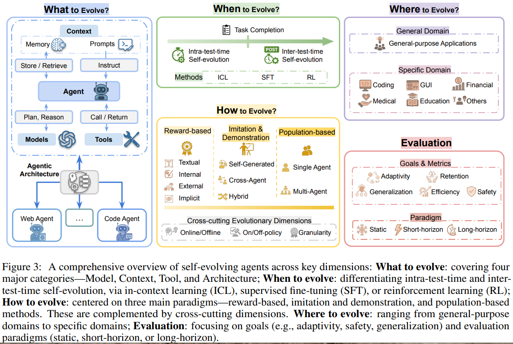
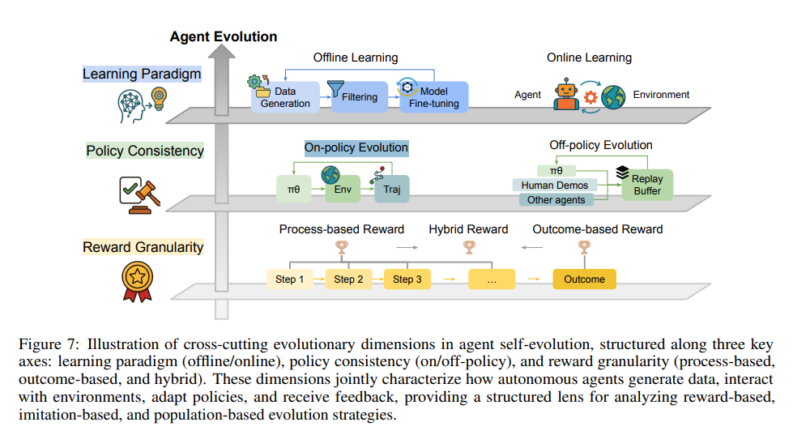
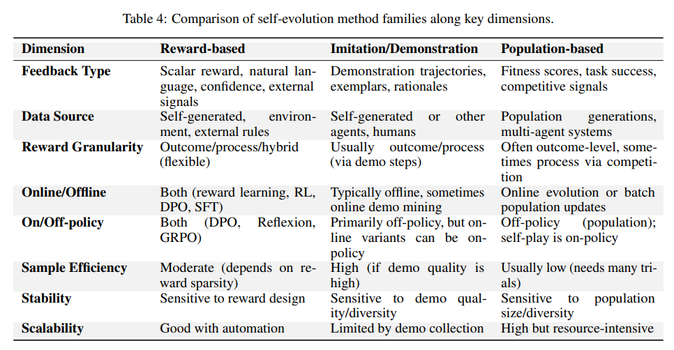

# A SURVEY OF SELF-EVOLVING AGENTS: ON PATH TO ARTIFICIAL SUPER INTELLIGENCE

**摘要：**大型语言模型（LLMs）已在各类任务中展现出卓越能力，但本质上仍具有静态性，无法针对新任务、不断发展的知识领域或动态交互场景调整内部参数。随着大型语言模型越来越多地应用于开放式、交互式环境，这种静态特性已成为关键瓶颈，因此亟需能够**实时进行自适应推理、行动和进化的智能体。**这种范式转变——从扩展静态模型到开发自我进化智能体——引发了人们对实现从数据、交互和经验中持续学习与适应的架构和方法的日益浓厚的兴趣。  本综述首次对自我进化智能体进行了系统且全面的回顾，围绕三个基本维度构建了该领域的框架——**进化什么、何时进化以及如何进化**。我们研究了智能体各组件（如**模型、记忆、工具、架构**）的进化机制，按阶段（如**测试时内部、测试时之间**）对适应方法进行分类，并分析了指导进化适应的算法和架构设计（如标量奖励、文本反馈、单智能体和多智能体系统）。此外，我们还分析了专为自我进化智能体设计的评估指标和基准，强调了其在编码、教育和医疗等领域的应用，并指出了在安全性、可扩展性和协同进化动态方面的关键挑战和研究方向。  通过提供理解和设计自我进化智能体的结构化框架，本综述为在研究和实际部署中推进自适应、稳健且多功能的智能体系统制定了路线图，最终为实现人工超级智能（ASI）铺平道路——在人工超级智能中，智能体能够自主进化，在广泛的任务中表现出达到或超越人类水平的智能。

---

智能体的哪些方面需要进化？何时应进行适应调整？以及在实践中应如何实现这种进化？

据我们所知，这是首篇聚焦自我进化智能体的系统性、综合性综述，为理论研究和实际部署提供了清晰的路线图。我们围绕三个核心问题组织分析——进化什么、何时进化以及如何进化，并为每个问题提供了结构化的理解框架。具体而言，我们系统考察了智能体的各个组成部分，包括模型、记忆、工具及相应的工作流程，探究了它们各自的进化机制（第3节探讨智能体的进化内容）；随后，我们根据不同的时间阶段和学习范式（如监督微调、强化学习和推理时进化）对现有进化方法进行了分类（第4节探讨进化时机）；最后，我们总结了指导智能体进化的不同信号（如文本反馈或标量奖励），以及智能体的不同进化架构（如单智能体和多智能体进化）（第5节探讨进化方式）。

此外，我们回顾了用于追踪自我进化智能体现有进展的某些评估指标和基准，强调了评估与智能体协同进化的重要性（第6节）。我们还考察了在编码、教育和医疗等领域的新兴应用，这些领域中持续的适应与进化至关重要（第7节）。最后，我们指出了当前存在的挑战，并勾勒出有前景的研究方向，为自我进化智能体的发展提供指引（第8节）。通过从多个正交维度对自我进化过程进行系统性分解，我们提供了一个结构化且实用的框架，使研究人员能够系统地分析、比较和设计更稳健、更具适应性的智能体系统。

总之，我们的主要贡献如下：

* 我们建立了一个统一的理论框架，用于描述智能体系统中的自我进化过程，该框架围绕三个基本维度展开：进化内容、进化方式和进化时机，为未来的自我进化智能体系统提供了明确的设计指导。

- 我们进一步研究了专为自我进化智能体设计的评估基准或环境，重点关注与适应性、稳健性和现实世界复杂性相关的新兴指标和挑战。

- 我们展示了在多个领域的若干关键实际应用，包括自主软件工程、个性化教育、医疗健康和智能虚拟助手，以此阐明自我进化智能体的实际潜力。

- 我们指出了关键的开放性挑战和有前景的未来研究方向，重点关注安全性、个性化、多智能体协同进化和可扩展性等方面。

通过这些工作，我们的综述为研究人员和从业者提供了一个更结构化的分类体系，助力从不同角度理解、比较和推进自我进化智能体的研究。随着基于大型语言模型的智能体日益融入关键任务应用中，理解它们的进化动态变得至关重要，这不仅涉及学术研究，还涵盖工业应用、监管考量以及更广泛的社会影响。

---

## 基础和定义

partially observable Markov Decision Process：

E = (G, S, A, T, R, Ω, O, γ)，其中：

- **G** 是潜在目标的集合。每个g ∈ G都是智能体需要达成的任务目标，例如用户的查询。
- **S** 是状态的集合。每个s ∈ S代表环境的内部状态。
- **A** 是动作的集合。每个动作a ∈ A可以是文本推理、外部知识检索和工具调用的组合。
- **T** 是状态转移概率函数，它接收一个状态-动作对(s, a)，并输出下一个状态的概率分布T(s′|s, a)。
- **R**: S × A × G → R 是反馈/奖励函数，以特定目标g ∈ G为条件。反馈r = R(s, a, g)通常以标量分数或文本反馈的形式呈现。
- **Ω** 是智能体可获取的观测集合。
- **O** 是观测概率函数，它接收一个状态-动作对(s, a)，并输出智能体下一个观测的概率分布O(o′|s, a)。
- **γ** 是折扣因子。

智能体系统

我们将（多）智能体系统定义为Π = (Γ, {ψi}, {Ci}, {Wi})。架构Γ决定了智能体系统的控制流程或多智能体之间的协作结构，通常表现为由节点（N1, N2, ...）组成的序列，这些节点通过图形或代码结构组织。每个节点Ni包含以下组件：

- **ψi**：底层的大型语言模型（LLM）/多模态大型语言模型（MLLM）。
- **Ci**：上下文信息，例如提示词Pi和记忆Mi。
- **Wi**：可用工具/应用程序接口（API）的集合。

在每个节点，智能体策略是一个函数πθi(·|o)，该函数接收一个观测值并输出下一个动作的概率分布，其中θi = (ψi, Ci)。**此处的实际动作空间是自然语言空间与工具空间Wi的并集。**

对于由环境E和相应目标g ∈ G表示的给定任务T = (E, g)，智能体系统遵循拓扑结构Γ生成一条轨迹τ = (o0, a0, o1, a1, ...)，**并从外部环境或内部信号（如自信心或评估器的反馈）中接收反馈r。**

自我进化策略

自我进化策略是一种转换函数f，**它以生成的轨迹τ和外部/内部反馈r为条件，将当前智能体系统映射到新状态：**

f(Π, τ, r) = Π′ = (Γ′, {ψ′ᵢ}, {C′ᵢ}, {W′ᵢ}) （1）

自我进化智能体的目标

设U为一个效用函数，它通过赋予标量分数U(Π, T) ∈ R来衡量智能体系统Π在给定任务T上的性能。该效用可源自任务特定的反馈r（如奖励信号或文本评估），也可能结合其他性能指标（如完成时间、准确率或稳健性）。给定一系列任务（T₀, T₁, ..., Tₙ）和初始智能体系统Π₀，自我进化策略f通过以下方式循环生成智能体系统的进化序列（Π₁, Π₂, ..., Πₙ）：

Πⱼ₊₁ = f(Πⱼ, τⱼ, rⱼ) （2）（优化模型，context，控制流或者工具）

其中，τⱼ和rⱼ分别是任务Tⱼ上的轨迹和反馈。

现有范式主要侧重于更新模型参数，与之不同的是，**自我进化智能体将更新目标的范围扩展到了非参数组件，例如上下文（提示词和记忆）以及工具集。**这一扩展的空间提供了更大的灵活性，使自我进化智能体能够在序列任务场景中有效运作，并在测试时进行适应。更关键的是，自我进化智能体独特地展现出主动探索能力**（例如在线搜索开源工具[43]）、自身拓扑结构的修改能力（例如迭代修改工作流程[64]或代码[55]），以及自我反思和自我评价能力（例如使用内部评估器大型语言模型提供语言反馈[17]）**，而这些能力在以往的范式中是不存在的。

## What to Evolve?

我们可将智能体系统分解为四个基本的、可进化的核心要素。我们的研究始于智能体的认知核心，即**模型**（{ψi}），考察支配其推理与行为的基本参数如何通过自身经验持续更新 [8,22]。接着，我们关注塑造其行动的**上下文**（{Ci}），探究它所遵循的指令 [39,37] 以及为保持信息更新和适应能力而依赖的长期记忆 [25,29] 的进化过程。在这一内在基础之上，我们转向智能体的外部能力，分析它如何通过自主创建 [43]、掌握 [49] 和管理新技能 [53] 来扩展其**工具集**（{Wi}），从而克服自身固有的局限性。最后，我们将视角扩展至**智能体系统**本身，研究智能体系统的架构 [65,64] 和协作结构 [70] 如何动态优化以提升整体性能和效率。

### Model

具体而言，我们概述了模型进化所依托的主要维度。其中包括**通过从自我生成的监督信号中学习来优化模型权重，以及通过与构建的环境或外部环境的交互实现进化。**这些策略共同体现了从被动学习范式向主动、持续且自主导向的改进模式的转变。

### Policy

自我进化智能体能够优化自身参数，从而在目标任务上表现更优。传统上，为工具使用基准训练智能体而收集数据的方法成本高昂，且覆盖范围往往有限；而纯合成数据生成流程则通常存在质量不足的问题。因此，近期研究**着重让智能体能够自主生成数据，以改进自身模型权重。**  一种具有代表性的方法是自挑战智能体（SCA）[8]：语言模型交替扮演两个角色——作为挑战者生成可执行的“代码即任务”问题，以及作为执行者解决这些问题。随后，模型利用成功解决方案产生的轨迹对自身参数进行微调，进而在复杂的多步骤任务中实现显著的性能提升。类似地，“自我奖励自我改进”框架[9]内置了内部自我评判机制，使模型能够自主生成问题、解决问题并评估自身表现，从而在无需外部标注的情况下生成完整的微调数据。这种方法在复杂推理任务中尤其展现出显著的改进效果。  除了任务创建，另一个颇具前景的研究方向是**直接利用交互反馈进行参数更新**。例如，SELF[10]、SCoRe[11]和PAG[12]在结合在线监督微调（SFT）与强化学习（RL）的框架中，将执行轨迹或自然语言评论解读为奖励信号，实现策略的持续优化。TextGrad[13]**进一步拓展了这一概念，将非结构化文本反馈视为可微分的训练信号，能够直接影响提示词设计和模型参数。**此外，AutoRule[14]将语言模型的推理轨迹和偏好反馈转换为明确的基于规则的训练奖励，通过结构化奖励信号提升模型输出质量。  这些进展共同勾勒出一条清晰的发展路径——从智能体自主设计训练任务，到基于执行反馈直接优化参数，凸显了模型通过从自身生成的数据中学习而实现持续进化的能力。

### Experience

智能体不仅能通过调整内部参数实现进化，**还能通过主动与环境交互（甚至构建环境）、捕捉经验并将其转化为驱动迭代改进的学习信号。**这种环境循环为智能体提供了可扩展自适应所需的复杂性和多样性。

自挑战智能体（SCA）[8] 在任务层面体现了这种动态性：智能体自主生成新的 “代码即任务” 问题，执行这些任务，然后筛选成功的轨迹用于自我再训练。AgentGen [16] 将这一概念扩展到全环境生成，从初始语料库中合成多种模拟世界（采用 PDDL 或 Gym 风格格式）。它实现了一个双向进化循环，逐步调整任务难度，使智能体能在动态结构化的课程中持续成长。

Reflexion [17] 通过引入自我反思机制对此进行补充：智能体迭代记录对自身先前行为的自然语言评价，指导未来行为以避免重复犯错。此外，AdaPlanner [18] 引入闭环自适应规划，允许智能体根据环境反馈实时优化策略，有效根据即时结果重塑行动序列。类似地，SelfRefine [20] 采用迭代优化循环，智能体反复评价并修改初始输出，无需显式再训练即可显著提高任务准确率。

SICA（自改进编码智能体）[19] 进一步突破边界，让智能体能够自主编辑其底层代码和工具，通过直接的自我修改迭代增强核心推理能力。从强化学习角度看，RAGEN [22] 和 DYSTIL [23] 等框架将多步骤工具使用任务概念化为马尔可夫决策过程，通过丰富的环境奖励和策略归纳循环优化智能体策略。其中，RAGEN 利用来自环境的密集反馈迭代微调行动策略，而 DYSTIL 则利用语言模型生成的高层策略建议，逐步将复杂决策技能内化为强化学习智能体的能力。

这些方法共同凸显了一种极具吸引力的范式：**自我进化智能体不仅利用自我生成的数据，还主动重塑自身环境和内部机制，为持续学习提供动力。这种动态交互循环指向了深深植根于经验适应的自主、开放式改进周期。**

### context

作为待进化的大型语言模型（LLM）智能体的核心组件，**上下文** 决定了智能体的行为方式。首先，我们需要阐释文献中常用的两个术语：“提示词优化”与“记忆进化”。多数情况下，这两个术语可互换使用，因为它们均指向上下文窗口中包含的内容。

“提示词优化”关注的是“**如何措辞或构建指令才能让大型语言模型表现更优**”，涉及措辞、顺序等细节；而“记忆进化”则聚焦于“应**如何存储、遗忘和检索上下文**，才能让智能体保持信息更新并提升表现”，重点在于哪些过往信息需要呈现或归档。

#### Memory Evolution

基于大型语言模型（LLM）的智能体日益配备了 **长期记忆机制** ，这种机制会随着智能体不断解决任务和与环境交互而发展和适应[160,161]。进化的记忆使智能体能够积累知识、回忆过往事件，并根据经验调整自身行为。许多研究强调，有效的记忆管理对智能体性能至关重要[162,163,164]。    SAGE[24]利用艾宾浩斯遗忘曲线来决定记住或遗忘哪些内容。A-mem[165]遵循卡片盒（Zettelkasten）方法的基本原则，通过动态索引和链接更新智能体的记忆结构，构建相互关联的知识网络。Mem0[25]引入了一个两阶段流程：智能体首先从近期对话中提取关键事实，然后决定如何更新长期记忆——可以**添加** 新事实、**合并/更新** 冗余信息，或**删除** 矛盾内容。这种机制确保智能体的长期记忆连贯且与时俱进。MemInsight[26]通过语义结构增强原始记忆，对过往交互进行总结和标记，以便后续检索。REMEMBER[27]**将大型语言模型与经验记忆相结合，并利用强化学习信号决定在每个情节后如何更新该记忆。**

**记忆进化的一个关键方面是让智能体能够从过往经验中学习启发式方法或技能。** 高级智能体不仅能检索精确的过往实例，还能将经验提炼为更通用的指导原则[28,166]。Expel[28]处理过往轨迹以生成见解和规则，用于指导进一步的交互。这种经验性知识积累带来了可衡量的进步，随着经验的增加，智能体的表现稳步提升。其他系统则专注于存储更高级别的问题解决模块，例如“智能体工作流记忆”（Agent Workflow Memory）[29]记录常见的子任务序列（工作流），使解决复杂任务的智能体能够检索和复用已验证的行动序列，而非从零开始规划。在黎塞留外交智能体（Richelieu diplomacy agent）中，系统通过自我对弈游戏扩充记忆，存储模拟交互中的见解以优化未来决策[30]。通过将特定情节概括为可复用的知识，这些方法展示了记忆进化如何将智能体的一次性经验转化为长期能力，进而推动智能体的进化。

#### Prompt Optimization

记忆进化关注智能体保留哪些知识，而 **提示词优化（Prompt Optimization, PO）**  则通过改进输入给基础模型的指令，使大型语言模型（LLM）智能体实现自我进化——这种方式无需修改模型权重，却能直接改变模型行为[167]。

早期研究将指令设计视为一个搜索问题。APE[32]生成候选提示词，在验证示例上评分后选择最优方案；ORPO[33]进一步让模型在先前输出的反馈指导下，迭代重写自身提示词。ADO[168]引入领域特定语言（DSP），对迭代生成的提示词施加语义约束，以更高效地找到最优提示词。ProTeGi[34]生成自然语言“修正意见”，将其作为编辑操作应用于提示词，形成类似梯度下降的文本优化过程。PromptAgent[35]**将提示词探索转化为蒙特卡洛树搜索问题，策略性地探索指令空间；** 而像PromptBreeder[5]这样的进化方法则通过维持一个提示词群体，不断发现更有效的指令。REVOLVE[36]通过追踪模型响应轨迹并应用平滑更新，进一步稳定了长期优化过程。将自主性推向极致的SPO[39]构建了一个完全自包含的循环：模型生成自身训练数据，并通过对输出进行成对偏好比较来优化提示词，彻底摆脱了对外部标注数据或人类反馈的依赖。这些技术共同表明，智能体能够自主改进其提示策略，使提示文本成为与自身经验协同进化的可学习组件。

在复杂系统中，智能体通常需要协调一系列大型语言模型调用，或与其他智能体协作，这使得提示词设计成为一个多节点问题。诸如DSPy之类的框架将整个工作流表示为一个图，其中的子提示词会针对全局目标进行联合调优[37]。Trace[38]、TextGrad[13]和LLM-AutoDiff[40]进一步拓展了这一思路：**它们将每个提示词视为可微分程序中的参数，并通过传播自然语言“梯度”来优化每一步骤。** 在协作场景中，多智能体系统搜索（MASS）[63]首先优化单个角色的提示词，再改进智能体间的通信模式；而**MAS-ZERO[159]会动态生成和修订角色提示词，为每个新问题组建高效团队。**EvoAgent[41]和AgentSquare[54]等进化系统将智能体及其提示词视为模块，通过变异和选择机制发现专用团队，其性能超越人工设计的方案。这些方法将提示词优化从单一指令扩展到了定义整个工作流或智能体群体的语言层面。

## TOOLS

智能体的能力从根本上由其可运用的工具所定义。智能体的发展轨迹中存在一个关键的进化节点：**从单纯的工具使用者转变为自主的工具创造者。**这种从依赖预设、静态工具集到能够自主扩展和改进自身技能的转变，是迈向认知自主性的重要飞跃。这种让智能体动态调整自身能力的范式，使其能够解决大量初始设计时未预见的复杂问题。这一进化过程体现在三个相互关联的方面：**工具的发现、掌握与管理**，下文将详细阐述。

### 自主发现与创造

自主创造工具的主要动力是为了突破固定工具集的固有局限，让智能体拥有按需创新的灵活性。目前，相关方法已涵盖从随机发现到规范化合成的多个层面。其中，Voyager这类智能体通过在《我的世界》等复杂开放式环境中进行探索性试错，凭借内在驱动力构建起不断扩充的技能库[42]。这种探索式方法虽能生成大量技能，精准度却有所欠缺。与之不同，Alita和ATLASS等系统采用更具反应性的方式，**常常在发现能力缺口时，借助检索增强生成（RAG）技术搜索开源代码库，或从零开始编写新函数[43,44]。** 而在另一极端，存在一些高度结构化的框架，将工具创造视为一种审慎的工程流程。例如，CREATOR将抽象工具创造（如设计一个用于计算N天平均温度的可复用函数的通用结构）与具体工具使用（如确定如何将该函数应用于特定城市和时间范围）分离开来，从而增强了工具的模块化和可复用性[45]。更为规范的是，SkillWeaver通过**分析人类或智能体成功完成任务的轨迹，提出、合成新技能并将其打磨成稳健的可复用API，确保初始生成的工具具备较高质量**[46]。此外，CRAFT等框架表明，为特定领域创建专用工具集对于补充通用模型至关重要，这能在不牺牲适应性的前提下实现专家级性能[47]。然而，这种日益增强的自主性也带来了重大挑战，尤其是在安全与安保方面。代码的无约束生成可能导致工具存在可被利用的漏洞或意外的有害行为，因此，自动化验证和沙箱技术成为未来研究的关键领域。

### 通过迭代改进实现掌握

自主创造的工具数量不断增加，这就需要一套可靠的机制来掌握这些工具。新生成的工具往往只是脆弱的脚本，而非可靠的函数，此时迭代改进便显得至关重要。LearnAct和From Exploration to Mastery等框架建立了关键的自我修正循环，让智能体从自身经验中学习[48,49]。这涉及到解决棘手的“信用分配”问题：**精确找出导致失败的具体代码行或参数。** 为此，智能体需要分析多种反馈信号，包括编译器错误、意外的API返回值、环境状态变化，甚至用户后续行为中隐含的信号。其目标不仅是调试工具的底层代码，还要完善工具的文档（如文档字符串和参数描述），这对提升智能体未来理解和正确使用工具的能力至关重要。这一改进过程也为有价值的人机协作创造了可能。尽管完全自主是最终目标，但许多系统可设计为“人机协作模式”，由人类专家提供修正意见、给出高层建议或验证新创建的工具。这种协作方式能显著加快掌握过程，并确保智能体的技能与人类意图及安全标准保持一致。归根结底，正是这种自我打磨的过程，将初步形成的技能提升为可靠的能力，确保智能体不断增长的技能库不仅在数量上有所增加，更重要的是在质量和稳健性上得到提升。

### 可扩展的管理与选择

当智能体掌握的技能库扩展到数百甚至数千项时，它就面临着“富足的困境”。挑战从创造工具转变为高效地管理和筛选工具。庞大的技能库会形成巨大的搜索空间，使得传统检索方法既缓慢又不准确。为解决这一问题，ToolGen带来了根本性的范式转变，它将工具编码为语言模型词汇表中的独特标记。这一做法巧妙地将工具检索重构为生成问题，利用Transformer强大的模式识别能力，将最合适的工具预测为其思维过程的自然延续[53]。除了选择单一工具，高级智能体还必须擅长工具组合——学习以新颖的序列将多个工具串联起来，以解决多步骤问题。这是一种更高层次的管理任务。AgentSquare等架构采用元学习的方式，自动搜索智能体的模块化设计空间（包括其规划、记忆和工具使用组件），为复杂任务的执行找到最优配置[54]。作为这一进化趋势的逻辑终点，像达尔文-哥德尔机这样富有远见的概念提出了一个开放式进化框架，让智能体能够从根本上重写自身核心代码。在这一愿景中，智能体与其工具之间的界限变得模糊，从而引发超越工具增强本身的递归式自我改进[55]。**本质上，这整个进化路径旨在建立一个封闭且良性的循环：一个真正自主的智能体，能够察觉到自身能力的缺口，创造新颖的解决方案，通过实践掌握这些方案，并将其无缝整合到一个管理有序、不断扩充的技能库中。**

## 结构

下一代智能体系统的标志性特征在于其内在的自我改进能力。这标志着从固定能力系统向可自主提升性能的系统的根本性转变[169]。通过将自身内部逻辑和协作结构视为可优化组件，这些系统能够根据反馈调整行为和设计，从而达到静态设计无法企及的效率和效果水平。本节将详细阐述这种自我优化的实现方式，首先考察单智能体系统内部的改进，再探讨复杂多智能体系统的协同进化。

#### 3.4.1 单智能体系统优化

**大型语言模型调用节点优化**

孤立地优化单个大型语言模型调用较为简单，但在智能体系统中，由于后续步骤会掩盖任何单一变更的影响，这成为一个棘手的 **信用分配问题** 。相关研究通过使节点级组件可优化来解决这一问题，主要采用两种策略。第一种策略专注于在固定智能体拓扑结构内改进节点。典型示例如TextGrad[13]，它受反向传播启发，利用“文本梯度”将最终输出的反馈沿工作流反向传播，指导每个节点进行系统性的局部优化，而不改变系统整体结构。第二种并行策略则将这种组件级优化直接融入系统架构的搜索过程。在此方法下，节点特征成为更大搜索空间中的可调节参数。例如，部分框架可将提示词工程直接嵌入搜索循环，使系统能同时发现最优工作流和每个智能体的最有效指令[63]。类似地，EvoFlow[62]采用进化算法，从多样化的模型池中为每项任务选择最合适的大型语言模型，构建异构工作流。这种整体策略有助于发现结构和单个智能体能力协同优化的系统，有效平衡整体性能和成本等指标[170]。

**自主智能体优化**    在单个大型语言模型调用节点优化的基础上，更深层次的自我改进以自主智能体为整体目标。这种进化沿两个主要方向推进：优化智能体的高层架构设计，以及使智能体能够直接修改自身源代码。第一种方法聚焦于发现最优智能体结构。AgentSquare[54]便是典型代表，它定义了包含规划器、记忆模块等组件的模块化设计空间，然后利用进化算法为特定任务找到最有效的组件组合。第二种方向涉及动态重写自身运行代码的智能体。例如，达尔文-哥德尔机[55]这类激进系统可递归修改自身Python代码库，AlphaEvolve[61]则通过进化编码改进特定算法。同样，哥德尔智能体[4]提供了一个自引用框架，让智能体能够分析和改变自身逻辑。这两个方向（优化智能体的架构“蓝图”及其功能代码）共同体现了将智能体基本结构和逻辑转化为可学习组件的关键趋势。

#### 多智能体系统优化

智能体在系统中的组织和通信方式（即拓扑结构）从根本上决定了其解决复杂问题的能力。该领域已从使用固定的、人工设计的通信结构，**发展到创建可根据特定任务自动调整组织方式的动态系统，从而能够发现和利用最有效的协作模式。这种进化主要体现在两个方面：静态显式工作流的优化，以及动态内部策略的协同进化。**

**智能体工作流优化**

智能体工作流优化旨在为特定问题找到最有效的（通常是静态的）通信和任务分配结构。早期研究奠定了重要基础，例如AutoFlow[66]实现了从自然语言自动生成线性工作流，GPTSwarm[67]提出了统一的基于图的框架。与此同时，其他基础性工作探索了智能体如何通过符号学习将交互经验提炼为明确、可解释的逻辑规则，以指导未来决策[171]。将系统抽象为可调节组件（无论是节点、边还是符号规则）至关重要，但这些早期系统往往缺乏有效遍历庞大可能配置和交互空间的正式方法。  当ADAS[65]和AFlow[64]将这一挑战正式定义为搜索和优化问题时，取得了重大突破。ADAS通过将系统设计框定为在图灵完备的基于代码的配置空间中搜索，树立了理论愿景。在此基础上，AFlow通过引入代表常见智能体模式的可复用算子，并采用蒙特卡洛树搜索（MCTS）高效遍历庞大设计空间，使这一愿景得以实践。这些研究共同建立了将智能体系统设计视为可处理的优化问题的核心方法，证明自动发现的工作流性能可超越人工设计[64]。  在这一形式化之后，研究迅速向为每个特定查询创建定制化智能体系统的方向拓展，主要形成两种策略：基于搜索的生成和基于学习的生成。基于搜索的方法（如MaAS[172]）创建潜在架构的“超网络”，然后从中采样专用系统；基于学习的方法则训练模型直接生成有效拓扑，例如ScoreFlow[68]使用新型偏好优化方法训练生成器，FlowReasoner[69]利用强化学习训练元智能体实时构建定制工作流。这一针对特定查询的生成研究领域仍在积极发展中[173,159]。此外，值得注意的是，这一过程不仅限于拓扑结构优化——许多框架还会同步进行节点级优化，例如将提示词协同优化或从异构模型中选择模型作为架构生成过程的一部分[64,63,62]。  所有基于搜索和学习的方法都面临一个关键挑战：评估每个潜在工作流的计算成本过高[54]。为解决这一问题，研究人员开发了轻量级预测模型。典型代表如Agentic Predictor[174]，它训练模型基于工作流的结构和语义特征准确预估其性能，无需完整执行。这些预测模型提供了快速廉价的评估替代方案，显著加速了优化过程，使探索庞大设计空间成为可能[175]。

**多自主智能体优化**

与优化系统显式工作流结构不同，这一研究方向聚焦于多个自主智能体如何通过交互协同进化其内部行为策略。这种方法能够培育出协调、任务分配和有益竞争等涌现能力。例如，ReMA[70]利用多智能体强化学习（MARL）协同训练高层元思考者和低层执行者，显著提升了推理基准测试的性能。在此基础上，GiGPO[71]通过聚合轨迹提供更精确的信用分配，增强了多智能体强化学习训练，提高了长周期任务的成功率。为支持这一方向，MARTI[176]等平台提供了开源基础设施，用于编排和扩展这些语言模型集合的训练。这些研究共同表明，多智能体强化学习是培养单个智能体无法实现的群体级能力的有效途径。

---

## When to Evolve

基于大型语言模型（LLM）的智能体，其自我进化的时间维度主要涉及学习过程与任务执行之间的关系。因此，自我进化智能体的第二个关键方面是确定进化时机，即自我进化策略f在智能体系统的哪个阶段被调用和应用。为此，我们提出一种分类法，将自我进化的时间模式分为两类：测试时内部自我进化（Intra-test-time self-evolution）和测试时之间自我进化（Inter-test-time self-evolution）。

测试时内部自我进化指的是在任务执行过程中发生的自适应过程，此时智能体会意识到自身在特定问题上的局限性，并启动针对性学习机制以实时增强能力[177,178]。这种进化模式的特点是与当前任务直接关联：智能体针对遇到的具体问题提升解决能力，使性能与适应之间形成动态交互。

测试时之间自我进化指的是在任务完成间隙发生的学习过程，通过利用积累的经验来改善未来表现。这一类别涵盖多种方法：通过迭代优化从预先收集的数据集中提取知识的离线学习范式[79,80]，以及基于流式交互数据持续适应的在线学习范式[84,43,179,117]。

在这些时间阶段实现自我进化时，会用到大型语言模型中的三种基本学习范式：\*\*上下文学习（ICL）\*\*[180,181,182]，通过上下文示例调整行为而不修改参数；\*\*监督微调（SFT）\*\*，基于标记数据通过梯度优化更新模型权重[183,184,185]；以及\*\*强化学习（RL）\*\*，通过奖励驱动的策略优化塑造行为[186,187,188]。尽管这些学习范式在不同时间场景下的概念保持一致，但它们在数据可用性和学习目标方面的具体实现有所不同：

测试时内部进化具有在线性特征：**学习数据在任务执行过程中动态生成，优化目标直接指向提升当前具体问题的解决性能。** **这种实时关联性要求具备快速适应机制，能够在任务解决的时间限制内处理学习数据和反馈信号，并调整行为。**  相比之下，测试时之间进化具有回顾性特征：**学习算法基于历史数据（**无论是来自精心整理的数据集还是累积的行为轨迹）运行，优化目标侧重于提升整个任务分布的预期性能，而非最大化单个具体问题的成功率。这种时间上的分离使更复杂的学习过程成为可能——无需受实时任务执行的即时性约束，就能识别跨任务模式、整合多样化经验并培养可泛化的能力。

### Intra-test-Time Self-Evolution

在测试时内部自我进化中，智能体所进行的自我改进过程与解决当前手头任务紧密关联。这一时间阶段的显著特征是其同步性：反馈信号在任务执行过程中生成并处理，优化目标专门针对提升当前问题实例的性能，而非泛化到未来任务。在此，我们介绍这三种学习范式在该时间阶段的实现方式。

**上下文学习**

测试时内部的上下文学习方法利用模型的上下文窗口作为动态记忆系统，实现即时适应而无需修改参数。**这些方法通常采用自我反思机制，智能体分析自身表现、生成语言化的评价或见解，并将这些反思保存在情景记忆缓冲区中，以指导同一任务情境下的后续决策[17,72]。**部分方法不仅限于简单反思，还包括动态规划修正——智能体可根据环境反馈调整整体策略，按需在行动执行与计划修改之间切换。  例如，AdaPlanner[18]将任务分解为可管理的子目标，并预测每个子目标的环境反馈。在执行过程中，其修正组件区分计划内反馈（与预测一致的观察结果）和计划外反馈（偏离预测的观察结果）。对于计划内反馈，修正组件通过专门的ask\_LLM()动作动态查询大型语言模型，以解析观察结果并提取相关信息；对于计划外反馈，修正组件主动修订整个计划，并从中途节点恢复任务解决过程，而非从头开始。这种自适应闭环框架无需预先知晓反馈结构，能实现更高效的决策。类似地，TrustAgent[73]在执行过程中采用基于规则的计划修订，根据语言反馈调整策略，逐步形成更安全的规划方案。  这些上下文学习方法表明，测试时适应无需对模型进行永久性修改，就能实现复杂的行为调整，在保持模型通用能力的同时确保灵活性。

**监督微调**    测试时内部的监督微调代表了一种范式转变——模型通过习得的元适应策略进行即时自我修改。自适应语言建模[74]是这种方法的典型示例，它生成“自我编辑指令”——一种元级别的指令，能够重构信息表示、指定优化超参数，或**调用工具进行数据增强和梯度计算**。这些自我编辑指令触发即时的监督微调，产生持续的权重更新，使模型适应当前任务。**其核心创新在于元学习阶段：通过强化学习训练模型生成有效的自我编辑指令，将更新后模型的下游性能作为奖励信号，本质上是教会模型如何自我学习。**

**强化学习**   测试时内部的强化学习**使模型在遇到超出自身当前能力的问题时，能够按需发展新能力**。LADDER[77]通过其测试时强化学习（TTRL）机制展示了这一点：**当识别到极具挑战性的问题时，系统生成一系列相关的问题变体，并针对该问题类别进行集中、有针对性的强化学习。**这种方法将难以解决的挑战转化为学习机会，使模型能在部署过程中扩展问题解决能力，而非直接失败或给出次优解。该方法代表了一种即时技能获取形式——计算资源被精准投入到最需要的时间和场景中。

### Inter-Test-Time Self-Evolution

测试时之间的自我进化是自主智能体的主要学习过程，其适应发生在任务执行之后而非执行过程中。在这种时间模式下，智能体会完成特定任务，提取包括明确奖励[189]、梯度[190,191]和性能指标[192]在内的反馈信号，随后利用这些信息提升未来解决问题的能力。这种回顾性学习过程将任务表现与能力提升分离开来，使智能体能够整合经验、识别成功与失败的模式，并系统地完善行为策略，而不受实时任务需求带来的计算约束。

**上下文学习**    测试时之间的上下文学习已成为智能体自我改进的广泛采用的方法。这种范式将先前任务的执行结果和反馈作为未来问题解决的上下文信息。Wang等人[29]通过从智能体动作历史中归纳工作流，并将其纳入后续任务的上下文，展示了这一原理。上下文强化学习（ICRL）领域[193,194,195]进一步扩展了这一概念，在智能体的上下文窗口中保留观察和动作的历史。这些方法基于这样一种假设：预训练神经网络可以在其前向传播过程中实现隐式强化学习算法，无需参数更新就能通过处理上下文信息来调整行为[196]。ICRL的一个显著特征是 **上下文内改进** ，即随着与任务相关的信息在上下文中积累，智能体的性能会逐步提升，从而通过注意力机制而非基于梯度的学习实现复杂的适应。

**监督微调**    测试时之间的监督微调[82]方法通过合成数据生成和自我评估，建立了迭代自我改进的范式。SELF[10]开创了元认知训练，即模型首先获得自我反馈和自我完善能力，然后迭代生成对未标记指令的响应，并通过自我批判加以改进。STaR[79]和Quiet-STaR[80]专注于通过合理化来改进推理能力——模型尝试解决问题，然后为最初未能解决的正确答案生成解释，从而创建结合成功尝试和事后推理的增强训练数据。SiriuS[81]将这一理念扩展到序列问题解决中，在维护正确解决方案库的同时，通过包含反馈整合、重新生成和重新表述的多阶段优化来增强对失败案例的处理。这些方法都有一个核心见解：模型可以通过学习评估和增强自身输出来实现自我提升，无需大量人类监督，就能从最初不完善的尝试中创造高质量的训练信号。

**强化学习**    测试时之间的强化学习利用不受约束的计算资源，通过广泛的环境交互和复杂的课程设计来优化智能体。RAGEN[22]和DYSTIL[23]在多轮交互任务中采用在线强化学习，通过模拟对话中的在策略学习不断完善策略。“类人学习”（Learning Like Humans）[83]引入了受认知启发的训练方法，结合自适应难度递进、在策略探索与离策略效率以及专家演示来加速学习。特定领域的应用展示了测试时之间强化学习的多功能性：WebRL[84]通过自我进化课程开发网络导航智能体，该课程能根据性能自动调整任务复杂度；DigiRL[85]则使设备控制智能体通过自主强化学习掌握实际场景中的交互。这些方法利用部署前的阶段进行广泛的试错学习，通过数千次交互开发稳健的策略，而这在实时部署中是不切实际的。

## How to Evolve

对自我进化的追求是构建高级、自主且日益通用的人工智能的核心。对于大型语言模型（LLMs）及其智能体扩展而言，如何持续、自主且高效地进化其能力已成为核心挑战。因此，第三个关键方面在于：与依赖静态数据集或一次性监督微调不同，**自我进化强调一个持续过程——模型从现实世界交互中学习、主动寻求反馈、自我反思、生成或筛选新数据，并根据动态环境调整策略。** 这种持续进化不仅是数据或计算规模的扩大，还要求智能体具备一系列元能力，包括自我修正、自主数据生成、知识迁移和多智能体协作。由此，自我进化的领域变得日益丰富多元，每个方法分支都在探索反馈、学习范式、数据来源和进化规模的不同维度。

本章旨在系统梳理和分析自我进化方法的主要类别，提供一个理解其原理、机制和相互作用的统一框架。我们首先探讨基于奖励的进化，其核心是设计奖励信号（**从自然语言反馈、内部置信度指标到外部或隐含信号**），以指导迭代式自我改进。接下来，我们考察**模仿与示范学习，即智能体通过学习高质量范例（无论是自我生成的，还是其他智能体或外部来源提供的）来实现改进。**当示范样本丰富或可自主合成时，这种范式尤为有效，并在推理和多模态领域推动了显著进展。最后，我们介绍基于**群体和进化的方法，这类方法从生物进化和集体智能中汲取灵感，通过维持智能体变体或协作智能体的群体，利用选择、变异、交叉和竞争等机制并行探索解决方案空间、促进多样性，并催生新策略或架构创新。**

### Reward-based Self-Evolution

自我改进能力是高级智能的基石。在大型语言模型（LLMs）中，这体现为一个由奖励驱动的动态进化过程——模型通过迭代学习自身输出和交互结果来优化能力。而作为引导反馈的\*\*奖励信号设计\*\*至关重要，它决定了学习过程的性质、效率和效果。本节将系统梳理奖励设计的主要方法，按反馈性质分为：文本反馈、内部置信度、外部奖励和隐含奖励。

#### 文本反馈（Textual Feedback）

文本反馈利用大型语言模型的原生模态——自然语言——提供详细、可解释的优化指令。与标量奖励不同，文本反馈包含细致的批判和可操作的建议。近期框架如Reflexion[17]、AdaPlanner[18]、AgentS2[86]、SELF[10]、Self-Refine[72]、SCoRe[11]、PAG[12]和TextGrad[13]均属于这一方向。例如，Reflexion提出“语言强化学习”，**智能体以自然语言反思过往尝试，并将这些反思作为情景记忆存储，用于指导未来决策。**AdaPlanner通过允许大型语言模型智能体根据计划内和计划外反馈修订方案，实现闭环自适应规划，同时借助代码风格提示减少幻觉并促进技能发现。Self-Refine和SELF进一步探索迭代式自我反馈与自我修正，证明即使是最先进的模型，也能通过多轮基于语言的自我批判实现改进，无需额外监督数据或外部强化。这些框架凸显了语言作为奖励渠道的力量，可实现细致、灵活且样本高效的自我改进。

#### 内部奖励（Internal Rewards）

基于内部置信度的奖励脱离外部信号，转而利用模型的内在指标（如概率估计或确定性）。这种范式借助模型的内在理解指导改进，无需依赖外部监督。置信度知情自一致性（CISC）[87]、自集成（Self-Ensemble）[88]、自我奖励自我改进（Self-Rewarding Self-Improving）[9]、基于自我确定性的可扩展best-of-N选择[89]以及自我奖励语言模型（Self-Rewarding Language Models）[90]等方法，使模型能基于内部置信度指标进行自我评估和响应校准。例如，CISC通过置信度分数对推理路径加权，同时提升准确性和计算效率，有效从多个候选中筛选高质量解决方案。自集成通过将选项划分为更小的可管理组并聚合预测，减轻置信度失真和过度自信偏差。自我奖励语言模型证明，模型可作为自身的奖励函数，通过自我指令和自我评估循环生成训练数据。这些方法能减少对人类标签和外部评估器的依赖，实现可扩展且自主的自我改进循环，无需人类干预即可持续运行。  ### 外部奖励（External Rewards） 外部奖励来自模型之外的来源，如环境、多数投票或明确规则。多数投票[91,92,93]将多个模型输出的共识作为正确性的代理，提供自我生成但有依据的奖励信号。环境反馈（包括基于工具的信号）是智能体研究的核心（如SWE-Dev[94]、SICA[95]、Feedback Friction[96]、USEagent[97]、DYSTIL[23]），其中智能体通过与现实世界环境和工具的直接交互学习。基于规则的奖励[98,14,83,77,22,99]将明确约束或逻辑规则作为可验证信号，在数学推理、游戏和结构化问题解决等领域尤为有效。这些方法提供客观、可靠的监督，但可能需要大量工程投入或在表达能力上存在局限。

#### 隐含奖励（Implicit Rewards）

隐含奖励框架假设，即使反馈信号未被明确标记为奖励，大型语言模型也能从中学习。例如，“奖励即足够”（Reward Is Enough）[100]证明，大型语言模型可利用上下文窗口中嵌入的简单标量信号进行上下文内强化学习，无需明确的强化学习微调或监督，即可在多轮交互中改进响应。这揭示了模型解释和学习输入上下文中隐含反馈线索的内在能力。近期研究进一步扩展了这一概念，表明大型语言模型通过标准训练目标，天生编码了类奖励信号。内生奖励（Endogenous reward）[101]发现，标准的下一个token预测任务隐含学习了通用奖励函数，无需额外训练即可从模型logits中提取。此外，隐含自我改进（ImPlicit Self-ImprovemenT，PIT）框架[214]通过最大化参考响应条件下的响应质量差距，从人类偏好数据中隐含学习改进目标，无需额外人工投入。与基于规则或环境的外部奖励不同，隐含奖励方法通过发现和利用语言建模中固有的奖励信号，展现出独特优势。

### Imitation and Demonstration Learning

模仿与示范学习是一种范式，其中自我进化的智能体通过学习高质量样例来提升自身能力，这些样例可能由智能体自身、其他智能体或外部来源生成。与依赖明确奖励信号的基于奖励的方法不同，基于模仿的方法专注于通过迭代自我训练和自举机制来复现和完善成功的行为模式。当存在高质量示范或能够自主生成这些示范时，这种方法尤为有效，能让智能体在最少外部监督的情况下实现能力的自举提升。

#### 5.2.1 自我生成示范学习

自我生成示范学习是指智能体通过迭代优化过程创建自身的训练数据，模型从自己的输出中生成并筛选高质量样例，进而实现学习提升。

**推理能力自举** ：文献[79]介绍了自我生成示范学习的基础框架，使语言模型能够通过迭代自我训练实现推理能力的自举。该过程包括为问题生成推理链、基于正确答案进行微调，并重复这一循环以逐步提升性能，无需依赖真实的推理路径。在这一框架的基础上，近期研究通过更复杂的训练策略优化了自举过程。例如，文献[102]提出了一种验证器引导的自我训练方法，由单独的验证器模型评估生成的推理链质量，再将其纳入训练数据，从而增强自我改进的可靠性。此外，文献[103]引入了自适应数据采样策略，根据模型在各类推理任务中的表现动态调整训练数据的构成，减少对特定问题类型的过拟合。

**多模态自我训练** ：将自我训练扩展到多模态领域面临独特挑战，需要生成跨越视觉和文本模态的高质量示范。文献[104]展示了视觉-语言模型如何通过学习自身生成的图像描述和视觉推理链实现迭代改进。该方法利用模型已有的视觉理解能力生成详细的图像描述，随后通过自举方式用这些描述微调模型的视觉感知能力。文献[105]在此概念上进一步拓展，使多模态大型语言模型成为强大的数据生成器，通过先进的提示词工程和质量筛选机制，生成跨不同模态和任务的多样化训练样例。

#### 5.2.2 跨智能体示范学习

跨智能体示范学习是指智能体从其他智能体（无论是同一系统内还是外部来源）提供的示范中学习，实现知识转移和协作改进。

**多智能体自举推理** ：文献[81]提出了一个多智能体系统框架，通过自举推理从彼此的成功示范中学习。该系统维护一个经验库，存储不同智能体生成的成功交互轨迹，为高效的知识共享和协作改进提供支持。每个智能体都能利用整个系统的集体经验，加快学习进程并发现多样化的解决方案策略。这一框架表明，智能体可以在复杂任务的不同方面形成专长，同时从整个系统积累的知识中获益。

**特定领域示范学习** ：示范学习在特定领域的应用已被证明效果显著，尤其在那些专家知识能通过示范有效传递的专业领域。在推荐系统中，自优化微调等技术[106]使基于大型语言模型的推荐系统能够从自身成功的推荐模式中学习，形成一个随时间增强个性化的反馈循环。该系统从成功的用户交互中生成高质量的推荐示范，并用这些示范微调底层语言模型，最终实现更精准、更个性化的推荐。

#### 5.2.3 混合示范学习

混合示范学习结合了自我生成示范和外部示范，构建更稳健、更多样化的训练方案，以充分利用两种方法的优势。

**递归自我改进** ：文献[107]展示了如何通过结构化的自我反思和示范生成来训练智能体系统地改进自身行为。这种方法使语言模型智能体能够反思自身的推理过程，识别需要改进的地方，并生成纠正性示范来解决这些不足。这一递归过程形成了一个持续改进的循环，让智能体在自我诊断和自我纠正方面的能力不断提升，进而表现出更稳健、更具适应性的行为。

**置信度引导的示范选择** ：近期研究聚焦于从自我生成和外部来源中筛选高质量示范的更复杂机制。基于置信度的方法[108]利用模型的不确定性估计来判断哪些示范最有可能对学习产生积极影响，过滤掉可能有害或低质量的样例。这种方法解决了示范学习中的一个关键挑战：低质量示范会降低性能。通过确保仅使用高置信度、高质量的样例进行训练，该方法有助于维持学习过程的完整性。

模仿与示范学习方法的效果在很大程度上取决于可用示范的质量和多样性。当存在高质量样例时，这些方法能产生显著效果，但在示范稀缺或可用数据中最优行为代表性不足的领域，它们仍面临挑战。未来的研究方向包括开发更复杂的示范选择和生成策略、提升从有缺陷示范中学习的稳健性，以及构建能更好地融合多来源示范的机制。

#### Population-based and Evolutionary Methods

基于群体和进化的方法代表了一种与前几节讨论的基于奖励和基于模仿的方法截然不同的智能体进化范式。基于奖励的方法通常通过迭代奖励信号优化单个智能体，模仿学习则依赖于从示范中学习，而基于群体的方法则从生物进化和集体智能中汲取灵感。这些方法同时维持多个智能体变体，通过选择、变异、交叉和竞争性交互等机制，实现解决方案空间的并行探索和多样化能力的涌现 [109]。这使得搜索覆盖范围更广，能够发现基于梯度优化可能遗漏的新颖解决方案。当解决方案空间复杂、多模态，或最优策略需要根本性架构变更而非参数微调时，这种方法尤为有价值。

#### 5.3.1 单智能体进化

单智能体进化方法侧重于通过基于群体的机制进化单个智能体，其中智能体的多个变体随时间竞争和进化。这些方法大致可分为两类主要范式：从进化中学习和从多轮推演中进行自我对弈。

**从进化中学习**：这种范式直接借鉴生物进化，维持智能体变体的群体，并应用进化算子来发现增强的能力。达尔文 - 哥德尔机（DGM）[55] 是这种方法的典型示例，它通过自我改进智能体的开放式进化，维护所有历史版本的档案，允许从任何过去的 “物种” 分支，而非线性优化。该系统通过允许智能体直接修改自身的 Python 代码库实现自引用改进，其进化由编码基准测试的实证性能驱动，亲本选择平衡了性能分数和用于多样化探索的新颖性奖励。为补充这种代码级进化，受自然启发的基于群体的进化（GENOME）框架 [109] 直接将遗传算法应用于语言模型参数进化，维持群体并对模型权重使用交叉、变异和选择算子。GENOME + 通过粒子群优化概念扩展了这一点，添加了继承机制和集成方法，表明无梯度进化优化可以通过参数空间探索有效提升模型能力。

**从多轮推演中进行自我对弈**：这种范式侧重于智能体通过迭代自我竞争和基于推演的学习来改进，其中智能体生成多个轨迹并从自身探索中学习。自我对弈微调（SPIN）[110] 奠定了基础，让当前模型与先前版本竞争，创造进化压力，使只有改进的策略得以留存，无需外部标注。SPC [111] 通过复杂的对抗性协同进化推进了这一点，其中 “狡猾生成器” 学习制造欺骗性错误，而 “步骤评论家” 进化以检测日益微妙的错误，使用自动验证在没有人类步骤级标注的情况下维持改进。STL [112] 通过迭代前瞻搜索展示了自我教学进化，其中价值模型从自身探索性推演中生成训练数据，将数值价值学习与自然语言推理链相结合，实现自举式持续改进。这些方法共享一个原则：使用智能体自身生成的经验作为学习信号，创建无需外部监督即可进化的自我维持改进循环。

#### 5.3.2 多智能体进化

多智能体进化方法将基于群体的方法扩展到进化整个智能体团队或网络，侧重于优化集体行为、协调策略和协作架构。根据其进化机制，这些方法可分为两类主要范式：系统架构进化和基于知识的进化。

**系统架构进化**：这种范式侧重于进化多智能体系统的结构和协调方面，包括团队组成、编排策略和工作流优化。EvoMAC [113] 引入了一个模仿神经网络训练的多智能体系统框架，实现 “文本反向传播”，其中编译错误和测试失败作为损失信号，驱动智能体团队组成和个体提示词的迭代修改。一个专门的 “更新团队” 分析文本反馈以识别有问题的智能体，并生成修改指令，有效在智能体配置空间而非模型参数上实现基于梯度的优化。在这种结构进化概念的基础上，Puppeteer [114] 采取了不同的方法，侧重于协调策略进化而非团队组成变化。该系统采用集中式编排器，通过强化学习进化其决策策略，动态选择在每一步激活哪些智能体，同时平衡任务性能和计算成本。这种 “木偶师 - 木偶” 范式展示了架构进化如何在协调层面发生，发现高效的协作模式和涌现行为，如核心智能体之间更紧密的协调和复杂的循环交互模式。

**基于知识的进化**：这种范式强调通过记忆积累和基于案例的学习来进化多智能体团队的集体知识和经验，主要通过上下文学习而非参数更新运作。MDTeamGPT [115] 通过双知识库系统为此方法奠定了基础，实现了存储成功案例的 CorrectKB 和捕获失败反思的 ChainKB，使系统能够通过结构化案例检索和推理增强从成功和错误中学习。扩展这一医疗咨询框架，MedAgentSim [116] 展示了这种基于知识的进化如何应用于现实世界的诊断场景，从患者交互中积累经验，并使用检索增强生成随时间改进咨询质量。

### 5.4 跨领域进化维度

智能体的自我进化是一个多维度过程，其核心特征体现在多个跨领域维度中，这些维度决定了智能体如何随时间学习、适应和改进。除了单一的学习算法或监督信号，这些维度定义了自主智能体设计与分析的核心原则。本节将从多个关键维度系统比较自我进化方法的主要类别 —— 基于奖励的方法、基于模仿 / 示范的方法和基于群体的方法，包括学习范式（在线 vs 离线）、策略一致性（在策略 vs 离策略）和奖励粒度（基于过程、基于结果或混合式）。我们还将强调其他维度，包括反馈类型、数据来源、样本效率、稳定性和可扩展性，汇总于表 4 中。这种全面比较为理解不同智能体进化方法的优势、局限性和设计权衡提供了统一视角。

#### 5.4.1 在线学习与离线学习

自我进化智能体设计的另一个基本维度是学习范式，大致可分为离线学习和在线学习。这一区分取决于智能体的进化更新是基于静态的、预先收集的经验数据集（离线），还是通过与实时环境的持续直接交互（在线）。

**离线学习**
在离线学习范式中，学习阶段与实时任务执行分离。离线过程通常包括离线数据生成、筛选和模型微调的循环，重点是在部署前构建强大的通用基础模型。该领域的主要策略是大型语言模型自举，即模型利用自身生成的内容增强自身能力。例如，Self-Instruct [202] 展示了语言模型如何通过生成新指令并配对自身响应，创建用于微调的合成数据集，从而自举其指令遵循能力。在此基础上，WizardLM [203] 展示了如何逐步提升这些自生成指令的复杂度，推动模型在更具挑战性的任务上的能力。在图形用户界面（GUI）和网络智能体领域，离线学习通常涉及利用预先收集的高质量轨迹进行监督微调（SFT）。OS-Genesis [204] 引入了反向任务合成方法用于自动轨迹创建；类似地，UI-Genie [120] 采用统一奖励模型进行轨迹评估，并通过自我改进循环迭代生成高质量轨迹。这两种方法都专注于构建丰富的监督微调数据集，以增强智能体解决复杂任务的能力。除监督微调外，离线方法还包括基于静态智能体 - 环境交互数据集的强化学习，例如 GUI-R1 [205] 和 InfiGUI-R1 [206] 利用基于规则的奖励，并在离线 GUI 数据集上应用 R1 风格 [215] 的训练。

**在线学习**
相比之下，在线学习使智能体能够在与实时或模拟环境交互时持续学习和适应。每个动作的反馈用于实时更新智能体的策略、计划或知识库，使其能更好地适应动态或未知场景。有些智能体的在线进化不依赖更新模型权重，而是通过实时优化计划和技能库实现。例如，Voyager [42] 提出了一个基于大型语言模型的智能体，通过持续探索《我的世界》、生成自身任务课程表，并从直接经验中构建持久的技能库来学习游戏玩法。AdaPlanner [18] 专注于在任务中调整计划：生成初始计划后，根据环境反馈在线优化计划。同样，SwiftSage [207] 采用 “快慢思维” 过程，当快速直觉模式失败时，可切换至更审慎的工具使用模式，并根据任务难度在线调整策略。强化学习是在线学习的基础机制，使智能体能够从环境奖励信号中学习。DigiRL [85] 展示了如何通过自主强化学习训练野外设备控制智能体；DistRL [212] 提出异步分布式框架，使此类设备端训练成为可能。MobileGUI-RL [213] 通过引入合成任务生成管道和基于轨迹感知奖励的群体相对策略优化（GRPO），解决了在线移动环境中 GUI 智能体训练的特定挑战。

#### 5.4.2 在策略学习与离策略学习

上一节探讨了数据收集与学习的时机（在线 vs 离线），本节则聚焦智能体进化的策略一致性 —— 具体而言，智能体是从自身待改进策略生成的经验中学习（在策略），还是从其他策略生成的经验中学习（离策略）。这一区分对于理解智能体如何利用经验数据，以及在进化过程中如何平衡学习稳定性与样本效率至关重要。

**在策略学习**
在策略方法要求智能体仅从当前策略生成的经验中学习，确保策略一致性，但通常以牺牲样本效率为代价。Reflexion [17] 通过迭代自我反思机制体现了这一方法：智能体使用当前策略生成响应，接收失败反馈，并立即将该反馈整合到下一迭代的推理过程中。GRPO [216] 和 DAPO [217] 进一步拓展了这一思路，展示了多轮推演的有效性。智能体始终从自身当前行为中学习，维持严格的策略一致性。在智能体场景中，在策略方法具有出色的学习稳定性，避免了离策略方法中常见的分布失配问题。然而，它们的样本效率较低，因为每次策略更新都需要新的数据收集，这在生成高质量轨迹成本高昂的复杂多步推理或工具使用场景中，计算成本极高。

**离策略学习**
离策略方法允许智能体从其他策略（包括先前版本、其他智能体或人类示范）生成的经验中学习，显著提高样本效率，但可能导致分布失配。文献 [218] 展示了一种复杂的离策略方法：模型 Mt+1 从先前版本 Mt 生成的偏好数据中学习。该系统通过 DPO 内置的与参考策略的 KL 散度约束处理分布偏移，防止新策略过度偏离数据生成策略。文献 [219] 展示了另一种强大的离策略范式：通过基于排名的监督从多样化响应源（包括其他模型、人类和不同采样策略）中学习。该方法将对齐视为排名问题，而非要求策略一致性，巧妙规避了分布偏移。文献 [81] 阐释了多智能体场景中的离策略学习：智能体从包含先前策略版本生成的成功交互轨迹的 “经验库” 中学习，实现昂贵的多智能体协作数据的高效复用。在智能体场景中，离策略方法在样本效率上表现优异，允许智能体利用历史数据、专家示范和跨智能体学习。它们在成功轨迹稀少且生成成本高的多步推理，以及智能体可从多样化执行示例中学习而无需重复环境交互的工具使用场景中尤为重要。然而，它们面临分布偏移、奖励篡改（智能体利用训练与部署策略之间的不一致性）以及需要谨慎正则化以维持训练稳定性等挑战。

#### 5.4.3 奖励粒度

奖励设计中的另一个关键选择是奖励粒度，它决定了智能体接收学习信号的详细程度。奖励粒度范围从评估整体任务完成情况的粗粒度结果型奖励，到评估智能体轨迹中每个步骤的细粒度过程型奖励。当前的自我进化框架采用不同粒度级别，根据任务复杂性和预期学习成果定制反馈机制。

**结果型奖励**
结果型奖励是一种基于预定义任务完成情况评估智能体的反馈机制。这种奖励仅由智能体轨迹的最终状态决定，与中间步骤无关。一个核心挑战（尤其在网络或 GUI 导航等动态环境中）是如何同时从成功轨迹和更频繁的失败轨迹中学习。为解决这一问题，直接偏好优化（DPO）[220] 旨在直接最大化偏好响应的可能性，同时最小化与参考策略的 KL 散度。类似地，RRHF [219] 采用排名损失方法，通过对响应概率排序，使多个响应的模型概率与人类偏好对齐，无需辅助价值模型。此外，多项研究开发了基于结果型奖励的智能体自我进化专用框架。一种直接方法是拒绝采样微调，如 AutoWebGLM [208] 所采用的：该方法使用预设计的奖励模型评估轨迹结果，识别成功轨迹，并利用这些高质量数据更新模型。DigiRL [85] 将 GUI 导航任务建模为马尔可夫决策过程（MDP），并使用基于 VLM 的评估器在情节结束时获得稀疏的最终奖励。WebRL [84] 开发了稳健的结果监督奖励模型（ORM），以解决动态网络环境中固有的反馈稀疏性。ORM 在自我进化课程框架中评估任务成功，使智能体能够从失败尝试中学习并逐步改进。

**过程型奖励**
与提供单一延迟信号的结果型奖励不同，过程型奖励范式通过评估智能体轨迹中的每个步骤，提供更精确、更细致的反馈。过程监督奖励模型（PRMs）已被证明比结果监督奖励模型（ORMs）可靠得多，尤其在需要复杂推理的领域（如解决数学问题）[209]。然而，获取这种细粒度的步骤级反馈传统上需要大量人类标注，既耗时又难以规模化。为解决标注瓶颈，Math-Shepherd [197] 提出了自动过程标注框架，利用蒙特卡洛树搜索（MCTS）通过评估每个步骤导出正确最终答案的潜力，收集步骤级监督。类似地，AlphaMath [210] 训练价值模型评估解决路径中的步骤正确性，并通过 MCTS 框架内的探索与利用更新策略和价值模型。通过利用过程型奖励，智能体能够以渐进、分步的方式提升能力。rStar-Math [211] 和 AgentPRM [198] 均提出了迭代进化策略和过程奖励模型的方法，无需人工标签即可生成质量逐步提升的推理路径。Agent Q [199] 将逐步验证机制集成到其 MCTS 过程中，收集高质量轨迹，然后通过 DPO 训练迭代优化策略。

**混合式奖励**
混合式方法旨在通过结合最终任务成功的明确性（结果型）和中间步骤的细致指导（过程型），提供更全面的学习信号。这些方法克服了纯结果信号的稀疏性，同时将智能体的分步推理与最终任务目标关联。例如，GiGPO [200] 通过引入双级奖励机制解决长周期智能体训练的不稳定性：它基于整个轨迹的最终成功提供情节级奖励，同时为中间动作分配局部步骤级奖励。这种双重信号既提供了高层方向目标，又提供了低层纠正指导。同样，SPA-RL [201] 提出奖励分解方法，弥合稀疏结果信号与密集过程反馈之间的差距：它根据最终任务完成情况，将增量进展归因于多步轨迹中的每个步骤，有效地将结果型奖励分配到过程步骤中。这种方法创建了密集的中间进展奖励，增强了强化学习的有效性，同时保持与最终任务目标的一致性。

#### 5.5 自我进化方法的其他维度

除了学习范式、策略一致性和奖励粒度这些核心维度，表 4 还强调了区分自我进化方法的其他重要维度：

* **反馈类型**：反馈的性质差异很大 —— 基于奖励的方法利用标量奖励、自然语言信号或模型置信度；模仿方法聚焦于示范轨迹和推理依据；基于群体的方法使用适应度分数或竞争信号。反馈类型从根本上决定了智能体用于改进的信息。
* **数据来源**：基于奖励的方法通常通过智能体 - 环境交互或设计规则生成数据；模仿学习则常依赖人类或专家生成的示范；基于群体的方法从多个智能体或多代的集体经验中获取数据，支持多样化探索，但需要大量协调。
* **样本效率**：在高质量示范可用的情况下，模仿学习通常样本效率最高，因为智能体可直接模仿专家行为。基于奖励的方法效率中等，且对奖励稀疏性高度敏感。基于群体的进化样本效率较低，因为它通常需要通过多次试验评估大量智能体变体。
* **稳定性**：基于奖励的学习对奖励函数的质量和设计敏感，存在奖励篡改或意外行为的风险。模仿学习严重依赖示范的质量和多样性。基于群体的方法对群体规模和多样性敏感，小型或同质化群体可能面临过早收敛的风险。
* **可扩展性**：可扩展性由数据或反馈收集的可行性以及学习的并行化能力决定。当反馈自动化时（如通过模拟器），基于奖励的方法扩展性良好。模仿学习常受限于示范收集成本。基于群体的方法可扩展到大规模计算，但资源消耗极大。

这些维度共同构成了对自我进化策略更细致、多维度的理解，指导实践者选择和设计最适合特定领域挑战的智能体学习流程。
