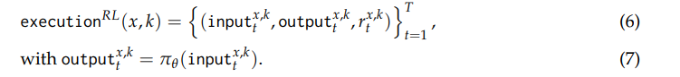
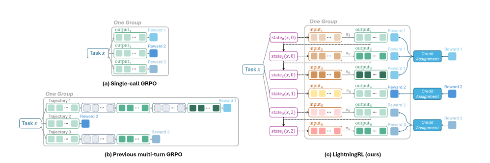

# Agent Lightning: Train ANY AI Agents with Reinforcement Learning

摘要：我们提出了 Agent Lightning—— 一个灵活且可扩展的框架，支持基于强化学习（RL）的大型语言模型（LLMs）训练，适用于任何 AI 智能体。与现有方法不同，传统方法将 RL 训练与智能体紧密耦合，或依赖带掩码的序列拼接，而 Agent Lightning 实现了**智能体执行与训练的完全解耦**，能够与通过多种方式开发的现有智能体（例如，使用 LangChain、OpenAI Agents SDK、AutoGen 等框架，或从零构建的智能体）无缝集成，且几乎无需修改代码。**通过将智能体执行过程建模为马尔可夫决策过程，我们定义了统一的数据接口，并提出了一种分层 RL 算法 LightningRL，该算法包含一个信用分配模块，能够将任何智能体生成的轨迹分解为训练过渡数据。** 这使得 RL 能够处理复杂的交互逻辑，如多智能体场景和动态工作流。在系统设计方面，我们引入了 “训练 - 智能体分离” 架构，并将智能体可观测性框架融入智能体运行时，提供了标准化的智能体微调接口。在文本到 SQL、检索增强生成和数学工具使用任务上的实验表明，该框架能实现稳定、持续的性能提升，展现出其在现实世界智能体训练和部署中的潜力。

---

强化学习（RL）推动了 DeepSeekR1（Guo 等人，2025）、Kimi k1.5（团队等人，2025）等推理模型的近期进展，为智能体场景下的大型语言模型（LLMs）优化提供了强大范式。

监督学习需要详细的分步标注 —— 而对于复杂的交互任务，这类标注不仅稀缺且成本高昂；相比之下，强化学习依赖于基于结果的奖励信号，这就无需特定任务的精心标注数据，使智能体能够直接从不同任务的环境反馈中学习理想行为。此外，强化学习的试错特性与人类获取问题解决能力的方式高度相似，能让模型学习基于部署场景的行动策略。这种能力为将 LLM 生成的文本令牌转化为现实世界的行动创造了可能，使得强化学习成为智能体系统中模型训练的天然适配方法。

然而，将强化学习（RL）范式扩展到智能体领域，在算法设计和系统实现两方面都带来了显著挑战。现有针对大型语言模型（LLMs）的 RL 方法与框架，主要适用于静态、单轮调用任务（如偏好对齐或数学推理）。相比之下，智能体的复杂性和多样性远超这一范畴：其复杂性体现在，智能体的执行过程往往涉及多次大型语言模型调用（每次调用的提示词和响应各不相同），以及与外部工具、API 或环境的交互；其多样性则源于，需针对不同应用场景设计定制化的智能体。这些挑战阻碍了 RL 在大规模智能体语言模型调优中的应用。

我们提出了 Agent Lightning—— 一个灵活且可扩展的框架，支持基于 RL 的任何 AI 智能体的语言模型训练。如图 1 所示，Agent Lightning 实现了智能体执行与 RL 训练的完全解耦，使开发者能够以几乎零代码修改的方式训练现有智能体。这种解耦的核心是将智能体执行过程建模为马尔可夫决策过程（MDP）：其中，“状态” 代表智能体执行的当前快照，包含足以描述执行状态的变量值；“动作” 对应策略语言模型生成的输出，该输出随后用于更新状态。基于这一建模，我们为 RL 训练设计了统一数据接口，将智能体轨迹结构化为一系列 “过渡”（transition）序列 —— 每个过渡包含当前状态（语言模型输入）、动作（语言模型输出）和奖励。这种统一数据接口抽象了底层编排逻辑和智能体框架细节，使其适用于任何智能体。此外，为利用收集到的过渡数据优化策略语言模型，我们提出了 LightningRL—— 一种专为智能体训练设计的分层 RL 算法。在为每个过渡分配信用后，LightningRL 以与现有语言模型单轮 RL 方法完全兼容的方式更新策略。这种建模与算法设计具有多重优势，包括支持高度灵活的上下文构建、允许同时选择性优化多个智能体，以及缓解因上下文累积导致序列过长的问题。

基于上述具体建模，Agent Lightning 引入了 “训练 - 智能体分离”（TA Disaggregation）架构，以建立适用于任何智能体的标准化训练服务。**该框架包含 Lightning Server（训练服务器）和 Lightning Client（训练客户端）两部分：Lightning Server 作为 RL 训练系统的控制器，负责管理训练过程，并向客户端暴露类 OpenAI 风格的更新后模型 API；Lightning Client 包含两个功能组件，一个负责与服务器通信以收发数据，另一个运行智能体并执行数据收集，作为智能体运行时（agent runtime）。**

得益于统一数据接口，智能体运行时能够将 **OpenTelemetry**（OpenTelemetry, 2025）等全面的可观测性框架整合到轨迹收集的训练过程中。这一设计将可观测性基础设施与 RL 训练连接起来，使优化技术能够利用丰富的监控数据，为提升可扩展性和灵活性奠定基础。此外，智能体运行时还通过 “**自动中间奖励**”（Automatic Intermediate Rewarding, AIR）机制，帮助算法缓解奖励稀疏性问题：AIR 可基于系统监控信号（如工具调用返回状态）为过渡分配中间奖励。开发者可轻松自定义这一机制，有效缓解智能体中的奖励稀疏问题，提升训练效果。

我们通过多项任务验证了 Agent Lightning 的有效性，包括基于 LangChain 实现的文本到 SQL 智能体、基于 OpenAI Agents SDK 构建的检索增强生成智能体，以及通过 AutoGen 开发的带工具使用功能的数学问答智能体。这些实验的奖励曲线表明，Agent Lightning 能在不同智能体场景中实现持续且稳定的性能提升，展现出解决现实世界任务的巨大潜力。

综上，Agent Lightning 在智能体训练方面的创新体现在以下几个方面：

* **Agent Lightning 是首个实现智能体与强化学习训练完全解耦的框架**。这种解耦使其能无缝应用于任何 AI 智能体（无论其实现方式如何），且几乎无需修改代码。通过将训练与智能体的执行逻辑对齐，它直接提升了智能体在实际应用中的性能，让开发者得以突破静态预训练模型的局限，释放自适应、基于学习的智能体的全部潜力。同时，它作为统一数据接口，可收集多样化的智能体生成数据以提升模型能力。为实现这种解耦，Agent Lightning 在算法和基础设施两方面都采用了专门设计。
* **在算法层面**，Agent Lightning 基于智能体的马尔可夫决策过程（MDP）建模，引入了统一数据接口。该接口抽象了各种智能体执行逻辑的复杂性，使智能体执行过程中收集的数据能直接转化为训练轨迹。此外，Agent Lightning 采用带信用分配模块的分层强化学习框架，将轨迹级回报分配给每次调用生成的响应。这种设计与现有单轮强化学习算法无缝集成，实现高效且有效的训练。
* **在系统层面**，Agent Lightning 引入 “训练 - 智能体分离” 架构，实现了强化学习训练与智能体执行的清晰分离。该架构通过 Lightning Server（训练服务器）和 Lightning Client（训练客户端）实现，共同提供适用于任何智能体的标准化模型训练服务。Lightning Client 作为智能体运行时，透明地管理智能体执行并收集轨迹，无需修改代码。这种设计使可观测性基础设施能在训练场景中复用，确保了可扩展性、伸缩性，以及与各类智能体框架的无缝集成。

组件定义：

**工具**：是智能体为执行特定任务而调用的功能，例如从数据库检索信息、执行代码或与 API 交互。根据是否在多次调用中维持上下文，工具可分为无状态工具和有状态工具。此外，工具的实现方式多样，包括外部 API、本地程序或库。在近年来的趋势中，工具通常遵循 MCP（模型上下文协议，Protocol, 2025）或其他智能体通信协议，以标准化智能体与工具之间的交互，实现无缝集成和互操作性。设**\\(T = \\{T\_j\\}\_{j=1}^t\\)**表示智能体可使用的工具集，其中**t**为工具的数量。

**编排**（Orchestration）

以组件集$(M \cup T)$作为功能构建块，编排（包括组件间的执行流程、依赖关系和顺序）通常由用户根据任务需求自定义。第 3.1.3 节提供了一个智能体及其执行流程的详细示例。

重要的是，**这种编排往往既非固定也非确定性的**。现代 AI 智能体展现出动态行为：大型语言模型（LLMs）可能会根据不断变化的上下文决定后续行动或选择工具。例如，在上述检索增强生成（RAG）智能体中，通过让 LLM 自主决定是优化查询还是直接回答问题，智能体与数据库的交互轮次可以是可变的。另一个例子是游戏对战智能体：生成行动并接收环境反馈的迭代过程被表示为一系列 LLM 调用，每一次调用对应游戏中的一个决策步骤。通过展开这一迭代过程，我们可以捕捉到智能体的动态行为 ——LLM 可能会根据当前游戏状态和历史行动调整策略。

尽管这种动态交互包含了丰富的任务特定行为（有助于提升优化效果），但它也给数据建模和下游学习带来了显著挑战，使得在现有强化学习（RL）训练框架中实现不同智能体的适配既不现实也难以扩展。

智能体框架通过提供模块化组件（大型语言模型和工具）以及灵活的动态编排机制简化开发流程，让用户能够定义适应任务需求和智能体运行时状态的工作流。然而，无论智能体是从零构建还是基于框架开发，它们通常都缺乏自动自我改进的机制，也不涉及智能体优化。在现实场景中，尤其是处理私有数据时，智能体的性能往往难以满足需求，因此亟需一种自动化的优化方式。

---

### Agent Lightning

**统一数据接口（Unified Data Interface）**

数据驱动的智能体优化从根本上依赖于智能体执行过程中生成的数据。因此，在 Agent Lightning 中，我们定义了一个统一数据接口，用于规范这些数据如何输入到强化学习（RL）训练算法中。该接口具有高度通用性，可适用于从任何 AI 智能体收集的数据。

AI 智能体是一种特殊的软件，与所有软件的执行过程一样，其运行可被表示为一个有向无环图（DAG）（Alfred 等人，2007；Abadi 等人，2016）。在这个图中，每个节点对应组件集$(M \cup T)$中的一次组件调用（无论是 LLM 还是工具），每条边则代表组件之间的依赖关系或控制流。然而，从杂乱的智能体执行轨迹中解析出完整的图并非易事，且我们发现，对于训练而言这并非必需。通过借鉴马尔可夫决策过程（MDPs）的概念，**我们只需确定当前状态以及影响状态转移的关键因素（即调用）**，即可进行强化学习优化。

我们将**状态**定义为智能体执行过程的快照，可能包含程序计数器、变量值、调用栈、资源上下文等信息。这些信息可抽象为一组变量，它们会随着智能体的执行过程不断变化。对于同一任务**x**，由于智能体的动态行为，多次执行可能会产生不同的执行轨迹。由两部分组成：

**元数据（模型，名字，类型，版本，采用参数等），语义变量：当前执行步骤的输入和输出；**

---

Reward模型：

中间奖励$(r_i)(i < N)$，例如工具调用成功的指标或任务部分完成的信号，能提供更细致的反馈，并指导智能体的学习过程。最终奖励$(r_N)$通常用于评估智能体完成任务的整体表现。

在许多现实场景中，往往只有终端奖励$(r_N)$可用于评估整个执行过程的结果。这属于上述通用形式的一种特殊情况：此时不存在中间奖励$(r_1, ..., r_{N-1})$，学习过程仅依赖最终结果。

用于训练或评估的数据集包含一个任务集$X = {x_1, ..., x_{|X|}}$和一个奖励函数，其中*$(|·|)$表示集合的大小。任务可被多次执行，每次执行的结果会根据奖励函数进行标注。

在智能体执行过程中，**调用组件（LLM 或工具）会更新相关语义变量，进而导致下一状态发生变化。**因此，智能体针对特定任务**x**的执行过程可表示为一个有序的调用序列（如图 2 右侧所示），其中每个调用包含组件本身、其输入、输出以及相关奖励（通常仅最终调用会有奖励）。

重要的是，我们的统一数据接口能捕捉所有状态变化，包括由非 LLM 组件引发的变化，这为灵活且高度可定制的优化方法提供了支持。例如，它支持**对多智能体系统中的特定智能体进行选择性优化（详见 3.2.2 节及 4.1 节的实验），也支持模型微调之外的优化方式（如提示词调优）。**尽管本文聚焦于以 LLM 为中心的优化，但这种可扩展性体现了我们方法的广泛适用性。更多实现细节可参见我们的 GitHub 仓库 ²。

通过在每个状态中捕捉完整的执行上下文，统一数据接口为策略学习提供了充足信息，实现了智能体执行与 RL 训练的清晰解耦。这种设计无需显式解析整个执行有向无环图（DAG），就能适配任意复杂的智能体交互逻辑，从而大幅简化了针对多样化智能体工作流的基于 RL 的优化过程。

---

Markov Decision Process in AgentsFormulation

我们从一个简单案例入手：一个包含单个待优化 LLM 的智能体。当我们将该 LLM 视为策略模型时，可将其决策过程建模为部分可观测马尔可夫决策过程（POMDP），这构成了应用强化学习（RL）的基础。POMDP 元组$(M = (S, O, A, T, R)$可定义如下：

* **S**为状态空间，对应所有可能的状态，即$(state_t \in S)$；
* **O**为观测空间，对应策略 LLM 的所有可能输入，即$(input_t \in O)$；
* **A**为动作空间，其中单个动作定义为策略 LLM 单次调用生成的完整令牌序列，即$(output_t \in A)$；
* $(T(s' | s, a))$定义了（通常未知的）向新状态的转移动态；
* $(R(s, a))$为奖励函数，将状态 - 动作对映射为标量奖励。

具体而言，在每一步**t**，智能体的快照为$(state_t)$，LLM 观测到上下文$(input_t)$。如 3.1.1 节所述，$(input_t)$是一个语义变量，代表$(state_t)$中**对策略 LLM 决策而言可见或必要的部分**。随后，LLM 生成令牌序列$(output_t = (y_{t,1}, y_{t,2}, ..., y_{t,N_t}))$作为输出，该序列被视为单个动作，记为*$(a_t \in A)$。执行$(a_t)$后，智能体转移至新状态$(state_{t+1})$，并可能获得标量奖励$(r_t = R(s_t, a_t))$以评估该动作的质量。回报（return）定义为奖励的总和：

$(R = \sum_{t=1}^{T} r_t))$

策略模型的目标是最大化这一回报。

---

Data Extraction for RL

基于上述马尔可夫决策过程（MDP）建模，我们需要收集包含所有策略大型语言模型（LLM）决策及其相关奖励的轨迹用于强化学习（RL）。为此，我们从每次执行中（即公式（5））**仅提取与更新参数化为 θ 的策略 LLM 相关的信息**：LLM 调用的原始输入、输出及其奖励，记为：

这里，**\\(\\pi\_\\theta\\)**是待优化的 LLM，**T**是该轨迹中的调用次数。图 2 展示了这一数据提取过程。

LLM 调用是无状态且高度灵活的。其输入可编码复杂智能体逻辑生成的各类信息，包括但不限于指定 LLM 角色或目标的指令提示词、对话历史，以及因任务和执行而异的用户查询、推理步骤、检索文档等内容。智能体框架可能会进一步渲染或解析这些输入和输出（例如，通过模板或结构化格式）。但出于 RL 训练目的，得益于 MDP 建模，我们可以忽略这些繁琐且多变的逻辑与处理过程，**仅关注 LLM 的当前输入和输出。**这种提取方式无需关注 LLM 输入的详细来源和生成原因，有助于避免对高度动态的智能体运行轨迹进行冗长且复杂的解析，从而使 RL 优化适用于**任何 AI 智能体**成为可能。

综上，统一数据接口和 MDP 建模使 Agent Lightning 能够清晰区分任务特定的智能体设计与基于学习的策略优化，为模块化、动态智能体系统中高效的基于 RL 的优化奠定了基础。

**在单 LLM 多智能体场景中的应用**

需注意，上述建模可灵活应用于单 LLM 的多智能体场景：在这种场景中，LLM 可根据提示词在执行的不同阶段承担多个角色。以图 2 中的检索增强生成（RAG）案例为例，在第一次 LLM 调用中，我们可指示模型专注于搜索，生成搜索查询$(a_1)$；该查询会修改状态，形成新输入；在第二次 LLM 调用中，我们可指示模型专注于回答给定问题，生成最终答案$(a_2)$，而答案质量决定最终奖励$(r_2)$。通过这种方式，单个 LLM 可扮演两个智能体的角色。此外，Agent Lightning 能够通过在优化过程中纳入对应智能体的过渡数据，实现对多智能体系统中特定智能体的选择性优化 —— 与掩码方法相比，选择过渡数据的方式更便捷直观。

**向多 LLM 场景的扩展**

当需要联合优化多个具有独立参数的不同 LLM 时，一种直接的方法是将每个 LLM 视为独立的 MDP 并分别优化。这种方式虽简化了训练，却忽略了策略间的相互依赖，可能导致协作次优。更原则性的方法是采用多智能体强化学习（MARL）或博弈论，将每个 LLM 视为具有自身目标和策略的智能体（Lowe 等人，2017；Zhang 等人，2021）。这类方法能更好地捕捉多个 LLM 之间潜在的交互动态及竞争或合作行为。

---

Method:

（a）单轮调用 GRPO：LLM 一次性生成对任务的响应。同一任务的输出被归为一组，用于优势估计。
（b）现有的多轮 GRPO：每条轨迹包含多次 LLM 调用，同一任务的轨迹被归为一组以进行优势估计。优化过程中，非 LLM 生成的令牌会被掩码（灰色虚线框）。
（c）我们提出的 LightningRL：轨迹被分解为过渡数据，同一任务的过渡数据被归为一组用于优势估计。每个过渡包含当前输入 / 上下文、输出和奖励。输入是当前智能体状态的一部分，奖励由信用分配模块计算。

LightningRL: A Hierarchical RL Method for Optimizing LLMs in Agents

在上述马尔可夫决策过程（MDP）建模中，我们**将单次 LLM 调用生成的整个令牌序列视为一个动作。** 策略可能需要通过多次这样的动作交互才能完成一整个 episode（回合）。相比之下，LLM 是逐令牌生成输出的，而大多数现有 LLM 强化学习算法专为单轮交互设计，专注于优化单次响应内的令牌生成。为弥合这一差距，Agent Lightning 引入了一种简单的分层强化学习（HRL）方法，称为 LightningRL。该方法无需修改即可与现有 LLM 单轮强化学习方法无缝集成，并能有效支持任何智能体场景下的优化。

如图 3 所示，Agent Lightning 使用过渡数据组织信息，每个过渡定义为公式（6）中的元组**\\((\\text{input}\_{x,k}^t, \\text{output}\_{x,k}^t, r\_{x,k}^t)\\)**。每个过渡包含当前 LLM 调用的输入上下文，无论该上下文是如何构建的。LightningRL 采用两步机制：首先，通过信用分配模块将 episode 级回报**R**分配到各个动作；然后，将其进一步分解到每个动作内的令牌，生成令牌级监督信号。在我们当前的实现中，LightningRL 简单假设回合内的每个动作具有相同的价值，且等于最终回报**R**。第二步则由现有的 LLM 单轮强化学习算法处理。

这种设计带来了多个优势：

第一，它允许直接使用任何单轮强化学习算法而无需修改，尤其是那些通常轻量高效的无价值方法（value-free methods）。例如，在 GRPO 中，从相同提示词生成的样本会被分组以估计优势。我们在这里采用相同的方法：对每个任务**x**运行多次以生成不同的执行数据，每个数据都被分解为单独的动作。然后，这些样本按任务分组，用于计算公式（8）中的统计量。类似的适配也适用于 PPO 和 REINFORCE++。

第二，LightningRL 支持灵活构建策略观测（policy observations），因为我们的数据按单个过渡级别组织，每个过渡都有自己的奖励。当前输入 / 观测可灵活地从状态中导出 —— 例如，$(\text{input}_t)$可以是 LLM 生成的先前步骤总结、通过模板组装的结构化提示词，或是指示 LLM 当前角色的指令（详见 3.2.2 节）。相比之下，以往的方法通常将轨迹中的所有轮次拼接成单个响应，并通过掩码控制哪些部分需要更新 —— 这种方法无法支持如此灵活且模块化的上下文构建。

第三，与掩码策略相比，LightningRL 的实现更稳健且可扩展。基于掩码的方法不仅需要训练与智能体执行逻辑的紧密耦合，还会破坏 LLM 中令牌的连续性（**而这种连续性是旋转位置编码（RoPE，Su 等人，2024）等广泛使用的位置编码方法所依赖的**）。此外，掩码会显著增加代码验证、调试和内核设计的复杂性，当掩码变得复杂时，效率往往会降低。相反，LightningRL 将智能体轨迹分解为过渡数据，自然契合 LLM 的输入结构，无需额外掩码。这种设计简化了实现并增强了可扩展性。此外，以过渡形式组织数据还缓解了因拼接所有轮次而导致的上下文累积和过长问题：长轨迹被拆分为过渡批次，使得批量累积（batch accumulation）等技术可用于高效更新。

更复杂的信用分配

信用分配模块未来可集成更复杂的策略，例如基于启发式或学习模型进行信用分配。一个潜在的未来研究方向是引入高层价值函数，单独估计每个动作$(a_t)$的预期回报，以提供更细致的信用分配。尽管如此，我们的实验结果表明，这种简单的均等分配策略在多个场景和数据集上均有效。

---

系统设计：

为现实世界中的智能体训练大型语言模型（LLMs）是一项极具挑战性的工作，需要整合强化学习（RL）训练框架与智能体开发框架。这些框架往往复杂、迭代迅速且本质上分散独立，难以协同工作。Agent Lightning 框架通过提供统一解决方案应对这一挑战，助力基于 RL 及其他优化技术的智能体实现无缝开发与训练。

### 3.4.1 训练 - 智能体分离架构（Training-Agent Disaggregation Architecture）

LLM 的 RL 训练框架主要包含两个核心组件：训练器（trainer）和轨迹生成（rollout）。训练器负责更新模型权重，轨迹生成则捕获训练器所需的数据 —— 轨迹。对于数学推理等单轮 RL 任务，轨迹生成过程简单，仅需 LLM 针对特定提示词生成响应；而对于涉及多轮交互及与环境交互的智能体任务，轨迹生成需要智能体完整执行，不仅包括多次 LLM 生成，还涉及原生代码的执行（如工具调用）。

Agent Lightning 的核心创新在于其 “**训练 - 智能体分离**” 架构，该架构**将计算密集型的 LLM 生成过程与轻量但多样灵活的、用传统编程语言编写的应用逻辑和工具分离开来。前者由 RL 框架管理，并向后者暴露类 OpenAI 风格的 API（如图 4 所示）；后者可独立管理和执行，无需与 GPU 资源绑定，从而为智能体行为的定义提供了更大灵活性。**

**与智能体无关的训练和与训练器无关的智能体**
Agent Lightning 的 “训练 - 智能体分离” 架构的一个关键优势是，它在训练框架与智能体之间建立了相互独立性。这种设计使训练框架（如 VeRL（Sheng 等人，2024））“与智能体无关”—— 其仅关注 LLM 的优化和硬件资源的管理，无需与特定智能体逻辑耦合；反之，运行在客户端的智能体 “与训练器无关”，可独立于训练框架的实现细节运行。这种解耦为智能体的开发和部署提供了极大灵活性，使开发者能专注于智能体逻辑，而不受训练基础设施的限制。附录 A 提供了代码示例，展示如何利用 Agent Lightning 轻松优化现有智能体，体现了其易用性和适应性。

为实现上述设计目标，Agent Lightning 引入了双组件架构：Agent Lightning 服务器（Server）和 Agent Lightning 客户端（Client），如图 4 所示。服务器旨在与 RL 框架无缝集成，负责管理训练过程和 LLM 优化，处理任务协调、数据管理及与客户端的通信；客户端封装智能体，使其能独立于训练框架运行，从而为智能体的开发和执行提供灵活性。

当服务器接收到用户上传的任务数据集后，会与 RL 框架一同初始化并协调训练流程。服务器将数据集分批，并通过事件驱动系统与客户端协同管理生成阶段与训练阶段的过渡。任务批次通过 “库存管理方式” 分发给客户端：服务器维护可用任务清单，在客户端就绪时进行分配。同时，服务器会向客户端传递一个为每个任务专属的类 OpenAI 风格 API 端点，该端点支持客户端与服务器连接，并促进数据追踪与捕获。**随后，客户端在智能体运行时（见 3.4.2 节）中执行智能体以生成轨迹和奖励，捕获的轨迹会被回传至服务器；服务器处理这些数据并转发给训练框架，用于模型参数更新。**这种架构充分发挥了 RL 框架与智能体开发框架的优势，实现了智能体的高效、可扩展训练。

**智能体运行时（Agent Runtime）**

Agent Lightning 客户端是智能体的运行时管理器，负责协调执行、捕获数据、处理错误及与服务器通信。它确保智能体训练流程稳健、可扩展且高效。

**智能体执行的数据并行**
现代 RL 训练中，大批次规模对于充分利用计算资源和减少轨迹生成延迟（训练循环的瓶颈）至关重要。为处理这些大批次，需并行运行多个智能体实例。Agent Lightning 客户端**旨在高效管理和并发执行多个智能体实例，通过数据并行最大化吞吐量并最小化延迟。**具体而言，它实现了两级并行策略：**节点内并行（单个客户端在一台机器上运行多个工作进程，每个进程执行不同的智能体实例）和节点间并行（多台机器上运行多个客户端，每个客户端管理自己的智能体实例集）。**这种架构支持跨分布式系统的灵活扩展和高效资源利用。

**无需代码修改的数据捕获**
为与现有智能体代码库无缝集成，Lightning 客户端采用两种插桩技术（instrumentation techniques），无需修改智能体逻辑即可捕获相关数据。第一种技术基于 OpenTelemetry（OpenTelemetry, 2025）和 AgentOps（AgentOps, 2025），利用 OpenTelemetry 的追踪能力自动为智能体代码插桩，捕获执行轨迹、LLM 调用和环境交互。对于不愿依赖 OpenTelemetry 的用户，Agent Lightning 还在类 OpenAI 风格的 API 端点中嵌入了基础追踪机制。这种机制轻量且可扩展，确保即使对于不兼容 OpenTelemetry 的智能体开发框架，也能高效捕获数据。

**错误处理与稳健性**
训练过程的稳定性和可靠性至关重要，且对各类故障极为敏感（尤其是在长时间运行的训练会话中）。错误可能源于多种原因，包括智能体崩溃、网络中断或输出无效；由于 RL 算法固有的探索与利用特性，RL 训练中的错误频率远高于推理阶段。若处理不当，这些错误可能导致严重停机和计算资源浪费。为此，Agent Lightning 客户端集成了全面的错误处理机制，确保训练期间的稳健性。它能检测智能体代码未妥善处理的故障（如崩溃或长时间挂起的工具调用），并确保这些故障不会干扰整体训练过程。失败的任务可重试或重新分配给其他智能体实例，同时会保留详细日志用于调试和监控。这种设计最大限度减少了停机时间，提高了训练效率，支持智能体性能的持续提升。

**自动中间奖励（AIR）**
RL 训练中奖励的延迟性和稀疏性可能阻碍学习过程。中间奖励在智能体执行的多个阶段提供反馈，通过更频繁、更具信息量的信号显著增强训练效果。但中间奖励通常需要高昂成本（如昂贵的人工标注或复杂的奖励计算逻辑）。**如何从智能体执行过程中挖掘中间奖励，对训练至关重要。Agent Lightning 客户端提供 AIR 机制，将系统监控数据转换为中间奖励，使训练框架能利用这些信号实现更有效的学习。**

**面向可扩展性的环境与奖励服务**
环境和奖励函数是 RL 训练的关键组件。对于轻量且可本地运行的环境和奖励函数，可与智能体实例在同一工作进程中直接执行；但对于资源密集型或初始化成本较高的环境和奖励函数（如手机模拟器或复杂的奖励计算逻辑），将其作为共享服务托管更高效。目前，Agent Lightning 客户端支持以简单池化方式托管环境和奖励计算服务，未来可扩展至支持更复杂的无服务器架构。
