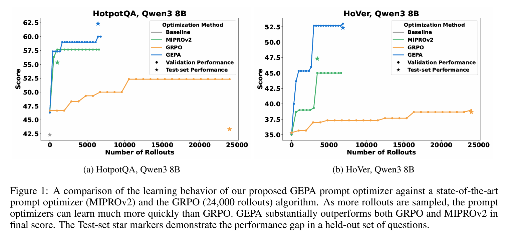
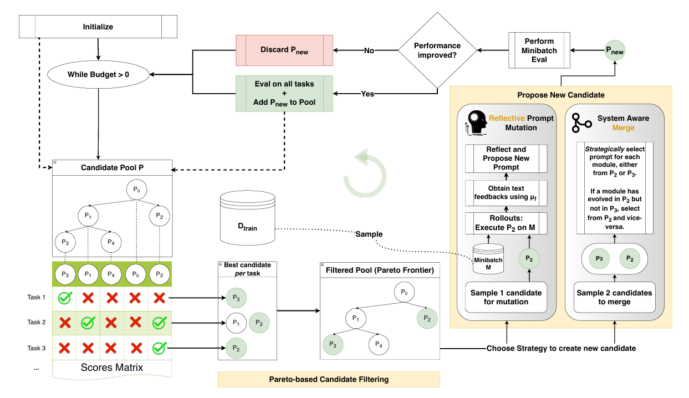

# GEPA: REFLECTIVE PROMPT EVOLUTION CAN OUTPERFORM  REINFORCEMENT LEARNING

摘要：

大型语言模型（LLMs）正越来越多地通过强化学习（RL）方法（如群体相对策略优化（GRPO））适配下游任务，这类方法通常需要数千次推演才能学习新任务。我们认为，**与从稀疏的标量奖励中导出的策略梯度相比，语言的可解释性往往能为 LLMs 提供更丰富的学习媒介。**

为验证这一点，我们提出了 GEPA（Genetic-Pareto，遗传 - 帕累托）—— 一种提示词优化器，它充分结合自然语言反思，从试错中学习高层规则。对于任何包含一个或多个 LLM 提示词的 AI 系统，GEPA 会采样系统级轨迹（例如推理过程、工具调用和工具输出），并通过自然语言反思来诊断问题、提出并测试提示词更新，同时从自身尝试的帕累托前沿中整合互补经验。

得益于这种设计，GEPA 通常只需几次推演就能带来显著的质量提升。在四项任务中，GEPA 平均优于 GRPO 10%，最高达 20%，同时使用的推演次数最多减少 35 倍。此外，在两个 LLM 模型上，GEPA 的性能超过了领先的提示词优化器 MIPROv2 10% 以上，并在作为代码优化的推理时搜索策略方面展现出良好前景。

---

我们发现，即便是高度复杂的大型语言模型（LLM）系统，其生成的推演过程也能序列化为自然语言（及形式语言）轨迹 —— 这些轨迹仅包含各 LLM 模块的指令、生成的推理链、工具调用，以及可能包含的奖励函数内部运算过程（例如，尚未被压缩为标量奖励的编译器错误信息）。由于现代 LLM 能轻松理解这类序列化轨迹，我们认为：与标准强化学习方法相比，通过反思这些轨迹、以自然语言进行刻意学习的算法，更能有效利用 LLM 强大的语言先验知识。

为将这一思路落地，我们提出了 GEPA（遗传 - 帕累托算法）—— 一种适用于复合 AI 系统的反思型提示词优化器，它将文本反思与多目标进化搜索相结合。GEPA 会根据新推演过程产生的自然语言反馈，迭代调整 AI 系统中的所有提示词。每次调整时，候选提示词均基于上一代生成，同时整合从观察结果和 LLM 反馈中提炼的高层经验。为避免贪婪式提示词更新容易陷入的局部最优，GEPA 维持一个帕累托前沿：它不会仅进化全局最优提示词，而是随机探索每个问题实例的顶级表现提示词，从而丰富策略多样性并增强泛化稳健性。

我们在四项多样化任务中评估了 GEPA：多跳推理（HotpotQA；Yang 等人，2018）、指令遵循（IFBench；Pyatkin 等人，2025b）、隐私感知代理（PUPA；Li 等人，2025a）和检索增强验证（HoVer；Jiang 等人，2020），并使用了开源模型（Qwen3 8B；Yang 等人，2025；团队，2025）和专有模型（GPT-4.1 mini；OpenAI，2025）。结果显示，GEPA 泛化能力稳健且样本效率极高：在 Qwen3 8B 上，GEPA 相比 GRPO（使用 LoRA 的 24,000 次推演）性能提升最高达 19%，同时所需推演次数最多减少 35 倍。在所有任务中，GEPA 平均比 GRPO 提升 10%。此外，GEPA 在所有基准测试和模型上均超越了此前最先进的提示词优化器 MIPROv2（Opsahl-Ong 等人，2024），整体优化增益达 14%，是 MIPROv2（7%）的两倍多。

从定性角度看，GEPA 生成的提示词同样高效。图 2 展示了 GEPA 为多跳问答系统（用于 HotpotQA）的查询生成模块设计的提示词片段。我们还发现，在大多数情况下，仅一次反思性提示词更新就能带来显著改进（如图 5 的优化轨迹所示）。这些结果表明，利用语言反馈进行反思性提示词进化，可实现高效的样本利用和稳健的泛化能力，为在数据或预算受限环境中优化复杂的现实世界 AI 工作流提供了实用路径。最后，我们还展示了 GEPA 作为推理时搜索策略在代码优化方面的初步前景（基于 NPUEval（Kalade & Schelle，2025）和 KernelBench（Ouyang 等人，2025））。

我们参考相关研究，将**复合 AI 系统**定义为：由一个或多个语言模型（LLM）调用构成的模块化系统，可能穿插外部工具调用，并通过任意控制流进行编排。这一定义涵盖了广泛的现实世界 LLM 基 AI 系统，包括智能体、多智能体系统，以及通用框架技术（如 ReAct（Yao 等人，2023）、Archon（Saad Falcon 等人，2025）等）。

借鉴 Soylu 等人（2024）、Khattab 等人（2024）、Opsahl-Ong 等人（2024）、Tan 等人（2025）的研究，我们将这类系统形式化为 Φ = (M, C, X, Y)，其中：

* M = ⟨M₁, ..., Mₖ⟩表示语言模块（k 为模块数量）；
* C 指定控制流逻辑；
* X、Y 为全局输入 / 输出 schema。

每个模块 Mᵢ = (πᵢ, θᵢ, Xᵢ, Yᵢ) 是一个 LLM 子组件：

* πᵢ是其（系统）提示词，包含指令和少样本示例；
* θᵢ是底层模型权重；
* Xᵢ、Yᵢ是输入 / 输出 schema。

在运行时，C 负责编排模块的调用顺序 —— 例如，将一个模块的输出传递给另一个模块、有条件地调用模块，或利用工具 API。通过这种方式，C 可以按任意顺序多次调用不同的模块。

优化目标是：在一定的预算条件下，找到最优的prompt和参数，使得在任务集合上的reward更高。

GEPA 以迭代方式运行：在每一轮迭代中，通过两种策略（**反思性提示词变异**（见 3.2 节）**或系统感知融合**（见附录 F））对**现有候选方案进行改进，生成新的候选方案**。首先在小批量数据上评估这些候选方案，若性能有所提升，则进一步在更大的数据集上评估。为避免因始终选择表现最佳的候选方案进行变异而陷入局部最优，GEPA 引入了基于帕累托的候选采样（见 3.3 节）—— **从每个任务的最佳候选方案列表中进行筛选和采样，确保策略的充分多样性。** 总体而言，这些设计决策使 GEPA 具备极高的样本效率，同时展现出强大的泛化能力。

我们提出了 GEPA（遗传 - 帕累托算法）—— 一种适用于复合 AI 系统的样本高效优化器，其设计基于三项核心原则：**遗传提示词进化（3.1 节）、利用自然语言反馈的反思（3.2 节），以及基于帕累托的候选方案选择（3.3 节）。**图 3 展示了 GEPA 的整体框架，完整的 GEPA 算法在图 4 中进行了形式化定义。

GEPA 的输入包括：一个实例化了待优化简单提示词的复合 AI 系统 Φ、训练数据集 Dtrain（包含 2 节所述的任务实例 (x, m)）、任务的标准评估指标 μ、反馈函数 μf（3.2 节介绍），以及总推演预算 B。

图 4：（左）GEPA 的反思性提示词进化核心算法。GEPA 以迭代方式运行，在每轮迭代中：选择部分当前候选方案进行进化（第 7 行）；在小批量推演上执行选定的候选方案，同时利用专用反馈函数 μf 收集模块特定反馈（若有）（第 9-10 行，详见 3.2 节）；通过 LLM 对提示词进行反思性更新（第 11 行）；评估新提示词实例化的系统是否在小批量数据上提升了性能（第 14 行）。若性能提升，GEPA 会进一步在完整的 Dpareto 数据集上评估该新系统候选方案，将其加入跟踪的候选列表，并标记新系统的父代。

（右）GEPA 核心算法所用的 SelectCandidate 子过程，负责确定下一轮优化迭代中待进化的最佳候选方案。GEPA 的主要候选选择策略是：从（所有任务实例的）帕累托前沿中筛选非支配候选方案，再基于它们在帕累托前沿中的出现频率随机选择一个。

对于复合 AI 系统 Φ，优化过程的目标是找到一组参数⟨Π, Θ⟩Φ，使其在任务分布上的得分最大化。GEPA 首先初始化一个候选池 P，其中的 “候选方案” 是复合系统可学习参数⟨Π, Θ⟩Φ 的具体实例。初始时，候选池仅包含基础系统的参数作为唯一候选方案。随后，GEPA 进入优化循环，迭代生成新的候选方案并将其加入池中，直至评估预算耗尽。

GEPA **通过变异或交叉方式修改现有候选方案**，迭代生成性能更优的新方案 —— 这一过程由**新收集的推演数据提供学习信号，并追踪每个新方案的祖先信息。这使得 GEPA 能在优化过程中沿着 “遗传树” 积累经验，每个新候选方案都会继承父代的学习信号以及当前推演过程中的信号。**

在每轮迭代中，GEPA 从候选池中筛选出有潜力的方案（候选选择），生成新候选方案（可能基于反思性反馈对模块提示词进行变异，或对两个候选方案进行交叉），并在小批量任务上评估该新变体。若新方案在局部小批量数据上的性能优于其父代，则 GEPA 将其加入候选池 P，这包括追踪新方案的祖先等内部数据结构，以及在用于候选选择的验证集 Dpareto 上对新方案进行完整评估。

当预算耗尽后，GEPA 返回在 Dpareto 上综合表现最佳的候选方案。

---

**REFLECTIVE PROMPT MUTATION**:反思变异

复合 AI 系统执行过程中生成的自然语言轨迹，能清晰呈现每个模块的行为与职责 —— 它们捕捉了中间推理过程和底层推理步骤。**当这些轨迹与系统的最终结果（如成功或失败）相结合时，便具备了强大的诊断价值，使开发者能将错误或成功追溯到模块层面的具体决策。**大型语言模型（LLMs）可**通过反思利用这些轨迹进行隐式信用分配，将最终结果的责任归属于相关模块。这种反思过程进而可用于对单个模块进行针对性更新，从而显著且有效地改善整个系统的行为。**

GEPA 的实现方式如下：在优化循环的当前迭代中，给定一个待变异的候选方案后，GEPA 会用该候选方案的参数更新系统，选择系统中一个目标模块进行改进（通过轮询确保所有模块都能得到更新），并在从训练数据集中采样的小批量数据上生成少量推演，记录其结果（成功 / 失败）、输出和。通过检查系统的执行轨迹，**GEPA 识别出目标模块的输入推理过程。据此，GEPA 利用 LLM 反思性地分析这些信息，将成功或失败归因于模块提示词的特定内容（或缺失的内容），并为目标模块提出新的指令。**随后，新候选方案被生成为当前候选方案的副本，仅将目标模块的提示词更新为新提出的版本。GEPA 用于执行反思性提示词更新的元提示词详见附录 B。

作为诊断信号的评估轨迹：尽管系统自身的执行轨迹已为有效反思和提示词更新提供了有用信息，但我们还发现了另一极具诊断价值的信息源 —— 评估指标 μ。评估指标 μ 通常会采用丰富的策略进行评估以得出最终分数。例如，代码评估环境会执行一系列步骤（编译、运行、性能分析等），每一步都会生成自然语言轨迹，之后才给出一个标量奖励。

我们建议，**除系统自身的执行轨迹外，还可利用这些评估轨迹进行反思性信用分配和针对性提示词更新。GEPA 通过对评估指标 μ 进行简单调整来实现这一点，即创建一个反馈函数 μf，该函数能识别评估过程中产生的相关文本轨迹，并返回最终分数及 feedback\_text（反馈文本）。** 只要有可用信息，这种反馈函数还能提供模块级别的反馈（例如，在多跳系统中，评估器可在系统的每一跳后提供反馈）。

---

PARETO-BASED CANDIDATE SELECTION：候选集选择

GEPA 是一种模块化程度极高的算法，能够支持在每轮优化迭代中采用多种候选方案选择策略。关键在于，候选选择策略的选择决定了优化器所采用的 “探索 - 利用” 权衡方式。一种简单策略是始终从池中选择表现最佳的候选方案，但这可能导致优化器陷入提示词空间的局部最优：一旦找到一个占优策略，就很难超越它，优化器会在未学到新的、可能更优的策略的情况下耗尽预算。图 6a 展示了这种策略生成的搜索树示例 —— 可以看到，搜索过程找到一个新策略（第一个子节点）后，就一直尝试改进它，经过多轮迭代仍未成功，最终耗尽了所有推演预算。

为解决这一问题，GEPA 采用了基于帕累托的 “遍历” 策略（Mouret & Clune, 2015），如算法 2 所示。具体而言：

1. GEPA 会找出池中所有候选方案在每个单独训练实例上的最高得分，构建一个 “帕累托前沿”，代表优化过程至今达成的最佳得分集合；
2. 随后，GEPA 汇总那些在至少一个训练任务上达到最佳得分的候选方案，筛选出包含 “制胜” 策略的方案，**保留所有在反思性变异中发现的有价值见解；**
3. 接着，GEPA 剔除被严格支配的候选方案 —— 例如，若候选方案 2 仅在任务 1 上得分最佳，而候选方案 3 在任务 1 上得分相同且在任务 2 上也最佳，则剔除候选方案 2；
4. 最后，GEPA **从修剪后的列表中随机采样一个候选方案，对在更多训练实例上达到最佳得分的候选方案赋予更高的选择概率。**

在实际应用中，这种策略帮助 GEPA 在不过度扩大搜索范围的情况下摆脱局部最优。通过将资源集中在已展现出有效 “制胜” 策略的有潜力候选方案上，GEPA 高效平衡了探索与利用，能够在优化预算内实现持续改进。

GEPA 的反思性提示词变异会系统性地融入任务特定细节，从而带来显著的性能提升。本图可视化了 GEPA 的优化轨迹，展示了图 23d 中的一个带注释子树（针对隐私保护代理任务 PUPA），以呈现对提示词的迭代改进过程。从基础提示词（候选方案 0）到性能最佳提示词（候选方案 11）的演进路径用红色箭头突出显示，每一步的关键提示词修改都标注在对应节点旁。这些迭代的完整指令详见附录 G.1。此轨迹中的每一次提示词优化，都会结合持续优化过程中获取的信息添加针对性细节，这直观体现了 GEPA 如何通过积累经验不断提升任务性能。
