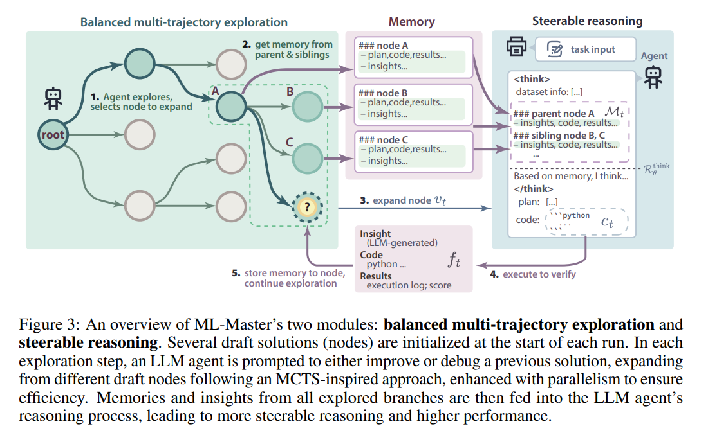

# ML-Master: Towards AI-for-AI via Integration of Exploration and Reasoning

**背景与动机**：随着人工智能能力向人类水平逼近甚至可能超越，一个自然的转变应运而生：AI 驱动的开发将比以人类为中心的方法更高效。实现这一转变的一个有前景的路径是 AI4AI（人工智能用于人工智能），它利用 AI 技术实现 AI 系统设计、训练和部署的自动化与优化。

**现状**：尽管基于大语言模型（LLM）的智能体已展现出实现 AI4AI 的潜力，但它们往往无法充分利用智能体在推理过程中探索解决方案时积累的经验，导致效率低下和性能未达最优。

**主要动作：**提出 ML-Master 一种新颖的 AI4AI 智能体，它通过采用**选择性作用域记忆机制**，无缝集成探索与推理。该方法使 ML-Master 能够高效地将并行解决方案轨迹中的多元洞见与分析推理相结合，在避免过多上下文负担的同时指导后续探索。

**结果**：在 MLE 基准（MLE-Bench）上对 ML-Master 进行评估，其平均获奖率达 29.3%，显著超越现有方法，尤其在中等复杂度任务中表现突出。更重要的是，它在严格的 12 小时时间限制内完成了这一优异表现 —— 仅为先前基线方法所用 24 小时上限的一半。这些结果表明，ML-Master 有望成为推动 AI4AI 发展的强大工具。

---

背景知识：

实现 AI4AI（人工智能用于人工智能）愿景的起点，在于理解人类专家如何设计 AI 系统。受专业 AI 从业者工作方式的启发，我们观察到：开发高效 AI 解决方案本质上是一个**迭代且探索性**的过程。AI 从业者会自然地将探索与推理整合为一种连贯的认知方法论。具体而言，**探索**指通过各类实验与发现主动寻求新洞见，而**推理**则涉及对现有知识的审慎分析及对过往经验的反思。二者缺一不可：缺乏推理的探索会导致效率低下与盲目试错，而缺乏探索的推理则可能陷入停滞。相反，有效的问题解决源于探索与推理的和谐互动 —— 探索中获得的新洞见会持续丰富并优化后续推理过程。这种目的性探索与审慎推理的迭代循环，构成了人类驱动 AI 发展中持续改进与创新的基础，也促使我们需要构建能够类似地整合这些互补认知策略的 AI4AI 框架。

此前的工作 [19,20,21,22,23] 如 AI Scientist [19]、SELA [20] 和 Dolphin [22] 等，主要强调探索策略，却未充分利用高级推理模型的分析推理能力，从而错失了有价值的洞见，并限制了其在复杂场景中的适应性。相反，AIDE [2] 和 Agent Laboratory [18] 等研究虽尝试利用推理能力，但其探索策略往往效率低下或不够全面，导致模型产生幻觉、输出不可靠及性能未达最优。

主要问题：**总体而言，现有 AI4AI 方法难以有效整合探索与推理，主要原因在于：探索过程常无法充分提炼过往经验以生成可行方案；同时，推理模型也难以有效利用探索中积累的海量非结构化经验 —— 过长的上下文会使推理过程过载，进而导致幻觉与不可靠输出。**

**思路：**

ML-Master 通过**自适应记忆机制**将探索与推理整合为连贯的迭代方法论，该机制选择性捕捉并总结探索历史中的洞见。这一设计确保各组件相互强化而不彼此削弱。具体而言，ML-Master 同时利用推理模型的分析学习能力与全面高效的探索策略，形成持续改进的**良性循环**。在这一统一认知框架中，ML-Master 包含两个互补且相互支持的模块：

（1）平衡多轨迹探索

该模块赋能 ML-Master 并行逐步探索多条解决方案轨迹，同时在挖掘潜力路径与探索未充分研究的替代方案间维持最优平衡。通过基于轨迹的潜在价值和探索历史动态排序，该模块使 ML-Master 能主动生成多元经验与洞见，避免过度投入单一方向。这些探索成果构成由具体执行反馈和新知识组成的记忆体，以丰富推理过程，使后续迭代中的分析推理更具依据与准确性。

（2）可导向推理

通过将自适应记忆显式嵌入推理过程，该模块增强了高级推理模型（Deepseek-R1 [13]）的推理能力。**探索轨迹中的洞见与执行反馈被选择性融入推理过程，使模型能从过往经验中学习，同时避免冗余推理路径。**这种整合确保了精准、可靠且可控的分析能力，显著减少了基于 LLM 的智能体中常见的**幻觉**与错误解读。从该推理过程中导出的洞见直接指导探索步骤。

通过在统一框架中有机结合平衡多轨迹探索与可导向推理，ML-Master 实现了鲁棒、高效且高性能的 AI4AI。

核心贡献：

1. 我们提出了 ML-Master—— 一种新颖的 AI4AI 智能体。它受专业 AI 开发者认知策略的启发，采用自适应记忆机制，将全面探索与分析推理无缝集成到统一框架中。
2. 我们在 MLE 基准（MLE-Bench）上实现了前沿性能，平均获奖率达 29.3%，尤其在复杂的中等难度任务中表现突出。在这类任务中，我们以 20.2% 的获奖率实现了对先前最佳结果的翻倍超越。
3. ML-Master 以低于以往方法的计算成本实现了这一卓越性能：仅需 12 小时 —— 为早期方法所设定时间限制的一半。

---

与之前的AutoML相比，如今的基于LLM的方法能够complex reasoning, knowledge-based judgment and code generation.

AI4AI的发展路径：Self-evolving（自我迭代）-> self-evolved deep-thinking -> self-reflective -> integrating experience accumulation -> self-evolving multi-agent collaboration -> tool-using

方法：

在 AI4AI 范式中开发鲁棒的 AI 系统，需要一个整合探索与推理的统一框架。探索使智能体能够遍历多样化的解决方案路径并适应复杂的不确定性，而推理则赋予智能体解释、评估和综合信息的能力。然而，二者若孤立使用则各有局限：仅依赖探索可能退化为低效的试错，而仅依赖推理若局限于先验知识则可能陷入分析停滞。**因此**，探索与推理的整合对自主智能体在 AI 开发中实现深度与广度兼具的目标至关重要。

为实现这一整合，我们提出 ML-Master—— 一种通过**自适应记忆机制**将可导向推理模块与平衡多轨迹探索模块紧密耦合的迭代智能体。如图 3 所示，平衡多轨迹探索（§3.1）使 ML-Master 能够并行生成并评估多条解决方案轨迹，以多元经验洞见丰富推理过程。这种并行探索主动产生多样化的经验洞见与执行反馈，这些信息被自适应捕获并结构化为简洁的记忆体。该记忆体并非用海量冗余的历史数据淹没推理过程，而是策略性地仅保留从探索中提炼的最相关、可操作的洞见。**探索通过经验洞见持续丰富推理，而推理则系统性地将探索引向有潜力的轨迹。在自适应记忆机制的引导下，这种迭代互动使 ML-Master 能够逐步优化解决方案，稳健地探索复杂问题空间，并在 AI4AI 领域实现卓越性能。**

**Balanced Multi-Trajectory Exploration**

* Tree-guided exploration: 基于MCTS通过构建和扩展搜索树来迭代探索潜在的solution。
* Parallel search：在搜索树中并行探索多个分支，显著提升搜索过程的效率与可扩展性。

**Tree-guided exploration：**

构建和扩展一个搜索树：每个节点表示一个不同的解决状态，节点间的边表示为对应的优化操作。

* selection：ML-Master 采用新型**上下文感知准则**，高效筛选出有潜力但探索不足的解决方案状态并确定其优先级；

使用UTC（Upper Confidence Bound）当他到达一个叶子节点或者一个没有充分探索过的节点：

$$
UCT(v) = \frac{Q_v}{N_v} + C  \sqrt{\frac{lnN_{parent}}{N_v}}
$$

Q_v表示节点v的整体reward，N_v是节点v的访问次数，N_parant是父节点的总访问次数，C是一个用于控制探索和开发平衡的常数，**UCT 值越高**的节点代表 “高潜力但低探索度” 的解决方案路径，从而引导探索向解决方案空间的潜在价值区域偏移。

**探索终止条件：**

当节点满足以下任一停止条件时，将被视为终止节点并排除在后续扩展之外：

1. 基于改进的终止准则（抑制性能停滞）：定义$\Delta_i$为第 i 次优化操作后，当前路径相对最佳祖先节点的**相对改进值**.如果超过一定”失败优化次数“则节点终止。$∑_{i=1}^K I[Δi<t] > τ_{improve}$, t 为相对改进阈值。
2. 调试深度约束（防止无效搜索）若到达当前节点的连续调试操作次数超过一定数目，则标记该节点为终止节点。

* Expansion：执行专门为 AI 开发任务量身定制的**优化操作**；扩展过程从筛选出的节点出发，通过应用三类操作生成新的子节点。这三类操作 ——**草拟（Draft）、调试（Debug）、改进（Improve）**—— 旨在通过解决代码优化与生成的不同维度问题，引导搜索朝向更高质量的解决方案

1. **Draft**： 为节点生成初始可运行的代码解决方案，产出满足任务要求的基础实现，作为后续优化的起点
2. **Debug**： 聚焦于识别并纠正当前代码中的错误，在任何进一步优化前，确保节点代码可正确编译与执行
3. **Improve**： 通过调整数据预处理、模型架构或优化方法，提升功能正确代码的质量，生成融入优化且实现**可量化性能提升**的节点

**操作选择原则：**

对每个节点 v，其操作选择遵循以下形式化条件：

1. **若节点 v 中无该任务的现有解决方案**
   → 执行**草拟（Draft）** 操作生成新方案
2. **若节点 v 的解决方案存在错误且调试未完成**
   → 执行**调试（Debug）** 操作定位并修复剩余问题
3. **若节点 v 的解决方案当前无错误但仍需优化**
   → 执行**改进（Improve）** 操作提升其性能

**优化停止条件：**

调试阶段：已生成正确解决方案，调试尝试次数超过**预设阈值**

改进阶段：无法再取得进一步性能提升

* Verification：通过奖励函数精准高效地评估候选解决方案的质量；

验证过程通过计算反映任务目标达成度的**奖励信号**，评估新扩展节点 v 的质量。奖励函数 R (v) 定义为：$(R(v) =  \begin{cases}  -1, & \text{若} \ D(v) \\ r_q(v) + r_d(v) + r_s(v), & \text{否则} \end{cases} $ 其中，D(v)判断节点 v 是否存在缺陷，各奖励分量定义如下：

1. 质量奖励 r_q(v)

* 表征节点 v 的解决方案是否优于当前最优评估指标
* 形式化定义 $(r_q(v) =    \begin{cases}    1, & \text{若} \ M(v) > M^* \\   0, & \text{否则}   \end{cases} $ 其中，M(v)为节点 v 的解决方案评估指标，$M^*$为搜索过程中记录的最佳分数。

2. 调试奖励 r_d(v)

* 反映从父节点到 v 的转移是否成功消除已知故障
* 定义：若父节点存在的故障在 v 中解决，则r_d(v)=1，否则为 0。

3. 结构改进奖励 r_s(v)

* 表征节点 v 是否成功完成改进过程
* 具体：若 v 满足预设改进终止条件$T_i(v)$，则$(r_s(v)=1)$，否则为 0。
* Backpropagation：将结构化评估反馈沿搜索树传播，动态指导后续探索决策。验证阶段结束后，获得的奖励沿扩展节点到根节点的路径反向传播。在此过程中，路径上的每个节点按以下方式更新：递增该节点的被访问计数, 累加当前奖励值

---

**并行搜索：**

为将蒙特卡洛树搜索（MCTS）有效扩展至并行环境与大型搜索空间，我们旨在设计一种搜索框架，在保留 MCTS 核心原理的同时，支持在树结构中有潜力的子区域进行**异步探索**。

一、异步分支并行 MCTS 策略的技术实现

搜索过程遵循以下机制：

1. **根节点并行扩展**：所有工作节点（workers）共同并行扩展根节点；
2. **高价值节点筛选**：当根节点的子节点完全扩展后，选择 UCT 值最高的前 k 个节点作为深度搜索的新入口；
3. **独立线程异步探索**：每个选中节点启动独立搜索线程，允许**选择、扩展、验证、反向传播**四大操作异步执行且无跨线程干扰。

二、线程调度与资源动态分配机制

* **分支完成后的线程回流**：当线程完成某一分支的搜索后，返回根节点，并基于 UCT 分数从**未被其他线程探索**的子节点中选择最优节点继续搜索；
* **无重复探索保障**：该机制确保并行探索高效进行，避免重复计算；
* **算力动态重分配**：计算资源被动态分配至搜索树中有潜力但未被占用的区域。

**Steerable Reasoning**

在任何追求通过自引导迭代实现优化的 AI4AI 系统中，**可导向推理**都至关重要。在 ML-Master 中，我们通过**将上下文记忆显式嵌入推理（"思考"）组件而非指令组件，显著增强了高级推理模型（Deepseek-R1 [13]）的推理能力。**具体而言，它仅自适应利用**同一探索深度内的直接前序推理节点和并行兄弟节点**。

这种自适应记忆机制确保了推理的精准性、连贯性和上下文关联性，有效减少了幻觉与冗余。通过动态提取最有价值的分析洞见并整合简洁的执行反馈，ML-Master 持续从过往经验中学习，实现稳健的分析、高效的调试和明智的决策，从而大幅提升 AI4AI 的可靠性与性能。

Reasoning process and insight extraction:

在每个探索节点t，根据当前的task input和之前探索的上下文memory,生成推理process:

$$
c_t = R_{\theta}^{think}(x, M_t)
$$

ct包括problem analysis, strategy formulation, decision rationale, and final solution.

我们系统性地提取最显著的洞见：$r_t=ε(c_t)$,从完整推理轨迹中提取关键分析洞见、识别的模式、调试策略及改进方向。

**并行收集机制：**

执行反馈 f_t 在每次扩展步骤中通过解释器收集，捕获以下信息：

1. **模型验证性能指标**：基于验证数据的评估结果；
2. **代码执行日志**：来自编译阶段和运行时的记录；
3. **错误诊断信息**：解决方案执行失败时的具体错误分析。

这些经验反馈为解决方案质量提供了具体证据，并明确指出需要改进的特定领域。

自适应记忆构建：可控推理的信息整合机制

为实现可控推理，我们构建自适应记忆体 $M_t$，策略性融合提炼洞见与执行反馈，同时避免冗余轨迹：$M_t = \{(r_{t-1}, f_{t-1})\} \cup \left \{ (r_t^{(s)}, f_t^{(s)}) \mid s \in S_t \right \}$ 其中：

* $(r_{t-1}, f_{t-1})$ 表示当前探索分支中直接前序节点 t-1 的推理洞见与执行反馈，确保逻辑连续性与渐进优化；
* $S_t$代表并行分支中同一探索深度的兄弟节点集合，每个兄弟节点 **s** 提供替代推理语境 $(r_t^{(s)}, f_t^{(s)})$，为同一任务提供对比视角。

兄弟节点信息的引入带来**对比信号**，使模型能够识别并避免生成与并行探索中已存在的推理路径重复的轨迹，从而促进多样性并防止冗余探索。同时，前序节点的直接传承确保各探索分支内的逻辑连贯性。

通过将这种精心策划的上下文记忆显式嵌入 LLM 的推理组件，ML-Master 实现了兼具上下文一致性和并行探索路径多样性的**可导向推理**。这种可控整合显著减少了幻觉、冗余推理和收敛至次优解等常见问题，从而大幅提升 AI4AI 的可靠性与有效性。
