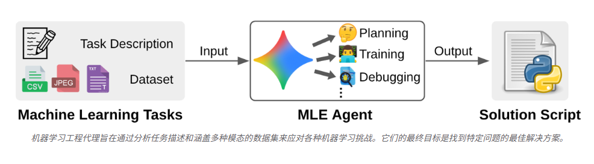
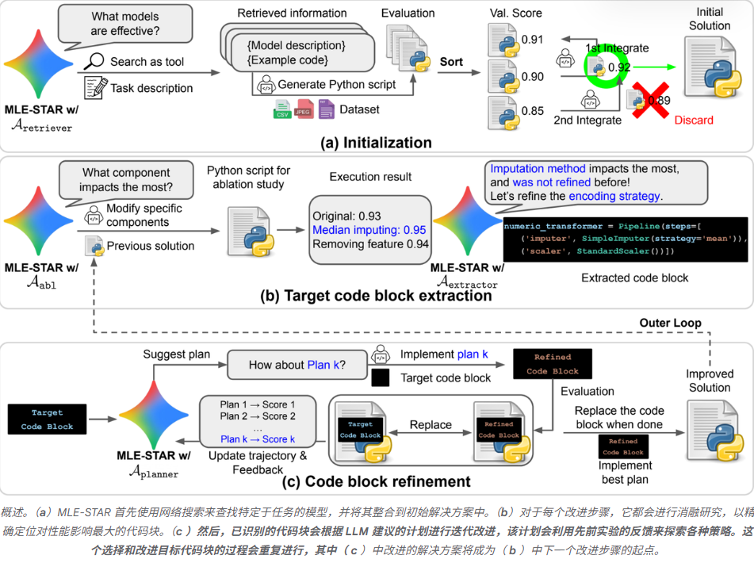
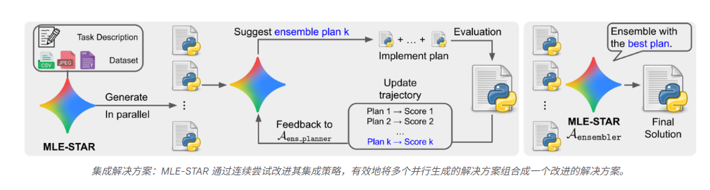

# MLE-STAR: Machine Learning Engineering Agent via Search and Targeted Refinement

MLE-STAR 是一种最先进的机器学习工程代理，能够跨多种数据模式自动执行各种机器学习任务，同时实现最佳性能。

[机器学习 (ML) 的兴起推动了从表格分类](https://arxiv.org/pdf/1603.02754)到[图像去噪](https://vciba.springeropen.com/articles/10.1186/s42492-019-0016-7)等各种实际场景中高性能应用程序的开发。然而，对于机器学习工程师来说，构建这些模型仍然是一项艰巨的任务，需要大量的迭代实验和数据工程。为了简化这些高要求的工作流程，[最近的研究](https://arxiv.org/pdf/2502.13138)集中于利用大型语言模型 (LLM) 作为机器学习工程 (MLE) 代理。通过利用其固有的编码和推理技能，这些代理将 ML 任务概念化为代码优化挑战。然后，它们探索潜在的代码解决方案，最终根据提供的任务描述和数据集生成可执行代码（例如 Python 脚本）。

尽管目前的机器学习代理取得了令人鼓舞的初步进展，但它们仍面临一些限制，从而削弱了其有效性。首先，它们严重依赖已有LLM知识，往往导致其偏向于熟悉且常用的方法（例如，用于表格数据的[scikit-learn](https://www.jmlr.org/papers/volume12/pedregosa11a/pedregosa11a.pdf)库），而**忽略了可能更优的针对特定任务的方法。** 此外，[这些代理](https://arxiv.org/pdf/2402.17453)通常采用一种探索策略，即在每次迭代中同时修改整个代码结构。这常常导致代理过早地将注意力转移到其他阶段（例如，模型选择或超参数调整），因为它们**缺乏在特定流程组件中进行深度迭代探索的能力，例如对不同的特征工程选项进行详尽的实验。**

在我们最近的[论文](https://arxiv.org/abs/2506.15692)《MLE-STAR》中，我们介绍了一种新型机器学习工程代理，它集成了[网络搜索](https://cloud.google.com/vertex-ai/generative-ai/docs/grounding/grounding-with-google-search)和有针对性的代码块优化功能。与其他方案不同，MLE-STAR 首**先在网络上搜索合适的模型，从而获得坚实的基础，以此应对机器学习挑战。** 然后，它会**通过测试代码中哪些部分最重要来仔细改进这个基础。** MLE-STAR 还采用了一种新方法，**将多个模型融合在一起，以获得更佳的结果。** 这种方法非常成功——它在 63% 的 Kaggle MLE-Bench-Lite 比赛中赢得了奖牌，显著超越了其他方案。

---

生成初始解决方案：

* MLE-STAR 使用网络搜索来检索可能对构建模型有效的相关且可能最先进的方法。
* 为了增强解决方案，MLE-STAR 提取代表特定机器学习流水线组件（例如特征工程或集成构建）的特定代码块。
* 专注于探索针对该组件的定制策略，并将之前的尝试作为反馈进行反思。
* 确定对性能影响最大的代码块，MLE-STAR 会进行消融研究，评估每个机器学习组件的贡献。重复此改进过程，修改各个代码块。

此外，我们提出了一种生成集成的新方法。MLE-STAR 首先提出多个候选解决方案。然后，MLE-STAR 不再依赖基于验证分数的简单投票机制，而是使用智能体自身提出的集成策略，将这些候选方案合并为一个改进的解决方案。该集成策略会根据先前策略的表现进行迭代改进。

最后但同样重要的是，MLE-STAR 集成了三个附加模块来增强其稳健性：(i) 调试代理、(ii) 数据泄漏检查器和 (iii) 数据使用情况检查器。对于调试代理，如果 Python 脚本的执行触发错误并产生记录（例如回溯），MLE-STAR 会使用调试模块尝试纠正。对于数据泄漏检查器，我们观察到 LLM 生成的 Python 脚本存在数据泄漏的风险，例如，在训练数据准备期间不当访问测试数据集中的信息。为了解决这个问题，我们引入了一个检查代理，它会在执行解决方案脚本之前对其进行分析。对于数据使用情况检查器，我们注意到 LLM 生成的脚本有时会忽略使用所有提供的数据源，而只关注 CSV 等简单格式。为了确保所有相关的数据都得到利用，MLE-STAR 包含一个数据使用情况检查代理。

---

为了验证其有效性，我们利用MLE-Bench-Lite中的[Kaggle](https://www.kaggle.com/)竞赛对 MLE-STAR 进行了全面评估。在这里，我们使用了一个额外的代理，它将任务描述和最终解决方案作为输入，并输出包含加载测试样本和创建提交文件的代码。

上图所示的实验结果表明，MLE-STAR 只需极少的人力投入（例如，定义可推广至任何任务的初始提示），就能显著超越之前的替代方案，包括[那些需要人工从 Kaggle 收集策略的方案。具体而言，MLE-STAR 在任何奖牌成就方面都取得了显著提升，与表现最佳的](https://arxiv.org/pdf/2402.17453)[基准](https://arxiv.org/pdf/2502.13138)相比，提升幅度从 25.8% 提升至 63.6% 。

为了理解 MLE-STAR 性能提升的来源，我们从多个角度进行了多项分析。我们研究了 (i) MLE-STAR 使用的机器学习模型类型；(ii) 如何通过人工干预扩展 MLE-STAR；以及 (iii) 附加的数据泄露和使用情况检查器如何进一步提升 MLE-STAR 的性能。

* *模型使用*：考虑两个 MLE 代理的模型使用情况。AIDE主要使用ResNet[进行](https://arxiv.org/pdf/2502.13138)图像分类。然而， 2015 年发布的ResNet现已被认为过时，并且可能导致性能不佳。相比之下，MLE-STAR 主要使用更新、更具竞争力的模型，例如EfficientNet或ViT，从而获得了可观察到的性能提升。
* *人工干预*：MLE-STAR 能够轻松采用更新的模型，且只需极少的人工干预。虽然 MLE-STAR 会使用网络搜索自动构建模型描述，但其自然扩展功能在于利用人类的专业知识进行构建。通过手动添加[RealMLP](https://arxiv.org/pdf/2407.04491)的模型描述，MLE-STAR 成功地将其训练代码集成到框架中，这是一个之前从未检索过的模型。
* *LLM 的错误行为及修正*：我们观察到，虽然 LLM 生成的代码执行正确，但其内容有时不切实际，呈现出幻觉。例如，下图（**左**）展示的是一种不切实际的方法，即使用测试数据自身的统计数据进行预处理。由于测试数据必须保持不可见，因此有必要对代码进行修正。为此，MLE-STAR 使用数据泄漏检查器来识别此类问题，并在检测到问题时优化生成的脚本。
* 我们还发现，LLM 生成的脚本经常会忽略一些已提供的数据源。为了解决这个问题，MLE-STAR 采用了数据使用检查器，它会重新检查任务描述，以确保所有给定的数据都得到了利用。如（**右**）所示，这种设计使 MLE-STAR 能够整合之前被忽略的数据。

我们提出了 MLE-STAR，一个专为各种机器学习任务设计的新型机器学习工程代理。其核心理念是利用[网络搜索](https://cloud.google.com/vertex-ai/generative-ai/docs/grounding/grounding-with-google-search)检索有效模型，然后探索针对特定机器学习流程组件的各种策略来改进解决方案。MLE-STAR 的有效性已得到验证，它在 MLE [-Bench-Lite](https://arxiv.org/pdf/2410.07095) Kaggle 竞赛中获得了 63% 的奖牌（其中 36% 为金牌）。

通过自动化复杂的机器学习任务，MLE-STAR 可以降低个人和组织利用机器学习的门槛，从而有可能促进各个领域的创新。此外，随着最先进模型的不断更新和改进，MLE-STAR 生成的解决方案的性能预计将自动提升。这是因为我们的框架利用搜索引擎从网络上检索有效的模型来形成其解决方案。这种固有的适应性确保了 MLE-STAR 能够随着机器学习领域的发展不断提供越来越优秀的解决方案。最后，同样重要的是，开发人员和研究人员现在可以使用我们最新发布的基于代理开发套件(ADK)构建的 MLE-STAR[开源代码库来加速他们的机器学习项目。](https://github.com/google/adk-samples/tree/main/python/agents/machine-learning-engineering)
