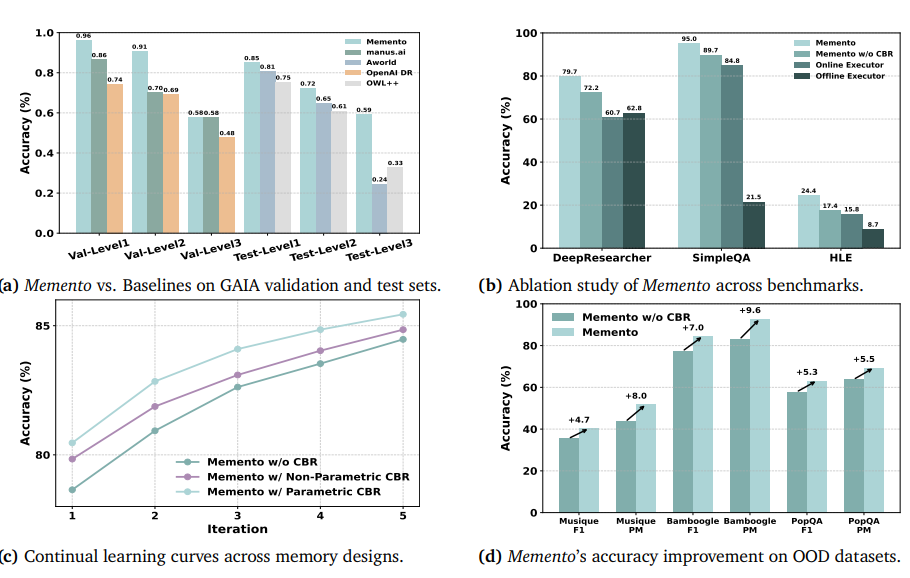
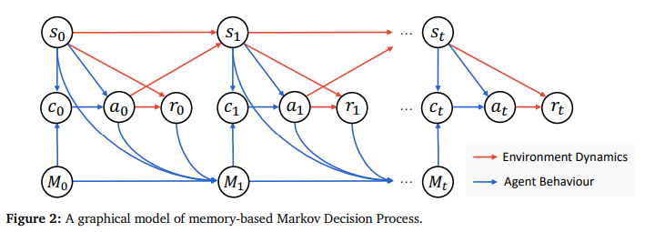
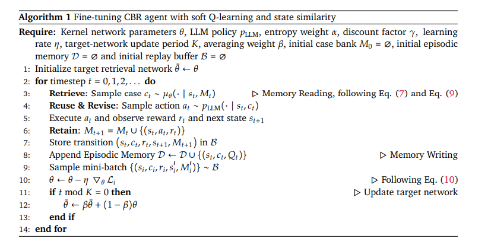
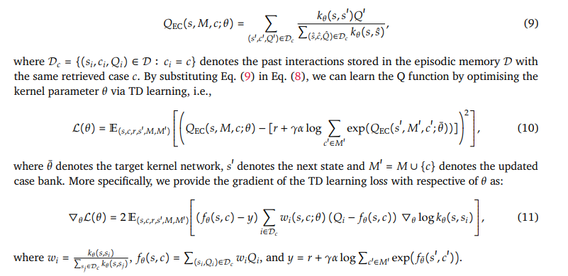
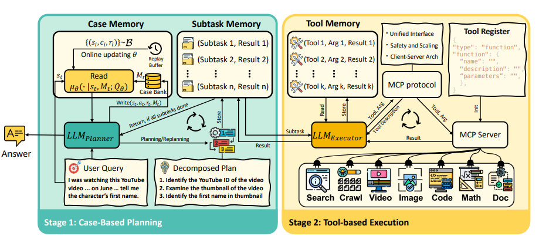

# Memento: Fine-tuning LLM Agents without Fine-tuning LLMs

摘要：

在本文中，我们提出了一种面向自适应大型语言模型（LLM）智能体的新型学习范式，该范式无需对底层 LLM 进行微调。现有方法往往存在局限性：要么灵活性不足，依赖静态、人工设计的反思流程；要么计算成本高昂，需要对 LLM 模型参数进行梯度更新。与之不同，我们的方法**通过基于记忆的在线强化学习，实现了低成本的持续自适应。**

我们将这一过程形式化为**记忆增强型马尔可夫决策过程（M-MDP）**，并配备神经案例选择策略以指导动作决策。过往经验（无论可微还是非参数化形式）均存储于情景记忆中：通过记忆重写机制，可基于环境反馈持续更新策略；而通过高效的记忆读取（检索）操作，则能实现策略优化。

我们在深度研究场景下实例化了该智能体模型，即**Memento**。实验结果表明：

* 在 GAIA 验证集上，Memento 的 Pass@3 指标达到 87.88%（Top-1 水平），在测试集上该指标为 79.40%；
* 在 DeepResearcher 数据集上，其 F1 值达 66.6%、PM（Pass@Mean）值达 80.4%，性能优于当前基于训练的最先进方法；
* 对于分布外（OOD）任务，基于案例的记忆机制可使性能绝对值提升 4.7 至 9.6 个百分点。

我们的方法为开发通用型 LLM 智能体提供了一条可扩展且高效的路径 —— 这类智能体能够在无需梯度更新的情况下实现持续、实时的学习，推动机器学习向**开放式技能获取**与**深度研究场景**迈进。相关代码已开源，地址为：[https://github.com/Agent-on-the-Fly/Memento](https://github.com/Agent-on-the-Fly/Memento)。

尽管近年来研究取得了一定进展，但当前的大型语言模型（LLM）智能体通常遵循两种主流范式，且每种范式都存在根本性局限。

第一种范式构建具有固定工作流程和硬编码推理逻辑的专用框架：这类框架在特定狭窄任务中表现良好，但灵活性不足。智能体部署后便处于 “静态” 状态 —— 既无法整合实时在线信息，也不能适应全新场景。

第二种范式则聚焦于通过底层 LLM 的参数调优（如监督微调或强化学习）来更新模型本身（Christianos 等人，2023；Shi 等人，2025）：这种方式虽能让智能体表现出更灵活的行为，但需承担极高的计算成本。对于持续自适应与在线学习而言，这些方法效率低下，在开放式场景中部署智能体时更是难以落地。这一现状为通用智能体研究提出了核心挑战：

**如何构建无需承担底层 LLM 微调高昂成本，却能从动态环境中持续学习的 LLM 智能体？**

受人类记忆机制启发，我们提出了一种基于记忆的学习框架，在不修改底层 LLM 的前提下实现持续自适应，以此应对上述挑战。我们观察到，人类的能力之所以能稳步提升，是因为每段经验都会经历以下过程：

（i）被编码为情景轨迹（Pritzel 等人，2017）；

（ii）在依赖睡眠的记忆巩固过程中提炼为抽象规则（Squire 等人，2015）；

（iii）通过多巴胺驱动的信用分配机制得到选择性强化（Glimcher，2011）；

（iv）当相似问题出现时，通过基于案例或类比的推理被调取使用（Ashley，1992）。

因此，我们的 LLM 智能体并未对基础模型进行微调，而是借助外部记忆存储过往轨迹（包括成功与失败标签），并借鉴相似的历史经验来指导决策。这种方法与**基于案例的推理（CBR）** 原则一致（Aamodt 与 Plaza，1994；Guo 等人，2024、2025）—— 这是一种符合心理学规律的学习策略，有研究表明人类常通过回忆类似过往场景来解决问题（Anderson，2013；Ross，1989）。例如，在深度研究场景中，曾成功完成某类网络任务的深度研究智能体，可借助过往经验解决从未见过但结构相似的新任务（Wiratunga 等人，2024）。我们的方法为深度研究智能体提供了一条全新的持续学习路径 —— 兼具高效性与泛化性，且灵感源自人类的学习方式。

为此，我们提出了**Memento**—— 一种非参数化、即时学习的 CBR 框架（Smyth 与 McClave，2001；Hatalis 等人，2025），其具体形式为基于记忆增强型马尔可夫决策过程（MDP）的 “规划器 - 执行器” 架构。Memento 包含三个核心组件：（i）规划器；（ii）支持工具调用的执行器；（iii）不断扩充的案例库（Case Bank）—— 该案例库以情景记忆的形式存储过往轨迹。Memento 并非仅依赖 LLM 训练后便固定不变的参数记忆，而是通过存储丰富的情景轨迹，实现了在线基于案例的推理。

---

## 相关工作：

### LLM 智能体系统中的持续学习

LLM 智能体的持续学习策略可分为两类。**参数化方法**（Zhu 等人，2025b、a）通过训练后优化（如强化学习（Wang 等人，2025））或监督微调（如 START 方法（Li 等人，2025a））更新 LLM，虽能实现较高的任务适配度，但需付出高昂的计算与数据成本，且存在 “灾难性遗忘” 风险（Li 等人，2024）。学界普遍认为，要让模型具备解决复杂推理问题的能力，需对模型参数进行大幅调整，因此在强化学习过程中，全量微调的应用十分广泛（Liu 等人，2025）。然而，在处理长时程复杂任务时（Mialon 等人，2023；Phan 等人，2025），LLM 智能体系统需耗费大量时间生成轨迹以收集训练数据，同时还依赖大规模人工标注的问题数据集。与之不同，**非参数化方法**固定 LLM 参数，通过附加外部记忆优化提示构建过程。人类智能高度依赖记忆系统，尤其是情景记忆 —— 这种记忆可支持从成功与失败经验中学习（Baddeley，1983）。认知科学研究表明，此类记忆会被分割存储，并通过选择性回放为未来决策提供参考（Anderson 等人，1997；Khosla 等人，2023；Fountas 等人，2024）。这一机制启发了早期人工智能范式，如基于案例的推理（CBR）（Francis 与 Ram，1993）。尽管现代检索增强生成（RAG）系统（Lewis 等人，2020）与 CBR 在表面上有相似之处，但它们通常仅查询静态文档语料库，缺乏持续自适应机制（Gao 等人，2023）。

### 工具增强型 LLM

为突破上下文限制与计算瓶颈，语言智能体正越来越多地整合外部工具。基于提示的方法（如 WebGPT（Nakano 等人，2021））将工具调用直接嵌入生成轨迹中。但处理长时程任务往往需要多步工具调用，因此近期研究提出了多智能体流水线方案，例如 AutoGen（Wu 等人，2023）、OWL（Camel-AI，2025）与 DeerFlow（字节跳动，2025），这些方案通过对话实现专用智能体间的协同。为解决在与外部工具环境进行动态、多轮交互时的长时程决策问题，**智能体强化学习（Agentic RL）** 已成为一种极具潜力的训练范式。该方法将 LLM 训练从静态任务求解（如数学计算或代码生成）转向动态的 “智能体 - 环境” 推理。包括 Toolformer（Schick 等人，2023）、API-Bench（Li 等人，2023）以及基于 GRPO 的优化方法（Wang 等人，2025；Qian 等人，2025；Feng 等人，2025）在内的监督微调技术，虽能教会模型 “何时调用 API” 及 “如何调用 API”，但需耗费大量成本进行重新训练，且通常假设工具集是固定且规模较小的（如仅包含代码工具与搜索工具）。然而，若缺乏明确的规划，“何时调用工具” 与 “调用何种工具” 的决策问题，仍是长时程任务的主要瓶颈。**为此，我们将规划建模为具有状态的马尔可夫决策过程（MDP），并为其配备用于存储过往案例的显式记忆。通过将基于案例的推理融入规划过程，可引导执行器进行策略性工具调用，从而实现稳定的高性能表现。**

### 智能体记忆机制

近期研究聚焦于为 LLM 智能体赋予显式记忆结构。越来越多的研究（Camel-AI，2025；Liang 等人，2025；谷歌，2025；字节跳动，2025）表明，当前 LLM 智能体的设计针对固定环境，其进化能力受到限制。尽管部分研究（如 ReAct 风格智能体与反射式提示流水线（Shinn 等人，2023；Yao 等人，2023））通过反馈实现了性能提升，但它们仍受限于预定义的启发式规则，无法实现真正的终身学习。DS-Agent（Guo 等人，2024）通过挖掘过往 Kaggle 竞赛解决方案并将其转化为可执行流水线，实现了规划过程的稳定；Agent-K（Grosnit 等人，2024）引入结构化记忆与信用分配机制以复用过往成果，实现了 Kaggle 风格工作流程的端到端自动化；此外，Agent-KB（Tang 等人，2025）与 Alita（Qiu 等人，2025）构建了共享知识库与优化工具集，为智能体问题求解提供支持。然而，大多数系统在存储案例时缺乏选择性筛选，导致了经典的 “淹没问题”—— 即检索成本超过了记忆本身的效用（Francis 与 Ram，1993）。

如今，LLM 智能体正逐渐配备可随时间增长、自适应的长期记忆，使其能够积累知识、召回过往上下文，并根据经验调整行为。MemoryBank（Zhong 等人，2024）将检索机制与艾宾浩斯式遗忘调度相结合，使时效性差、效用低的记忆项逐渐衰减，同时强化与用户相关的事实；基于这一思路，SAGE（Liang 等人，2024）将反射机制与基于艾宾浩斯理论的记忆优化器相融合，支持持续的自我完善；Mem0（Chhikara 等人，2025）采用结构化记忆机制，提供显式操作（添加、更新、删除、无操作）；A-MEM（Xu 等人，2025）通过类型学网络管理记忆；MemInsight（Salama 等人，2025）则进一步优化记忆语义，通过为原始记忆添加摘要与标签提升检索效率。

另有多项研究从交互轨迹中提炼操作知识：ExpeL（Zhao 等人，2024）收集轨迹并将其转化为可复用的自然语言见解与规则；AutoGuide（Fu 等人，2024）将离线日志压缩为简洁、带条件约束且上下文感知的指导方针；智能体工作流记忆（Agent Workflow Memory，Wang 等人，2024）则将频繁使用的子任务序列转化为辅助技能。最后，Agent-KB（Tang 等人，2025）与 Alita（Qiu 等人，2025）构建共享知识库与优化工具集，为智能体问题求解提供支持。与之不同，我们将规划过程形式化为**记忆增强型马尔可夫决策过程（M-MDP）**，并通过在线软 Q 学习，在情景案例库上学习神经案例选择策略 —— 从而在不微调底层 LLM 参数的前提下，实现智能体的持续自适应。

## 方法

Memory-Based MDP with Case-based Reasoning Policy

memory: (S X A X R), 状态+Action+Reward

其与标准马尔可夫决策过程（MDP）的核心差异在于：我们引入了一个由过往经验构成的**记忆空间**。在基于案例推理（CBR）智能体的设定中，状态空间与动作空间均被定义为 “基于预定义词汇表𝒱生成的所有有限长度序列” 的集合。

借助 M-MDP 的形式化定义，CBR 智能体的行为可正式描述如下：在时间步 t，我们维护一个案例库（即记忆模块）Mt = {ci}（i 从 1 到 Nt），其中每个案例 ci 均为一个元组（si, ai, ri），Nt 代表当前案例库中的案例数量。给定当前状态 st 后，CBR 智能体首先会检索一个案例 ct，该检索过程服从分布 μ(⋅ ∣ st, Mt)；随后，智能体通过 LLM 对检索到的案例进行复用与适配，即动作 at 的生成服从分布 pLLM (⋅ ∣ st, ct)。此处，μ 代表**案例检索策略**，其实现细节将在后续内容中阐述。

在执行动作 at 后，CBR 智能体将获得奖励 rt = ℛ(st, at)，并观测到下一个状态 st+1（该状态转移服从分布𝒫(⋅∣st, at)）。同时，CBR 智能体还会将这个新生成的案例存入案例库，即 Mt+1 = Mt ∪ {(st, at, rt)}。

**Soft Q-Learning for CBR Agent：**

使用episodic control (EC) algorithms 来计算Q，

## 实现

我们在深度研究场景（Huang 等人，2025）中，通过记忆增强型马尔可夫决策过程（M-MDP）方法（第 3 节）实现了**带状态的提示工程**。在这类场景中，智能体需通过与环境的迭代交互、调用外部工具、从外部源检索信息、处理异构数据以进行动态推理，从而解决复杂的长时程任务。如图 3 所示，Memento 在两个核心阶段间交替运行：**基于案例的规划（Case-Based Planning）** 与**基于工具的执行（Tool-Based Execution）**。

### 框架设计

为应对长时程推理的挑战，Memento 遵循 “规划 - 执行” 范式（Erdogan 等人，2025）—— 规划器（Planner）与执行器（Executor）通过交替循环运行，逐步推进任务完成。为实现高效协同，Memento 整合了三个记忆模块：

* **案例记忆（Case Memory）**：以向量形式存储过往案例，为高层规划提供支持；
* **子任务记忆（Subtask Memory）**：以文本形式存储活跃子任务及其执行结果；
* **工具记忆（Tool Memory）**：以文本形式记录每个子任务对应的工具交互日志。

### 规划阶段（Planning Stage）

规划器实例化为由 LLM 驱动的 CBR（基于案例推理）智能体，其工作流程如下：

1. **接收与检索**：接收任务指令后，查询案例记忆，获取 K 个相关案例三元组（si, ai, ri）（i=1 至 K）—— 其中 si 代表历史任务，ai 代表对应规划方案，ri 代表任务成功标识，K 为检索数量；
2. **记忆支持**：案例检索由 “案例记忆模块” 实现，该模块通过**基于相似度的检索器**或**在线更新的 Q 函数**，从案例库中提取相关经验，使规划器能够同时利用参数化记忆（LLM 自身记忆）与非参数化记忆（案例库）作为先验知识；
3. **生成规划**：将检索到的案例与当前任务指令拼接，构成提示（Prompt），引导 LLM 为每个子任务生成规划方案；
4. **子任务协调与迭代**：初始任务分解后，“子任务记忆模块” 协调规划器与执行器的交互，记录生成的子任务及其执行结果。每次迭代后，规划器利用累积的执行历史评估任务完成度：**若任务未完成，则基于更新后的上下文重新规划；若任务完成，则返回最终结果，并仅在任务结束时将新经验更新至案例记忆。**

### 执行阶段（Execution Stage）

执行阶段由 “执行器（Executor）” 管理，该执行器基于通用 LLM 构建，负责通过**模型上下文协议（MCP）**，将每个子任务作为独立场景（Episode）执行（Sumers 等人，2023）。与以往智能体（Zheng 等人，2025；Weng 等人，2025）不同，Memento 的执行器支持丰富的推理能力与灵活的工具组合，具体流程如下：

1. **信息读取**：执行器从子任务记忆中读取待处理子任务，从工具记忆（按子任务划分范围）中获取相关历史交互记录；
2. **工具决策与执行**：参考工具记忆确定合适的工具调用方式，执行子任务并更新结果；
3. **MCP 协议作用**：执行器作为 MCP 协议的客户端运行，而 MCP 本身是一种**标准化、与模型无关的接口**—— 能够灵活协调各类外部工具与数据源。通过在单一协议层下统一访问入口，Memento 可在多领域中无缝整合动态推理与组合式工具使用。

### 案例记忆管理

案例记忆是一个通过 “写入（Write）” 与 “读取（Read）” 操作动态扩充的案例库**(M_t)**，支持非参数化与参数化两种实现方式。在**非参数化设置**中，“写入” 操作仅需将案例元组**((s_t, a_t, r_t))**追加至案例库，“读取” 操作则通过相似度检索获取案例以保证计算效率；在**参数化设置**中，“写入” 操作除追加案例外，还会在线更新一个 Q 函数以调整检索分布，“读取” 操作则由训练后的 Q 函数驱动，从而实现案例的自适应选择。

### 记忆存储（Memory Storage）

依据 3.2 节定义的 CBR 智能体设计，在每个时间步**t**结束后，“写入” 操作会将历史案例**((s_t, a_t, r_t))**追加至案例库**（M_t)**，具体公式如下：

**$\text{Write}(s_t, a_t, r_t, M_t) = M_{t+1} = M_t \cup {(s_t, a_t, r_t)} \tag{12}**

在此过程中，**状态(s\_t)通过冻结的文本编码器（预训练后参数固定）进行编码，而动作(a_t)**与奖励**(r_t)则以原始形式存储** —— 这是因为仅有状态表示需要向量化处理，以支持后续的检索操作。该 “写入” 操作在智能体执行过程中持续进行，使案例库能逐步积累为一个全面且可迁移的经验库。通过同时存储成功与失败案例，记忆模块不仅能支持 “回顾性分析”（帮助智能体规避过往错误），还能提供 “成功轨迹” 以前瞻性地指导未来规划。

### 非参数化记忆检索（Non-Parametric Memory Retrieval）

Memento 的核心优势在于其动态演化的案例库，这是其持续学习能力的基础。在每个规划步骤中，该非参数化记忆模块接收任务指令后，**会检索包含 “成功案例” 与 “失败案例” 的相关案例集合。** 这种 CBR 方法模拟了人类的类比学习过程 —— 即过往经历的结果会影响当前决策（Aamodt 与 Plaza，1994）。

具体而言，通过计算 “当前状态” 与 “历史状态” 的语义相似度，从案例库中检索出 K 个最相似的历史案例。该设计遵循主流 CBR 范式的核心假设：**相似问题应对应相似解决方案**（Wiratunga 等人，2024；Guo 等人，2025），从而使智能体优先选择 “历史上下文与当前任务最匹配” 的案例。形式上，非参数化记忆的 “读取” 操作定义为： **\\(\\text{Read}\_{\\text{NP}}(s\_t, M\_t) = \\text{TopK}\_{(s\_i, a\_i, r\_i) \\in M\_t} \\text{sim}\\left( \\text{enc}(s\_t), \\text{enc}(s\_i) \\right) \\tag{13}\\)**

其中，**\\(s\_t\\)**与**\\(M\_t\\)**分别表示时间步**t**的查询状态（当前任务）与案例库；**\\(\\text{enc}(\\cdot)\\)**代表预训练文本编码器；**\\(\\text{sim}(\\cdot)\\)**代表余弦相似度函数（用于量化状态向量间的语义匹配度）。

### 参数化记忆检索（Parametric Memory Retrieval）

为使智能体能够 “选择性利用高价值案例” 以增强基于过往经验的规划能力，我们在 Memento 中通过**参数化 Q 函数**设计了可微分记忆机制。与非参数化方法仅按公式（12）追加案例元组不同，**参数化方法在向案例库写入新案例时，还会同步在线更新 Q 函数。**

同时，由于 Memento 仅在 “规划阶段” 应用 CBR，CBR 规划器可简化为**单步设置**（而非多步 M-MDP）。这种单步设置将公式（10）中的时序差分（TD）目标简化为 “即时奖励”，从而降低了学习目标的复杂度。由于无需 “自举”（bootstrapping，即利用后续状态的 Q 值估计更新当前 Q 值），参数更新退化为监督学习范式，避免了目标值的非平稳波动（non-stationary targets）。

因此，我们可端到端训练一个参数化 Q 函数**\\(Q(s, c; \\theta)\\)**，无需依赖公式（9）中的基于核函数的估计方法。相应地，单步 Q 学习的损失函数可表示为： **\\(\\mathcal{L}(\\theta) = \\mathbb{E}\_{(s,c,r)} \\left[ \\left( Q(s, c; \\theta) - r \\right)^2 \\right] \\tag{14}\\)**

其中，元组**\\(\\{(s, c, r)\\}\\)**存储在经验回放缓冲区**\\(\\mathcal{B}\\)**中，**Q**由神经网络实现。需注意，深度研究任务中的奖励信号为**二元值**（**\\(r \\in \\{0, 1\\}\\)**）：由于均方误差（MSE）损失在目标值接近 0 或 1 时易出现梯度消失问题，而交叉熵（CE）损失能提供数值更稳定的梯度信号，因此我们将损失目标替换为二元分类损失。重构后的训练目标如下： **\\(\\mathcal{L}(\\theta) = \\mathbb{E}\_{(s,c,r)} \\left[ -r\\log Q(s, c; \\theta) - (1-r)\\log \\left( 1 - Q(s, c; \\theta) \\right) \\right] \\tag{15}\\)**

此时，**Q**可视为一个归一化值，代表 “在给定案例库**M**的情况下，检索案例**c**对当前状态**s**是良好参考” 的概率**\\(p(r=1 \\mid s, c; \\theta)\\)**。

与非参数化方法仅 “保存新案例” 不同，参数化记忆在 “写入” 过程中还会优化 Q 函数 —— 每次更新既能记录新案例，又能调整整体 Q 值分布。在检索阶段，通过公式（7）利用训练后的 Q 函数计算检索策略分布，并从中采样案例；为降低案例选择的随机性、提升智能体决策过程的可解释性，参数化记忆的 “读取” 操作通过 TopK 算子筛选出 Q 值最高的 K 个案例，作为规划参考： **\\(\\text{Read}\_{\\text{P}}(s\_t, M\_t) = \\text{TopK}\_{c\_i \\in M\_t} Q(s\_t, c\_i; \\theta) \\tag{16}\\)**

通过用新样本持续更新 Q 函数，参数化记忆模块能够学习捕捉 “状态与案例间的潜在关联模式”，从而使案例检索策略更接近最优检索分布**\\(\\mu^\*\\)**。

### 工具使用

深度研究任务除了要求智能体具备 “长任务执行序列” 与 “多轮交互” 能力外，对原子动作（即基础操作）也提出了严格要求 —— 智能体需能够获取外部信息，并对其进行后续处理、整合与分析。为此，我们为 Memento 设计了一套可通过**MCP 协议**调用的工具集，涵盖两类核心模块：一类是信息检索工具（如搜索引擎、网络爬虫），另一类是多模态信息处理与分析组件（支持处理视频、图像数据及多种格式文件）。

### 外部信息获取（External Information Acquisition）

为支持需要访问**实时外部知识**的开放式任务（如 GAIA、BrowseComp 数据集对应的任务），我们设计了一套兼具 “检索” 与 “内容获取” 能力的搜索工具包，具体实现如下：

1. **元搜索引擎集成**：采用自托管的元搜索引擎 searxng²，该引擎可聚合来自 Google³、Bing⁴、DuckDuckGo⁵、Brave⁶等多个来源的搜索结果，避免单一引擎的信息偏差；
2. **结果重排序**：根据 “检索结果与查询上下文的语义相似度” 对候选结果进行重排序，确保信息的相关性与精准度；
3. **深度内容爬取**：当执行器需要更深入理解信息时，集成 Crawl4AI⁷工具爬取并解析选定结果的完整网页内容。
   简言之，搜索工具基于用户查询中的关键词匹配实现 “粗筛选”，而爬虫则在需要时作为 “细粒度机制”，从检索到的来源中提取详细信息。

### 多模态异构信息处理（Multimodal Heterogeneous Information Processing）

为支持对异构数据源的下游推理，我们开发了一套**通用且细粒度的文档处理工具包**，可自动从多种文件类型与模态中提取信息，具体功能如下：

* 图像：通过视觉语言模型（VLM）生成图像描述（Image Caption）；
* 音频：通过自动语音识别（ASR）技术转换为文本；
* 演示文稿（PowerPoint）：逐页解析，同时生成嵌入的图像描述；
* 电子表格：转换为可读的行式布局；
* 压缩文件：自动解压缩；
* 纯文本与代码文件：直接读取内容；
* JSON 与 XML 文件：解析为结构化对象；
* Word 文档：转换为 Markdown 格式；
* 视频：通过 VLM 生成自然语言摘要；
* PDF 或未支持格式：通过 Chunkr AI⁸或纯文本解析作为备用提取方案。

该工具包为 “跨文件类型、跨模态的内容访问与解析” 提供了统一接口，简化了真实场景中异构数据的处理流程。

### 推理工具（Reasoning）

推理与分析工具包集成了**代码执行**与**数学计算**功能，为 Memento 框架内的稳健自动化分析提供支持，具体包括两个核心工具：

1. **代码工具（Code Tool）**
   提供一个**沙箱环境**（安全隔离的执行空间），支持在统一工作区中编写、运行和管理代码：
   * 用户可在持久化任务目录内创建文件、执行 Shell 或 Python 命令、查看输出结果；
   * Python 脚本需通过安全白名单验证（确保执行安全），支持 numpy、pandas、torch 等常用库；
   * 工作区在多步骤间保持状态，支持迭代式代码开发。
     该工具对解决数据分析、自动化操作或动态代码生成类任务至关重要。
2. **数学工具（Math Tool）**
   作为代码工具的补充，负责处理基础算术运算，满足简单数值计算需求。

### 实验

规划器（Planner）由 GPT-4.1 驱动；在 GAIA 数据集任务中，执行器（Executor）由 o3 模型驱动，而在其他数据集任务中则由 o4-mini 模型驱动；图像处理任务由 GPT-4o 完成；视频智能体由 Gemini 2.5 Pro 驱动；音频智能体由 Assembly AI（注：Assembly AI 为专注于语音识别的技术平台）驱动。

对于非参数化基于案例推理（CBR）：我们通过 SimCSE 模型（注：一种用于生成句子向量的预训练模型，擅长捕捉语义相似性）对句子进行编码，并采用余弦相似度对候选案例进行排序。对于参数化 CBR：我们同样使用 SimCSE 初始化句子表示，同时将 Q 函数实现为一个两层多层感知器（MLP），用于分配 Q 值（即案例对当前任务的参考价值）。此外，CBR 规划器在每一步的状态通常包含从先前状态继承的信息；为避免冗余存储，仅将每条轨迹（注：指完成一个完整子任务或任务的 “状态 - 动作 - 奖励” 序列）最后一步的状态、动作与奖励写入记忆，确保案例库既精简又能保留关键信息。

“离线执行器（Offline Executor）” 设置指仅使用一个静态执行器，移除规划器、案例记忆及所有外部工具 —— 该设置仅反映大型语言模型（LLM）自身的原始参数化知识（即无外部记忆与工具辅助的基础性能）。“在线执行器（Online Executor）” 在上述精简基线（离线执行器）的基础上，重新为执行器连接实时搜索工具及其他 MCP 协议支持的工具 —— 该设置用于体现实时检索与工具执行带来的性能提升。“Memento（无 CBR）” 版本（Memento (w/o CBR)）则禁用情景记忆，通过该设置可单独衡量 “基于案例推理（CBR）” 这一模块带来的额外性能增益。

### 每个任务的 Token 数量

如图 5 所示，在所有难度级别中，代码（Code）、搜索（Search）与爬取（Crawl）任务的占比最高，且其使用频率随任务难度提升显著增加。值得注意的是，尽管工具总使用量随任务复杂度增长，但对于最具挑战性的问题，模型更多依赖**内部推理**来解读和整合此前工具输出的证据，而非仅通过 MCP 协议调用更多工具。这一现象凸显：**要解决开放式、长时程的深度研究任务，“规划、记忆与证据整合” 三者的有效协同至关重要。**

### MCP 工具的统计数据

如图 6 所示，我们从 GAIA 验证集中随机抽取 10 个任务，分别计算每个任务的 Token 数量与成本。结果显示，平均响应 Token 数随任务难度急剧增加：

* 1 级任务（Level 1）需 4.7k 输出 Token，对应输入 Token 为 26k；
* 2 级任务（Level 2）输出 Token 增至 6.9k，输入 Token 增至 48k；
* 3 级任务（Level 3）输出 Token 达峰值 9.8k，输入 Token 达 121k。

这表明，在复杂场景中，主要计算负担来源于 “整合与分析多步骤工具输出”，而非 “生成冗长的响应内容”。

我们观察到，**输出 Token 数在各难度级别中保持相对稳定**—— 这是因为最终答案通常只需简短表述，说明我们的系统在推理过程中能有效控制生成长度，避免不必要的冗余。然而，受真实环境复杂性与不可预测性影响，**输入上下文随任务难度显著增长**：任务越复杂，就需要将更多详细观测结果、规划方案、工具输出及中间推理步骤纳入输入提示（Prompt），进而导致输入 Token 数量大幅增加。

### “快速思考” 与 “慢速思考” 模式的影响

表 6 对比了 “快速思考”（Fast-thinking）与 “慢速思考”（Slow-thinking）两种规划器对不同难度任务整体系统性能（Pass@1 指标）的影响。结果显示：

* 当搭配 o3 执行器时，采用 “快速、非深思熟虑型” 的 GPT-4.1 规划器，平均准确率达 70.9%，优于采用 “更深思熟虑型” o3 规划器的 63.03%（二者使用相同执行器）；
* 当搭配 o4-mini 执行器时，GPT-4.1 规划器相比 o3 规划器，性能提升幅度高达 16.4%；
* Qwen3-32B 系列模型的实验结果进一步验证了这一趋势：“快速思考” 规划器的性能始终优于 “慢速思考” 规划器。

对系统运行轨迹（Trace）的分析揭示了 “快速思考” 规划器更优的核心原因：

1. 基于 o3 的 “慢速思考” 规划器常出现两种问题：要么直接跳过规划步骤直接作答，要么生成过于冗长的规划方案，导致执行器因指令不完整而被误导；
2. 在复杂的多步骤推理场景中，“慢速思考” 规划器倾向于将解决方案压缩为单一、复杂的思维链（Chain of Thought），而 “快速思考” 规划器能有效将问题分解为可管理的子任务。

综上，这些发现表明：在模块化 LLM 系统中，**简洁且结构化的规划**能带来更高效的下游执行。过度深思熟虑的规划不仅会引入不必要的上下文与冗余信息，还可能导致 “角色混淆”（如规划器承担了执行器的部分功能），进而削弱 “规划 - 执行” 两阶段架构本应发挥的专业化优势。

# Memento 模型相关内容总结

Memento 是一种无需微调底层大型语言模型（LLM），却能实现持续自适应的智能体模型，聚焦深度研究场景，核心围绕 “记忆增强型马尔可夫决策过程（M-MDP）” 构建，以下从核心机制、模块设计、实验与发现三方面总结上述翻译内容：

## 一、核心机制与设计理念

1. **核心解决问题**：针对现有 LLM 智能体 “静态僵化（依赖人工反思流程）” 或 “计算成本高（需微调模型参数）” 的痛点，提出基于记忆的学习框架，在不修改底层 LLM 参数的前提下，通过外部记忆与强化学习实现低成本持续自适应。
2. **灵感来源**：模拟人类记忆机制，将经验编码为情景轨迹、提炼为抽象规则、通过多巴胺驱动强化，并基于案例 / 类比推理调取，契合 “基于案例的推理（CBR）” 原则，可复用过往成功经验解决相似新任务。
3. **形式化基础**：以 M-MDP 为理论框架，引入记忆空间存储过往经验，定义状态空间与动作空间为预定义词汇表下的有限长度序列，通过 “案例检索 - 复用适配 - 奖励反馈 - 记忆更新” 的循环实现智能体行为优化。

## 二、关键模块设计

### （一）整体架构：“规划 - 执行” 双阶段交替

* **规划阶段（Planner）**：由 LLM 驱动的 CBR 智能体实现，接收任务指令后，从案例记忆中检索相关案例三元组（历史任务、规划方案、成功标识），结合当前任务生成子任务规划，通过子任务记忆协调与执行器的交互，迭代评估任务完成度并动态调整规划。
* **执行阶段（Executor）**：基于通用 LLM，通过 “模型上下文协议（MCP）” 将子任务作为独立场景执行，支持多工具组合与动态推理，从工具记忆中获取历史交互记录，决策工具调用方式并更新执行结果，MCP 协议作为标准化接口，保障与各类外部工具 / 数据源的灵活对接。

### （二）案例记忆管理：双模式存储与检索

1. **记忆存储**：每个时间步将案例元组（状态、动作、奖励）追加至案例库，状态通过冻结文本编码器向量化，动作与奖励保留原始形式，仅存储轨迹最后一步关键信息以避免冗余，构建全面且精简的经验库。
2. **非参数化检索**：通过 SimCSE 编码状态并计算余弦相似度，检索最相似的 K 个案例，遵循 “相似问题对应相似解决方案” 的 CBR 范式，保障计算效率，适用于对检索速度要求较高的场景。
3. **参数化检索**：引入参数化 Q 函数（两层 MLP 实现），写入案例时同步在线更新 Q 函数，通过二元交叉熵损失（因深度研究任务奖励为二元值）端到端训练，检索时选择 Q 值最高的 K 个案例，实现高价值案例的自适应筛选，更贴合最优检索分布。

### （三）工具集：覆盖多场景需求

1. **外部信息获取工具**：集成自托管元搜索引擎 searxng（聚合多平台结果）与 Crawl4AI 爬虫，前者基于关键词粗筛选结果，后者在需深度理解时爬取完整网页内容，满足开放式任务的实时知识需求。
2. **多模态异构信息处理工具**：支持图像（VLM 生成描述）、音频（ASR 转文本）、PPT（逐页解析 + 图像描述）、电子表格（行式布局转换）等多类型数据处理，提供统一接口，解决异构数据解析难题。
3. **推理工具**：含沙箱环境的代码工具（支持 Python/Shell 命令、安全白名单验证、迭代开发）与基础算术的数学工具，分别满足数据分析、自动化及数值计算需求。

## 三、实验设置与关键发现

### （一）模型与参数配置

* 规划器由 GPT-4.1 驱动，执行器依数据集差异选用 o3（GAIA）或 o4-mini（其他），多模态任务分别采用 GPT-4o（图像）、Gemini 2.5 Pro（视频）、Assembly AI（音频）；非参数化与参数化 CBR 均以 SimCSE 初始化句子表示，参数化 CBR 的 Q 函数为两层 MLP。

### （二）对照实验设计

1. **离线执行器**：仅含静态执行器，移除规划器、记忆与外部工具，反映 LLM 原始参数化知识，作为基础性能基线。
2. **在线执行器**：在离线基线基础上连接实时搜索与 MCP 工具，量化实时工具与检索的价值。
3. **Memento（无 CBR）**：禁用情景记忆，单独衡量 CBR 模块的额外性能增益。

### （三）核心发现

1. **任务难度与资源消耗**：随任务难度提升，代码、搜索、爬取工具使用量增加，输入 Token 数大幅增长（Level 1 至 Level 3 从 26k 增至 121k），但输出 Token 稳定，说明复杂场景的计算负担源于多步骤工具输出整合，而非冗长响应生成。
2. **“快速思考” 规划器更优**：GPT-4.1（快速）相比 o3（慢速）规划器，搭配不同执行器时性能均显著提升（最高 16.4%），因慢速规划器易直接作答或生成冗长方案，且压缩复杂思维链，而快速规划器能简洁分解子任务，避免角色混淆，发挥两阶段架构的专业化优势。
3. **CBR 与记忆的价值**：案例记忆通过存储成功与失败经验，既支持错误规避又提供规划指导，参数化检索因 Q 函数优化能优先选择高价值案例，非参数化检索保障效率，二者共同支撑 Memento 在 GAIA、DeepResearcher 等数据集的顶尖性能（如 GAIA 测试集 Pass@3 达 79.40%）。
