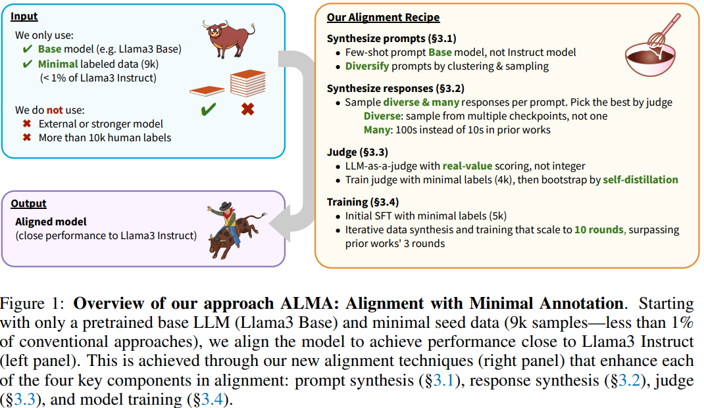

# ALMA: ALIGNMENT WITH MINIMAL ANNOTATION

摘要：近期针对大型语言模型（LLM）对齐的方法通常需要数百万个人工标注，或者依赖外部已对齐的模型来生成合成数据。  本文介绍了“最少标注对齐法”（ALMA），展示了仅使用9000个标注示例（不到传统方法所需数量的1%）就能实现有效对齐。“最少标注对齐法”（ALMA）通过新技术生成了大量高质量的合成对齐数据：利用少样本学习进行多样化提示语合成，借助多个模型检查点生成多样化回复，以及通过分数聚合和自蒸馏来增强评判（奖励）模型。  仅使用一个预训练的Llama3基础模型、5000个监督微调（SFT）示例以及4000个评判标注，“最少标注对齐法”（ALMA）在多个不同的对齐基准测试中实现了接近Llama3-Instruct的性能（例如，在羊驼评估（AlpacaEval）2.0分数上仅有0.1%的差异）。这些结果是通过多轮、自举式的数据合成与训练方案实现的，该方案会持续改进10轮，超越了此前方法通常只能进行3轮的局限。 ** 这些结果表明，基础模型本身已具备足以实现有效对齐的知识，而且合成数据生成方法能够将这些知识挖掘出来。**

---

大语言模型的对齐需要大量的数据，一般包括SFT和Feedback数据组成，对于SFT数据而言需要考虑以下四个子问题：

* Prompt 收集：收集用户提示和问题
* 回复收集：首先收集对于这个Prompt的人工回复，之后再生成模型回复
* 判断：开发判别或者奖励模型来获得回答质量，一般是在human preference数据上训练
* 模型训练：使用收集好的prompt，回复已经判别结果对齐LLM（SFT， PPO，DPO）等算法

目前效果最优的LLM都需要收集大量的人工标注数据（prompts，response， judgements）,比如LLama3包含了数百万的人工标注数据。为了应对数据的挑战，最近的研究展示了使用合成数据进行模型对齐的潜力。然而这些方法都依赖于额外的模型进行数据合成，而这些模型本身使用了大量的标注数据进行对齐。

在这项工作中，**我们认为基础模型本身已经具备足够的知识来合成高质量的训练数据，只需要极少的种子标注用于引导即可。**我们表明，通过精心设计的数据合成技术以及持续训练，模型的对齐能力能够被挖掘出来并得到强化。

为了验证这一假设，我们使用的人工标注数据比常规情况少了好几个数量级（只用9000个，而非常规的数百万个），并且将模型本身作为生成合成数据的唯一来源。如图1所示，我们的方法仅使用三种输入来进行模型对齐：一个预训练的基础大型语言模型（Llama3基础版）、一个小规模的有监督微调（SFT）种子数据集（含5000个样本）以及一个小规模的评判数据集（含4000个样本）——无需从其他模型或数据集进行蒸馏。我们将这种方法称为“最少标注对齐法”（ALMA），它包含以下技术：

（1）提示语合成：我们通过**对基础模型进行少样本提示来合成新的提示语**，然后**运用聚类和二次抽样的方法来增强提示语的多样性。**

（2）回复合成：为收集高质量的回复，我们利用多个模型检查点（而非单个检查点）生成多样化的输出，并且针对每个提示语生成数百条回复（而不是先前研究中通常使用的十几条回复）。然后由评判模型选出最佳回复。

（3）评判模型：我们最初仅使用一个小规模的标注数据集（含4000个样本）将大型语言模型微调成一个评判模型。为提升其性能，我们让这个大型语言模型评判模型能够生成实数值分数，而非传统的整数分数，**并通过使用额外的合成提示语和回复进行自蒸馏来进一步训练它。**

（4）模型训练：在最初使用小规模种子数据集（含5000个样本）进行有监督微调之后，我们利用合成数据对大型语言模型开展为期10轮的训练。

这种整体方法会带来性质不同的学习趋势，能够基于更高质量的合成数据进行更多轮次的训练。“最少标注对齐法”（ALMA）能够实现持续改进，模型可以连续改进10轮，而此前的对齐方法通常只会展现出3轮的改进情况（见第4.2节）。我们还表明，与先前的方法相比，使用多个模型检查点对众多（数百条）回复进行采样能显著提升性能，先前的方法通常仅使用单个模型对至多10到20条回复进行采样（见第5.3节）。

这些结果表明，基础语言模型具备足够的潜在知识，能够基于极少的种子数据来启动自身的对齐过程，从而极大地降低了对大量人工标注的需求。虽然高质量的种子数据仍然至关重要——这意味着人类的输入无法被完全消除——但“最少标注对齐法”（ALMA）代表着与依赖数百万个标注示例的传统对齐方法相比的一种根本性转变。

这项工作开辟了重要的研究方向，**包括确定哪些类型的人类标注对于引导最为关键且本身难以合成，以及理解合成数据和人类标注数据的互补作用。**“最少标注对齐法”（ALMA）表明，未来的对齐方法可能不仅受益于规模更大的人类标注数据集，还受益于复杂的数据合成技术。

---

相关工作：

RLHF Workflow (Dong et al., 2024), and Nemotron (Adler et al., 2024).

合成数据：

* Magpie 展示高质量的SFT数据，能够通过简单的提升Llama3-Instruct模型来合成。
* Nemotron presents methods to synthesize RLHF data, including prompts, responses and preference labels.
* Self-Rewarding LM

high-quality data synthesis through diverse prompt and response sampling

self-distillation for further improving the judge

an iterative training recipe that allows the model to improve beyond 5 rounds without overfitting

我们的工作是将这些改进后的回复用于模型训练（即将它们反馈给模型以强化积极行为）。通过这样做，在向用户提供模型服务时，我们无需使用额外的推理资源。

---

方法：

* Prompt collection： 收集用户问LLM的提示和问题
* Response collection： 回复收集，收集用户标注的回复，或者模型生成的回复
* Judge：创建评判模型或奖励模型，以便根据给定的提示来评估回复质量，通常是通过**使用人工标注的偏好数据**（评判数据）进行训练来实现这一目的。
* Model training：通过一个两阶段的进程来对齐LLM，（i）首先使用人工标注的回复（监督微调，SFT），（ii）然后通过诸如最优n个监督微调（best-of-n SFT）、近端策略优化（PPO）或直接偏好优化（DPO）等优化算法，利用模型生成的回复及评判结果进行操作（反馈学习）。反馈学习阶段**可以通过使用最新模型生成新的回复，并将这些新数据纳入后续的训练轮次中，如此重复多轮。**

PROMPT SYNTHESIS：

使用LLM来合成prompt：具体而言，我们从5000个种子提示语中随机抽取3到5个提示语作为语境，然后通过少样本提示的方式让基础大型语言模型生成一个新的提示语。在重复这一过程并去除重复内容后，我们总共获得了**一组1亿个独特的合成提示语**，在每一轮反馈学习中都可以对其进行采样。虽然这种方法通过少样本条件作用生成了符合实际的提示语，但它也存在局限性。生成的提示语倾向于常见的询问（例如，“规划一次去西雅图的三日游”），**而对更长、更复杂或特定领域的询问（例如，带有详细症状和化验结果的具体医学问题）体现不足**。仅仅从这个集合中随机均匀采样提示语用于训练，会过度强调常见提示语，并且可能会对处理更具挑战性的提示语的性能产生不利影响。**为了解决这一问题，我们开发了一种多样化的采样技术**：

我们这多达1亿个提示语的大集合中确实包含长尾提示语，尽管数量相对较少。为了更好地利用这些多样的示例，我们实施了基于聚类的再平衡方法。我们对这1亿个提示语进行k均值聚类，根据来自基础大型语言模型的隐藏表示创建100万个聚类。在每一轮反馈学习期间（反馈学习会使用K个提示语，例如K = 50000），**我们会选择K个聚类，并从每个聚类中抽取一个此前未使用过的提示语。**这种方法确保了能从原始集合中对提示语进行多样化的选取。我们在表4中展示了这种多样化技术的有效性。（通过从Kmeans聚类中进行不放回采样来增强数据的多样性）；

RESPONSE SYNTHESIS：

* Best-of-n SFT: sample N model-generated responses per prompt, select the best ones using the judge, and then use the selected responses for additional SFT
* PPO (Ouyang et al., 2022): reinforcement learning using reward scores from the judge
* DPO (Rafailov et al., 2023) and SimPO (Meng et al., 2024), etc: learning from comparative preferences between ‘chosen’ and ‘rejected’ responses as determined by the judge

We **primarily use the best-of-n SFT method in this work** due to its simplicity and effectiveness, but we will show in §5.3 that our approach also works well with DPO-style methods.

在所有这些训练方法中，合成回复的质量都很重要，无论是在“最优n个”（best-of-n）方法中选择最佳回复，还是在直接偏好优化（DPO）中选择“选定”回复都是如此。传统方法通常使用单个模型（训练中的最新检查点）来生成多达10到20条回复（袁等人，2024；董等人，2024），但我们发现，通过增加回复的数量和多样性，能在“最优n个”采样中获得质量明显更好的回复——这一改进可通过我们的评判模型所给出的分数以及来自GPT-4o评判模型（郑等人，2023）和阿尔莫（Armo，王等人，2024a）的外部奖励分数来衡量。

**Specifically, we improved response quality through two key changes:**

* Increased sampling: Sample 200 responses instead of tens (effectiveness shown in Figure 3)
* Enhanced diversity: Sample from multiple model checkpoints (e.g., two initial SFT checkpoints trained with different seeds, and the latest checkpoint) rather than a single checkpoint. This prevents overfitting (see Table 5). We found a sampling ratio of 1:1:1 from these three checkpoints worked well.

JUDGE：

To improve the judge performance, we implement three techniques:

* high-quality seed data
* fine-grained real-value score prediction
  * **我们查看模型针对每个可能分数（0、1、……、10）所预测的概率，然后通过计算概率加权平均值对它们进行汇总，从而生成一个实数值分数（例如，9.21）。事实证明，这一技术极为有效，它使评判模型在“奖励基准”（RewardBench）上的性能提升了17个百分点。** 获取实数值分数的另一种有效方法是多次向大型语言模型（LLM）进行提示并对其给出的分数进行采样，然后取平均值，但基于词元概率聚合的方法在计算效率方面更高。
* self-distillation
  * 首先由4K的数据训练一个初始化的判别器，对合成的20Kprompt数据进行判断，使用新生成的数据，继续训练判别器。

VANILLA PROMPTING VS CHAIN-OF-THOUGHT PROMPTING

将大型语言模型用作评判模型时的另一个设计选择是提示策略，例如，是直接生成分数（普通提示）还是在生成分数之前生成中间推理步骤（思维链提示（Wei等人，2022a；Kojima等人，2022））。在这项工作中，我们选择普通提示（附录A.2中有具体提示模板）主要有两个原因： • 在我们的微调实验（第3.3.1节）中，普通提示的表现与思维链提示相当。 • 实数值评分（第3.3.2节）被证明极为有效，并且它与普通提示无缝集成。使用思维链提示实现实数值评分需要对多个推理链进行采样并汇总，这在计算上成本很高。 我们将思维链提示的进一步探索（例如，如何将其与实数值评分有效结合）留待未来的工作。

---

MODEL TRAINING：

利用第3.1节收集到的1亿个提示语集合$P$、第3.2节所述的回复合成技术以及第3.3节开发的评判模型$J$，我们通过以下算法对模型进行$R$轮迭代对齐训练：

- 将$M_0$定义为基础模型（Llama3 8B 基础版）
- 将$D_1$定义为含 5000 个样本的种子监督微调（SFT）数据
- 初始监督微调：在$D_1$上对基础模型进行微调，以获得初始监督微调模型$M_{1}^{(i)}$。我们在训练中使用两个随机种子来获得两个检查点$M_{1}^{(1)}$和$M_1^{(2)}$，它们稍后将用于多样化回复采样。
- 反馈学习：对于每一轮r（r=1,2,3...,R）：
  - 数据合成
    - 提示语：使用多样化采样技术（第 3.1 节）从P中采样K（=5000）个新提示语。
    - 回复：对于每个提示语，使用初始监督微调检查点$M_{1}^{(i)}$以及如果r>=3时的最新检查点$M_{r-1}$，总共采样$N$（=200）个回复（第 3.2 节的多样化采样技术）。
    - 评判：对于每个提示语，将评判模型J应用于所有生成的回复，并选出最佳回复（最优n个）。
    - 将定$D_r$义为最终得到的个提示语 - 回复对的集合。
  - 训练：
    - 在合并后的数据集$D_1, ...D_r$上对基础模型进行微调，以获得最新模型$M_r$（最优n个监督微调）。

对齐训练中的一个关键挑战在于，模型性能在几轮训练后往往会趋于平稳。现有研究通常显示在 3 轮训练后性能就不再提升（董等人，2024）。为防止出现这种平稳状态，我们确定了几种有效的技术（已融入上述算法中），这些技术帮助我们的模型在超过 10 轮的训练中持续改进，并实现了接近 Llama3 Instruct 的性能：

* 从多个检查点采样回复，而不仅仅是最新的检查点，正如第 3.2 节和第 5.3 节所讨论的那样。仅使用最新检查点可能会导致过拟合，并强化生成虚假输出的情况。
* 在每一轮数据合成（$D_r$）中，引入此前未使用过的提示语。在用最新模型生成回复时，使用这些新提示语，而非重复使用旧提示语。这能防止过拟合，因为针对之前见过的提示语生成回复时，由于模型在早前的训练轮次中已经学习了相应的选定回复，会缺乏多样性。
* 在每一轮最优n个监督微调中，**从基础模型检查点开始初始化训练**，而非从最新检查点开始，因为与基础模型相比，最新检查点可能已经过拟合并且出现遗忘现象。由于我们在每一轮（r）最优n个监督微调中都包含了之前所有轮次的数据$D_1,...D_{r-1}$，所以从基础模型开始训练仍然能够纳入我们所有的合成数据。

---
