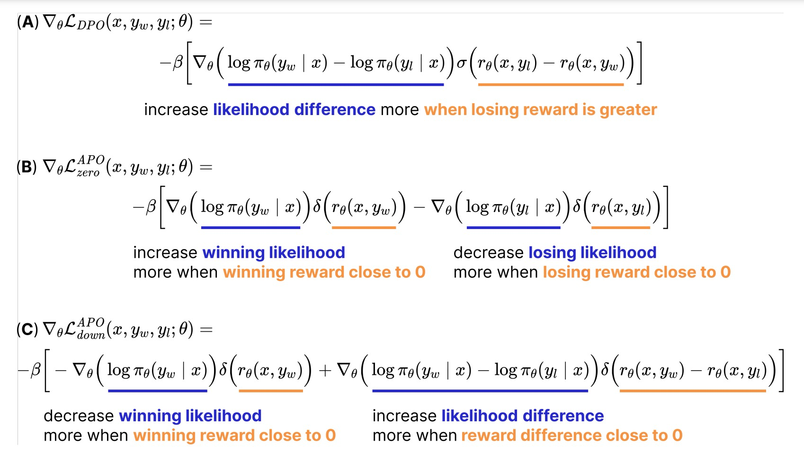

# Anchored Preference Optimization and Contrastive Revisions: Addressing Underspecification in Alignment

摘要：LLM经常使用contrastive alignment objectives and preference pair datasets。
当潜在回答具有对比性时，偏好数据可以提供更好的学习信号；当对齐目标在训练期间指定对模型的更多控制时，它们会带来更好的性能。
提出了Contrastive Learning from AI Revisions：一个数据构建方法能够构建更具有对比性的preference pair;瞄定对比优化目标提供更稳定和可控的对齐目标（有些训练数据集中的win数据质量比lama-3-8B-Instruct更低一些）；
使用Llama-3-8B-Instruct，MixEval-Hard scores作为评测指标；使用APO在32K CLAIR preferences数据上提升了7.65%，同时缩小了45%与GPT-4的差距；

* 构建训练数据对
  yl = M(x)
  yw = Reviser(x, yl)
  这里使用GPT4-turbo来Reviser Llama-3-8B-Instruct。
* baseline (on-policy judge)
  y1, y2 = M(x), M(x)
  yw, yl = Judge(x, y1, y2).
* baseline (off-policy judge) 样本不是由目标模型生成。
  y1, y2 = M′(x), M′′(x)
  yw, yl = Judge(x, y1, y2).
* baseline (Stronger Preferred):
  yl = M(x)
  yw = Stronger(x)
  根据上述四个方法，创建了四个训练数据集。prompt是从UltraFeedback中均匀采样的32K样本； For the off-policy
  judge dataset, we use already judged outputs available in UltraFeedback.（比Llama-3-8B-Instruct弱）

We can assess this directly using some simple heuristics: the Jaccard similarity (token intersection over union) between yw and
yl and the single-character Levenshtein edit distance between yw and yl. The more contrastive a dataset is, the higher the Jaccard similarity should
be and the lower the Levenshtein distance should be.

---

Training Objective

* DPO:
$r_{\theta}=\beta log\frac{\pi_{\theta}(y|x)}{\pi_{ref}(y|x)}$

$$
_{DPO}(x, y_w, y_l; \theta) = -log \sigma (r_{\theta}(x, y_w) - r_\theta(x, y_l))
$$

* APOoffer fine-grained control over each of the rewards, thus controlling the absolute increase or decrease in likelihood during training.
  * APO_ZERO:
    * $L_{zero}^{APO}(x, y_w, y_l; \theta) = - \sigma (r_{\theta}(x, y_w) - \sigma (r_{\theta}(x, y_l)))$
  * APO_DOWN:
    *
    * $$
      L_{down}^{APO}(x, y_w, y_l; \theta) = \sigma (r_{\theta}(x, y_w)) - \sigma (r_{\theta}(x, y_w) - \sigma (r_{\theta}(x, y_l)))
      $$

      

      DPO优化the likelihood difference， 可能是win上升也可能是loss样本下降。

      δ(x) = σ(x)(1 − σ(x)) is a function with a global maximum at x = 0 that tends to 0 for x → ±∞

      考虑到了模型的变化，x的值随着模型训练会不断变化，win越来越大，loss越来越小。
    * If the model is better than the winning outputs (yw ≺ πθ), APO-down will intuitively be a better objective.
    * If winning outputs are better than the model (yw ≻ πθ), APO-zero will be better
* KTO：does not operate on preference pairs, but rather requires only one unpaired answer and a label indicating if it was preferred or not
  * the goal of KTO is to push the winning / losing reward above / below the Kullback–Leibler (KL) divergence between the model during training and the reference model.
  *
