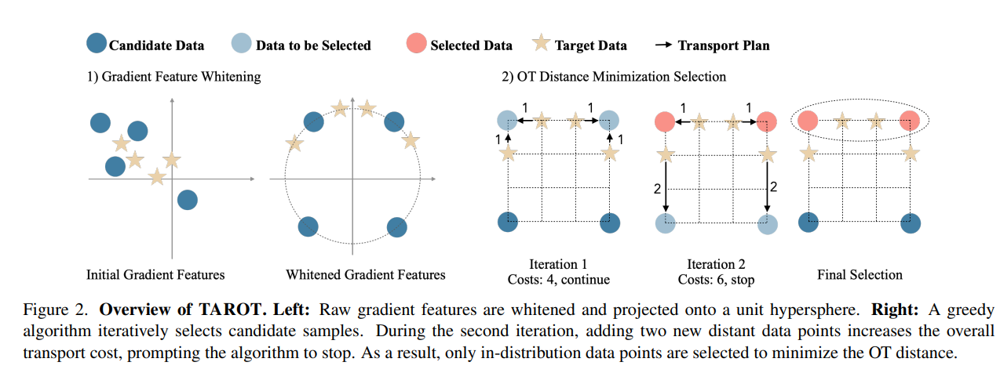

# TAROT: Targeted Data Selection via Optimal Transport

摘要：我们提出了“塔罗特”（TAROT），**这是一个基于最优传输理论的目标数据选择框架。**以往的目标数据选择方法主要使用基于影响的贪婪启发式方法来提升特定领域的性能。这些方法在有限的单峰数据（即遵循单一模式的数据）上表现良好，但随着目标数据复杂性的增加，其有效性会降低。具体而言，在多模态分布中，这些启发式方法无法考虑多种内在模式，从而导致数据选择并非最优。这项工作确定了造成这一局限性的两个主要因素：（i）在高维影响估计中主要特征成分的不成比例的影响，以及（ii）贪婪选择策略中固有的严格线性相加假设。为应对这些挑战，“塔罗特”（TAROT）纳入了白化特征距离，以减轻主要特征偏差，提供一种更可靠的数据影响衡量方式。**在此基础上，“塔罗特”（TAROT）使用白化特征距离来量化所选数据与目标域之间的最优传输距离，并使其最小化。值得注意的是，这种最小化还有助于估计最优选择比例。**我们在多个任务中对“塔罗特”（TAROT）进行了评估，包括语义分割、运动预测和指令微调。结果一致表明，“塔罗特”（TAROT）优于现有最先进的方法，突显了其在各种深度学习任务中的通用性。代码可在https://github.com/vita-epfl/TAROT获取。

---

targeted data selection methods： 目标是从一个候选池里面选择数据，从而在特定的目标任务上最大化模型性能。现有的方法一般使用两阶段的方法：

* influence estimation：which calculates data influence scores between the candidate and target datasets.（候选数据对于目标数据的影响力分数）
* 贪婪启发式：which selects data with the highest average influence scores for the target dataset.

它们在很大程度上依赖于影响函数具有可加性这一假设。这意味着多个训练样本对一个目标样本的影响可以相加。然而，正如胡等人[22]所指出的，尽管这一假设高效且广泛适用，但即使在简单的线性回归场景中也不成立。在某些情况下，可加性假设效果良好的一个主要原因是目标域的分布简单且为单峰，例如大型语言模型中特定领域的问答对。在这些情况下，将影响相加能很好地估计一个候选样本对整个目标数据集的影响程度。在一些复杂的情形，比如多模态情感识别，在这种情况下，累加的影响并不能反映目标分布的多样性，从而降低了其有效性。

为此，我们采用了一种分布匹配的方法来进行目标数据选择。我们首先引入**白化特征距离**（WFD），**这是一种旨在减轻主要特征偏差的影响估计方法**。以白化特征距离作为数据点之间的成对成本估计，我们开发了“塔罗特”（TAROT），这是一个基于最优传输（OT）的目标选择框架。**该方法选择那些能使目标分布与所选样本之间的最优传输距离最小化的数据。**图1展示了我们方法的选择目标。我们选择最优传输的做法也得到了[24]中的研究结果的支持，**该结果表明，在与目标域具有较小最优传输距离的源数据上训练模型可提高特定领域的性能。**  为了验证我们方法的普遍有效性，我们在语义分割、运动预测和指令微调任务上进行了实验。大量结果表明，我们的方法始终优于先前的方法。值得注意的是，在较小但与领域相关的数据集上训练的模型往往优于在较大但相关性较低的数据集上训练的模型。

---

相关工作：

Data Influence Estimation：

* estimate data influence by tracing the gradient descent process.
* datamodels:
  * simple linear datamodels can predict model outputs effectively.
  * a scalable technique for estimating datamodel scores.
  * checkpoint ensembles
  * efficient gradient storage
  * scalable gradient projection

使用梯度来估计训练数据的影响分数：

using a first-order approximation of training dynamics.

每个step的影响力是通过训练该sample后再targe样本上loss的减少量来度量的。这可以通过一阶泰勒展开来估计：

$$
-\eta_t \langle\nabla L(x_i; \theta^t), \nabla L(x; \theta^t)
$$

xi 是候选样本，x是目标样本。

compute the trajectory influence by summing the per-step influences over epochs:

$$
\mathrm{Inf}_{\mathrm{SGD}}(x_i, x) \triangleq \sum_{i = 1}^{N} \bar{\eta}_i \langle\nabla \mathcal{L}(x_{\cdot}, \theta_i), \nabla \mathcal{L}(x_i, \theta_i) \rangle
$$

---

Method:

相比之下，我们将目标数据选择构建为一个分布匹配问题，旨在选择与目标分布紧密匹配的候选数据子集。

使用最优传输估计分布间的距离需要使用一个metric，这里选用的是L2距离作为metric。（By computing distances such as the L2 distance, it provides a viable metric for the OT problem.）

使用T个不同的ckpt（不同的训练epoch数）计算样本的梯度：

$$
\phi (z) = \sum_{t}^{T} \nabla L(z; \theta_{i})
$$

计算不同样本的距离：

$$
d_z (z, z') = || \phi(z) - \phi (z') ||_2
$$

Whitened Feature Distance:

直接计算距离由于梯度特征彼此的相关性会带来比较大的挑战，这种相关性会导致协方差矩阵出现病态，使得某些特征空间方向在距离估计中占据主导地位，并扭曲样本间的关系。此外，不同的梯度分量尺度会使距离度量产生偏差，从而影响距离估计的准确性。为解决这些问题，我们提出了一种将白化（whitening）新颖地应用于梯度特征的方法。**白化能够有效地去除特征间的相关性，并将它们缩放至具有单位方差，从而确保每个特征在距离计算中贡献相同。**

* 随机映射：$\phi(z)_i^{proj} = P^{T} . \phi(z)_i$ 降低梯度的维度。
* 白化：尽管进行了降维处理，但投影梯度仍然存在相关性，从而形成了各向异性的特征空间。为解决这一问题，我们采用乔列斯基（Cholesky）白化来去除特征间的相关性。
* Normalization：whitened gradient vector 归一化到单位长度。

数据选择：

* fixed-size selection for maximizing performance under a limited budget
  * 迭代的添加于目标数据最邻近的N的样本直到达到目标数目
* OT distance minimization selection to find a potentially optimal selection ratio
  * This scheme minimizes the OT distance between the selected data Ds and the target distribution.使用K折交叉验证来避免过拟合。目标数据集\\(D\_t\\)被随机划分为\\(k\\)个大小相等的子集。在每一折（fold）中，\\(D\_t\\)的\\(1/k\\)部分被用于数据选择，而最优传输（OT）距离则是根据剩余的\\((k - 1)/k\\)部分的数据来进行评估的。
