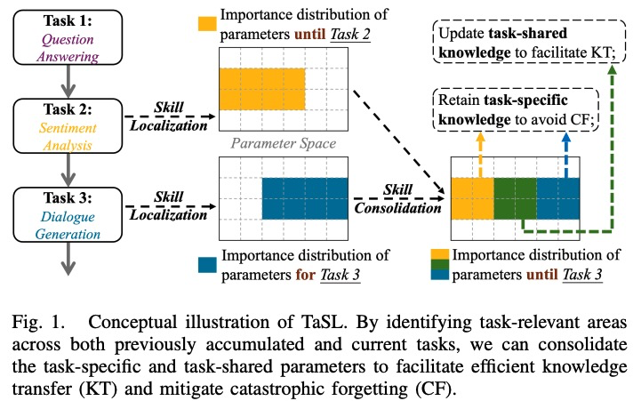
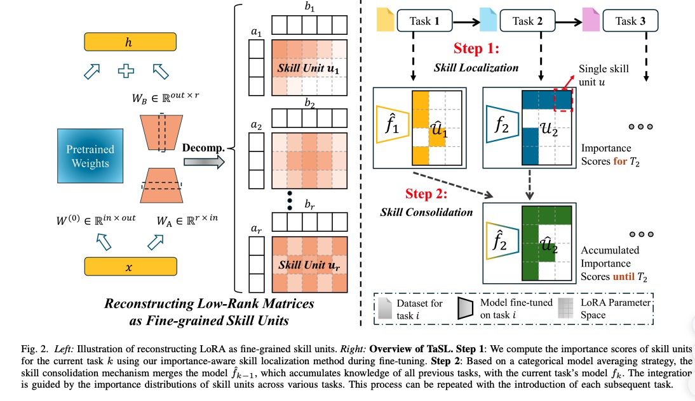
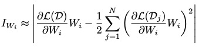
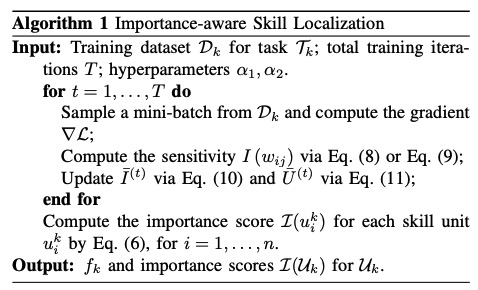
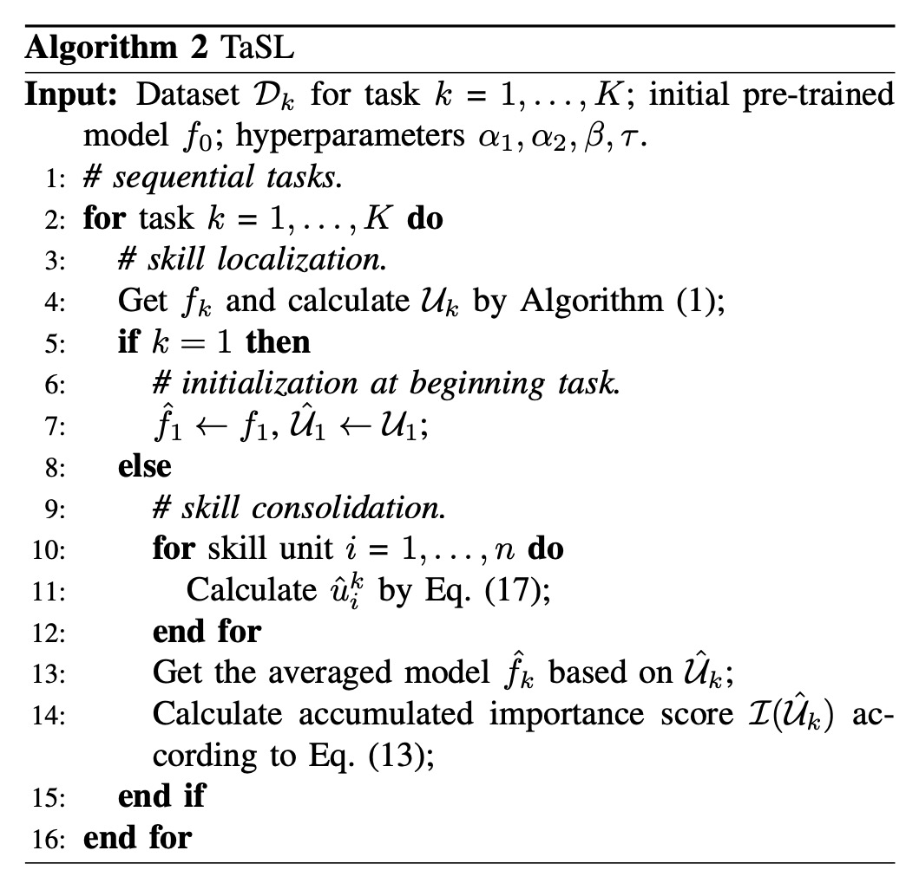

# TaSL: Task Skill Localization and Consolidation for Language Model Continual Learning

问题：如何在动态变化的环境中，让语言模型能够不经过训练就能泛化到不同的任务上？

主要困难是：灾难性遗忘，模型在学习新技能的时候遗忘了之前学习过的知识。

现有方法：使用多参数微调方法，对每一个任务都获取特定的知识，但是这种方法效率不高同时没有考虑到在任务切换过程中的知识迁移。

在这篇论文中：提出了一个新的CL框架，TSLC，在不依赖知识回放的情况下增强知识迁移；首先基于参数依赖将模型划分为不同的“skill units”，能够更细粒度的控制，其次**对于新任务**使用一个新的**分组skill定位方法**来得到skill单元的重要性分布信息；通过将此重要性分布与先前任务的重要性分布进行比较，我们实施了一种细粒度的技能巩固策略，该策略保留了特定于任务的知识，从而防止遗忘，并更新任务共享知识，从而促进双向知识转移。

效果：因此，TaSL 在保留先前知识和在新任务中表现出色之间实现了出色的平衡。TaSL 还表现出很强的通用性，适用于一般模型，并可针对 LoRA 等 PEFT 方法进行定制。此外，它还表现出显著的可扩展性，允许与记忆重放集成以进一步提高性能。在两个 CL 基准上进行的大量实验，模型大小各异（从 220M 到 7B），证明了 TaSL 及其变体在不同设置下的有效性。

---

**Orthogonal Low-Rank Adaptation (O-LoRA) [19] updates parameters via gradient projection in orthogonal subspaces.**

**动机：模型参数对于性能的贡献是不均衡的；**

**不同的数据对于最终指标的贡献也是不均衡的？**

TaSL 最初采用基于群组重要性感知的技能定位技术，该技术利用梯度轨迹来识别参数空间内存储当前任务关键知识的微小区域。**通过将重要性分布与之前的任务进行比较，我们可以区分任务特定区域和任务共享区域，如图 1 所示。**

然后，我们创新的技能巩固阶段将先前任务的权重与当前任务进行分类整合，从而实现有效的知识转移 (KT)，同时最大限度地减少遗忘;

首先重构模型或者PEFT模块将他们组织为‘skill unit’.技能单元是指**模型参数的一个独特子集**，它封装了与特定任务相关的特定功能能力或知识，例如自注意力层内的query矩阵。通过以这种更精细的粒度进行操作，我们可以在单个 PEFT 块中定位和巩固特定于任务的知识和共享知识，而不是像以前的工作那样为每个任务调整单独的 PEFT 块;

During this phase, we promote forward KT by initializing new tasks with previously finetuned weights. For backward KT, we merge knowledge from both current and past tasks into localized task-shared skill units, enhancing their capability. To prevent CF, we preserve the integrity of skill units containing previous task-specific knowledge, ensuring they remain unaffected by new task learning；

---

TasLoRA 根据参数依赖关系将 LoRA 适配器重构为新的技能单元，确保通过顺序任务学习更有效地管理知识。

* We propose a novel Task Skill Localization and Consolidation (TaSL) framework for language model continual learning. By identifying and consolidating task-specific and task-shared knowledge at a granular skill unit level, TaSL achieves effective knowledge transfer and mitigates catastrophic forgetting, overcoming the limitations of previous approaches.
* We develop various group-wise skill localization and finegrained skill consolidation techniques. For instance, the parameter importance metric in skill localization can be based on first-order gradients or a new second-order gradient approximation method. In skill consolidation, our model averaging strategies include a categorical hardmask approach and an adaptive soft-mask method.
* The TaSL framework demonstrates strong generalizability and extensibility. The flexible design of skill units enables TaSL to be easily tailored to PEFT methods, such as LoRA, optimizing performance for specific model architectures. Additionally, TaSL can be integrated with memory replay technique to further enhance performance and adapt to a broader range of application scenarios.
* Extensive evaluation on two CL benchmarks underscores the superiority of our TaSL framework and its variants in facilitating knowledge transfer and mitigating catastrophic forgetting, especially in memory-free scenarios. Furthermore, TaSL consistently excels across diverse model sizes (ranging from 220M to 7B), different model architectures (T5 and LLaMA-2), and unseen tasks.

**相关工作：**

持续学习：

* 基于正则的方法：显示添加正则保持之前task的知识；
* 基于Rehearsal的方法：通过保存旧的训练样本避免灾难性遗忘；
* 基于参数隔离的方法可以动态扩展模型容量，或在整个 CL 过程中为每个任务分配专用的隔离参数，以防止任务之间的干扰；

For instance, the authors in [19] and [34] **constrain the learning of PEFT blocks to maintain orthogonality,** restricting KT among different tasks

Keep Memory: 对于每一个之前的任务都随机选择M个样本放在记忆库中，训练的时候与新任务的样本一起训练。

* skill units:
  * Matrix-Level Skill Unit:在这种划分策略中，我们将技能单元定义为模型中的单独矩阵，例如自注意力层中的查询或关键矩阵，或者LoRA中的A矩阵。
  * LoRA-Tailored Skill Unit:虽然矩阵级划分简单直观，但它没有充分考虑矩阵内冗余和矩阵间依赖性。为了解决这些限制以及近期研究 [19] 中指出的低效率问题（将每个 LoRA 适配器视为特定于任务的知识容器），我们**根据针对 LoRA 量身定制的参数依赖性将模型矩阵分解为新的、更细粒度的“技能单元”。**

对每个Lora的参数矩阵A和B都添加了对应的正交正则损失项；

---

**Importance-aware Skill Localization**

to estimate the importance of Wi , we calculate the change in loss when the parameter is zeroed out using(泰勒展开)：

一阶+二阶：通过Fisher信息矩阵来逼近二阶的Hessian矩阵；

通过minibatch更新重要性分数。

求每个block的平均重要性分数（block里面每个权重重要性分数的平均）

将所有先前任务的分数转换为迭代的累积分数，无需单独保存过去的任务分数；

I(Uˆ k−1) = βNorm(I(Uˆ k−2)) + (1 − β)Norm(I(Uk−1))

Norm将score归一化到0-1；

接下来，任务 Tk−1 之前的技能单元的重要性分布与当前任务 Tk 的重要性分布相结合，以促进技能巩固过程。

**Skill Consolidation**

fine-grained averaging strategies：

* task-shard
* task-specitic

**Static Weighted Consolidation**

设定重要性阈值来选择最重要的20%的skill units；

**Adaptive Weighted Consolidation**

使用记忆重放：

在计算重要性权重后，训练新task之前使用历史的数据，进行训练，训练的时候，固定当前任务特有的参数，只训练之前任务的参数；

---

实验benchmark: SuperNI

15个task用于评测，每个task 1000个训练样本， 100个样本用于验证和测试；

---

Long Sequence Benchmark：

15个分类的训练数据集：
