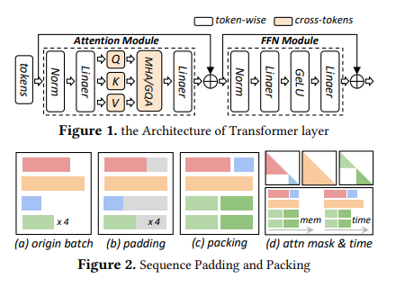
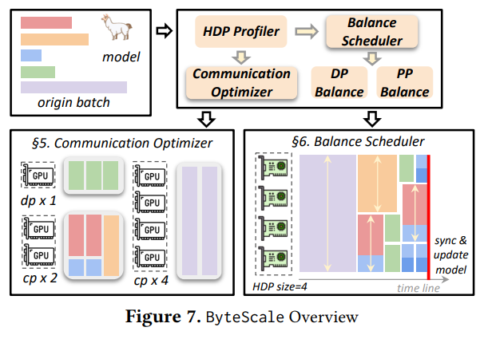

# ByteScale: Efficient Scaling of LLM Training with a 2048K Context Length on More Than 12,000 GPUs

对于大型语言模型（LLM）而言，扩展长上下文处理能力至关重要。在长上下文训练中，为了在多个设备之间分摊内存消耗，通常会使用数据间划分（又称数据并行）和数据内划分（又称上下文并行）这两种方法。当前的训练框架大多将这两种技术视为相互独立的，并建立静态通信组，将设备组织成一个静态网格（例如二维网格）。

然而，无论对于文本、多模态数据还是强化学习，用于大型语言模型训练的序列长度通常各不相同。数据的异构性与静态网格之间的不匹配会导致冗余通信和计算负载不均衡，从而降低训练效率。

在这项工作中，我们引入了 ByteScale，这是一个高效、灵活且可扩展的大型语言模型训练框架，适用于长序列和短序列的大规模混合训练。ByteScale 的核心是一种全新的并行策略，即**混合数据并行（HDP），它通过动态网格设计将数据间划分和数据内划分统一起来。**

具体而言，我们构建了一个通信优化器，它通过**感知数据的分片方式和动态通信来消除短序列的冗余通信**，并通过选择性卸载进一步压缩长序列的通信成本。此外，我们还开发了一个平衡调度器，通过感知并行性的数据分配来缓解计算负载不均衡的问题。

我们在一个拥有超过 12000 个 GPU 的生产集群上，对模型规模从 70 亿参数到 1410 亿参数、上下文长度从 256K 到 2048K 的情况进行了 ByteScale 的评估。实验结果表明，ByteScale 的性能比当前最先进的训练系统高出最多 7.89 倍。

特别是，数据的异构性与静态系统设计之间的不匹配带来了两个主要挑战（详见第3节）。

1. **冗余通信**：常见的做法是将较短的序列[22]打包成一个长度达到上下文长度的单一序列，并配置足够的上下文并行（CP）规模，以防止出现内存溢出（OOM）错误。然而，即使不必要，所有短序列也必须经历与长序列相同的划分和通信过程。更糟糕的是，上下文并行需要进行O(S^{2})量级的计算来重叠O(S)量级的通信，这对于短序列来说是一个挑战。
2. **计算负载不均衡**：尽管通过上下文并行，标记在各个设备上被均匀划分，并且内存也实现了平衡，但执行时间仍然会有所不同。这是因为每个标记的计算复杂度与原始序列长度相关，其量级为O(S^{2}))。计算负载不均衡会导致一些设备因同步而进入空闲状态。

贡献总结。为了应对上述挑战，我们提出了ByteScale，这是一个高效、灵活且可扩展的训练框架，专为长序列和短序列的大规模混合训练而设计。主要贡献如下：

C1：混合数据并行策略的提出。我们提出了一种全新的并行策略，即混合数据并行（HDP），它将数据间划分（数据并行，DP）和数据内划分（上下文并行，CP）统一起来，并定义为在各个设备间均匀分配标记。它可利用数量在\\([1, DP×CP]\\)范围内的设备，灵活地处理可变长度的序列。

C2：通信优化。为了消除短序列的冗余通信，混合数据并行（HDP）提供了数据感知分片的能力，能够自动构建动态通信组，并且每个序列将由最少数量的设备单独进行处理。此外，混合数据并行（HDP）还提供了选择性卸载功能，以进一步压缩长序列的通信成本。

C3：平衡策略。为了缓解计算负载不均衡的问题，我们设计了一种启发式算法，该算法基于数据特征和流水线并行的特点，重新组织数据分配。此外，对于那些执行时间较短的设备，我们会分配更多的微批次数据，而不是像静态系统设计中那样分配相同数量的数据。

C4：评估。我们在一个拥有超过12000个GPU的生产集群上进行了实验，将模型规模从70亿参数扩展到1410亿参数，上下文长度从256K扩展到2048K。

---

Redundant Communication:

例如，假设每个设备的处理能力为8000个标记，要训练一个上下文长度为100万个标记的大型语言模型，就需要上下文并行度达到128。这种配置要求使用128个独立的设备来处理一个长度为100万个标记的序列。与此同时，大量较短的序列，比如长度为4000、8000和16000个标记的序列，会被打包成长度为100万个标记的序列，并在一个由128个设备组成的上下文并行组中进行处理。  如图14所示，打包序列中的每个子序列都需要在上下文并行的各个设备（共128个设备）间被划分为128个数据块，并进行**环形的端到端**（P2P）通信。实**际上，对于长度小于8000个标记的序列，进行跨设备的划分和通信是没有必要的。对于长度为16000个标记的序列，只需要两个上下文并行的设备（即并行度为2）就足够了(attention mask 这些数学不需要attented到其他的序列)**。对这些较短的序列使用与最大长度序列相同的上下文并行度，会导致过多的冗余通信。**当序列长度差异非常大时，这个问题会更加严重。**

---

Imbalanced Computation**浮点运算量不均衡。**尽管Flash Attention（快速注意力机制）能够实现具有O(S)内存复杂度的线性打包方式，但每个子序列的计算复杂度仍然是O(S^{2})。如图2(d)和图3(c)所示，**即使两个打包后的序列包含相同数量的标记，它们实际的计算工作量也是不同的，这与注意力掩码的面积成正比。**  如图6(a)所示，当上下文长度小于8000个标记时，O(S^{2})这一项的影响相对较小，此时打包操作能够有效地在内存和计算方面平衡工作量。然而，对于长上下文训练任务来说，O(S^{2})这一项成为了计算的主要部分，这导致不同打包序列之间存在显著的时间不均衡问题。

为了给出一个直观的解释，我们从GitHub数据集中采样了一批总量为120万个标记的全局数据，并将它们随机打包成最大长度为32000个标记的微批次数据，使其与模型的上下文长度一致。如图6(b)所示，我们记录了每个微批次的浮点运算次数（FLOPs，即Floating Point Operations），并观察到了显著的差异，这表明每个微批次的执行时间也各不相同。

Imbalanced Data and Pipeline Parallelism：

各个微批次之间执行时间的不均衡，进一步降低了数据并行和流水线并行的效率。在数据并行中，所有数据并行的设备（DP ranks）都必须执行相同数量的微批次，然后在模型更新之前同步梯度。  如图3(c)所示，设备2（rank-2）处理的标记所涉及的浮点运算量（FLOPs）比设备0（rank-0）少，这就导致设备2在等待同步时出现空闲时间（即数据并行气泡，DP Bubble）。  在流水线并行中，存在两种类型的 “气泡”：流水线气泡（PP bubble）出现在单个流水线内部，而**数据并行气泡（DP bubble）则出现在不同的流水线之间（不同的数据并行组）**。除了在预热和冷却阶段出现的流水线气泡外，微批次之间浮点运算量的不均衡，使得不同设备上的执行时间无法像理想的流水线那样重叠。  这就导致了因阶段间等待而产生的额外流水线气泡，如图5所示。**此外，由于每个微批次在流水线的d_{pp}个不同阶段依次执行，任何数据并行气泡都会被放大d_{pp}倍。**  例如，考虑图5中所示的两条流水线，流水线(a)中的微批次0和7，与流水线(b)中的微批次相比，其前向和后向执行时间更长。在d_{pp}=4的情况下，这个时间差会被放大四倍。因此，在执行完8个微批次后，流水线(b)会进入较长的空闲期，等待梯度同步。这使得数据并行气泡占总执行时间的比例超过30%，远远超出了正常的流水线气泡时间。

---

ByteScale Overview：

如图7所示，它主要由三个部分组成。性能分析器（Profiler）用于对环境、模型配置、数据分布进行分析，并为其他组件构建成本模型。通信优化器（Communication Optimizer）旨在通过数据感知分片、动态通信和选择性卸载来提高短序列和长序列的通信效率。平衡调度器（Balance Scheduler）则通过感知并行性的数据分配来解决计算负载不均衡的问题。

Communication Optimizer:

First, it reduces redundant communication for short sequences by dynamic sequence sharding and communication. Second, it further compresses the communication cost for long sequences by selective offloading.

Data-Aware Sharding and Communication:

Hybrid Data Parallelism.

HDP can use 96 ranks to handle a 768K sequence while use rest 32 ranks to handle 32 × 8K sequences individually.

---
