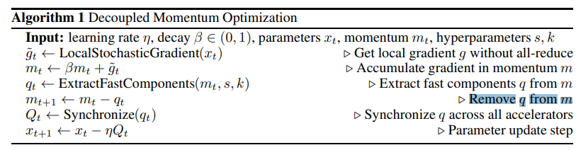

# DeMo: Decoupled Momentum Optimization

摘要：训练大型神经网络通常需要通过专门的高速互连设备在各个加速器之间共享梯度。**借鉴频率分解和能量压缩的信号处理原理，我们证明了在训练期间同步完整的优化器状态和模型参数是没有必要的**。通过解耦动量更新，并允许加速器之间的优化器状态出现可控的差异，与目前最先进的优化器相比，我们实现了更好的收敛效果。

我们引入了 “解耦动量（Decoupled Momentum，简称 DeMo）”，这是一种融合优化器和数据并行算法，它能**将加速器之间的通信需求降低几个数量级。这使得即便在网络带宽有限以及硬件异构的情况下，也能够对大型神经网络进行训练**。我们的方法与拓扑结构无关，也不依赖于特定的架构，并且支持可扩展的时钟同步分布式训练，计算和内存开销可以忽略不计。

实证结果表明，使用 DeMo 训练的模型能够达到甚至超越使用 AdamW 训练的同等模型的性能，而且在预训练大规模基础模型时，无需使用高速互连设备。一个开源的参考性 PyTorch 实现已发布在 GitHub 上，网址为[https://github.com/bloc97/DeMo](https://github.com/bloc97/DeMo)。

在本文中，我们证明了在大型神经网络训练过程中，梯度和优化器状态存在显著的冗余性，并且具有很高的可压缩性。基于这一见解，我们开发了“解耦动量（DeMo）”优化器，该优化器利用这种可压缩性将加速器之间的通信需求降低了几个数量级。

---

人们已经开发出了各种各样的策略来减少分布式训练中的通信开销。对于集中式且时钟同步的训练而言，最有效的技术可被归为三大主要方法：

* Quantization and sparsification of gradients

  先前的一些工作，比如文献[10]中所涉及的，主要通过量化和稀疏化的方式来探究梯度的可压缩性，其前提假设是梯度值之间相互无关联，并且能够容忍压缩误差。然而，基于量化的方法面临着一些根本性的局限：一个16位的梯度所能压缩到的最小位数不会少于1位。尽管从理论上来说，稀疏化可提供无限制的压缩，但要在不降低训练性能的情况下实现高压缩比仍然颇具挑战性，这使得它更适用于微调（fine-tuning）而非预训练（pre-training）阶段。
* Low-rank projection of gradients

  近期的工作 [12] 表明，大型语言模型（LLM）的梯度在训练过程中呈现出极低秩的结构。这使得可以利用奇异值分解（Singular Value Decomposition，SVD）将梯度投影到低维空间中，该低维空间保留了最显著的方向，从而大幅减少了存储及通信方面的需求。

  然而，针对超大型模型计算奇异值分解的计算成本很高，而且投影矩阵必须在各个节点之间共享或者重新计算。尽管可以通过降低计算奇异值分解的频率来减少这部分开销，但它仍然是一个重大瓶颈，并且随着模型规模的增大，其扩展性很差。

  尽管如此，这种方法在实现与满秩优化器同等收敛性方面取得的成功提供了宝贵的见解：低秩投影相较于稀疏化具有优势，值得进一步深入研究。
* Federated averaging (also known as Local-SGD)

  联邦平均算法（Federated averaging，[7]）通过允许各节点在通过权重平均进行同步之前独立训练多个步骤的方式来减少通信量。从本质上讲，每个加速器节点会独立训练固定的步数，然后通过对它们的权重取平均值来实现加速器节点之间的同步。  虽然这种方式消除了每步都要进行梯度通信的需求，但在同步阶段它仍然需要共享完整的模型参数，由此产生的带宽成本与标准训练相当。此外，增加同步间隔的步数会产生一种根本性的权衡：步数增多虽能减少通信量，但会减慢收敛速度。这就导致要么是迭代速度快但收敛效果差，要么是收敛效果好但迭代速度慢得让人难以接受。

---

我们提出了一种全新的解耦动量优化算法，该算法有意允许并利用各个加速器之间不同的优化器状态，而非对现有的优化算法进行渐进式修改。

Assumptions：

我们的方法基于三个关键推测，尽管目前这些推测缺乏正式的证明，但得到了大规模神经网络训练中的经验证据的支持：

推测3.1：动量中快速变化的分量呈现出较高的空间自相关性，其大部分能量集中在少数几个主成分上。

推测3.2：快速变化的动量分量在时间维度上的方差较低，应当立即应用于参数更新，而慢速变化的分量在时间维度上呈现出较高的方差，从较长时间段的时间平滑处理中获益。

推测3.3：慢速变化的动量分量尽管方差较高，但对于长期收敛至关重要，应当予以保留，而不应被滤除。

我们将对这些推测的正式证明留待后续工作去完成，但要强调的是，我们所提出的优化器是在考虑了所有这些假设的基础上构建的。我们希望通过提出这一新颖的方法，能够有助于在未来的研究中进一步拓展这些思路。这需要我们大胆地进行设想。

方法：

从带动量的随机梯度下降（SGD with Momentum）算法开始，我们做了两项关键的修改：首先，我们去掉了针对梯度\\($\tilde{g}_{k}$\)的全局归约（all-reduce）操作，从而在各个加速器之间解耦动量m。其次，在更新动量之后，我们提取并去除其快速变化的分量q，这些分量能够以极少的通信量实现高效同步。

m_{t+1} <- m_t - q_t 去除快速变化的分量，保留慢更新的分量。

我们的目标是高效地识别并提取最关键的动量分量，同时尽量减少计算开销。尽管存在最优分解方法，但对于大规模训练，我们更优先考虑实际效率。

为使我们的方法奏效，在训练期间，我们必须首先对动量进行去相关、分离以及提取主成分的操作。假设推测3.1成立，一种做法是应用空间的柯桑比 - 卡亨南 - 洛厄夫变换（Kosambi–Karhunen–Loève Transform，KLT），以便将变化较快的分量与变化较慢的分量分离开来。然而，针对拥有数十亿甚至数万亿参数的神经网络的动量张量来计算KLT，其计算成本高得令人难以承受。

或者，从信号处理相关工作中获取灵感，**离散余弦变换**（Discrete Cosine Transform，DCT）可以充当柯桑比 - 卡亨南 - 洛厄夫变换（KLT）的一种近似方法。

离散余弦变换（DCT）为我们的目的提供了一种对理论最优的柯桑比 - 卡亨南 - 洛厄夫变换（KLT）的出色实用近似，具有三个关键优势：首先，DCT具有高度并行性，在现代图形处理单元（GPU）上计算速度极快。此外，它作为一种可分离变换，确保了其计算复杂度对于二维、三维甚至n维信号呈线性增长。最后，DCT具有固定的正交基，这意味着无需任何辅助信息就可以完美解码经DCT编码的信号；其变换矩阵及其逆矩阵是预先已知的。尽管并不完美，但这种近似使得大规模实际实现成为可能。如果推测3.1成立，那么离散余弦变换（DCT）应该能够有效地从我们的动量中提取快速变化的分量，因为我们假定动量在空间上是自相关的。从经验角度来看，我们发现仅靠离散余弦变换（DCT）就足以对主成分进行充分近似了。

---

在此，我们实际上是在每一步对动量中所有快速变化的分量进行平均，同时让慢速变化的分量彼此解耦。如果我们假定梯度中的慢速变化分量具有较高方差，那么它们会随着时间在动量中不断累积。如此一来，慢速变化的分量在强度上会逐渐超过快速变化的分量，然后从动量中传递并被去除。由此，我们可以得出结论：慢速变化的分量会与快速变化分量的即时传递一同逐渐被传递。
