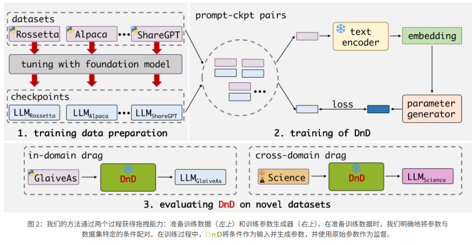

# Drag-and-Drop LLMs: Zero-Shot Prompt-to-Weights

摘要：Drag-and-Drop LLMs (DnD), a prompt-conditioned parameter generator that eliminates per-task training by mapping a handful of unlabeled task prompts directly to LoRA weight updates. A lightweight text encoder distills each prompt batch into condition embeddings, which are then transformed by a cascaded hyperconvolutional decoder into the full set of LoRA matrices. Once trained in a diverse collection of prompt-checkpoint pairs, DnD produces task-specific parameters in seconds, yielding i) up to 12,000× lower overhead than full fine-tuning, ii) average gains up to 30% in performance over the strongest training LoRAs on unseen common-sense reasoning, math, coding, and multimodal benchmarks, and iii) robust cross-domain generalization despite never seeing the target data or labels. 将未标注的任务prompt直接映射到Lora的参数更新上，使用一个轻量化的文本编码器，将每个prompt batch 编码为条件embedding，之后通过hyperconvolutional decoder 编码为一系列的LoRA matrics.在经过收集的prompt-checkpoint pair训练之后，DnD 能够在数秒钟内产生对应任务的参数，且在未见过的常识推理、数据、代码和多模态基准上平均能获得30%的表现提升。尽管在从未见过的目标数据和标签上也表现出强的泛化能力。

**我们观察到，LoRA 适配器只不过是其训练数据的函数：梯度下降将基础权重“拖拽”到特定任务的最优值。如果这种从提示到权重的映射能够直接学习，我们就可以完全绕过梯度下降。**



基于这些见解，我们建议拖放LLM即可生成特定于任务的权重而无需调整。我们首先在各种数据集上训练和保存 LoRA 适配器。为了开发“拖放”功能，我们合并了来自这些数据集中的提示，并将它们与收集的检查点随机配对，以形成 DnD 的训练数据：提示-参数对。生成器是一个由级联卷积块组成的解码器。在训练期间，我们使用现成的文本编码器来提取提示嵌入并将其输入到生成器中。生成器输出模型权重作为预测，我们使用生成的模型权重和原始模型权重之间的 MSE 损失来优化它。在推理过程中，我们只需将来自新数据集（训练期间未见过）的提示输入到DnD，即可通过一次前向传递获得定制的参数。

```
在探讨上述问题之前，我们先分析一下潜在的挑战。
挑战 1：如何使参数生成器具备有效的“拖放”功能？生成器应该生成能够有效使 LLM 适应特定任务的参数。
挑战 2：如何在无需针对特定任务进行训练的情况下实现自适应？传统的 PEFT 方法通常需要在新任务上进行训练，但我们能否通过直接生成参数而无需对目标任务进行任何微调来实现类似的性能？
挑战 3：如何使拖放功能更加用户友好且易于访问？生成机制应该简单直观，以便于更广泛的采用和实际部署。
```
