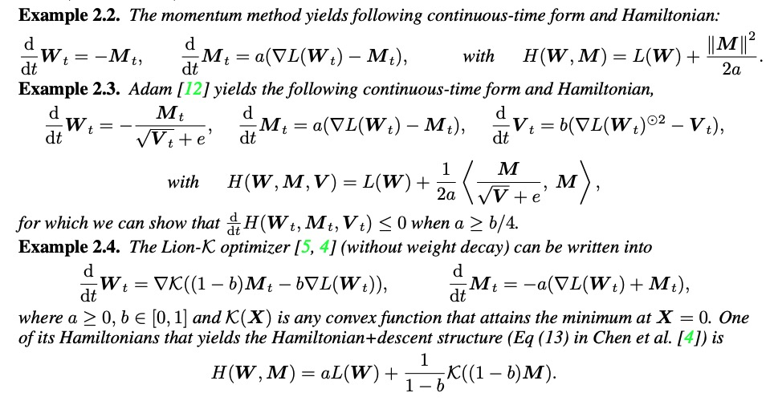
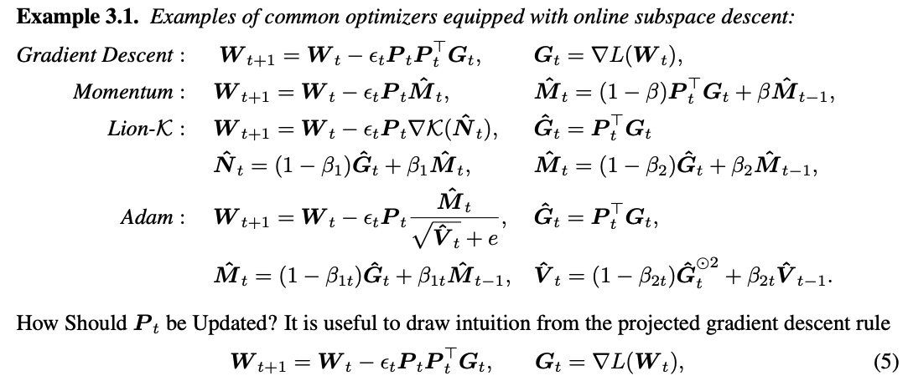
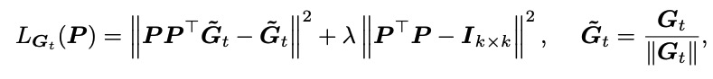
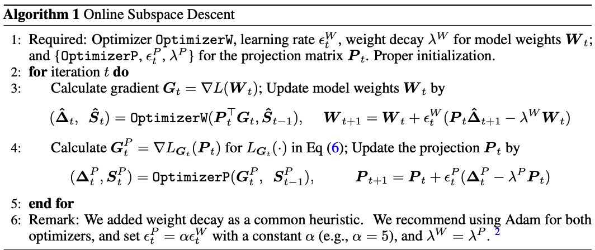

# Memory-Efficient LLM Training with Online Subspace Descent

摘要：memory-efficient LLM training algorithms，这些方法利用梯度的low-rank结构使用由SVD分解得到的投影矩阵将优化器状态投影到一个子空间中。但是这些方法的收敛性高度依赖于投影矩阵的更新方式。**这项工作为投影矩阵的任意更新规则提供了一个收敛保证。**这种保证一般适用于可以用**哈密顿下降法**分析的优化器，包括最常见的优化器，例如 LION、Adam。

```
Hamiltonian Descent是一种优化算法，结合了哈密顿动力学的原理与梯度下降方法。它主要用于高维空间中的优化问题，尤其是在机器学习和统计建模中。该方法通过模拟物理系统的运动来寻找目标函数的最小值。

主要特点：
哈密顿动力学：Hamiltonian Descent利用哈密顿方程来描述系统的状态，状态由位置和动量组成。通过这种方式，算法能够在参数空间中进行有效的探索。

动量更新：与传统的梯度下降方法不同，Hamiltonian Descent引入了动量的概念，使得优化过程更加平滑，能够更快地收敛到最优解。

高效性：在处理复杂的损失函数时，Hamiltonian Descent能够更好地避免局部最小值，并在高维空间中表现出更好的性能。

应用广泛：该算法在深度学习、贝叶斯推断等领域得到了广泛应用，尤其是在需要高效优化的场景中。

总结
Hamiltonian Descent是一种创新的优化方法，通过结合物理学的原理与传统的优化技术，提供了一种高效的解决方案，适用于复杂的高维优化问题。
```

通过理论分析，提出了Online Subspace Descent，一种不需要SVD的子空间梯度下降优化器，与使用特征向量来更新投影矩阵不同，这类方法使用在线PCA（核心思想是通过增量更新的方式来计算主成分，而不是一次性处理整个数据集。它利用了协方差矩阵的特性，通过逐步引入新样本来更新主成分（更新均值，更新协方差矩阵，更新主成分）。）。在C4数据集上预训练了60M到7B参数量的LLama系列模型，该方法与其他优化方法相比取得了更低的困惑度和更好的下游任务表现。

**问题-理论-新方法-实验验证**

---

核心问题：how to balancing the computational efficiency with model performance? 在不影响模型能力的情况下优化内存使用？

近期的一些方法：Stochastic Subspace Descent， LoRA， ReLoRA， Gradient LowRank Projection (GaLore)， Sketchy. 利用定期更新的低秩投影矩阵来管理参数更新.

GaLore and Sketchy使用SVD来构建投影矩阵，stochastic subspace descent 使用随机矩阵，并且提供了在凸目标函数上的收敛性分析；但是目前来说还没有能够提供这类方法在非凸优化上的收敛保证；

we introduce a novel family of memory-efficient optimizers named Online Subspace Descent, which incorporates a dynamically changing projection matrix, replacing the conventional periodic updating approach (SVD) with online PCA.

---

优化问题：

最小化：$min_{w}L(W)$

一些符号：$<A, B>=tr(A^{T}B)$表示矩阵A，B的内积；$||A||^{2}=tr(A^{T},A)$表示A的Fribenius norm. $A \odot B$表示A与B的element wise product。

一些优化器的更新规则：

* 梯度下降：$W_{t+1}=W_t -\epsilon_t\nabla L(W_t)$
* Momentum:$W_{t+1}=W_t - \epsilon_t M_t$, $M_t = (1- \beta)\nabla L(W_t) + \beta M_{t-1}$
* Lion_k: $W_{t+1} = W_t - \epsilon_t \nabla K(N_t)$, $N_t=(1-\beta_1)\nabla L(W_t)+\beta_1M_t$,$M_t=(1-\beta_2)\nabla L(W_t)+\beta_2M_{t-1}$
* Adam: $W_{t+1} = W_t - \epsilon_t \frac{M_t}{\sqrt{V_t} + e}$, $M_t=(1-\beta_{1t}\nabla L(W_t)+\beta_{1t}M_{t-1}$,$V_t=(1-\beta_{2t} \nabla L(W_t)^{\odot2}+\beta_{2t}V_{t-1}$

其中$\epsilon_t$指的是更新步长。M_t和V_t指的是一阶和二阶动量。β, β1, β2 动量系数。 K 任意凸函数 with ∇K(0) = 0 for Lion-K， Lion  uses K(X) = ∥X∥1,1 and ∇K(X) = sign(X).

其中M_t和V_t的size都和权重一样，这导致了优化过程中的高内存消耗。

Hamiltonian+Descent：研究优化器动态特性的一种有效方法是在无限小步长的限制下检查它们的连续时间ODE形式，连续时间形式可以更清晰地了解算法的渐进收敛性，抽象出步长、离散化和随机误差的选择。好的优化器应该能够在使用足够小的步长的时候保证收敛到局部最小值。（将离散优化算法（如梯度下降）视为连续时间的动力系统，通过常微分方程（ODE）来描述其行为。这种视角有助于理解优化器的收敛性和稳定性，尤其是在使用小步长时。）

连续时间下的优化器：



**Memory-Efficient Optimizers via Online Subspace Descent**

静态子空间下降：

$$
min_{w^{-}}L(PW^{-})
$$

参数更新：$W_{t+1} = W_t + P ϕ_t(S^{t}), S^t = ψ_t(S^{t−1}, P^{T} ∇L(W_t))$

$∇_Wˆ L(PWˆ ) = P^⊤∇_W L(W)$

优化器状态S的大小与w-成正比所以有效的压缩优化器状态的大小，节省训练过程中的内存消耗。

Online子空间下降，保持映射矩阵P更新：

$$
W_{t+1} = W_t + P_t ϕ_t(S^{t}), S^t = ψ_t(S^{t−1}, P_t^{T} ∇L(W_t)); P_{t+1} = f(P_t, W_t, S^{t})
$$

P的更新可以与W和S并行，所以不会造成速度损失。



使得：$P_{t}P_{t}^{T}G_t$ 尽可能的逼近 Gt：

* 每T个step在Gt上执行一次SVD更新P：Pt, \_, \_ = torch.linalg.svd(GT⌊t/T⌋)
* 在时间t通过最小化PCA的目标函数更新P：
  * 
    辅助loss使得P正交同时normalizes G_t增加训练稳定性；
* 为了高效计算，在训练中只执行一次梯度下降来更新P；

**A key question is whether we can develop a theoretical framework to understand how Pt impacts the optimizer’s convergence behavior and provide guidance for the design of the update rules of Pt.**



**Hamiltonian Descent Meets Subspace Descent: A Lyapunov Analysis**

* 使用Online Subspace Descent，当Pt的更新规则 has a smooth continuous-time limit时能够保持the Hamiltonian+descent structure.因此，在非常温和的条件下，配备 Adam 和 Lion 等常见优化器的在线子空间下降会自动产生 Lyapunov 函数，从而实现良性连续时间收敛。
* 在线子空间优化器保证在连续时间内收敛到损失 L(W) 的驻点;

Experiment：

* Why do we Need Online Subspace Descent?
  * better convergence and lower overhead
