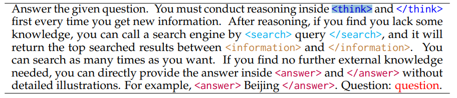
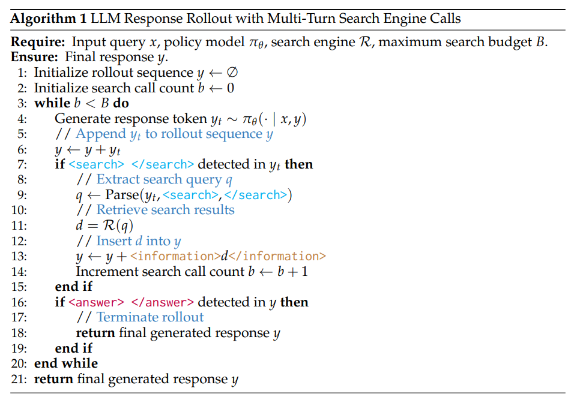

# Search-R1: Training LLMs to Reason and Leverage Search Engines with Reinforcement Learning

**摘要：**对于大型语言模型（LLM）而言，高效获取外部知识和最新信息是进行有效推理和文本生成的关键。在检索增强和工具使用的训练方法中，**将搜索引擎视为一种工具**，但这些方法要么缺乏复杂的多轮检索灵活性，要么需要大规模的监督数据。在推理过程中提示具有推理能力的先进大型语言模型去使用搜索引擎也并非最佳选择，因为大型语言模型并没有学会如何以最优方式与搜索引擎进行交互。  本文介绍了SEARCH-R1，它是DeepSeek-R1模型的扩展。在该模型中，**大型语言模型仅通过强化学习（RL），就能在逐步推理过程中，结合实时检索，自主生成（多个）搜索查询。** SEARCH-R1利用检索到的标记掩码来实现稳定的强化学习训练，并采用一个简单的基于结果的奖励函数，通过多轮搜索交互来优化大型语言模型的展开过程。  在七个问答数据集上进行的实验表明，与当前最先进的基线模型相比，SEARCH-R1使Qwen2.5-7B模型的性能提升了26%，使Qwen2.5-3B模型提升了21%，使LLaMA3.2-3B模型提升了10%。本文还进一步提供了关于强化学习优化方法、大型语言模型选择，以及在检索增强推理中回复长度动态变化方面的实证见解。

问题：然而，基于提示的方法通常难以实现泛化，因为在大型语言模型（LLM）的预训练过程中，可能并未遇到某些特定任务。另一方面，基于训练的方法具有更强的适应性，但这类方法依赖于大规模、高质量的经过标注的搜索与推理交互轨迹数据，这使得它们难以有效地进行扩展。

**然而，将强化学习（RL）应用于搜索与推理场景存在三个关键挑战：**

（1）强化学习框架与稳定性——目前仍不清楚如何在确保稳定优化的同时，有效地将搜索引擎整合到大型语言模型的强化学习框架中，尤其是在纳入检索到的上下文信息时。

（2）多轮交错式推理与搜索——理想情况下，大型语言模型应能够进行迭代推理并调用搜索引擎，根据问题的复杂程度动态调整其检索策略。

（3）奖励设计——为搜索与推理任务设计一个有效的奖励函数并非易事，因为传统的奖励设定方式可能无法很好地适用于这一新范式。

为了应对这些挑战，我们引入了 SEARCH-R1，这是一种全新的强化学习（RL）框架，它使大型语言模型（LLM）能够在自身推理的同时，以交错的方式与搜索引擎进行交互。具体而言，SEARCH-R1 引入了以下关键创新点：

（1）我们将搜索引擎建模为环境的一部分，从而实现了让大型语言模型生成标记的序列与搜索引擎检索操作交错进行的展开序列。SEARCH-R1 与包括近端策略优化（PPO）和广义近端策略优化（GRPO）在内的各种强化学习算法兼容，并且我们采用了检索标记掩码技术，以确保优化过程的稳定性。

（2）SEARCH-R1 支持多轮检索和推理，其中搜索调用由$<search>$和$</search>$标记明确触发。检索到的内容被包含在$<information>$和$</information>$标记之间，而大型语言模型的推理步骤则被封装在$<think>$和$</think>$标记内。最终答案使用$<answer>$和$</answer>$标记进行格式化，从而实现结构化的、迭代式的决策过程。

（3）我们采用了一种简单直接的基于结果的奖励函数，避免了基于过程的奖励函数的复杂性。我们的研究结果表明，这种极简的奖励设计在搜索与推理场景中是有效的。SEARCH-R1 可以被视为 DeepSeek-R1（郭等人，2025 年）的扩展，后者主要通过引入搜索增强的强化学习训练来聚焦于参数推理，以增强基于检索的决策能力。

总之，我们的主要贡献体现在三个方面：

- 我们明确了在大型语言模型结合搜索引擎调用进行推理时应用强化学习所面临的挑战。
- 我们提出了 SEARCH-R1，这一全新的强化学习框架支持大型语言模型的展开过程以及与搜索引擎相关的强化学习优化，其中包括用于稳定强化学习训练的检索标记掩码技术、支持复杂任务解决的多轮交错式推理与搜索，**以及一个简单而有效的基于结果的奖励函数。**
- 我们进行了系统的实验，以证明 SEARCH-R1 的有效性。与当前最先进的基线模型相比，在使用三个不同的大型语言模型时，SEARCH-R1 的平均相对性能提升分别达到了 26%、21%和 10%。此外，我们还提供了关于在推理和搜索场景中应用强化学习的见解，包括强化学习方法的选择、不同大型语言模型的选择以及对回复长度的研究。

检索到的标记的损失掩码处理。在近端策略优化（PPO）和广义近端策略优化（GRPO）中，标记级别的损失是在整个展开序列上进行计算的。在SEARCH-R1中，展开序列既包含大型语言模型（LLM）生成的标记，也包含从外部文本段落中检索到的标记。虽然对大型语言模型生成的标记进行优化可以提升模型与搜索引擎交互以及进行推理的能力，但对检索到的标记应用同样的优化可能会导致意外的学习动态变化。  为了解决这个问题，我们引入了针对检索到的标记的损失掩码处理，确保策略梯度目标仅在大型语言模型生成的标记上进行计算，同时将检索到的内容排除在优化过程之外。这种方法在保持搜索增强生成灵活性的同时，稳定了训练过程。

Text Generation with Interleaved Multi-turn Search Engine Call:

训练集样例：

Reward Modeling:

To train SEARCH-R1, we adopt a rule-based reward system that consists solely of final outcome rewards, which assess the correctness of the model’s response. For instance, in factual reasoning tasks, correctness can be evaluated using rule-based criteria such as exact string matching.
