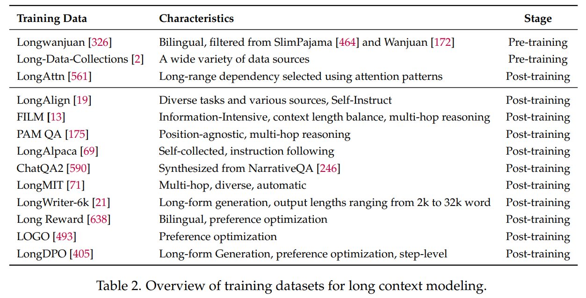
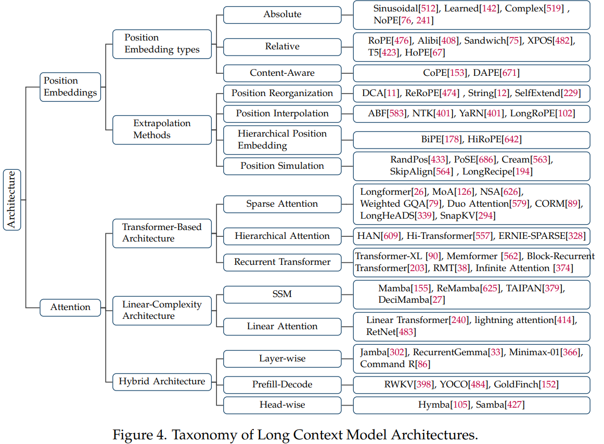

# A Comprehensive Survey on Long Context Language Modeling

* 如何获取有效且高效的长文本大语言基础模型？
  * 首先，为了获得有效且高效的大语言基础模型（研究问题 1，RQ1），我们回顾了数据策略（第 2 节）、架构设计（第 3 节）以及工作流程设计（第 4 节）。关于数据策略，我们详细讨论了在预训练和后训练阶段构建大语言基础模型过程中的数据工程工作，包括数据选择、数据筛选、数据合成、数据混合等等。
    对于架构设计，我们首先研究了大语言基础模型中常用的位置嵌入方法及其外推策略，然后系统地讨论了三种主要的架构设计类型：基于 Transformer 的改进型架构、线性复杂度架构，以及融合了这两种范式的混合架构。
    在此基础之上，我们进一步介绍了扩展单个大语言基础模型应用范围的工作流程设计，包括提示压缩、基于内存的工作流程、基于检索增强生成（RAG）的工作流程，以及基于智能体的工作流程。
* 如何高效训练和开发长文本语言模型？
  * 其次，为了高效地训练和部署大语言基础模型（研究问题2，RQ2），我们全面总结了人工智能基础设施的优化策略（第5节）。对于训练基础设施，我们研究了输入输出（I/O）优化、针对图形处理器（GPU）限制和内存访问的优化，以及通信与计算重叠方面的优化。对于推理基础设施，我们回顾了五种类型的高效推理策略，包括量化、内存管理、预填充-解码分离架构、GPU-CPU并行推理，以及推测性解码。
* 如何全面评估和分析大语言基础模型（LCLMs）？
  * 第三，在有效的大语言基础模型（LCLMs）和高效的基础设施的基础之上，我们接着讨论它们的性能评估（第6节）和分析（第7节）（研究问题3，RQ3）。在评估部分，我们将长文本上下文处理能力分为两大类：长文本上下文理解能力和长篇内容生成能力。对于每一类能力，我们都讨论了相应的评估范式，并对现有的基准测试进行了概述。在分析部分，我们既涵盖了外部性能分析（例如，有效上下文长度、困惑度（PPL）指标、中间信息丢失情况），也包括了模型内部结构分析（例如，位置嵌入、注意力头、多层感知器（MLP）层）。

---

Data:

training pipeline of LCLMs.

* Base LM -> long context continue pre-training -> general post traing + long contex post training -> long LCLMs.

预训练数据：

* 数据过滤：启发式规则和去重方法，多样性和难易程度
* 数据混合：Data Mixing Laws [613] and RegMix [319] investigate the data-mixing scaling law to find the optimal domain mixture for improving the pre-training efficiency with minimal training costs.

  * 对于长上下文：
    * Continual pre-training on a small amount of long context data can significantly improve a 7B model’s capability to accurately retrieve information over long context input.
    * When scaling up context length, it is crucial to oversample lengthy sequences while maintaining the original domain diversity of the pre-training datasets.
* 数据合成：

  * 对于后训练阶段的数据合成，我们需要有效地构建长上下文查询，并且已经有许多相关研究成果被提出。例如，“紫芽阅读器（Ziya-Reader）” [175] 构建了一个专门定制的多文档问答任务，该任务要求聚焦于上下文中的不同位置，以解决 “中间信息丢失” 问题 [317]。熊等人 [584] 提出从预训练语料库中选择一个文档，并促使语言模型根据所选文本块中的信息来编写问答对。最近，安等人 [13] 提出了信息密集型训练方法来克服 “中间信息丢失” 问题，该方法利用了一个合成的长上下文问答数据集，其中包含两种类型的问题（即针对某一短文本片段的细粒度信息感知问题，以及对来自两个或多个文本片段的信息进行整合与推理的问题）。徐等人 [590] 介绍了将所有相关段落组合起来，并随机插入真实摘要，以此来模拟真实的长文档，从而获取长上下文指令。陈等人 [71] 提出了多智能体交互式多跳生成（MIMG）框架，该框架整合了质量验证智能体、单跳问题生成智能体、多问题采样策略以及多跳问题合并智能体，以提高长上下文指令数据的质量。

  

  ---

模型结构：

位置编码：

* Absolute Position Embedding：

  * Functional Positional Embedding：Sinusoidal位置编码。
  * Learned Positional Embedding：
  * No Position Embedding：
* 相对位置编码：captures the relative distances between tokens

  * T5-style:将位置i,j得相对位置映射到一个bias b, 同时bais b在训练得时候会融入到Q与K之间得attention 点乘中去。The lookup table assigns the same parameter to distances exceeding a certain threshold, thereby facilitating generalization to unobserved distances.To solve the length generalization issue when the test length varies, FIRE proposes **progressive interpolation by normalizing the distance by query position index.** In this way, FIRE can map any test length into the training range.
  * ALiBi and its Variants：it **subtracts a scalar bias from the attention score.** This bias increases linearly in proportion to the distance between the query and key tokens.Building on top of ALiBi, Kerple [74] introduces two trainable parameters for better length extrapolation, while Sandwich [75] simplifies the form of sinusoidal position embedding by only considering the cross term of position embeddings to alleviate the overfitting issue of sinusoidal position embedding.
  * Rotary Position Embedding (RoPE) [476] and its variants. 旋转位置嵌入（RoPE）在进行点积注意力计算之前，会根据查询（query）和键（key）的绝对位置，将它们的表示旋转一个与之成比例的角度。由于这种旋转操作，注意力的点积计算将只依赖于词元（token）之间的相对距离，从而有效地将其转化为一种相对位置编码。
* Content-Aware Position Embedding：

  * 其观点认为，位置测量应该考虑到更具语义意义的单位，比如单词或句子，如下所示。
    * CoPE：内容位置嵌入（CoPE）通过利用词元的内容及其在序列中的位置，来考虑对内容和位置信息进行联合建模。具体而言，内容位置嵌入（CoPE）首先计算与上下文相关的门控值，然后利用这些值通过累加求和过程来确定词元的位置。通过这种方式，位置嵌入被赋予了上下文相关的信息。
    * DAPE：它提议通过注意力机制对位置信息进行动态建模。具体来说，动态注意力位置嵌入（DAPE）不仅依据位置索引，还结合语义信息来确定位置偏差。通过这种方式，动态注意力位置嵌入（DAPE）克服了灵活性不足的问题，并且通过针对每个特定的输入数据进行动态调整，为每个单独的实例实现了相对最优的性能。
* Extrapolation Methods of Position Embeddings：对于一个原始上下文窗口大小为$L_0$的语言模型，当处理长度为$L_t$（缩放因子$\alpha = L_t/L_0$）且超出该范围的目标序列时，第一个挑战是位置编码的分布外（OOD）问题，因为$L_0$个位置编码无法覆盖更大的范围。正如在《LM-Infinite》[168]中提到的，位置编码的分布外问题是阻碍长度外推的一个重要因素。从避免出现分布外位置的角度来看，基于位置编码的长度外推策略主要可以分为两类：（1）将目标序列映射到模型所支持的位置范围，以及（2）使模型能够支持比上下文窗口大小更大的位置范围。值得注意的是，第一类中的大多数方法无需额外调整就能表现良好，而第二类的设计往往依赖于训练才能生效。将目标序列映射到模型支持的位置范围可以进一步分为两种思路：

  * **位置重组** ：这种方法对位置索引进行重组，特别是重复利用在训练过程中出现过的位置索引，以处理超出训练长度的输入。这种重组位置索引的思想在T5模型[423]中很明显，该模型支持512个词元的输入，但只包含32种相对位置。对于使用旋转位置嵌入（RoPE）编码的主流大语言模型，可以应用类似的方法。在《SelfExtend》[679]中，对于每个词元，对最近的$w$个词元保持常规的相对位置，而对距离较远的词元进行分组。《DCA》[11]也采用了类似的方法。《ReRoPE》[474]使超出窗口\$w\$的相对位置以更小的间隔增加。此外，《String》[12]发现，即使在模型支持的位置范围内，模型在较短的相对位置上表现更好，因此更广泛地利用了训练良好的位置。
  * **位置插值** ：与重复利用现有位置不同，位置插值选择单调地减少所有输入词元的位置索引，使其不超过最大训练值。最早提出的插值策略是线性插值，它直接将每个词元的位置索引\$m\$缩小为$m/\alpha$[60]。在旋转位置嵌入（RoPE）位置编码下，这相当于均匀地减小角度$\theta$。根据神经正切核理论[209]，这种方法可能会阻碍模型学习高频特征。为了解决这个问题，神经正切核（NTK）插值[401]，也称为ABF[583]，降低了高频部分的缩放比例，同时提高了低频部分的缩放比例。在实践中，神经正切核（NTK）插值直接将原来的$\theta_j = 10000^{-2j/d}$调整为$\theta'_j = (10000\lambda)^{-2j/d}$，其$\lambda$通常选择略大于$s$的值。《YaRN》[401]发现，使用斜坡函数在不同维度上以不同比例执行神经正切核（NTK）插值可以取得更好的效果。在《YaRN》的基础上，《Resonance RoPE》[537]使用整数波长进一步优化了旋转位置嵌入（RoPE）的特征。《LongRoPE》[102]直接使用进化搜索来为每个维度找到最优的频率缩放参数。一些研究探索了为不同的注意力头[659]或层[66]分配不同的缩放因子，以提高模型在长上下文任务上的性能。除了基于旋转位置嵌入（RoPE）的外推方法，一些研究人员还将线性插值和神经正切核（NTK）插值技术应用于基于注意力的位置偏差（ALiBi）[1, 8]。

  另一方面，使模型能够支持比上下文窗口大小更大的位置范围，主要通过两种方法来实现：

  * \*\*分层位置嵌入\*\*：类似于数制系统，这种方法通过在位置编码中引入分层结构，极大地增加了可表示的范围。双向位置嵌入（BiPE）[178]引入了一个两层的位置编码系统，用于对片段内和片段间的位置进行建模。分层旋转位置嵌入（HiRoPE）[642]专注于代码场景，利用代码的自然分层结构，通过使用旋转位置嵌入（RoPE）较低的\$d/2\$个维度和较高的\$d/2\$个维度，分别处理词元级别和函数级别的距离。
  * \*\*位置模拟\*\*：有趣的是，有一系列研究探索了使用短训练数据来模拟长训练数据的方法，有效地将训练长度与推理长度分离开来。随机位置（RandPos）[433]从更长的位置序列中随机采样一组位置，将它们按升序排序，并将其用作较短输入数据的位置索引。使用这种方法训练的编码器表现出了出色的长度外推能力。对于大语言模型（LLMs），朱等人[686]提出了位置偏移（PoSE）方法，该方法将原始上下文窗口划分为几个块，确保块内的位置索引是连续的，同时允许块之间存在跳跃，从而用较短的上下文窗口覆盖更长的相对位置。
* 上下文窗口扩展与自适应位置编码方法（CREAM）[563]、长文本处理策略（LongRecipe）[194]和跳过对齐（SkipAlign）[564]在位置偏移（PoSE）的基础上进行了进一步改进。具体来说，上下文窗口扩展与自适应位置编码方法（CREAM）采用了诸如高斯采样等策略来优化文本块的划分，提高了位置索引的连续性和相对性。长文本处理策略（LongRecipe）同样对位置偏移（PoSE）的文本块划分进行了优化，并引入了“关键词元分析”，以选择每个块内用于填充的文本内容。跳过对齐（SkipAlign）根据特定的指令微调要求来确定块大小和位置索引的跳跃率，在长文本基准测试（LongBench）上取得了与GPT-3.5-Turbo-16k相当的性能。
