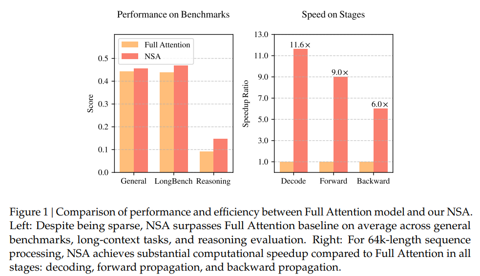
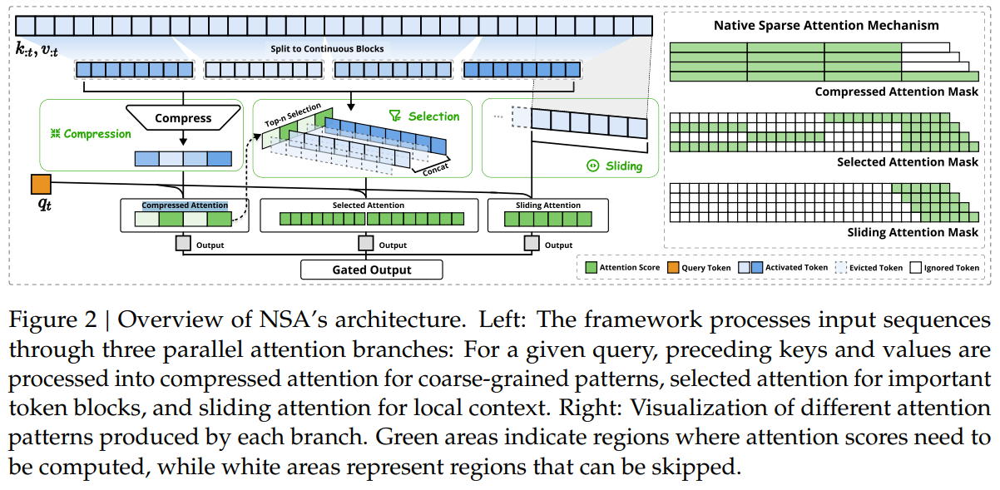

# Native Sparse Attention: Hardware-Aligned and Natively Trainable Sparse Attention

摘要：长上下文建模对下一代语言模型至关重要，但标准注意机制的高计算成本带来了显著的计算挑战。**稀疏注意力为提高效率同时保持模型能力提供了一个有前景的方向。**我们提出了NSA，一种原生可训练的稀疏注意力机制，它将算法创新与硬件对齐优化相结合，以实现高效的长上下文建模。**NSA采用动态层次稀疏策略，结合粗粒度的令牌压缩与细粒度的令牌选择，以保持全球上下文意识和局部精度。**我们的方法通过两个关键创新推动了稀疏注意力设计：(1) 我们通过算术强度平衡的算法设计实现了显著的加速，并针对现代硬件进行了实现优化。(2) 我们实现了端到端训练，**减少了预训练计算而不牺牲模型性能。**如图1所示，实验表明，使用NSA预训练的模型在一般基准、长上下文任务和基于指令的推理中保持或超过了全注意力模型。同时，NSA在64k长度序列的解码、前向传播和反向传播中相较于全注意力实现了显著的加速，验证了其在模型生命周期中的效率。

---

解决的问题：

* 针对大型语言模型中的长上下文建模，这对于需要处理大量序列的应用至关重要，例如深入推理、代码生成和多轮对话。
* 困难：

  * 计算低效：标准注意力机制在序列长度增加时表现出高复杂性和延迟，导致训练和推理过程中显著的计算开销。
  * **稀疏注意力挑战**: 现有的稀疏注意力方法在计算开销、操作优化困难和实现限制方面面临挑战，这妨碍了它们在实际应用中的有效性。
* 本研究的动机在于需要更高效的注意力机制，能够有效平衡模型能力和计算效率，使大型语言模型能够处理长上下文，而不影响性能或增加训练成本。

---

方法：

本文提出了与原生稀疏注意力（NSA）相关的以下方法：

1. **原生稀疏注意力（NSA）**
   * 一种新颖的机制，旨在通过将硬件对齐的优化与动态分层稀疏策略相结合，增强大型语言模型中的长上下文建模能力。
2. **分层令牌压缩**
   * 将粗粒度令牌压缩与细粒度选择相结合，以确保全球上下文的保留，同时保留局部细节。
3. **动态令牌选择**
   * 实施一种选择策略，以空间连续块的形式处理关键和数值序列，提高现代硬件上的计算效率。
4. **滑动窗口机制**
   * 维护一个最近令牌的窗口，以明确处理局部上下文，使其他分支（压缩和选择）能够专注于各自的特征而不受干扰。
5. **端到端训练框架**
   * 支持一个允许端到端训练的框架，减少预训练的计算需求而不影响模型性能。
6. **块选择**
   * 将关键和数值序列划分为选择块，并为每个块分配重要性评分，优化内存访问和计算效率。
7. **门控机制**
   * 利用学习到的门控机制聚合来自不同注意力分支（压缩、选择和滑动窗口）的输出，增强模型的稳定性和性能。

这些方法共同旨在提高语言模型中处理长上下文序列的注意力机制的效率和有效性。

---

本文对多个数据集和评估基准进行了实验。以下是具体的实验步骤和结果：

* **通用语言评估**
  * 在各种通用语言基准上评估了NSA的性能，并与传统的全注意力模型进行了比较。
* **长上下文评估**
  * 在LongBench上对NSA进行了评估，该基准包括单文档问答、多文档问答、合成任务和代码任务类别的子集。所有稀疏注意力方法的稀疏性设置以确保公平比较。
* **思维链推理评估**
  * 使用美国邀请数学考试（AIME 24）基准测试了NSA获取思维链推理能力的能力。这涉及在数学推理轨迹上进行监督微调后的后训练。
* **性能比较**
  * NSA与几种最先进的推理阶段稀疏注意力方法进行了比较，包括H2O、InfLLM、Quest和Exact-Top，以及在各种基准上的全注意力基线。
* **训练速度分析**
  * 分析了NSA与全注意力在不同上下文长度（8192、16384、32768、65536）下的训练速度，显示出在较长序列上显著的加速效果。
* **预训练损失比较**
  * 对NSA和全注意力的预训练损失进行了比较，结果显示NSA在训练过程中达到了更低的损失值。

这些评估展示了NSA在处理多样化长上下文挑战方面的有效性，以及在提高计算效率的同时保持性能的能力。

---

两个核心挑战：

* Hardware-aligned inference speedup：将理论的性能提升转换为实际的性能提升。（hardware-friendly algorithm design during both prefilling and decoding stages to mitigate memory access and hardware scheduling bottlenecks）
* Training-aware algorithm design：启用具备可训练算子的端到端计算，在保持模型性能的同时降低训练成本。

---

方法：

为了实现更有效、更高效的稀疏注意力机制，我们提出了原生可训练的稀疏注意力架构（NSA），该架构集成了分层标记建模方法。如图 2 所示，NSA 通过将键（keys）和值（values）组织成时间块，并通过三条注意力路径对其进行处理，从而减少了每个查询的计算量。这三条路径分别是：压缩后的粗粒度标记、有选择地保留的细粒度标记，以及用于获取局部上下文信息的滑动窗口。然后，我们实现了专用内核，以最大限度地提高其实际效率。

现有的方法：只在推理或者训练阶段生效且不适配新的更先进的attention结构。这一局限性迫使我们做出一个关键抉择：尽管一些稀疏注意力方法能够减少计算量，但其分散的内存访问模式与先进架构所采用的高效内存访问设计相冲突。

我们对原生可训练稀疏注意力的探索，源自对仅用于推理的方法进行分析后得出的两个关键认知：

1. \*\*性能下降\*\*：事后应用稀疏性会迫使模型偏离其预训练的优化轨迹。正如陈等人（2024年）所证实的，前20%的注意力只能覆盖总注意力得分的70%，这使得预训练模型中的检索头等结构在推理过程中容易被剪枝。

2. \*\*训练效率需求\*\*：高效处理长序列训练对于现代大语言模型（LLM）的发展至关重要。这既包括在更长的文档上进行预训练以提升模型能力，也包括后续的适配阶段，如长上下文微调与强化学习。然而，现有的稀疏注意力方法主要针对推理环节，在很大程度上未能解决训练过程中的计算难题。这一局限阻碍了通过高效训练来开发更强大的长上下文模型。此外，尝试将现有的稀疏注意力方法应用于训练时，也暴露出了一些问题。

---

具体而言，对于因果自注意力机制，在训练和预填充阶段，批量矩阵乘法和注意力计算呈现出较高的算术强度，这使得这些阶段在现代加速器上受限于计算能力。相比之下，自回归解码过程则受限于内存带宽，因为它每次前向传播仅生成一个标记，却需要加载整个键值缓存，从而导致算术强度较低。  这就带来了不同的优化目标：**在训练和预填充阶段要降低计算成本，而在解码阶段则要减少内存访问。**

总体而言，会对每个attention操作加上多个map,然后通过一个gate机制将这些map后的信息整合起来，

为了充分发挥具有自然稀疏模式的注意力机制的潜力，我们提议针对每个查询 $q_t$，用一组更紧凑且信息密度更高的表征键值对 $\tilde{K}_t$、$\tilde{V}_t$ 来替换公式（1）中的原始键值对 $k_{:t}$、$v_{:t}$。具体来说，我们正式将优化后的注意力输出定义如下：

$\tilde{K}_t = f_K(q_t, k_{:t}, v_{:t})$，$\tilde{V}_t = f_V(q_t, k_{:t}, v\_{:t})$  (3)

$o_t^* = \text{Attn}(q_t, \tilde{K}_t, \tilde{V}_t)$  (4)

其中，$\tilde{K}_t$、$\tilde{V}_t$ 是根据当前查询 $q_t$ 以及上下文记忆 $k_{:t}$、$v_{:t}$ 动态构建的。我们可以设计各种映射策略，以得到不同类别的 $\tilde{K}_t^c$、$\tilde{V}_t^c$，并将它们组合如下：

$o_t^* = \sum_{c \in \mathcal{C}} g_t^c \cdot \text{Attn}(q_t, \tilde{K}_t^c, \tilde{V}_t^c)$  (5)

如图 2 所示，原生可训练的稀疏注意力架构（NSA）有三种映射策略 $\mathcal{C} = \{\text{cmp}, \text{slc}, \text{win}\}$，分别代表对**键和值进行压缩、选择以及使用滑动窗口操作**。$g_t^c \in [0, 1]$ 是对应策略 $c$ 的门控分数，它是通过多层感知机（MLP）和 Sigmoid 激活函数从输入特征中推导得出的。令 $N_t$ 表示重新映射后的键/值的总数：  $N_t = \sum\_{c \in \mathcal{C}} \text{size}[\tilde{K}_t^c]$  (6)  我们通过确保 $N_t \ll t$ 来保持较高的稀疏率。

---

Token Commpression

将序列的key和value压缩，首先根据滑动步长d,将长度为l的相邻key和value组成一个block，通过一个map将每个block映射到一个向量。

Token Selection：只使用压缩key的话，可能会丢失细粒度的重要信息。

仅使用经过压缩的键和值可能会丢失重要的细粒度信息，这促使我们有选择性地保留单个键和值。下面我们将介绍一种高效的标记选择机制，该机制能够以较低的计算开销识别并保留最相关的标记。

**分块选择**

我们的选择策略以空间连续的块为单位处理键和值序列，这主要基于两个关键因素：硬件效率考量和注意力得分的固有分布模式。分块选择对于在现代图形处理器（GPU）上实现高效计算至关重要。这是因为与基于随机索引的读取操作相比，现代 GPU 架构在连续块访问时具有显著更高的吞吐量。此外，分块计算能够充分发挥张量核心（Tensor Cores）的性能。这种架构特性使得分块内存访问和计算成为高性能注意力机制实现中的一项基本原则，例如 FlashAttention 采用的基于块的设计就是一个例证。分块选择遵循注意力得分的固有分布模式。
先前的研究（Jiang 等人，2024 年）表明，注意力得分通常呈现出空间连续性，这意味着相邻的键往往具有相似的重要性水平。我们在第 6.2 节中的可视化结果也证实了这种空间连续模式。

为了实现分块选择，我们首先将键和值序列划分为多个选择块。为了确定哪些块对于注意力计算最为重要，我们需要为每个块分配重要性得分。下面我们将介绍计算这些块级重要性得分的方法。

**重要性得分计算**

计算块的重要性得分可能会带来相当大的开销。幸运的是，压缩标记的注意力计算会产生一些中间注意力得分，我们可以利用这些得分来推导选择块的重要性得分，具体公式如下：

从每个组合的block里面（长度为l）选择l`个token。
