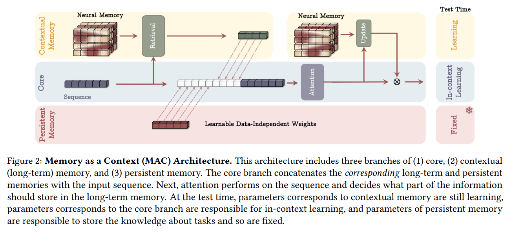

# Titans: Learning to Memorize at Test Time

摘要：

在过去十多年里，人们针对如何有效利用循环模型和注意力机制展开了广泛的研究。**循环模型旨在将数据压缩为固定大小的记忆（称为隐藏状态），而注意力机制则允许关注整个上下文窗口，捕捉所有标记之间的直接依赖关系。然而，这种对依赖关系更精确的建模伴随着二次方的计算成本，将模型限制在固定长度的上下文内。**  我们提出了一种新的神经长期记忆模块，该模块能够学习记忆历史上下文，并辅助注意力机制**在关注当前上下文时利用久远的过往信息。**我们证明，这种神经记忆在保持快速推理的同时，具备可快速并行训练的优势。从记忆的角度来看，我们认为**注意力机制**虽因上下文有限但依赖关系建模精确，起到了**短期记忆**的作用；而**神经记忆**因其能够记忆数据，扮演着**长期且更持久的记忆角色**。  基于这两个模块，我们引入了名为Titans的全新架构系列，并给出了三个变体，以探讨如何将记忆有效地融入该架构。我们在语言建模、常识推理、基因组学和时间序列任务上的实验结果表明，Titans比Transformer以及近期的现代线性循环模型更为有效。与基线模型相比，在“大海捞针”式的任务中，它们还能更有效地扩展到超过200万个上下文窗口大小，且具有更高的准确性。

这揭示了线性循环（或线性Transformer）模型一个自相矛盾的事实：一方面，我们使用这些线性模型来提升可扩展性与效率（线性复杂度对比二次复杂度），其优势在处理极长上下文时得以体现；另一方面，极长的上下文无法在小的向量值或矩阵值状态中得到恰当压缩。

此外，除了效率问题，大多数现有架构——从霍普菲尔德网络（Hopfield，1982年）到长短期记忆网络（LSTM，于尔根·施密德胡伯和霍赫赖特，1997年）再到Transformer（瓦斯瓦尼等人，2017年）——**在处理泛化、长度外推和/或推理任务**时都面临挑战（阿尼尔等人，2022年；秦、Y. 钟和邓，2024年），而这些都是许多现实世界复杂任务中不可或缺的部分。尽管这些架构从人类大脑中汲取了灵感，但它们都缺失了以下方面：（1）学习过程中的关键组成部分——如**短期记忆、长期记忆、元记忆、对当前上下文的关注**等（考恩，2008年）；（2）这些组成部分如何相互连接形成能独立运作的系统；以及/或者（3）从数据中主动学习并记住过往历史抽象信息的能力。我们认为，在一个有效的学习范式中，类似于人类大脑，应该存在不同但相互关联的模块，每个模块都负责学习过程中的一个关键组成部分。

记忆是一种基本的心理过程，也是人类学习不可或缺的组成部分（特里，2017）。如果没有一个功能正常的记忆系统，人类和动物将局限于基本的反射和刻板行为。

**从神经心理学文献中对记忆与学习的常见定义获取灵感（冈野、平野和巴拉班，2000 年），**大多数现有架构将记忆视为由输入引发的神经更新，并将学习定义为在给定目标下获取有效且有用记忆的过程。**从这个角度来看，循环神经网络（RNNs）（威廉姆斯和齐普泽，1989 年）可被定义为具有向量值记忆模块 M（也称为隐藏状态）的模型，主要包含两个步骤：在时刻 t 给定新输入 \\(x\_t\\) 时，模型（1）使用函数 \\(f(M\_{t - 1}, x\_t)\\) 更新记忆（伴随压缩过程）；（2）使用函数 \\(g(M\_t, x\_t)\\) 检索输入对应的记忆（详见§2.1）。  类似地，Transformer 可被视为具有不断增长的记忆且有两个类似步骤的架构。也就是说，键值矩阵对充当模型的记忆，模型：（1）通过将键和值追加到记忆中来更新记忆（无压缩）；（2）通过查找查询向量与键向量的相似度，检索查询向量对应的记忆，然后利用该相似度对值向量加权以生成输出。**

这种视角有助于我们更好地理解现有范式、它们的关键差异，并设计出更有效的架构。例如，Transformer（瓦斯瓦尼等人，2017）与线性Transformer（卡塔洛普洛斯等人，2020）之间的主要区别在于**记忆结构以及记忆更新步骤**。在线性Transformer中，会将历史数据压缩为固定大小的矩阵值记忆，而Transformer则会保留所有历史数据（在上下文长度范围内），不进行任何压缩。虽然线性Transformer和线性循环神经网络（包括状态空间模型）在记忆更新步骤中都会压缩信息，但关键差异在于记忆结构，线性循环神经网络（与线性Transformer相比）使用向量值记忆（而非矩阵值记忆）。因此，这种视角促使我们提出以下问题：

**（问题1）构成良好记忆结构的要素是什么？**

**（问题2）合适的记忆更新机制是什么？**

（**问题3）良好的记忆检索过程是什么样的？**

重新审视我们对人类记忆的理解，它既不是单一的过程，也并非仅发挥单一功能（考恩，2008）。实际上，记忆是一个系统联盟，例如包含**短期记忆、工作记忆和长期记忆**，每个部分都通过不同的神经结构发挥不同的功能，且每个部分都能够独立运作（威林厄姆，1997）。这一事实促使我们提出：

**（问题4）如何设计一种高效的架构，将不同且相互关联的记忆模块整合进来。**

最后，存储记忆是一个神经过程，需要对过去的信息进行编码和存储抽象内容。仅仅假设用一个向量或矩阵，通过线性方式对数据进行参数编码，就足以存储长期历史信息，这种想法过于简单化。

**（问题5）是否需要一个深度记忆模块来有效地存储 / 记住久远的过去信息？**

---

主要贡献：

Neural Memory：我们提出一种（深度）神经长期记忆，它能够在**测试阶段学习如何将数据记忆/存储到其参数中**。此概念的灵感源自人类长期记忆系统。

我们对这个记忆模块进行设计，**使得违背预期（令人惊讶）的事件更容易被记住。**为此，我们通过神经网络在关联记忆损失中相对于输入的梯度来衡量输入的“惊讶度”（详见3.1节）。为了更好地处理有限的记忆，我们提出一种衰减机制，该机制考虑了记忆大小的比例以及数据惊讶度，从而实现更好的记忆管理。我们证明，这种衰减机制实际上是现代循环模型中遗忘机制的推广（道和顾，2024；顾和道，2024；S. 杨、考茨和哈塔米扎德，2024）。有趣的是，我们发现这种机制等同于使用小批量梯度下降、动量和权重衰减来优化一个元神经网络。基于将小批量梯度下降张量化以使用更多矩阵乘法运算（孙宇等人，2024），我们提出了一种快速且可并行化的算法来训练我们的深度神经长期记忆。

Titans Architectures：

在设计好长期神经记忆后，**一个重要的遗留问题是如何切实有效地将记忆融入深度学习架构**。我们推出了Titans，这是一系列深度模型，由三个超级模块组成： (1) 核心模块：此模块包含短期记忆，负责处理数据的主要流程（我们采用窗口大小有限的注意力机制）； (2) 长期记忆模块：这个分支是我们的神经长期记忆模块，负责存储/记住久远的过往信息； **(3) 持久记忆模块：这是一组可学习但与数据无关的参数，对有关任务的知识进行编码。** 最后，作为概念验证，我们给出了Titans的三个变体，在这些变体中，我们将记忆分别以以下方式融入：(i) 作为上下文，(ii) 作为一层，(iii) 作为一个带门控的分支。

我们在语言建模、常识推理、高召回需求任务、大海捞针式任务、时间序列预测以及DNA建模任务上进行了实验评估。我们发现，在一系列广泛的基准测试中，我们的Titans架构优于所有现代循环模型及其混合变体（与滑动窗口注意力机制相结合的模型）。此外，在相同上下文窗口条件下，Titans的表现优于Transformer，并且与使用完整上下文的Transformer相比，也展现出具有竞争力的性能。与Transformer不同的是，Titans能够扩展到超过200万个上下文窗口大小，且仍能取得这样的成果。

---

基于transform的改进方案：

* Efficient Attentions：减少内存（flash-attention）, sparsifying the attention matrix,approximating the softmax, developing kernel-based (linear) attentions
* (linear) attentions:$\phi(x,y) = \phi(x) \phi(y)$
* 
  当$\phi$为identity matrix的时候，上式可变为：

  $$
  M_t = M_{t-1} + K_{t}^{T} V_t;  y_t =Q_tM_t
  $$

现代线性注意力模型及其memory视角：

$$
M_t = f(M_{t-1} + x_t);  y_t = g(M_t, x_t)
$$

f对应于写操作，y对应为读操作。

相当于将记忆压缩到一个矩阵Mt中。然而当处理长上下文的时候，这种加法性质的操作会导致记忆溢出（矩阵容量有限），严重影响模型的表现。为了解决这个问题，有两个主要的方向：

* Adding forget mechanism：自适应的遗忘门机制，能够在需要的时候抹除掉记忆。xLSTM,Mamba2.
* 提高写操作：为了克服传统循环模型中记忆写入操作的累加特性，威德罗和霍夫（1988年）提出了Delta规则。在该规则下，**在添加记忆（即一对键值对）之前，模型首先会移除其先前的值。**为了提升可并行训练能力与扩展性，S. 杨、B. 王、张宇等人（2024年）提出了一种快速可并行化算法。最后，就在最近，S. 杨、考茨和哈塔米扎德（2024年）**通过添加遗忘门改进了Delta网络。**

Memory Modules：

将线性层视为键值（关联）记忆系统的想法可以追溯到快速权重程序，在该程序中，动态的快速程序被纳入循环神经网络中，作为可写记忆（JH 施密德胡伯，1992年）。赫布（Hebb，2005年）和Delta（普拉多斯和卡克，1989年）这两种学习规则是快速权重程序中最流行的学习规则，它们在各种研究中得到了广泛探索（入江、施拉格等人，2021年；蒙赫达尔艾、索尔东尼等人，2019年；蒙赫达尔艾和H. 于，2017年；施拉格、入江和JH 施密德胡伯，2021年；JH 施密德胡伯，1992年；S. 杨、考茨和哈塔米扎德，2024年；S. 杨、B. 王、张宇等人，2024年）。然而，所有这些模型都是基于瞬时的“惊讶度”，缺失了序列中的标记流（见第3.1节），并且它们中的大多数缺乏遗忘门，导致记忆管理效果不佳。

---

Learning to Memorize at Test Time

为了克服长期记忆的缺失并使模型能够学习、遗忘和检索信息，在本节中，我们提出了一个神经长期记忆模块，它是一个元模型，**可在测试阶段学习记忆。**

为了设计一个神经长期记忆模块，我们需要一个能将过去历史的抽象信息编码到其参数中的模型。大型语言模型（LLMs）就是这样一个例子，它们被证明会记忆其训练数据（莱布宗和凯尔瓦德克，2024；施瓦茨希尔德等人，2024；斯塔布等人，2024）。因此，一个简单的想法是训练一个神经网络并期望它记住其训练数据。然而，记忆在神经网络中几乎一直被视为一种不良现象，因为它会限制模型的泛化能力（巴亚特等人，2024），引发隐私问题（斯塔布等人，2024），并因此导致在测试阶段表现不佳。此外，对训练数据的记忆在测试阶段可能并无帮助，因为测试数据可能是分布外的。**我们认为，我们需要一个在线元模型，它能在测试阶段学习如何记忆/遗忘数据。在这种设置下，该模型正在学习一个具有记忆功能的函数，但不会过度拟合训练数据，从而在测试阶段实现更好的泛化性能。**

训练长期记忆的关键思路是将其训练视为一个在线学习问题，在该问题中，我们旨在将过去的信息  压缩到我们的长期神经记忆模块  的参数中。如前所述，违背预期（即令人惊讶）的事件对于人类来说更容易被记住（曼德勒，2014）。受此启发，对于一个模型来说，惊喜的简单定义可以是它相对于输入的梯度。**梯度越大，输入数据与过去数据的差异就越大。**相应地，利用这个惊喜得分，我们可以更新记忆，如下所示：

$$
M_t = M_{t-1} - \theta_t \nabla l(M_{t-1}; x_t)
$$

然而，这种惊喜度量可能会导致错过在一个重大的令人惊讶时刻之后出现的重要信息。也就是说，在经过几个令人惊讶的步骤之后，梯度可能会变得极小，从而陷入一个平坦区域（即局部极小值），并遗漏序列某些部分的信息。从人类记忆的角度来看，一个事件可能不会在很长一段时间内持续让我们感到惊讶，尽管它是值得记忆的。原因是初始时刻足够令人惊讶，足以在较长的时间范围内引起我们的注意，从而导致我们记住整个时间范围。为了改进上述惊喜度量（公式 8），我们将惊喜度量划分为：(1) 过去惊喜，它衡量最近过去的惊喜量；(2) 瞬时惊喜，它衡量传入数据的惊喜度：

$$
M_t = M_{t-1} + S_t; S_t = \eta_t S_{t-1} - \theta_t \nabla l (M_{t-1}; x_t)
$$

Past Surprise, Momentary Surprise.有趣的是，这种表述类似于带有动量的梯度下降，其中 $S_t$ 是动量元素。因此，这里的动量充当了跨时间（序列长度）的惊喜记忆。在这种表述中，$\eta\_t$ 项是一种依赖于数据的惊喜衰减$x_t$ 的函数，它控制着惊喜随时间的衰减方式，而 $\theta_t$ 项则以一种依赖于数据的方式控制着应该将多少瞬时惊喜纳入最终的惊喜度量中。这种数据依赖性在这个设计中尤为重要：虽然可能需要前面标记的惊喜来影响下一个标记的惊喜，但只有当所有标记都相关且处于相同上下文时，这才是最有效的。相应地，依赖于数据的 $\eta$ 可以控制记忆是否需要：(1) 通过设置 $\eta_t$ to 0 来忽略上一个惊喜（可能是由于上下文的变化），或者 (2) 通过设置 $\eta_t$ to 1 来完全纳入上一个惊喜（可能是因为该标记与其最近的过去标记高度相关）。

**Objective**: the objective that our memory is learning to act as it at test time. 也就是说，我们的记忆模块是一个元模型，它基于损失函数\\(\\ell(.;.)\\)学习一个函数。在这项工作中，我们专注于关联记忆，其目标是将过去的数据存储为键值对。给定\\(x\_t\\)，与Transformer（瓦斯瓦尼等人，2017年）类似，我们使用两个线性层将\\(x\_t\\)投影为一个键和一个值：

$$
K_t = x_t W_k; v_t = x_tW_v
$$

接下来，我们期望我们的记忆模块学习键和值之间的关联。为此，我们将损失函数定义如下(过去的记忆加上当前的key能够得到当前的value)：

$$
l(M_{t-1}; x_t) = ||M_{t-1}(K_t) - v_t ||_2^{2}
$$

通过在我们的元模型（记忆）的内循环中优化上述损失函数，该模型学习如何在测试时记住键和值之间的映射。请注意，与元学习模型（尼科尔，2018；津特格拉夫等人，2019）类似，**记忆的训练处于内循环中，**因此参数$W_K$和$W_V$是上述损失函数中的超参数。**相应地，在内循环中，我们优化$M$的权重，而在外循环中，我们优化整个架构的其他参数。**

Forgetting Mechanism:

当处理非常长的序列（例如，数百万个标记）时，管理哪些过去的信息应该被遗忘是至关重要的——即使使用深度的或非常大的矩阵值记忆也是如此。为此，**我们使用一种自适应遗忘机制，该机制允许记忆遗忘不再需要的信息**，从而更好地管理记忆的有限容量。也就是说，给定下一个标记\\(x\_t\\)，我们修改更新规则如下：

$$
M_t = (1 - a_t) M_{t-1} + S_t; S_t = \eta_tS_{t-1} - \theta \nabla l(M_{t-1}; x_t)
$$

其中$\alpha_t$指的是门机制用来灵活控制memory；比如决定多少信息需要被遗忘。例如，它可以通过让\\(\\alpha\_t \\to 0\\)来更新记忆而不影响过去的抽象信息，也可以通过让\\(\\alpha\_t \\to 1\\)来清除整个记忆。在本节的后面部分，我们将展示这种权重衰减机制与现代循环神经网络（RNN）中的门控机制密切相关。

**Memory Architecture：在本文中，我们将具有$L_M \geq 1$层的简单多层感知机（MLP）作为我们长期记忆的架构。做出这一选择的主要原因是，我们想要更着重于推动长期记忆的设计，以及将其融入架构的方式。然而，我们的公式和架构设计为设计在数据记忆方面更有效率的神经架构开启了一个新的研究方向。最近，已经有一系列很有前景的工作致力于设计此类架构（贝热斯等人，2024年；塞廷等人，2024年；J. 张等人，2024年），将它们融入我们的框架（即用此类架构替换简单的多层感知机）可能是一项有趣的未来工作。**

也就是说，从元学习或在线学习的视角来看（孙宇等人，2024年），使用矩阵值记忆$M = W \in R^{d_{in}×d_{in}}$等同于优化$\ell(W_{t - 1}; x_t) = \|W_{t - 1}k_t - v_t\|_2^2$，这是一个**在线线性回归目标，因此最优解假设历史数据的潜在依赖关系是线性的。**

Retrieving a Memory:

在上述内容中，我们讨论了如何设计和训练一个能在测试时进行记忆学习的长期记忆模块。一个关键的遗留问题是：如何从记忆中检索信息？我们简单地使用不带权重更新的前向传播（即推理）来检索与查询相对应的记忆。形式上，给定一个输入$x_t$，我们使用一个线性层$W_Q$对输入进行投影，即$q_t = x_t W_Q$，并通过以下方式从记忆$y_t$中检索相应的（或有用的）信息：

$$
y = M^{*}(q_t)
$$

---

How to Parallelize the Long-term Memory Training

---

Persistent Memory:

我们的长期记忆也可被视为上下文记忆，这意味着输出完全依赖于上下文。因此，除了长期记忆之外，我们还使用一组可学习但与输入无关的参数，**将其作为与任务相关的记忆。**

在文献中，这类记忆被称为持久记忆或元记忆给定$N\_p \geq 1$，我们使用可学习参数$P = \begin{bmatrix} p_1 & p_2 & \cdots & p_{N\_p} \end{bmatrix}$，并将其添加到序列开头。也就是说，给定上下文窗口大小为N，我们将输入修改为：  $x_{new} = \begin{bmatrix} p_1 & p_2 & \cdots & p_{N_p} \end{bmatrix} || x$  其中||表示拼接操作。接下来，我们从三个角度探讨持久记忆的动机：

* **记忆角度:** 如前所述，我们的神经长期记忆是一种上下文记忆，其中所有参数都依赖于输入。**然而，一个有效的记忆系统还需要与输入无关的参数来存储任务知识的抽象信息。**也就是说，**掌握一项任务需要记住如何完成该任务的知识，而这些参数就负责存储此类知识。**
* **前馈网络角度:** 在 Transformer 架构中，注意力模块之后存在全连接层。研究表明，这些全连接层与注意力权重类似，但具有与数据无关的参数。即苏赫巴塔尔、格雷夫等人（2019 年）指出，将全连接层中的 ReLU 激活函数替换为 Softmax 函数，能够得到类似注意力的权重，且这些权重与数据无关：  $FFN(x) = W_V \text {Softmax}(W_K x)$  实际上，当$W_K$和$W_V$与输入无关(没有Q)时，它们的作用类似于注意力模块中的$K$和$V$矩阵。持久记忆权重有望具备相同的功能，这意味着在序列的起始部分使用它们可以得到与输入无关的注意力权重（苏赫巴塔尔、格雷夫等人，2019 年）。
* **技术角度** **带有因果掩码的注意力机制对序列中的起始标记存在隐式偏好，因此注意力权重几乎总是在起始标记处高度活跃，从而损害了性能。从技术角度来看，序列开头的这些可学习参数能够通过更有效地重新分配注意力权重来减轻这种影响**（韩等人，2024 年；肖等人，2024 年）。

---

How to Incorporate Memory?

一个尚未得到解答的重要问题是：如何切实有效地将设计好的神经记忆融入深度学习架构？如前文所述，从记忆的角度来看，Transformer 中的键（K）和值（V）矩阵对可以被理解为一个关联记忆块。由于它们能够精准地对依赖关系进行建模，但上下文窗口有限，我们将其视为短期记忆模块，主要关注当前的上下文窗口大小。另一方面，我们所设计的神经记忆具备持续从数据中学习并将信息存储于自身权重中的能力，能够充当长期记忆的角色。在本节中，我们打算通过提出 Titans 的三种不同变体来解答上述问题。在后续的实验中，我们会展示每种变体都有其自身的优缺点，并且在处理超长上下文时，它们在效率和有效性之间呈现出一种权衡关系。

Memory as a Context：

在第一个架构设计中（见图 2），我们将记忆视为当前信息的上下文。也就是说，给定一个长序列$x \in R^{N \times d_{in}}，$我们首先将该序列分割成固定大小的片段$S^{(i)}$，其中$i = 1, \ldots, N/C$。对于传入的片段$S^{(t)}$，我们将其视为当前上下文，而将其之前的片段视为历史信息。因此，设$M_{t - 1}$为片段$S^{(t)}$之前长期记忆的状态，我们将输入上下文作为对记忆$M_{t - 1}$的查询，以从长期记忆中检索相应的信息。我们检索与$S^{(t)}$对应的过去信息如下：$h\_t = M_{t - 1}^*(q_t)$  其中$q\_t = S^{(t)}W_Q$

接下来，我们将这些历史信息与我们的持久记忆参数一起作为注意力模块的输入序列：

$\tilde{S}^{(t)} = \begin{bmatrix} p_1 & p_2 & \cdots & p_{N_p} \end{bmatrix} ||  h_t || S^{(t)} ; y_t = \text{Attn}(\tilde{S}^{(t)})$。

整个序列上注意力图的结构如图 3a 所示。然后，我们使用y_t来更新长期记忆模块，以供下一个片段使用，并得到最终输出：

$ M_t = M_{t - 1}(y_t)， (o_t = y_t \otimes M_t^*(y_t)。$

请注意，在上述过程中，我们通过**前向传播**来更新$M_{t - 1}$的权重。

这种架构有两个关键优势：

1. **结合历史与当前上下文进行决策：**

通过同时拥有历史和当前上下文，注意力机制能够根据当前数据判断是否需要长期记忆信息。

2. **筛选有用信息以管理内存：**

注意力模块能帮助长期记忆仅存储当前上下文中的有用信息。由于并非每个片段中的所有标记都有用，若全部记忆可能导致内存溢出，所以注意力机制能协助记忆模块识别有用信息，从而更好地管理内存容量。

3. **测试阶段的特性:**

- 持久记忆参数保持固定，因为它们编码了关于任务的知识，不应被更改。

- 注意力模块的权重是上下文内学习的。
- 长期记忆模块在测试阶段仍能学习（记忆）信息。这意味着即使在测试阶段，我们也会更新神经记忆的权重，因为这些权重编码了过去的抽象信息。

---

Gated Memory:

我们采用双分支结构。在一个分支里，我们直接利用输入数据来更新长期记忆；在另一个分支中，我们运用滑动窗口注意力机制（SWA）：

$\tilde{x} = \begin{bmatrix} p_1 & p_2 & \cdots & p_{N_p} \end{bmatrix} || x，（式 26）$

$y = \text{SW-Attn}^*(\tilde{x})，（式 27）$

$o = y \otimes M(\tilde{x}))，（式 28）$

其中，$\text{SW-Attn}^*$ 指的是带前缀的滑动窗口注意力机制（见图 3b）。值得注意的是，与之前的设计不同，这里我们不会对输入数据进行分段处理。此外，我们沿用了前面的符号习惯，用 $M(x)$ 表示序列中所有标记经过递归操作后记忆模块的最终输出。在上述公式里，$\otimes$ 可以代表任意非线性门控操作。在我们的实验中，我们会使用可学习的向量值权重对输出 $y$ 和 $M(\tilde{x})$ 进行归一化处理，然后再应用一个非线性函数 $\sigma(.)$。  这种设计的整体注意力掩码如图 3b 所示。在该设计中，滑动窗口注意力机制起到了精准短期记忆的作用，而神经记忆模块则为模型充当了一种会逐渐淡忘信息的记忆。这种架构设计也可看作是一种多头架构，只不过各个头的结构有所不同。

---

Memory as a Layer:

最后一种变体是将神经记忆作为深度神经网络的一层（MAL，Memory As a Layer）（见图 5）。这种架构设计在文献中更为常见，在这类设计中，混合模型会将循环模型与全窗口或滑动窗口注意力机制堆叠在一起。给定输入\\(x\\)，我们有：

$$
\tilde{x} = \begin{bmatrix} p_1 & p_2 & \cdots & p_{N_p} \end{bmatrix} || x \\ y = M(\tilde{x}) \\ o = \text{SW-Attn}(y)
$$

其中，SW - Attn 是滑动窗口注意力机制。这种设计的主要缺点在于，模型的能力受限于每一层，因此无法充分利用注意力机制和神经记忆模块在数据处理上的互补优势。在我们的实验中，为了评估这种设计下的记忆能力，我们采用了与 H3（傅 D.Y. 等人，2023 年）类似的架构，不过用我们的神经记忆模块（LMM）取代了其中的序列模型。

**无注意力机制的记忆** 尽管在上述内容中，我们将 MAL 讨论为长期记忆模块（LMM）和注意力机制按顺序组合的形式，但 MAL 的一种简单变体是将 LMM 视为一个不使用任何注意力机制的序列模型。从记忆的角度来看，正如在第 1 节中所讨论的，我们期望记忆系统的每个部分都能独立运作，即使其他组件受到干扰也不例外。因此，即使没有短期记忆（即注意力机制），长期记忆模块也应该是一个强大的模型。在我们的实验中，我们将这种变体称为 LMM 或 Titans (LMM)。在附录 C 中，我们会进一步探讨 Titans 与其他现代循环模型之间的联系。
