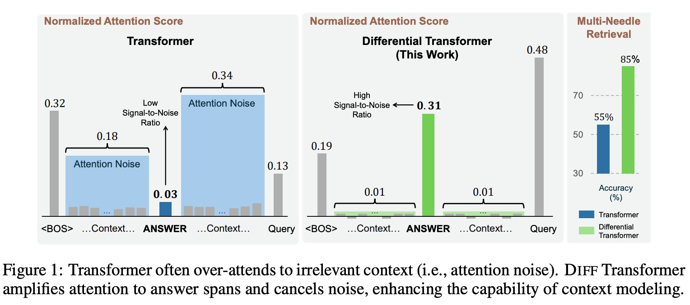
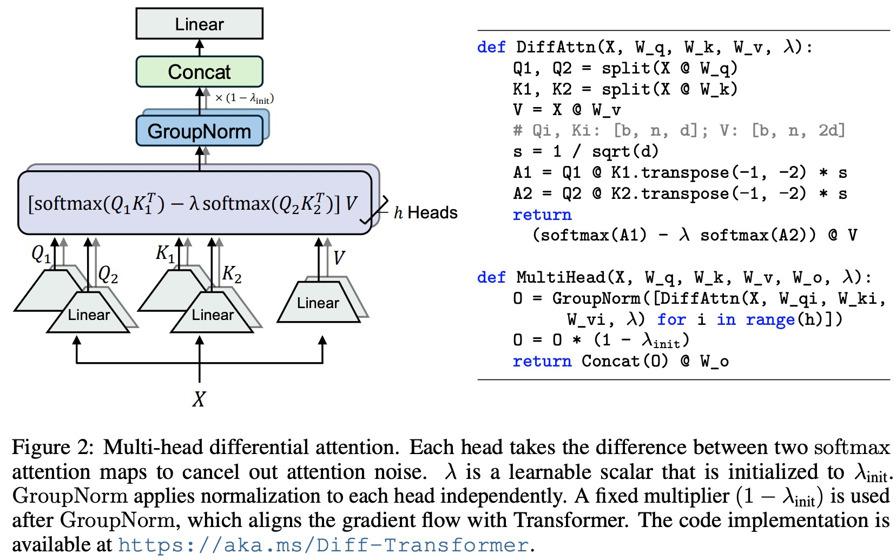

# DIFFERENTIAL TRANSFORMER

## 研究背景和动机

Transformer 的注意力问题：Transformer 在近年来受到广泛关注，其核心的注意力机制通过 softmax 函数对序列中各个 token 的重要性进行加权。然而，研究发现 LLMs 在从上下文中准确检索关键信息方面面临挑战，

**Transformer 往往会过度关注无关的上下文，分配给正确答案的注意力分数比例较小，这些无关的分数被称为注意力噪声。**

本文提出了Differential Transformer 架构，能够增加模型对相关信息的注意力从而减少注意力噪声。将两个softmax操作的差值作为新的注意力，这样消除了噪音，促进了稀疏注意力模式的出现（WHY？）。

实验表明该方法在：long-context modeling, key information retrieval, hallucination mitigation, in-context learning, and reduction of activation outliers等方面具有很大的潜力。比如由于更少的被不相干信息干扰，该方法能够有效的效果文本摘要和QA问题中的幻觉，对于in-context learning，他不仅能够提升精度而且对于顺序扰动更加鲁棒。

问题分析 attention noise：

动机：The differential attention mechanism is proposed to cancel attention noise with differential denoising.这种方法类似于电工程中的噪声消除耳机和差动放大器[19]，其中两个信号之间的差异能够消除共模噪声。

在参数量，训练token数，上下文长度等方面进行scale up,对应的曲线表明该方法只需要65%的模型大小和训练token就能达到原始transformer相匹配的语言模型效果。

## 方法

* Differential Transformer 架构
  整体架构：以仅解码器模型为例，由 L 层 DIFF Transformer 层堆叠而成。每层包含一个多头部差分注意力模块和一个前馈网络模块。
  差分注意力机制（Differential Attention）
  计算注意力分数：将查询和键向量投影为两组，分别计算两个 softmax 注意力图，然后将两者相减作为注意力分数。具体公式为，$[Q_1; Q_2] = XW^Q, [K1; K2] = XW^K, V = XW^V$

  $$
  DiffAtten(X) = (softmax(\frac{Q_1K_{1}^{T}}{\sqrt{d}})-\lambda softmax(\frac{Q_2K_2^T}{\sqrt{d}}V))
  $$

  其中是可学习的标量，经过重新参数化和特定的初始化设置。re-parameterize the scalar: $\lambda=exp(\lambda_{q1}.\lambda_{k1})-exp(\lambda_{q2}.\lambda_{k2})+\lambda_{init})$

  λinit = 0.8 − 0.6 × exp(−0.3 · (l − 1))
* 多头部机制（Multi - Head Differential Attention）：采用多头部机制，不同头部使用不同的投影矩阵，同一层内的头部共享。头部输出经过归一化和投影得到最终结果，公式为，其中，使用 RMSNorm 对每个头部进行归一化。
  头部归一化（Headwise Normalization）：使用 GroupNorm 对每个头部独立进行归一化，在连接之前对每个头部进行归一化可以改善梯度统计。

  

  这里对于每个head的输出使用了Group Norm这是因为As differential attention tends to have a sparser pattern, **statistical information is more diverse between heads**. The LN(·) operator normalizes each head before concatenation to **improve gradient statistics**

## 实验

* 实验设置
  模型训练：在不同的设置下训练 DIFF Transformer 和对比的 Transformer 模型，包括在 1T tokens 上训练 3B - size 的模型，以及在不同参数数量和训练 token 数量下进行缩放实验，还将 3B - size 模型扩展到 64K 上下文长度继续训练。
  评估任务和数据集：从多个角度评估模型，包括在各种下游任务上与 Transformer 对比，如大规模多任务语言理解（LM Eval Harness）基准测试中的多个任务（ARC - C、ARC - E、BoolQ、HellaSwag、OBQA、PIQA、WinoGrande），以及文本摘要（XSum、CNN/DM、MultiNews）和问答（Qasper、HotpotQA、2WikiMQA）任务中的上下文幻觉评估，还有上下文学习（many - shot 分类和鲁棒性评估）、长序列建模能力评估、关键信息检索等任务。
* 实验结果
  * 语言建模评估
    与现有模型对比：在 1T tokens 上训练的 3B - size DIFF Transformer 在 LM Eval Harness 基准测试中的多个任务上取得了优于之前训练良好的 Transformer - based 模型（如 OpenLLaMA - v2 - 3B、StableLM - base - alpha - 3B - v2、StableLM - 3B - 4E1T）的性能。
  * 模型缩放性能：在缩放模型大小和训练 token 数量方面，DIFF Transformer 表现出优势。在缩放模型大小时，如 6.8B - size 的 DIFF Transformer 能达到与 11B - size 的 Transformer 相当的验证损失，但只需要 62.2% 的参数；在缩放训练 token 数量时，如用 160B tokens 训练的 DIFF Transformer 能达到与用 251B tokens 训练的 Transformer 相当的性能，只消耗 63.7% 的训练 token。
  * 长上下文评估：将 3B - size 模型扩展到 64K 上下文长度后，DIFF Transformer 在 book 数据上的累积平均负对数似然（NLL）低于 Transformer，表明 DIFF Transformer 能更有效地利用增加的上下文。
  * 关键信息检索
    不同长度上下文检索：在 4K 和 64K 长度的上下文中进行多针检索实验，随着针数和查询城市数量的增加，DIFF Transformer 保持稳定的准确率，而 Transformer 的性能显著下降。例如在 64K 上下文长度，当针放置在 25% 深度时，DIFF Transformer 比 Transformer 的准确率提高了 76%。
    注意力分数分析：在关键信息检索任务中，DIFF Transformer 分配给答案跨度的注意力分数更高，注意力噪声更低。
    上下文学习
    多示例分类学习：在支持 64K 输入长度的 3B - size 语言模型上进行多示例分类学习实验，在多个数据集（TREC、TREC - fine、Banking - 77、Clinic - 150）上，DIFF Transformer 的准确率始终优于 Transformer，平均准确率提高幅度从 5.2% 到 21.6%。
  * 鲁棒性评估：在 TREC 数据集上评估上下文学习的鲁棒性，通过对示例顺序的排列分析性能方差，DIFF Transformer 的性能方差远小于 Transformer，表明 DIFF Transformer 对上下文学习更具鲁棒性。
  * 上下文幻觉评估：在文本摘要和问答任务中评估 3B - size 语言模型的上下文幻觉，通过将模型输出和真实响应提供给 GPT - 4o 进行二元判断，结果表明 DIFF Transformer 比 Transformer 在减少上下文幻觉方面表现更好，这可能是因为 DIFF Transformer 更好地关注任务所需的关键信息，而不是无关的上下文。
* 激活异常值分析
  * 激活值统计：分析从 Transformer 和 DIFF Transformer 模型收集的激活值，包括注意力对数（attention logits）和隐藏状态（hidden states），结果表明 DIFF Transformer 的顶级激活值远低于 Transformer，即产生更少的激活异常值。
  * 注意力对数量化：对注意力对数进行量化实验，从 16 位逐步量化到 8 位、6 位和 4 位，DIFF Transformer 在降低位宽时仍能保持高性能，而 Transformer 在 6 位量化时准确率显著下降，4 位 DIFF Transformer 的准确率与 6 位 Transformer 相当，且比 4 位 Transformer 的准确率高约 25%，这表明 DIFF Transformer 本身减轻了注意力分数中的激活异常值，为低比特 FlashAttention 实现提供了新机会。
  * 消融研究：对 1.4B - size 语言模型进行消融研究，改变 DIFF Transformer 的各种设计选择，结果表明 DIFF Transformer 在整体和细粒度损失方面均优于 Transformer，其性能提升主要来自差分注意力机制，而不是配置或归一化模块，并且模型对的初始化选择具有鲁棒性。

## 结论

提出的 Differential Transformer 通过差分注意力机制在放大对相关上下文的注意力的同时消除噪声，在语言建模的多个方面（缩放性能、长上下文建模、关键信息检索、幻觉减轻、上下文学习和激活异常值减少）优于 Transformer。
差分注意力机制可以通过 FlashAttention 轻松实现，研究结果表明 DIFF Transformer 是一种有特色且有前途的大型语言模型基础架构。未来，由于激活异常值的减少，可以开发高效的低比特注意力内核，并且可以利用稀疏的注意力模式压缩键值缓存。
