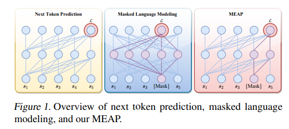

# [Mask-Enhanced Autoregressive Prediction: Pay Less Attention to Learn More](https://arxiv.org/abs/2502.07490)

摘要：研究发现，大型语言模型 (LLM) 无法准确检索关键信息。为了解决这个问题，我们提出了掩码增强自回归预测 (MEAP)，这是一种简单而有效的训练范式，它将掩码语言模型 (MLM) 无缝集成到下一个标记预测 (NTP) 中，以增强后者的上下文检索能力。具体而言，**MEAP 首先随机屏蔽一小部分输入标记，然后使用仅解码器的 Transformer 直接执行标准的下一个标记预测自回归。**MEAP 消除了 MLM 对双向注意或编码器-解码器架构的需求，在预训练或推理期间不会产生额外的计算开销。大量实验表明，MEAP 在关键信息检索和长上下文推理任务上的表现远远优于 NTP，而在常识推理任务上的表现相当或更好。 MEAP 的优势还扩展到监督微调，它在迷失于中间的场景中表现出显著的优势，比 NTP 高出 11.77 个百分点。我们的分析表明，**MEAP 的有效性源于它能够通过集中精力于一组减少的非掩码标记来提高更易区分的注意力得分。这种机制提高了模型对任务相关信号的关注度，**同时减轻了外围上下文的影响。这些发现使 MEAP 成为大型语言模型的一个有前途的训练范例。

为此，我们提出了掩码增强自回归预测（Mask - Enhanced Autoregressive Prediction，MEAP）方法，这是一种简单却有效的大语言模型（LLM）训练范式，它能将掩码标记无缝融入下一个标记预测任务中。具体而言，我们首先随机对一小部分输入标记进行掩码处理，然后使用仅含解码器的 Transformer 以自回归的方式直接进行标准的下一个标记预测。这种简单的修改无需双向注意力机制，也不需要复杂的编码器 - 解码器架构，因此在训练过程中不会产生额外的计算开销。  在推理阶段，经过 MEAP 训练得到的大语言模型可以像采用标准下一个标记预测（NTP）方法训练的大语言模型一样轻松运行，无需额外的工程处理。MEAP 的简洁性使我们能够提升大语言模型在关键信息检索和长上下文推理方面的性能，同时还能保留仅含解码器的大语言模型出色的可扩展性效率。图 1 展示了不同训练范式的示意图。

作为一种通用的预训练范式，掩码增强自回归预测（MEAP）在预训练和微调场景中均能有效发挥作用。在预训练设置中，我们进行了对照实验，分别采用标准下一个标记预测（NTP）方法和 MEAP 方法对参数规模为 11 亿的类 LLaMa 大语言模型（Zhang 等人，2024）进行预训练，训练标记的规模从 400 亿到 2000 亿不等。  实验结果表明，MEAP 大幅提升了关键信息检索任务的性能。例如，在“大海捞针”（Needle in a Haystack，Kamradt，2023）任务中，平均得分提升幅度最高可达 33%；在多文档问答（Multi - Document Question Answering，MDQA，Liu 等人，2024b）任务中，得分提升最高可达 27.2 个百分点，同时还保留了模型在预训练阶段学到的通用知识。值得注意的是，在“大海捞针”任务中，MEAP 使用 600 亿训练标记就能达到 85.8%的准确率，而 NTP 要达到类似性能则需要 2000 亿训练标记，这凸显了 MEAP 在关键信息检索方面具有卓越的数据效率。此外，与原始的 NTP 方法相比，MEAP 产生幻觉（即生成无事实依据内容）的情况也更少。

此外，MEAP 在大语言模型的微调方面也展现出良好的效果。我们的 MEAP 框架在多个常识推理任务中均实现了持续的性能提升，相较于 NTP 基线，平均得分提高了 1.12 分。在多文档问答任务中，MEAP 在所有测试位置上的平均性能提升了 11.77%。

---

方法：

pretrain:

这种方法的核心思想是在预训练阶段有选择地对输入的部分内容进行掩码处理。具体而言，我们采用了一种固定比例的掩码机制，即按照预先设定的百分比 $P$ 对输入序列中的标记进行随机掩码。通过这种方式，模型被迫在缺少部分上下文信息的情况下进行学习，这有助于提升其深度理解和推理能力。

P = 15%

**大语言模型微调 MEAP 也可以拓展到微调场景中。**

在这种方法里，我们会复制训练样本，并在微调时对复制后的序列应用相同的随机掩码策略。然后，将原始序列和经过掩码处理的对应序列合并成一个输入序列，再输入到模型中。从形式上来说，使用因果注意力机制的下一个标记预测对以下目标进行建模：

 $p_ {\theta}(X') = \prod_{t = 1}^{T} p_{\theta}(x_t | x_1, ..., x_{t - 1}; x_1, [mask], ..., x_{t - 1})$

这种设计解决了一个关键问题：**有监督微调中的输入序列通常包含对下游任务至关重要的关键信息。直接对原始序列进行掩码操作可能会移除关键信息，从而有可能损害模型在目标任务上的表现。对复制后的序列进行掩码处理，在将掩码语言模型（MLM）融入下一个标记预测（NTP）的同时，避免了这个问题。**

在实验中，我们在微调时选择的掩码比例 $P$ 为 10%。**对于答案长度超过 50 的问答对，我们才采用 MEAP 方法** 否则，就对该问答对采用标准的NTP方法。值得注意的是，虽然 MEAP 在微调时使序列长度增加了一倍，但图 5 显示，它只需一半的训练时间就能取得比NTP更优的性能，本质上用更少的训练标记就获得了更强的结果。**我们认为，MEAP 的有效性源于它在大语言模型训练过程中能够通过聚焦于更少的标记来促使模型产生更具区分度的注意力，因为被掩码的标记通常只会得到极少的注意力。**如第 5 节所验证的，这种改进有助于模型关注与任务相关的信号，同时减少外围上下文的影响。
