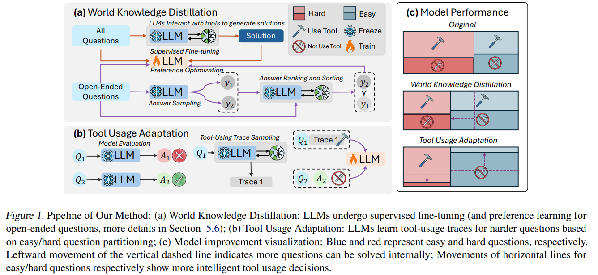
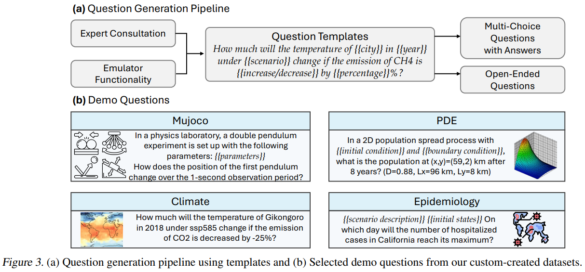

# Adapting While Learning:Grounding LLMs for Scientific Problems with Intelligent Tool Usage Adaptation

**问题：**大语言模型已经表现出能够解决一些简单的科学问题，但是也会受到幻觉问题的困扰， 特别是碰到一些复杂问题的时候。
在将大语言模型（LLMs）与工具集成时，虽然可以提高可靠性，但这种方法通常会导致对工具的过度依赖，从而降低模型通过基本推理解决简单问题的能力。
相比之下，人类专家在选择适当解决方案之前，首先会利用领域知识评估问题的复杂性。受到这种人类问题解决过程的启发，我们提出了一种新型的双组件微调方法。
第一部分是世界知识蒸馏（WKD），LLM直接从使用工具的信息生成的解决方案中学习，以内化领域知识。
第二部分是工具使用适应（TUA），我们根据模型的直接回答准确性将问题分为简单和困难两类。在对简单问题保持与WKD相同的对齐目标的同时，我们训练模型在面对更具挑战性的问题时智能切换到工具的使用。
我们在六个科学基准数据集上验证了我们的方法，这些数据集涵盖了数学、气候科学和流行病学。在所有数据集上，我们的模型在答案准确性上平均提高了28.18%，工具使用精度提高了13.89%，超越了包括GPT-4o和Claude-3.5在内的最先进模型。

---

第二段落：
0. 解决科学问题的一个方法是使用LLM调用工具。

1. 模型过度依赖工具吗，不仅由于资源密集型的科学工具而增加了计算成本，还限制了模型内化知识的能力。
2. 人类专家会首先根据问题难度来决定使用基础的推理还是特定的工具。
3. 目标是在LLM中建立相似的能力，将它们开发成跨科学领域的可靠且准确的助手。
4. 目前的很多的工作使用提示工程或者后训练技术，但是还没有判断是否要使用工具的相关工作。
5. 第三段落：
6. 提出了一个由两阶段构成的训练方法：
   * World Knowledge Distillation : 使用有监督的微调以及偏好学习，让预训练的大语言模型与利用外部工具信息生成的高度准确的解决方案相一致，
     旨在将科学知识内化。
   * Tool Usage Adaptation：评估LLM直接回答的能力，并且根据模型的精度将问题分为简单或者困难。在保持简单问题的相同对齐目标的同时，我们训练模型在难题上遵循外部工具的轨迹，从而能够根据问题的复杂性进行智能切换。

第三段落：

贡献：

* 提出了一个新的两阶段的训练方式，能够让LLM自适应的解决不同难度的真实世界的科学问题。
* 构建了四个不同科学领域的数据集，包括问题和答案，用于加速该方向的研究。
* 在自己和公开的数据集上的实验表明我们的工作的有效性，导致了更好的回答精度和更智能的工具使用。

---

相关工作：

* LLM对齐
* Grounding LLMs for Scientific Problems
* LLM as Tool User：
  * tools with timevarying results：搜索引擎，社交媒体
  * tools with consistent results： 编译器，物理引擎，科学数据库

虽然这些方法利用了大语言模型的工具使用能力，**但它们并没有增强大语言模型的固有领域知识**。此外，现有研究还没有解决**训练大语言模型根据问题的复杂性做出关于工具使用的智能决策这一问题**，这常常导致对训练期间涵盖的工具过度依赖。

---

**方法：**

Solution Generation with Tools: 根据system prompt + tool usage traces + query -> answer.

World Knowledge Distillation: 监督学习直接拟合上一步使用tool生成的结果。

Tool Usage Adaptation：根据**预先定义的问题精度阈值将问题分为：简单部分和困难部分。**对于简单部分采用WKD对其目标。对于困难问题：augmented solution with tool usage traces and train the LLM to

**follow these traces accurately.训练目标是拟合工具调用的轨迹**

最终简单和困难问题的loss加权求和得到最终的loss。

注意：

* apply the same prompt Pi across both easy and hard questions to train the model’s ability to determine when to leverage tools.
* Recent research (Zeng et al., 2024) has highlighted a critical challenge: knowledge acquired under one prompting strategy may not readily transfer to another, often resulting in significant performance degradation.（prompting 策略的鲁棒性不高）To mitigate this issue, we propose leveraging a mixed loss that simultaneously considers both WKD and TUA objectives, thereby maintaining consistent knowledge across different prompting strategies.

---

实验：

* 数据：公开数据集: MATH, SciBench, 四个构建的数据集：Mujoco, Partial Differential Equations (PDEs), Climate Science, and Epidemiology.
* **数据构建方法：**
  * 我们的自定义数据集构建遵循一个系统的流程。首先，我们基于专家咨询和模拟器功能设计特定领域的问题模板。然后，我们通过在科学有效的范围内采样参数来生成单个问题。最后，我们使用大语言模型和工具使用轨迹来生成相应的解决方案。
  * 主要由多项选择题构成。

    
