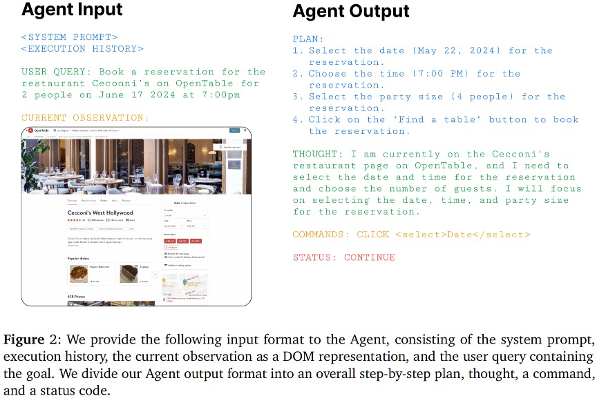
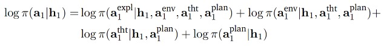
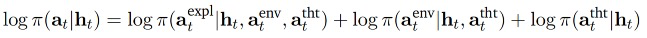
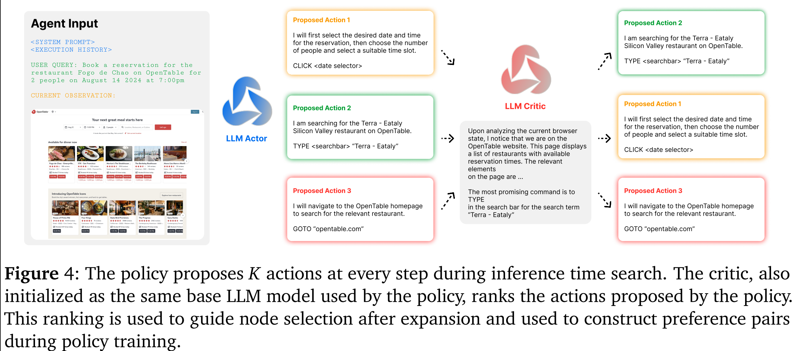
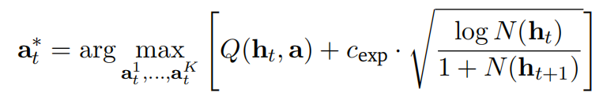
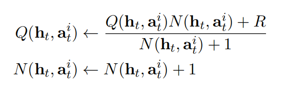
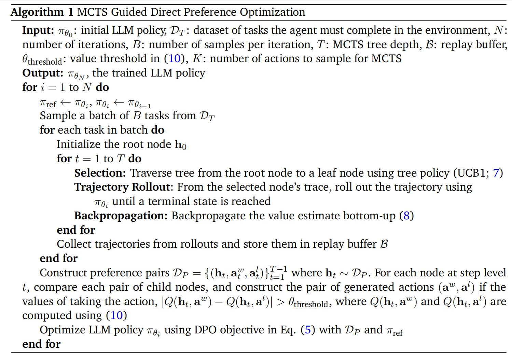

# Agent Q: Advanced Reasoning and Learning for Autonomous AI Agents

斯坦福大学在8月发表的增强大模型推理规划的论文，实验效果惊艳。

主要考虑的问题：在交互环境中的多步骤推理；传统的对静态数据集的监督预训练无法实现在web导航等动态设置中执行复杂决策所需的自主代理能力。以前弥补这一差距的尝试——通过对策划的专家演示进行监督微调，——经常遭受复合错误和有限的勘探数据，导致次优的策略结果。为了克服这些挑战，我们提出了一个框架，使用直接偏好优化（DPO）算法的n个非策略变体，引导蒙特卡罗树搜索（MCTS）与自我批评机制和使用代理交互的迭代微调方法相结合；我们的方法允许LLM代理有效地从成功的轨迹和不成功的轨迹中学习，从而提高了它们在复杂的、多步骤推理任务中的泛化能力。在电子商务环境和实时预定场景，进行效果验证；

基于提示的方法:虽然这些方法很成功，但它们仍然受到基础模型性能的限制。

基于微调的方法: 推理阶段的搜索prompting，利用搜索算法产生的轨迹，并将其与优化方法相结合.

**我们的目标是设计一种方法，允许代理通过自主经验和有限的监督进行改进。我们介绍了AgentQ——一种新方法，它是推理、搜索、自我批评和强化学习中的几个关键概念的结合。**

在给定复杂环境的情况下，我们使用一个**基础LLM来采样可能的理由和需要探索的网络行动**。虽然这种简单的搜索策略在成功率方面有了显著的提高，但由于环境奖励的稀疏性，它仍然在长期任务中挣扎。事实上甚至是一个小错误 该轨迹可能会导致最终的代理输出错误，造成重大的信用分配问题。为了克服这一问题，我们使用**人工智能反馈**（Bai等人，2022）和**自我批评**（Yuan等人，2024），进一步提示LLM在每个节点上提供自我评价反馈，作为中间节点 奖励并帮助指导搜索步骤。这有意义地提高了最终代理的成功率，但需要大量的在线交互，以及回滚操作的能力，而这在在线现实中并不总是可能的。这种在网络上少量监督的在线自主搜索会导致弱或不安全的代理，从而产生许多错误，导致敏感的在线设置中的危险行为 如银行转账和敏感信息共享。

为了纠正这一点，我们利用直接偏好优化（DPO）算法，**使用搜索过程生成的轨迹，通过离线强化学习成功和不成功的轨迹来提高模型的能力收益，我们在节点级别上创建对不同分支的偏好，这些偏好混合使用人工智能过程反馈奖励和被探索分支的最终成功率进行评分。**

在真实世界预订实验中，提升zero-shot success rate 从18.6%到81.7%,在经过一天的自主数据收集，已经超过了GPT-4的表现；当我们为Agent Q配备在线搜索能力时，我们的绝对成功率进一步提高到95.4%。

---

相关工作：

* Guided Search for Reasoning and Planing
  最近的工作提出了self-supervised methods for step-level supervision:树搜索与DPO算法结合，通过搜索算法在不同分支上产生的路径来构建参考pairs，然后在节点层面优化action。这篇论文提出的方法，使用AI-based feedback 来指导中间的搜索步骤。

  

---

## 相关概念

POMDP：（O，S，A，T，R，u, r），部分可观测MDP问题

O:观测状态空间；S：未观测状态空间；A：动作空间；T：转移概率；u_0:初始状态；r:折扣因子；

O：包括用户指令和当前的环境信息(网页信息（HTML DOM格式）)；偶尔，对于某些任务，代理可能会向用户请求确认/反馈，这也将成为观察的一部分。

A：agent action，以ReAct为基础：包括：：

* Planning:对于最初观察之后的第一个行动，我们利用了基础LLM的规划能力,然后提示代理生成一个计划用语言来表示后续的执行步骤；
* Reasoning:随后，所有的行动都包括一个思想行动
* Environment action:接下来，我们生成浏览器交互命令 reasoning_action + state -> env_action,这里是一个动作的有限集合：点击“元素ID””、“滚动”、“类型内容”或“询问用户内容”等；
* Explanation action：在生成环境交互操作之后，我们将额外提示模型以进行解释操作，reasoning_action + state + env_action -> explanation_action;

Step Action:

Initial Action:

The agent state:

是网络的当前状态，它可能是可以观察到的。在这个POMDP公式中，我们还需要构建一个代理内存组件h𝑡。相反，我们将代理的历史表示构建为h𝑡=（a1，……，a𝑡−1，o𝑡）。也就是说，代理程序的历史记录由迄今为止生成的操作和**当前的浏览器状态**组成。

DPO算法：

这里通过使用一个off-policy replay buffer（聚合采样得到的不同轨迹），避免了参考模型的使用；

实验：

使用AgentOhana xLAM-v0.1-r模型作为基础，该模型基于Mixtral-8x7B-Instruct-v0.1在大量agent相关的SFT数据上进行微调得到；使用于AgentLite一致的agent配置。

webshap-env:agent 需要在模拟环境中找到指定的符合需求的产品；该环境有12087个任务，这里使用11000个任务训练，1087个任务用于验证（zero-shotzero-shot）；

简单使用DPO能带来大约10%的提升；但是学习出来的策略- weak exploration；

## agent search

在本节中，我们将探讨通过MCTS赋予代理额外的搜索功能。

蒙特卡洛树搜索，四个阶段：**selection，exploration，simulation，backpropagation；**

**将web代理的执行制定为在网页上的树状搜索。**

state由agent 历史的总结以及当前网页的DOM树组成；相反，我们将使用基本模型作为一个行动-建议分布，并在每个节点（网页）上取样固定数量的可能行动。一旦我们在浏览器中选择并执行一个操作，我们就会遍历下一个网页，它与更新的历史记录一起成为新的节点。

**选择阶段**使用MCTS的上置信界（UCB1）公式，目的是为了平衡探索和开发；因此，我们结合基于人工智能的批评，在步骤层面提供过程监督，以指导探索过程。**我们使用基本模型为每个动作产生一个反馈分数，要求它根据其帮助代理完成用户任务的效用对生成的动作进行排序。**

MCTS-UCB1:

选择动作构建轨迹：

N（h_t）指的是h_t的观测频率，从根节点开始安装上述公式进行采样直到达到了叶子节点；

**Expansion and Backtracking:**

如果到达叶子节点执行成功了那么reward为1，否则reward为0；

这里需要跟踪两个值：Q（h_t, a_t^i）,通过状态h执行动作a能够获得的平均reward，以及state- action pair的观测频数；

