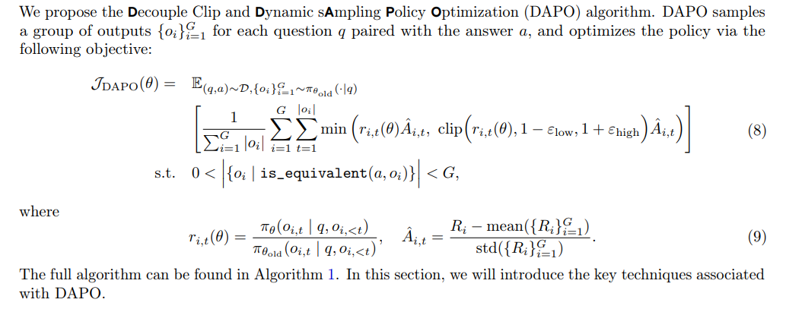

# DAPO: An Open-Source LLM Reinforcement Learning System at Scale

推理规模扩展使大语言模型（LLM）具备了前所未有的推理能力，其中强化学习是激发复杂推理的核心技术。然而，当前最先进的推理型大语言模型的关键技术细节处于保密状态（比如OpenAI的O1博客以及DeepSeek R1技术报告中的内容），因此学术界仍然难以复现它们的强化学习训练结果。  我们提出了解耦裁剪和动态采样策略优化（DAPO）算法，并完全开源了一个先进的大规模强化学习系统，该系统使用Qwen2.5-32B基础模型在2024年美国数学邀请赛（AIME）中取得了50分的成绩。与以往那些隐瞒训练细节的研究不同，我们介绍了我们算法中使得大规模大语言模型强化学习获得成功的四项关键技术。  此外，我们还开源了基于verl框架构建的训练代码，同时公开了一个经过精心策划和处理的数据集。我们这个开源系统的这些组成部分提高了研究的可复现性，并为未来大规模大语言模型强化学习方面的研究提供了支持。

我们使用Qwen2.5-32B [12] 作为强化学习的预训练模型来进行实验。在我们最初运行广义近端策略优化（GRPO）算法时，我们在美国数学邀请赛（AIME）中仅获得了30分，这一成绩明显低于DeepSeek的强化学习模型所取得的成绩（47分）。  经过深入分析后发现，简单的广义近端策略优化基线模型存在几个关键问题，比如**熵值崩塌、奖励噪声以及训练的不稳定性**。更广泛的学术界在复现DeepSeek的结果时也遇到了类似的挑战 [13-19]，这表明在R1论文中可能遗漏了一些关键的训练细节，而这些细节对于开发一个具有行业水平、大规模且可复现的强化学习系统来说是必不可少的。

提出了新算法使用50%的训练步数目，达到sota的效果。我们提出了解耦裁剪与动态采样策略优化（DAPO）算法，并引入四项关键技术，以使强化学习（RL）在长思维链（long-CoT）强化学习场景中表现出色。具体细节将在第3节中呈现。

1. **高裁剪（Clip - Higher）** ：该技术可提升系统的多样性，避免熵坍缩；
2. **动态采样（Dynamic Sampling）**：此技术能够提高训练效率和稳定性；
3. **标记级策略梯度损失（Token - Level Policy Gradient Loss）**：在长思维链强化学习场景中，这一技术至关重要；
4. **超长奖励塑形（Overlong Reward Shaping）**：该技术可减少奖励噪声，稳定训练过程。

我们的实现基于verl [20]。通过全面开源我们先进的强化学习系统，包括训练代码和数据，我们旨在为大规模大语言模型强化学习领域揭示有价值的见解，造福更广泛的研究群体。

---

PPO：introduces a clipped surrogate objective for policy optimization. By constraining the policy updates within a proximal region of the previous policy using clip, PPO stabilizes training and improves sample efficiency.

GRPO: Compared to PPO, GRPO eliminates the value function and estimates the advantage in a group-relative manner. 对于某一个（q, a）对，采样G个response， Then, the **advantage **of the i-th response is calculated by normalizing the group-level rewards. adopts a clipped objective, together with a directly imposed KL penalty term. 同样值得注意的是，广义近端策略优化（GRPO）是在样本层面计算目标函数的。确切地说，GRPO 首先计算每个生成序列内的平均损失，然后再对不同样本的损失求平均值。正如我们将在 3.3 节中讨论的那样，这种差异可能会对算法的性能产生影响。

方法：

* Removing KL Divergence：However, during training the long-CoT reasoning model, the model distribution can diverge significantly from the initial model, thus this restriction is not necessary. Therefore, we will exclude the KL term from our proposed algorithm.
* Rule-based Reward Modeling (数学竞赛，代码，理论证明)：

  * 1 = is_equivalent(y, y~)
  * -1 = otherwise

DRPO：

Raise the Ceiling: Clip-Higher：

* entropy collapse phenomenon：the entropy of the policy decreases quickly as training progresses (Figure 2b). The sampled responses of certain groups tend to be nearly identical. This indicates limited exploration and early deterministic policy, which can hinder the scaling process.（随着训练的进行，模型的输出response会趋同，缺少探索）

Clip-Higher： 我们发现，上限裁剪会限制策略的探索能力。在这种情况下，使得一个“利用型标记”更有可能出现，要比提高一个不太可能出现的“探索型标记”的出现概率容易得多。我们增大了\\(\\epsilon\_{high}\\)（较高的裁剪参数值）的值，以便为低概率标记的概率提升留出更多空间。如图2所示，这一调整有效地提高了策略的熵值，并有助于生成更多样化的样本。我们选择让\\(\\epsilon\_{low}\\)（较低的裁剪参数值）保持相对较小，因为增大它会将这些标记的概率压低至0，从而导致采样空间的崩塌。

Dynamic Sampling：

现有的强化学习（RL）算法在某些提示的准确率达到1时，会面临梯度下降的问题。例如，对于广义近端策略优化（GRPO）算法而言，如果某个特定提示的所有输出\\(\\{o\_i\\}\_{i = 1}^{G}\\)都是正确的，并且都获得相同的奖励1，那么这一组输出的优势值就为零。优势值为零会导致在策略更新时没有梯度，从而降低了样本效率。  根据经验观察，准确率等于1的样本数量会持续增加，如图3b所示。这意味着每一批次中有效提示的数量在不断减少，这可能会导致梯度的方差变大，并且会削弱用于模型训练的梯度信号。

为此，**我们提议进行过采样，并过滤掉准确率为1和0的提示**，如公式11所示，让批次中的所有提示都具有有效梯度，并保持提示数量一致。**在训练之前，我们持续进行采样，直到批次中完全填满准确率既不为0也不为1的样本。**

Token-Level Policy Gradient Loss：

原始的广义近端策略优化（GRPO）算法采用了基于样本层面的损失计算方法，**该方法首先对每个样本内的标记损失进行平均，然后再汇总各个样本的损失。在这种方法中，每个样本在最终的损失计算中被赋予了相等的权重。**然而，我们发现，在长思维链（long-CoT）强化学习场景中，这种损失计算方法带来了一些挑战。

由于在损失计算中所有样本都被赋予相同的权重，较长回复（包含更多标记）中的标记对总体损失的贡献可能会不成比例地降低，这可能会导致两种不良影响。 首先，对于高质量的长样本，这种影响会妨碍模型学习其中与推理相关模式的能力。其次，我们观察到，过长的样本常常会出现低质量的模式，比如胡言乱语和单词重复。因**此，基于样本层面的损失计算方法，由于无法有效地惩罚长样本中那些不良模式，会导致熵值和回复长度出现不合理的增加，如图4a和图4b所示。**

在这种情况下，与较短的序列相比，较长的序列对整体梯度更新的影响更大。此外，从单个标记的角度来看，如果某种特定的生成模式能够导致奖励的增加或减少，那么无论它出现在多长的回复中，这种模式都会受到同等程度的促进或抑制。

Overlong Reward Shaping：

在强化学习训练中，我们通常会为生成内容设置一个最大长度，过长的样本会相应地被截断。**我们发现，对被截断样本进行不当的奖励塑形会引入奖励噪声，并严重干扰训练过程。**

默认情况下，我们会给被截断的样本分配一个惩罚性奖励。这种方法可能会给训练过程引入噪声，因为一个合理的推理过程可能仅仅因为长度过长就受到惩罚。这样的惩罚可能会让模型对自身推理过程的有效性产生困惑。

为了研究这种奖励噪声的影响，**我们首先采用了一种超长过滤策略，该策略会屏蔽被截断样本的损失。我们发现，这种方法显著地稳定了训练过程并提升了性能，**如图5 所示。此外，我们提出了“软性超长惩罚”（公式13），这是一种考虑长度因素的惩罚机制，旨在对被截断样本的奖励进行塑形。**具体而言，当回复长度超过预先设定的最大值时，我们会定义一个惩罚区间。在这个区间内，回复越长，所受到的惩罚就越大。这种惩罚会被添加到基于规则的原始正确性奖励之上，从而向模型传达出应避免生成过长回复的信号。**

---
