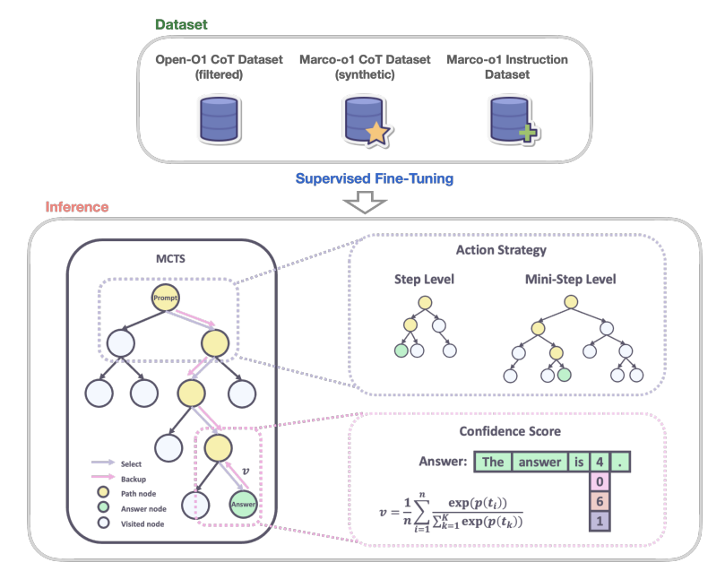

# Marco-o1: Towards Open Reasoning Models for Open-Ended Solutions

特点：不仅仅是关注有固定答案的问题（数学，物理，代码），也关注于开放性问题的回答。

核心问题：Can the o1 model effectively generalize to broader domains where clear standards are absent and rewards are challenging to quantify?

方法：CoT微调，蒙特卡洛搜索，反思机制，推理策略。使用Open-O1 CoT dataset，Marco-o1 CoT dataset，Marco-o1 Instruction dataset等数据进行微调，从top-k的对数概率可以导出多条搜索路径，通过探索这些搜索路径得到最优的解决方案。

* 合成CoT数据
* 通过MCTS来扩展解决方案的space（模型输出的置信度分数）
* 解释动作策略和反思机制
* 在翻译任务上的应用：exploring inference-time scaling laws in the multilingual and translation domain.

效果：在MGSM (English)数据集上+6.17%，在MGSM (Chinese) +5.60%，此外在翻译任务上显示出他对口语细微差别的出色掌握。

---

数据集：

* Open-O1 CoT Dataset (Filtered) [Team, 2024]: 筛选和过滤，45,125条样本
* Marco-o1 CoT Dataset (Synthetic)：使用MCTS来生成CoT数据集，10000条样本
* Marco Instruction Dataset：60266条样本

MCTS：

* Nodes as Reasoning States: In the MCTS framework, each node represents a reasoning state of the problem-solving process.
* Actions as LLM Outputs: The possible actions from a node are the outputs generated by the LLM. These outputs represent potential steps **or mini-steps in the reasoning chain.**
* Rollout and Reward Calculation: During the rollout phase, the LLM continues the reasoning process to a terminal state.
* Guiding MCTS: This reward score 𝑅 is used to **evaluate and select promising paths** within the MCTS, effectively guiding the search towards more confident and reliable reasoning chains.
  * Selection: 选择一个动作a(假想动作)： $score(a) = Q(a) + n * \frac{\pi(a|s_t;\theta)}{1+N(a)}$ 如果一个动作被探索过多次，那个他的概率会降低。
  * Expansion: 对手执行一个动作，状态更新。根据策略网络执行一个动作。
  * Evaluation：评价状态价值得到分数V，玩游戏直到结束获得reward，r,将(v+r)/2作为动作a的score。（Fast RollOut:模拟对局直到结束）
  * BackUp: 使用(v+r)/2来更新动作-价值。

confidence score: 在rollout阶段生成的每个token，计算得分为top5的tokens的softmax概率值。在获得序列的所有token后，计算token的平均分值，作为reward.

---

Action设计：

* Step as Action VS Mini-step as Action（32或者64个token）

Reflection after Thinking：

* **We introduced a reflection mechanism by adding the phrase “Wait! Maybe I made some mistakes! I need to rethink from scratch.” at the end of each thought process. Implementing this reflection has yielded significant improvements, especially on difficult problems that the original model initially solved incorrectly. With the addition of reflection, approximately half of these challenging problems were answered correctly.**
