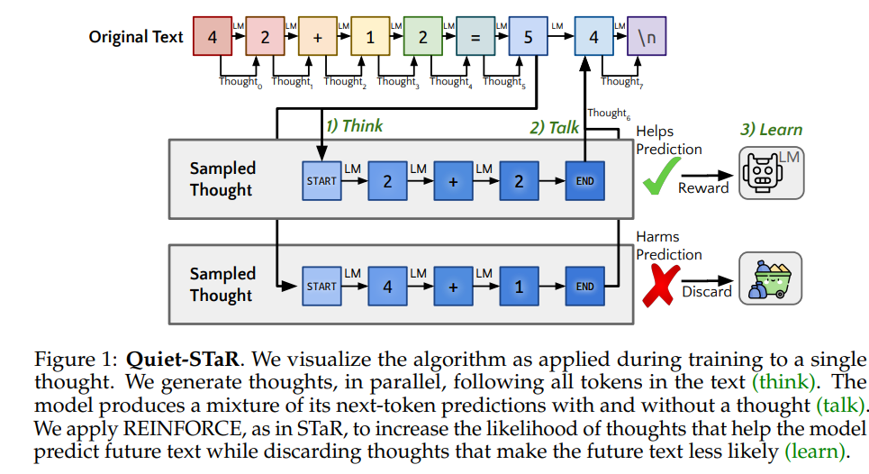
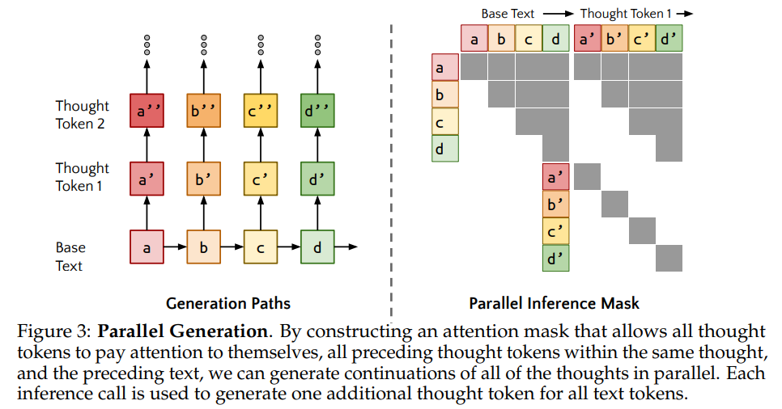
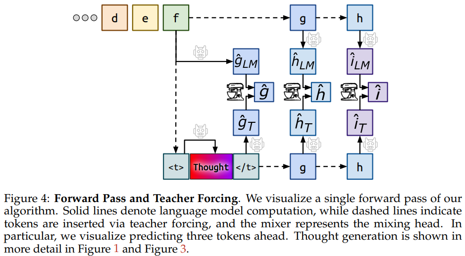

# Quiet-STaR: Language Models Can Teach Themselves to Think Before Speaking

摘要：人在写作的时候经常会停顿以用来思考。这是一个高度受限的环境——理想情况下，语言模型可以学习推断任意文本中未阐明的基本原理。Quiet-STaR：LM 学习为每个标记生成基本原理来解释未来的文本，从而改进他们的预测。我们解决了关键挑战，包括 1) 生成延续的计算成本，2) LM 最初不知道如何生成或使用内部思想，3) 需要预测超出单个下一个标记的需求。为了解决这些问题，我们提出了一种标记并行采样算法，使用可学习的标记来指示思想的开始和结束，以及扩展的teacher-forcing技术。令人鼓舞的是，生成的理由很大程度上有助于对难以预测的标记进行建模，并提高 LM 直接回答难题的能力。在使用该方法基于网络文本继续预训练后，GSM8K效果从5.9%提升到了10.9%，CommonsenseQA从36.3%提升到了47.2%。并且在困难token上也有困惑度的提升。

think:平行的生成思考token

talk:该模型会在考虑或不考虑的情况下生成下一个令牌预测的混合结果

learn:REINFORCE增加能够产生正确未来文本的thought概率，减少产生不相似的未来token的概率。

we train an LM to generate reasoning that helps it infer future text from a large internet text corpus.Thus, as in STaR, we leverage the LM’s pre-existing reasoning ability to generate rationales and train the LM on them with a REINFORCE-based reward.(利用LM现有的推理能力来生成理由，在此之上使用REINFORCE算法训练LM)

提出一个并行采样算法，给定string能够从所有位置的token中生成理由，使用meta-token用来判定什么时候应该生成理由，什么时候应该生成回答。mixing head:回顾性地确定将给定思想的下一个令牌预测合并到当前下一个令牌预测中的程度.

**non-myopic loss**:**including multiple tokens ahead for language modeling, improves the effect of thinking.**

we formulate the objective as accurately **predicting the remaining sequenc**e, rather than only the next token.

---

Method：

* think: n个token每个token生成r个长度为t理由，n X r个候选理由。We insert learned <|startofthought|> and <|endofthought|> tokens to mark each rationale’s start and end.
* talk: Mixing post-rationale and base predictions:From the hidden state output after each rationale, we train a ”mixing head” – a shallow MLP producing a weight determining how much the post-rationale next-token predicted logits should be incorporated compared to the base language model predicted logits.
* Optimizing rationale generation(learn): 优化the rationale generation parameters (start/end tokens and LM weights) to increase the likelihood of rationales that make future text more probable.

  To reduce variance, we apply a teacher-forcing trick to include in the loss the likelihood of predicting not only the token after the thought but also later tokens

Parallel Generation:

“Mixing” (Residual) Heads:

To smooth the transition to thinking, we introduce a learned interpolation between the LM predictions with and without thoughts.

Optimizing RationN

on-myopic Scoring and Teacher-forcingale Generation:

我们不希望思考在预测每一个token时都有用，我们希望模型的reward更多的依赖于接下来的语义内容，更少的依赖与思考后的第一个token。

