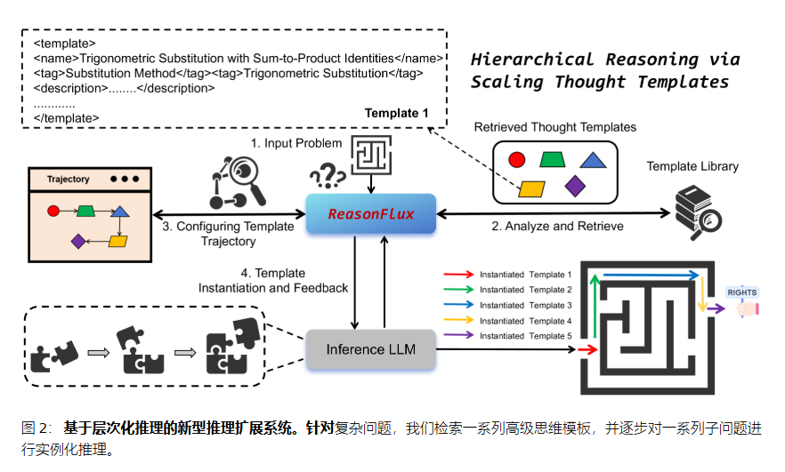
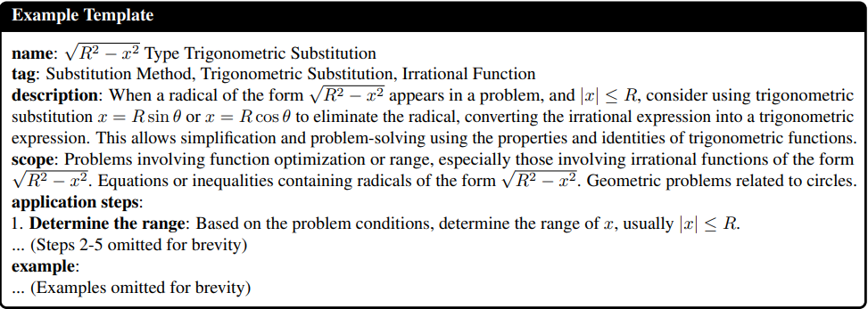

**主要贡献：**
引入了ReasonFlux，一种新颖的分层 LLM 推理框架，通过**在推理时自动检索相关的高级思维模板来配置最佳思维模板轨迹**，以在复杂的推理任务上实现卓越性能，
甚至超越 OpenAI o1-preview 和 o1-mini 模型。更具体地说，我们首先构建一个结构化模板库，**其中包含500 个有用的压缩思维模板，** 以实现高效的检索和适应。
我们不是优化较长的 CoT 轨迹，而是对一系列高级思维模板进行分层强化学习，优化基础 LLM 从多个思维模板轨迹中学习最佳思维模板轨迹，并指导推理 LLM 解决一系列更简单的子问题。
最后，我们通过自适应地扩展思维模板开发了一个新的推理扩展系统。这种分层推理范式使ReasonFlux能够简化推理路径的搜索，并通过为每个子问题动态选择最合适的高级模板来增强复杂问题的推理能力。我们的自动模板扩展使ReasonFlux能够有效地实现更好的探索-利用权衡，从而实现更稳健、更高效的问题解决过程。通过这些创新，ReasonFlux为增强 LLM 的复杂推理能力提供了更高效、更通用、更可扩展的解决方案。
最后，我们总结了我们的贡献如下：

1. 我们引入了ReasonFlux（见图 1），这是一个分层的 LLM 推理框架，可显著增强复杂推理能力，在具有挑战性的 MATH 和 AIME 基准测试中超越 o1-preview 和 DeepSeek-V3 等 SOTA 模型（见表2  ）。
2. 我们提出了一个结构化、紧凑的模板库，其中包含约 500 个从具有挑战性的数学问题中精选出来的思维模板。该库有助于高效检索和调整相关的高级思维模板，以用于一系列详细的推理步骤。
3. 我们对一系列高级思维模板进行分层强化学习，使得 LLM 能够为一系列较简单的子问题生成最优的思维模板轨迹，从而有效地简化推理路径的搜索空间。
4. 我们设计了一个新的推理扩展系统（见图2  ） ，通过自适应地扩展分层推理的思维模板。该系统允许ReasonFlux动态检索一系列高级模板，并在推理时自适应地执行实例化推理，从而实现更好的探索-利用权衡，实现稳健而高效的问题解决。

---

偏好学习：
然而，现有方法通常依赖于实例或步骤级奖励单元，可能无法捕捉和奖励人类解决问题过程中固有的高级认知过程。
为此，我们引入了基于分层 RL 的优化，这是一种新颖的偏好学习方法，它鼓励模型配置一系列高级思维模板，这些模板可以处理复杂问题的不同子任务，从而促进 LLM 中更像人类的问题解决策略。

---

结构化的思维模板库：
从不同的来源精心挑选了各种各样具有挑战性的数学推理问题，确保了模板库的稳健性和广泛适用性。我们使用 LLM 分析解决方案背后的思想，并生成简明的解决问题策略摘要并识别常见模式。这个过程产生了一个高质量、面向解决方案的思维模板集合。
我们使用 Gemini-2.0 （Team et al.，2023）从各种数学数据集的训练集中总结和提取高级思想，例如 MATH（7.5K 个样本）（Lightman 等，2023)和自编的CN高中竞赛级数据(2K样本)，构建了结构化的思维模板库(约500个思维模板)。我们在附录 A中提供了一些模板示例。

检索的时候跟进name和tag进行检索。

---

分层强化学习：

为此，我们开展分层强化学习进行训练，最终得到了“推理通量”（ReasonFlux），**它能够为某个问题有效地规划出一条最优的思维模板轨迹。**我们从模板库中检索并配置一系列相关模板，以协助将检索到的模板应用于具体的子问题。“推理通量”就像是一位经验丰富的导航员，它能提供一条被标记为 \$T\_{traj}\$ 的最优轨迹，使大语言模型（LLM）能够将抽象的思维模板转化为具体的顺序化问题解决步骤。

Structure-based Finetuning：

从$D_{temp}$中构建训练集$(T_{name}, T_{tag}, T_{des}, T_{sco})$,训练目标：$L_{struct} = -E_{D_{train}}[log \pi(T_{des}, T_{sco}|T_{name},T_{tag})] -> \pi_{struct}$根据名字和标签预测描述和步骤。

Preference Learning on Thought Template Trajectory：

基于经过微调的大语言模型 $\pi\_{struct}$，我们可以进一步提升它为输入问题 $x$ 规划一系列高级思维模板（即思维模板轨迹 $T_{traj}$）的能力，并将每个步骤与模板库中最相关的模板关联起来。这是通过我们在思维模板轨迹上进行的偏好学习实现的。

具体来说，如图 1 所示，给定一个输入问题 $x$，$\pi_{struct}$ 首先会分析并提炼该问题的条件信息，识别其中涉及的核心数学概念和关系。基于这一抽象表示，导航器 $\pi_{struct}$ 会配置一条轨迹 $T_{traj} = \{s\_1, s\_2, \ldots, s_n\}$，其中每个 $s_i$ 代表推理过程中的一个高级步骤，**与从模板库中检索出的一个可用于解决该问题的特定模板名称相关联，记为 $T_iTi$。随后，每个检索到的模板 $T_iTi$ 会结合输入问题 $xx$ 的具体细节进行实例化，并为另一个用于推理的大语言模型（记为 $\pi_{inf}πinf$）提供细致的指导，以解决该问题。**

为了衡量给定轨迹的有效性和泛化能力，我们使用一组与原始输入问题 $x$ 相似的问题 $X_{sim}$，其中包括问题 $x$ 本身。然后，我们沿着轨迹 $T_{traj}$ 使用实例化后的模板，引导 $\pi_{inf}$ 解决 $X_{sim}$ 中的每个问题 $x_i$。$\pi_{inf}$ 在这些问题上的平均准确率将作为轨迹奖励 $R(T_{traj})$。形式上表示为：

 $R(T_{traj}) = \frac{1}{|X\_{sim}|} \sum\_{x_i \in X_{sim}} \text{Acc}(\pi\_{inf}(x_i, T_{traj}))$  (3)

其中，$\text{Acc}(\pi_{inf}(x_i, T_{traj}))$ 表示在轨迹 $T_{traj}$ 的引导下，$\pi_{inf}$ 解决问题 $x_i$ 的准确率。  然后，我们利用这个奖励信号来构建优化对，从而进一步优化导航器 $\pi_{struct}$。更具体地说，对于每个输入问题 $x$，我们会采样多条不同的 $T_{traj}$，**并利用模板轨迹奖励评估其质量。**我们将用于优化 $\pi_{struct}$ 的损失函数定义如下：

$L_{TTR}(\theta) = - \mathbb{E}_{(x, (T^+_{traj}, T^-_{traj})) \sim D_{pair}} \left[ \log \sigma \left( \beta \log \frac{\pi_{\theta}(T^+_{traj}|x)}{\pi_{sft}(T^+_{traj}|x)} - \beta \log \frac{\pi_{\theta}(T^-_{traj}|x)}{\pi_{sft}(T^-_{traj}|x)} \right) \right]$  (4)

其中，$D_{pair}$ 是一个优化对的数据集。每一对包含一个输入问题 $x$ 以及两条轨迹 $T^+_{traj}$ 和 $T^-_{traj}$，且 $R(T^+_{traj}) > R(T^-_{traj})$。$\pi_{\theta}$ 表示使用参数 $\theta$ 进行优化的大语言模型，其初始参数来自 $\pi_{struct}$。

---

Inference Scaling with Scaling Thought Templates

“推理通量”（ReasonFlux）与 $\pi_{inf}$ 之间的交互并非单向过程，而是以迭代的方式进行。**在获得实例化步骤 $\hat{s}_is^i$ 后，“推理通量”会对其进行评估和分析，**我们将这一调整过程表示为 $\delta_i = \text{ReasonFlux}(T^*_{traj}, \hat{s}_i)$。基于这一评估结果和分析，“推理通量”会决定是否对轨迹进行优化，可能会调整后续步骤，甚至检索其他替代模板。这种迭代优化过程可以表示为：

$T^*_{traj} \leftarrow \text{ReasonFlux}(T^*_{traj}, \delta_i)$  (7)

“推理通量”与 $\pi_{inf}$ 之间的这种迭代反馈机制凸显了复杂问题解决过程中的一个关键方面：规划与执行之间的动态相互作用。通过分析推理过程中产生的中间结果，“推理通量”能够获得有价值的见解，从而为轨迹调整提供依据。这种优化解决方案路径的能力准确地反映了人类通常如何通过审视部分结果来发现更高效或更有效的解决方案。  此外，中间步骤可能会揭示问题中先前被忽视的约束条件或潜在机会，从而使我们能够采取更具针对性和更明智的方法。因此，借助这种迭代优化所实现的“推理通量”的分层特性，对于应对具有挑战性的推理任务的复杂性并实现最优解决方案至关重要。  总之，“推理通量”通过根据问题的复杂程度动态配置和调整模板轨迹来实现有效的问题解决，突破了传统推理方法的局限，提供了一个更高效、更强大的推理框架。
