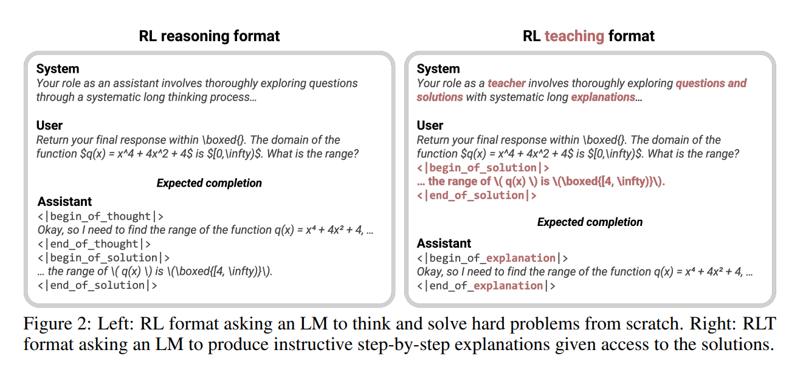
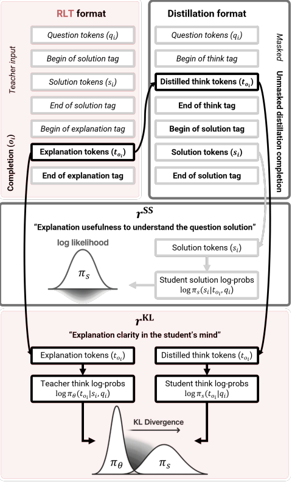

# Reinforcement Learning Teachers of Test Time Scaling

摘要：在训练推理语言模型（LMs）时，若采用强化学习（RL）并以 “非对即错”（one-hot）的正确性为目标，本质上依赖于模型在初始状态就具备一定概率探索并解决任务的能力。此外，推理 LMs 的一个关键应用场景是作为 “教师”，用于蒸馏新的 “学生模型” 并为未来的 RL 迭代提供冷启动支持，而非自身直接部署。基于这些考量，我们提出一种新框架：通过训练一类**强化学习教师（Reinforcement-Learned Teachers，RLTs）** 来规避 RL 的探索挑战，**其核心目标是实现最有效的下游蒸馏。**

RLTs 接收每个问题及其解决方案作为输入提示，任务是 “串联逻辑点”—— 生成针对学生模型的详细解释。我们使用**密集奖励**训练 RLTs：**将每个解释输入学生模型后，通过测试学生对问题解决方案的理解程度来获取奖励。**实践中，一个 7B 参数 RLT 的原始输出，在竞赛级和研究生水平任务上的最终性能，超过了现有蒸馏和冷启动流程（这些流程需收集并后处理规模大几个数量级的 LMs 的推理轨迹）。此外，RLTs 在训练更大的学生模型时仍能保持有效性，且在零样本迁移至分布外任务时同样适用，为 RL 推理框架解锁了更高的效率和可复用性。

探索是强化学习（RL）中的关键挑战之一，也是该领域文献的核心研究焦点 [1-3]。在稀疏奖励机制下，除非智能体在初始状态就已具备解决给定任务的能力，否则无法产生任何学习信号。

随着强化学习在开放式推理（即 “RL 推理”）中的应用兴起 —— 这种应用催生了一种新形式的语言模型（LM）扩展方式，其能力突破了提示工程和搜索的局限 [4,5]—— 探索问题再次成为核心挑战。强化学习的一个典型优势在于，它有望在奖励函数的引导下从部分解中逐步提升，并从零开始学习全新任务。然而，RL 推理框架中使用的 “非对即错” 型正确性奖励，无法提供密集的引导信号；相反，它仅专注于在初始模型的 “pass-at-k 尝试池” 中强化正确响应，而无法真正突破语言模型的初始潜在能力边界 [6]。因此，研究表明，只有大型且本身已具备较强能力的模型，才能在这种机制下持续改进，且性能超过成本更低、更简单的有监督优化方法 [7]。

---

### 强化学习教师（RLTs）框架：聚焦高效蒸馏的新型推理模型训练方法

由于这一根本性局限，再加上强化学习（RL）训练的不稳定性，蒸馏已成为当前推理范式中另一个无处不在的组成部分。在这种情况下，经 RL 训练的语言模型（LMs）在测试时的角色是作为 “教师”，为 “学生模型” 提供指导性推理轨迹，以帮助其解决新问题。这种师生范式被广泛应用于两个场景：一是训练更小、能力较弱的模型 [8,9]；二是甚至以教师自身的初始检查点作为学生，为未来的 RL 迭代提供冷启动支持，以实现更好的最终收敛 [7,10]。然而，研究表明，基于正确性奖励强化的解题能力，与下游蒸馏的目标并非完全一致 [11]。为解决这种不匹配，当前流程在很大程度上依赖于启发式驱动的教师输出后处理，以实现有效的学生能力迁移 [7,8,11,12]。

基于上述考量，我们提出一种新框架：通过训练一类专门的**强化学习教师（Reinforcement-Learned Teachers，RLTs）** 来规避 RL 的探索挑战，这类教师模型的训练目标明确指向高效的下游蒸馏。我们的核心直觉很简单：现实世界中教师的能力，并非通过其能否独立从零开始提出复杂定理、证明或答案来衡量；相反，**真正重要的是他们能否利用现成的解决方案，为学生设计出具有指导性的解释。**

因此，我们脱离传统的 RL 推理框架（该框架要求模型先独立思考，再首次提出新解决方案），转而赋予 RLTs 一个更简单的任务：**在提示中已给出问题解决方案的前提下，提供有效的解释。**我们使用**密集奖励**训练 RLTs，具体通过以下方式评估：学生模型的对数概率（反映其从教师解释中理解问题真实解的程度），以及解释本身中逻辑跳跃的可解释性。

通过从仅含 7B 参数的轻量级 RLTs 的原始输出中蒸馏学生模型，我们证明其性能显著优于依赖参数规模大几个数量级的推理 LMs 的现有流程（图 1）。研究表明，即使将 RLTs 的解释蒸馏用于训练更大的 32B 学生模型，或为传统 RL 优化提供冷启动支持，我们的框架仍能带来更优收益。此外，我们还展示了 RLTs 能够零样本迁移至新领域，且生成的蒸馏数据集效果显著 —— 相比直接使用任务奖励的 RL 方法，能训练出性能更优的最终学生模型。

总体而言，这些结果凸显了我们新方法的潜力：通过聚焦于更强、更小且可复用性高的专门教师模型，克服 RL 的高额成本，同时摆脱对昂贵且依赖启发式的蒸馏流程的依赖。我们开源了代码和预训练检查点 ¹，以促进 RL 推理与蒸馏领域的未来研究。

### 主要贡献总结

1. 我们提出 RLTs 框架，通过更简单的密集奖励机制解决探索挑战，使 RL 训练目标与高效下游学生蒸馏对齐；
2. 研究表明，从 7B 参数 RLTs 的原始输出中蒸馏学生模型，性能显著优于使用参数规模大几个数量级的 LMs 经精心后处理的推理轨迹训练的学生模型；
3. 我们证明 RLTs 可为传统 RL 提供更优冷启动支持、有效蒸馏至更大学生模型，甚至能零样本迁移至新推理领域。

---

---

有监督蒸馏是训练最新推理模型以弥补强化学习（RL）缺陷的另一关键步骤。对于如公式 1 所示的任何在线 RL 目标，要避免模型坍缩，初始状态下模型必须具备以非零梯度生成正确响应的显著概率。这一固有特性使得 RL 目标的适用性远不及交叉熵目标 —— 后者始终在模型梯度中包含正确响应的信息。

由于这种差异，对于较小、能力较弱的模型，通过有监督学习蒸馏经 RL 训练的大型语言模型（LMs）的推理轨迹，不仅成本更低，而且在诱导推理能力方面显著优于直接执行 RL [7,8,16,11,9]。此外，RL 容易出现不稳定性和输出质量下降，尤其在长时间训练过程中。受这一局限影响，DeepSeek R1 及其他多个模型 [7,10] 采用多轮 RL 训练：在每轮中间迭代结束时，仅使用经 RL 训练的模型再次收集蒸馏数据集，用于 “冷启动” 其原始初始检查点，为下一轮 RL 迭代获取更强的初始化起点。

#### 蒸馏数据集的构建流程

构建蒸馏提示数据集 $(D_{\text{SD}} = {d_1, ..., d_N})$的步骤如下：

1. 使用经 RL 训练的语言模型 $(\pi_\theta)$及其推理系统提示，对一组可验证问题进行回答（问题选择可采用多种启发式方法 [8,16,11,9]）；
2. 将模型针对每个问题生成的推理轨迹 $(o \sim \pi_\theta(\cdot|q))$ 与真实解对比，筛选出正确轨迹；
3. 通常，这些推理轨迹还需经过额外 “人工” 优化步骤进行后处理，例如调用其他闭源 LMs 修正语法问题，并将推理步骤重构为更规范、一致的格式。

事实上，Li 等人 [11] 甚至认为，推理数据的结构和格式是使较弱模型真正从蒸馏中理解并学习推理方法的关键因素，其重要性可能甚至超过正确性本身。

---

## Reinforcement learning teachers

经过RL训练的模型经常用于微调弱的学生模型，或者做为后续RL训练的冷启动模型。

这种师生范式凸显了一个潜在矛盾：用于强化学习（RL）训练的目标，与教师模型在测试时的实际角色并不匹配。在传统场景中，教师模型通过稀疏的正确性奖励进行训练，旨在提升其从零开始解决难题的能力。这一目标不仅因固有的探索挑战，限制了 RL 训练在基础模型原始能力范围之外任务的适用性，而且与教师的实际最终目标不一致 —— 教师的真正目标是生成推理轨迹，让学生模型 πₛ能够从中学习到独立推导正确答案所需的技能。

基于这些考量，我们提出了一种适用于 RL 推理模型的新型训练框架，使其能作为教师模型有效部署。该框架规避了 RL 的探索挑战，并解决了上述目标不匹配问题。其核心包括：更简单的任务设定、密集奖励目标，以及精心设计的训练方案，从而使我们能够训练出一类专门的**强化学习教师（Reinforcement Learned Teachers，RLTs）**。

在传统强化学习（RL）范式中，每个问题的解决方案$(s_i)$ 从未被明确提供给模型，仅用于验证语言模型生成的对应答案$(s_o^i)$的正确性。这种 “不直接提供解决方案信息” 的设计，虽能使训练目标与 “从零开始解决全新测试问题” 的测试时目标保持一致，但也正是这一点导致了探索难题 —— 模型在首次成功解题前无法获得任何梯度信号。

然而，我们的核心发现是：当测试时的目标是为**已知答案的问题**生成有效的蒸馏数据集$D_{\text{SD}}$（即 “教学” 目标）时，**明确提供解决方案**能极大简化这一过程。这与现实世界中的教师场景一致 —— 教师可借助现成的参考答案，从而将精力完全集中在如何为学生提供具有指导性的解释上。

为此，如图 2 所示，我们为 RLTs 设计了一种新的提示格式：将问题与解决方案同时作为输入提供给模型，其任务是生成**指导性的分步解释**，以衔接问题与答案之间的逻辑链条。我们对提示进行了专门设计，既确保教师模型的输出可直接用于学生蒸馏，又保持任务的自然性 —— 在生成每个补全内容前，将解决方案 token $(s_i)$和标签附加到 RLTs 的系统提示与输入问题中。

在测试时，构建学生蒸馏数据集$d_i \in D_{\text{SD}}$对应的问题补全内容变得极为简单：只需从教师输出中提取 “思考 token”（通过用 “思考标签” 替换周围的解释内容），再将解决方案$s_i$附加回去即可。

---

reward function:

接着，每个蒸馏提示会被输入到学生模型中，以获取一组逐token的对数概率，这些概率会被处理为以下两个奖励项：  i. $r_{\text{SS},i}$：用于量化学生模型$\pi_s$在给定问题$q_i$和上下文中的思考token$t_{o_i}$时，对解决方案$s_i$的理解程度。第一个奖励项基于学生模型对解决方案token的对数概率计算，通过平均和最小值运算进行归约： $[ r_{\text{SS}}(o_i, s_i, q_i) = \text{avg}{\log \pi_s^{s_i}} + \alpha \cdot \text{min}{\log \pi_s^{s_i}} \quad \text{其中} \ \pi_s^{s_i} = \pi_s(s_i \mid t_{o_i}.q_i) \quad (3) ]$

ii. $r_{\text{KL},i}$：从学生模型的角度，量化思考token$t_{o_i}$本身与教师模型的思考token相比是否为可解释的逻辑延续。第二个奖励项基于同一思考token在教师模型分布（在RLT格式下，上下文包含$q_i$和$s_i$）与学生模型分布（仅包含问题$q_i$）之间的KL散度计算，通过平均和最大值运算进行归约： $ r_{\text{KL}}(o_i, s_i, q_i) = \text{avg}\left { D_{\text{KL}}\left( \pi_\theta^{t_{o_i}} \parallel \pi_s^{t_{o_i}} \right) \right } + \alpha \cdot \text{max}\left{ D_{\text{KL}}\left( \pi_\theta^{t_{o_i}} \parallel \pi_s^{t_{o_i}} \right) \right } \quad (4) ]$ 其中，\$\\pi\_s^{t\_o\_i} = \\pi\_s(t\_o\_i \\mid q\_i)\$，\$\\pi\_\\theta^{t\_o\_i} = \\pi\_\\theta(t\_o\_i \\mid s\_i, q\_i)\$。   最后，RLT的奖励通过加权系数\$\\lambda\$将上述两项组合得到： \\[ r\_{\\text{RLT},i} = r\_{\\text{SS}}(o\_i, s\_i, q\_i) - \\lambda \\cdot r\_{\\text{KL}}(o\_i, s\_i, q\_i) \\quad (5) \\]

### 公式与术语解读

- \*\*\$r\_ {\\text{SS}}\$（解决方案理解奖励）\*\*：该奖励项通过平均对数概率反映学生对解决方案整体的理解水平，同时借助最小对数概率保障学生对解决方案中关键token的掌握，\$\\alpha\$用于调节最小值在整体奖励中的占比，确保学生不会忽略关键步骤。

- \*\*\$r\_ {\\text{KL}}\$（KL散度奖励）\*\*：此奖励项利用KL散度来衡量学生模型与教师模型在思考token分布上的差异。KL散度越小，表明学生在仅知晓问题时生成的思考token与教师在知晓问题和答案时生成的思考token越相近，意味着教师的解释符合学生的逻辑认知。平均运算用于把控整体的一致性，最大值运算则关注极端情况下的偏差，\$\\lambda\$用于控制该奖励项在总奖励中的惩罚权重。

- \*\*符号含义\*\*：\$\\pi\_s^ {s\_i}\$代表学生模型在思考token和问题上下文下对答案token的预测概率；\$D\_ {\\text{KL}}(P \\parallel Q)\$为KL散度，用于衡量两个分布之间的差异；\$\\text {avg}\\ {\\cdot\\}\$、\$\\text {min}\\ {\\cdot\\}\$、\$\\text {max}\\ {\\cdot\\}\$分别为平均、最小、最大运算，用于将逐token的概率或散度转化为标量奖励值。

- \*\*整体目标\*\*：公式（5）通过“\$r\_ {\\text{SS}}\$减去\$\\lambda \\cdot r\_ {\\text{KL}}\$”实现双重优化目标，既要最大化学生对答案的理解程度，又要最小化师生思考逻辑之间的偏差，从而训练出能够生成“清晰且符合学生认知的解释”的教师模型。

---

我们奖励函数中的每一项都有明确的作用。

首先，优化\$r\_{\\text{SS}}\$会促使模型生成包含特定思考token\$t\_o\_i\$的解释，这些解释能最大化学生模型得出正确答案\$s\_i\$的可能性。然而，仅靠这一项无法区分两种解释：一种是\*\*逐步引导学生推理\*\*的解释，另一种是虽能提高答案可能性、却未提供可学习的逻辑路径的解释。后者的极端情况是，解释仅通过重复答案token来提高可能性，却无法提供可迁移到新问题的通用推理示例。    因此，引入\$r\_{\\text{KL}}\$正是为了填补这一空白——它将教师的分布与学生的分布对齐，确保输出解释中的每个思考token，在仅包含问题\$q\_i\$和前文思考token的蒸馏提示\$d\_i\$中，不会出现概率过低的情况。直观而言，这一项的作用是\*\*正则化教师解释的每一步逻辑\*\*，确保即使仅基于学生的已有认知和问题本身，这些逻辑步骤在“学生的视角”中仍然合理。

此外，将平均值与最小值/最大值运算结合，可确保奖励不会忽略任何单个token，无论答案长度或教师解释中的思考token数量如何。例如，若忽略这种组合，可能会导致\$r\_{\\text{SS}}\$因答案长度产生偏差，或使教师倾向于生成冗长解释以掩盖困难但必要的单个逻辑步骤对\$r\_{\\text{KL}}\$的影响。关于这一点的进一步讨论，可参见附录D，其中我们通过实证分析验证了所有这些设计选择的合理性。

### 奖励项设计逻辑解析

1. \*\*\$r\_ {\\text{SS}}\$的局限性与\$r\_ {\\text{KL}}\$的补充作用\*\*：

- \$r\_ {\\text{SS}}\$仅关注“学生能否得出答案”，但无法保证解释的“可学习性”（如重复答案token的解释虽能提高答案概率，却无推理价值）；

- \$r\_ {\\text{KL}}\$通过约束“教师思考token与学生逻辑的一致性”，确保解释中的每一步推理对学生而言都是“可理解且可复现的”，从而实现从“答案灌输”到“推理教学”的转变。

2. \*\*极值运算的必要性\*\*：

- 平均值运算反映整体趋势，而最小值/最大值运算则聚焦关键token（如答案中的核心术语、推理中的转折点）；

- 这种组合避免了“多数token掩盖少数关键token”的问题，例如防止教师为降低\$r\_ {\\text{KL}}\$而牺牲必要的复杂推理步骤。

3. \*\*设计选择的实证基础\*\*：

文中明确指出附录D通过实验验证了这些设计（如奖励组合方式、极值运算的必要性），体现了方法的严谨性——每个组件的选择均基于可验证的效果，而非主观假设。这一奖励机制的核心目标是\*\*训练“会教学”的教师模型\*\*：既能帮助学生得出正确答案，又能传授可迁移的推理逻辑，最终实现“学生通过模仿教师解释学会独立解决新问题”的蒸馏目标。
