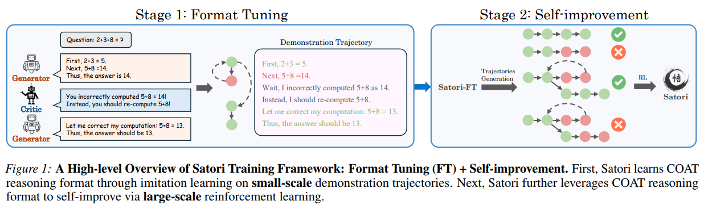
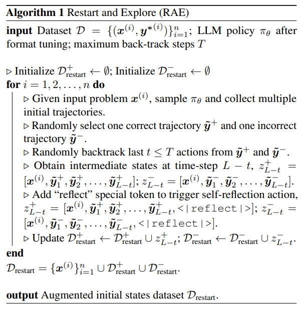

# Satori: Reinforcement Learning with Chain-of-Action-Thought Enhances LLM Reasoning via Autoregressive Search

摘要：

大语言模型（LLMs）已在多个不同领域展现出了卓越的推理能力。近期研究表明，增加测试时的计算量可以提升大语言模型的推理能力。这通常需要在推理阶段借助外部大语言模型验证器进行大量采样，从而形成一个双主体系统。尽管有外部引导，但该系统的有效性表明单个大语言模型也具备处理复杂任务的潜力。因此，我们提出了一个新的研究问题：能否将搜索能力内化，从根本上提升单个大语言模型的推理能力？

本研究探索了一个全新的方向，聚焦于对经过预训练的大语言模型进行自回归搜索（即一个包含自我反思和新策略自我探索的扩展推理过程）。为实现这一目标，我们提出了 “行动 - 思维链”（COAT）推理方法以及一个两阶段训练范式：1）小规模格式调整阶段，旨在内化 COAT 推理格式；2）大规模自我提升阶段，利用强化学习来优化模型。我们的方法造就了 Satori，这是一个基于开源模型和数据训练的 70 亿参数大语言模型。大量的实证评估表明，Satori 在数学推理基准测试中取得了当前最优的性能，同时在跨领域任务中也展现出了强大的泛化能力。代码、数据和模型都将完全开源。

---

贡献：

1. **效率**：Satori 是一个能够在**无需外部指导的情况下进行自回归搜**索的单一大型语言模型（第 6 节和附录 A）。此外，这一能力是在极少的监督下，通过**大规模自我提升**实现的。
2. *\*有效性*\*：Satori 在领域内的数学推理任务中表现卓越，并且在性能上超越了基于同一基础模型构建的指令微调模型（第 5.1 节）。
3. \*\*泛化性\*\*：与近期关于数学推理的研究不同，Satori 对领域外任务展现出强大的迁移能力，并且显示出具备**通用的自我反思和自我探索能力**（第 5.2 节）。

---

Method:

**行动 - 思维链推理（COAT）**

关键挑战在于让模型在没有外部干预的情况下，能够自主决定何时进行反思、继续推理或探索其他替代方案。为实现这一目标，我们引入了特殊的元动作标记，这些标记能引导模型的推理过程，使其超越标准的文本生成。这些标记就像是给模型的提示，让它在继续推理之前能判断何时重新评估自身的推理过程。

- \*\*继续推理（<|continue|>）\*\*：鼓励模型基于当前的推理路径，生成下一个中间步骤，从而延续推理过程。

- \*\*反思（<|reflect|>）\*\*：促使模型暂停当前推理，验证之前推理步骤的正确性。

- \*\*探索替代解决方案（<|explore|>）\*\*：提示模型识别自身推理过程中的关键缺陷，并探索全新的解决方案。

每个推理步骤y都是一个token的序列，其中起始token是meta token。

Learning to Reason via RL：x, y1 -> y2 ... -> yl

通过这种方式，我们可以使用强化学习（RL）来训练模型进行推理，目标是生成能使预期奖励最大化的推理步骤。然而，将强化学习应用于推理面临两个关键挑战：

1. \*\*对元动作标记缺乏认知\*\*：模型不理解特殊标记的用途，无法认识到遇到特殊的元动作标记时可能需要进行反思或提出替代方案。

2. \*\*长时程和稀疏奖励问题\*\*：推理需要进行长期决策，且只有在最终才能获得奖励，这会阻碍学习效果（贝勒马尔等人，2016）。模型必须采取许多正确的推理步骤才能获得奖励，一旦出现失误，就不得不从初始状态（即问题描述）重新开始。这使得学习变得困难，因为与奖励相关的训练数据十分稀少，而奖励对于推动强化学习的进展至关重要。

**所提方法概述**

为解决模型最初对元动作标记缺乏认知的问题，我们引入了一个预热的“格式调整”阶段：在一个包含少量示例推理轨迹的小数据集上对预训练的大语言模型进行微调（第 4.1 节）。这一步骤能让模型熟悉如何使用元动作标记以及对其做出反应。

其次，为应对长时程和稀疏奖励的挑战，我们受“围棋探索”（Go - explore，埃科菲特等人，2019 年）启发，**提出了“重启与探索”（RAE）策略。**在此策略中，**模型会从中途步骤重启，包括之前推理尝试失败的那些点，这样它就能专注于纠正错误，而非从头开始。我们还添加了探索奖励，以鼓励模型进行更深入的反思，从而进一步增加模型得出正确答案的机会**（第 4.2 节）。

Format Tuning Through Imitation Learning:

然而，为大语言模型生成高质量的示例推理轨迹对于复杂任务而言成本过高。为了高效构建示例推理轨迹数据集 $D_{syn}=\{(x^{(i)}, \tilde{y}^{(i)})\}_{i = 1}^{N}$，我们提出了一个多智能体数据合成框架，该框架利用了三个大语言模型：

- \*\*生成器\*\*：给定一个输入问题，生成器 $\pi_g$ 使用经典的思维链（CoT）技术为该输入问题生成多条推理路径。
- \*\*评判器\*\*：评判器 $\pi_c$ 评估生成器所生成推理路径的正确性，提供反馈以完善推理过程并修正欠佳的步骤。
- \*\*奖励模型\*\*：此外，奖励模型 $\pi_r$ 为经过完善的推理路径打分，并挑选出最有效的路径作为最终的示例推理轨迹。 这三个模型协同工作以构建高质量的示例推理轨迹（关于推理轨迹合成的详细内容见附录 C）。在这项工作中，我们采用了最简单的模仿学习方法——行为克隆，该方法利用有监督的微调在专家级的行动 - 思维链（COAT）示例推理轨迹数据集 \$D\_{syn}\$ 上训练大语言模型策略。值得注意的是，我们发现即使只有少量**（1 万条）的 COAT 示例推理轨迹，也足以让策略 $\pi_{\theta}$ 有效地遵循 COAT 推理格式。**

在格式调整之后，大语言模型策略 $\pi_{\theta}$ 采用了行动 - 思维链（COAT）推理风格，但在泛化能力上表现不佳，**尤其是在运用元动作进行自我反思方面。**这一局限源于格式调整阶段示例数据的匮乏。虽然收集更多示例数据会有所帮助，但这既昂贵又耗时。因此，我们探索该模型是否能通过强化学习（RL）来自我提升推理能力。  我们从经过格式调整的大语言模型入手，使用近端策略优化（PPO）算法（舒尔曼等人，2017b）对其进行训练，PPO 是一种广泛使用的强化学习方法。除了在数据集 $D$ 中的问题 $x$ 上进行训练外，**我们还训练模型 $\pi_{\theta}πθ$ 从格式调整后的大语言模型生成的部分推理轨迹开始进行推理。**  由于推理错误通常源于小失误而非根本性缺陷，从头重新探索效率低下。相反，我们允许模型从中途步骤重启以纠正错误，并最终得出正确答案。受“围棋探索”（Go - Explore，埃科菲特等人，2019）的启发，我们引入了“重启与探索”（RAE）策略。

**Reward Design.**

“重启与探索”（RAE）策略为模型提供了多次完善推理的机会，但有效的反思是利用这些机会的关键。除了将答案正确性作为奖励外，我们还引入以下额外奖励作为提示，引导模型得出正确答案：

- \*\*基于规则的奖励\*\*：基于规则的奖励仅评估最终答案的正确性。 $r_{rule}(\tilde{y}_L, y^*) = \mathbb{1}_{\tilde{y}_L - y^*}-1 \in \{-1, 0\}$
- *\*反思奖励\*\*：为强化自我反思，我们引入反思奖励 $r_{bonus}$。如果模型从存储在负重启缓冲区$D_{restart}^{-}$中的错误推理轨迹开始，并成功解决问题，它将获得奖励，这鼓励模型纠正过去的错误。相反，如果模型从正重启缓冲区$D_{restart}^{+}$中的正确轨迹开始，但未能解决问题，它将受到惩罚，这避免模型在已经走在正确轨道上时进行不必要的修改。形式上，反思奖励定义如下：$[r_{bonus}(z, \tilde{y}) =  \begin{cases} \beta & \text{如果 } z \in D_{restart}^{-} \text{ 且 } \tilde{y}_L = y^* \\ -\beta & \text{如果 } z \in D_{restart}^{+} \text{ 且 } \tilde{y}_L \neq y^* \\ 0 & \text{其他情况} \end{cases} ]$ 其中，\\(\\beta\\) 是奖励缩放超参数。
- \*\*偏好奖励\*\*：由于在训练初期正确答案较为罕见，奖励信号对于有效的强化学习训练而言往往过于稀疏。即使进行反思，模型也可能无法生成任何正确的推理轨迹，从而导致奖励稀疏问题。为缓解这一问题，我们使用布拉德利特里（BT）偏好框架**训练了一个结果奖励模型**（ORM）。ORM 会对推理轨迹进行评分，为正确（更受偏好）的轨迹赋予更高的值。对于数据集中的每个问题 $x \in D$，我们使用 $\pi_{\theta}$ 生成多条轨迹，并通过将正确和错误的输出配对来构建偏好数据集。训练一个 BT 模型，以最大化这些配对之间的得分差距。ORM 的输出 $\sigma(r_{\psi}(z, \tilde{y})) \in [0, 1]$ 作为细粒度的奖励信号，帮助模型进一步完善推理。具体细节见附录 D.3。

**迭代式自我提升**

强化学习（RL）能够让策略根据自身生成的轨迹进行自我提升，但这也可能导致恶性循环，即策略收敛到局部次优解而无法进一步改进。受（阿加瓦尔等人，2022；施密特等人，2018）的启发，我们提出了一种迭代式自我提升策略来缓解这一问题。  **具体而言，在每一轮强化学习训练之后，我们通过有监督的微调（SFT）将当前经过良好优化的策略的知识提炼到基础模型中。**然后，从新微调后的模型开始，我们再进行新一轮的强化学习训练。直观地说，从优化的角度来看，每一轮的知识提炼都可以看作是一种参数重置机制，它有助于策略在损失函数空间中跳出局部最优解，从而使其能够继续进行自我提升（更多细节见 D.3 节）。在下一节中，我们将提供实证证据来验证这一方法。

---

实验：

由于 Qwen - 2.5 - Math - 7B 具有强大的数学能力，我们将其用作基础模型。我们的训练数据来源于公开可用的数学指令数据集，即 OpenMathInstruct - 2 和 NuminaMathCoT。  在多智能体数据合成框架中，生成器需要生成高质量、逐步推进的推理轨迹。因此，我们使用 Qwen - 2.5 - MathInstruct 作为生成器。同时，评判器必须具备强大的指令遵循能力，所以我们选择 Llama3.1 - 70B - Instruct 作为评判器。为确保数据质量，我们过滤掉了存在无效问题或错误标签的样本，最终得到约 55 万个样本。更多实现细节可在附录 D 中找到。

**基准测试与评估**

我们主要使用数学基准测试对模型进行评估，以衡量它们的问题解决能力，这些基准测试包括 GSM8K、MATH500（MATH 测试集的一个子集，利特曼等人，2023 年）、AMC2023、AIME2024 和 OlympiadBench。除了 GSM8K 之外，其他数据集均包含竞赛级别的问题。评估过程采用贪婪解码，且不集成工具。报告的主要指标是零样本单次通过率（zero - shot pass@1 准确率），该指标衡量的是首次尝试就正确解决问题的比例。  此外，我们还在数学领域之外的广泛基准测试上进行了额外评估，以评估模型的通用推理能力。这些评估涵盖了逻辑推理（FOLIO，韩等人，2024 年；棋盘游戏问答（BGQA），卡泽米等人，2024 年）、代码推理（CRUXEval，顾等人，2024 年）、常识推理（策略问答（STGQA），盖瓦等人，2021 年）、表格推理（TableBench，吴等人，2024a）以及特定领域推理（MMLUPro 的 STEM 子集，王等人，2024b），其中 STEM 子集包括物理、化学、计算机科学、工程学、生物学和经济学等领域。更多评估细节请参考附录 D.4。

基线模型

我们将我们开发的模型 Satori - Qwen - 7B 与多个业界开发的大语言模型进行了比较。主要对比的是我们的模型和 Qwen - 2.5 - Math - 7B - Instruct（杨等人，2024a），后者是一个数学专用模型，与我们的模型基于相同的基础模型（Qwen - 2.5 - Math - 7B）构建。此外，我们还报告了一些更大模型的性能，包括 o1 - preview 和 QwQ - 32B - Preview，这些模型展现出了强大的推理能力，可作为性能上限参考。
