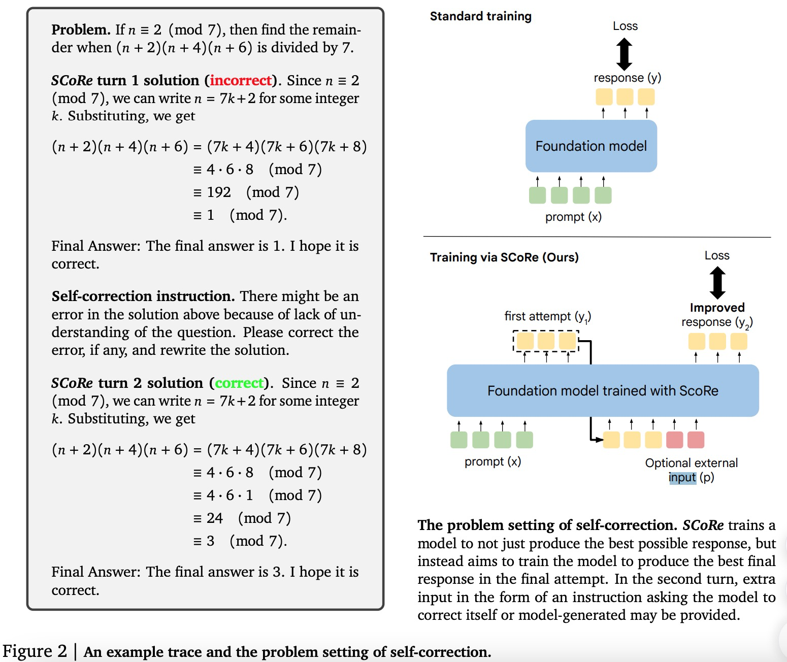
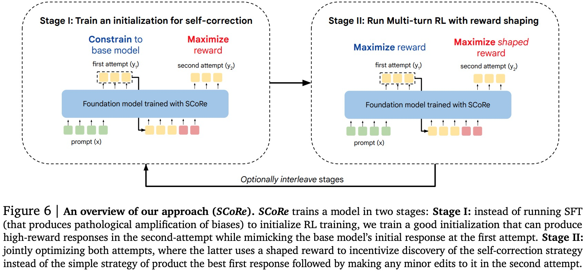

# Training Language Models to Self-Correct via Reinforcement Learning

摘要：自我修正是LLM一项备受期待的能力，现有获取这一能力的方法需要多个模型或依赖更强大的模型或其他形式的监督。这里提出了一个多轮在线强化学习方法，ScoRe,完全使用自我生成的数据显著提升了LLM的自我修正能力。首先，使用off-line生成的纠正轨迹对于self-correction是不够的。特别是，我们观察到，通过 SFT 进行的训练要么会**遭受训练数据与模型自身响应之间的分布不匹配的影响，要么隐含地只倾向于某种在测试时通常无效的纠正行为模式。**

SCoRe 通过**在模型自身的自生成校正轨迹分布下进行训练**，并**使用适当的正则化来引导学习过程学习在测试时有效的自我校正策略**，而不是简单地拟合给定的高奖励回复，从而解决了这些挑战。这种正则化规定在基本模型上运行强化学习的第一阶段，以生成不易崩溃的策略初始化，然后使用奖励奖金来放大训练期间的自我纠正。

基于Gemini 1.0 Pro and 1.5 Flash models在MATH和HumanEval基准上提升了15.6%和9.1%；

---

研究目标：

**strategies that help the LLM to use computation and interaction to improve its response on the test-time query.**

How can we instill LLMs with self-correction abilities?

* prompt 工程：难以进行有意义的内在自我纠正
* fine-turn：在推理是需要多个模型，比如一个验证器和一个纠正器，or require oracle “teacher” supervision to guide the process of self-correction。

SCoRe：训练一个单一模型，can both produce a response to a reasoning problem and also correct errors despite not receiving any oracle feedback. More importantly, SCoRe teaches this ability to models entirely by training on self-generated data, without any oracle.

* SCoRe runs multi-turn RL on self-generated data to avoid challenges with distribution mismatch between training and inference.
* To avoid the failure mode of learning a minimal edit strategy when training on on-policy data, we train SCoRe in two stages, with each stage regularizing the learning process to not collapse its behavior.
  第一阶段：训练一个模型初始化，优化纠正表现同时限制与基础模型接近；
  第二阶段：第二阶段运行多轮强化学习以优化两次尝试的奖励，同时使用奖励奖金术语鼓励改善从第一次尝试到第二次尝试的响应。

**SCoRe: Self-Correction via Multi-Turn Reinforcement Learning**

我们根据经验发现，虽然每次尝试的性能都通过朴素多轮 RL 的训练得到改善，但第二次尝试的性能与第一次尝试紧密耦合。随着训练的进行，标准多轮收敛过度偏向于不改变其响应，导致没有自我纠正能力。

Method overview：

在第一阶段（第一阶段），SCoRe 通过显式教导模型在相对静态的首次尝试分布下纠正其第二次尝试响应，训练模型初始化，使其在后续 RL 中不易崩溃。考虑到模型自己的第一次尝试分布，这种初始化扩大了第二次尝试响应的覆盖范围，并偏向于高奖励响应。

然后，我们使用此模型初始化来为实际的多轮 RL 运行提供种子，为了使学习偏向于学习自我纠正的解决方案，我们在第二次尝试时制定奖励，以提供有利于自我纠正的大量积极奖励奖金。

Stage I: Training a Model Initialization to Prevent Collapse：

Reward shaping to incentivize self-correction:

为了缓解这个问题，我们通过奖励塑造将学习问题偏向于自我纠正策略：通过更加强调将正确性从第一次尝试翻转到第二次的痕迹，我们可以使模型偏向于学习自我纠正解决方案.
