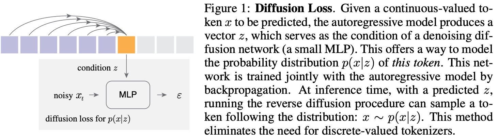
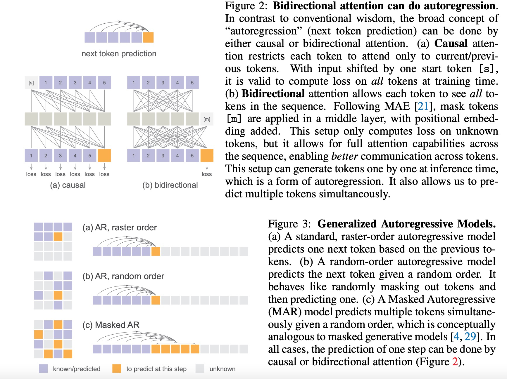

# Autoregressive image generation without vector quantization.

摘要：传统观点认为，用于图像生成的自回归模型通常伴随着向量量化标记。我们观察到，虽然离散值空间可以促进表示分类分布，但它并不是自回归建模的必要条件。在这项工作中，我们建议使用扩散程序对每个标记的概率分布进行建模，这使我们能够在连续值空间中应用自回归模型。我们没有使用分类交叉熵损失，而是定义了一个 Diffusion Loss 函数来模拟每个标记的概率。这种方法消除了对离散值分词器的需求。我们评估了它在广泛情况下的有效性，包括标准自回归模型和广义掩蔽自回归 （MAR） 变体。通过消除矢量量化，我们的图像生成器获得了强大的结果，同时享受了序列建模的速度优势。我们希望这项工作将推动自回归生成在其他连续值域和应用程序中的使用。

问题：自回归是否一定要使用VQ方法？

事实上基于之前的token预测下一个token与token是离散合适连续的是无关的。真正需要的是建模per-token的概率分布（由一个loss函数来定义），离散值可以很方便的将这个分布定义为类别分布。但这不是唯一的，只要有模型能够表示per-token的概率分布就可以了。

这里使用diffusion- model在连续值空间内建模per-token概率分布。autoregressively predicts a vector z for each token。

Conceptually, masked generative models predict multiple output tokens simultaneously in a randomized order, while still maintaining the autoregressive nature of “predicting next tokens based on known ones”. This leads to a masked autoregressive (MAR) model that can be seamlessly used with Diffusion Loss.

Masked Autoregressive (MAR) models:“next set-of-tokens prediction",random orider.

