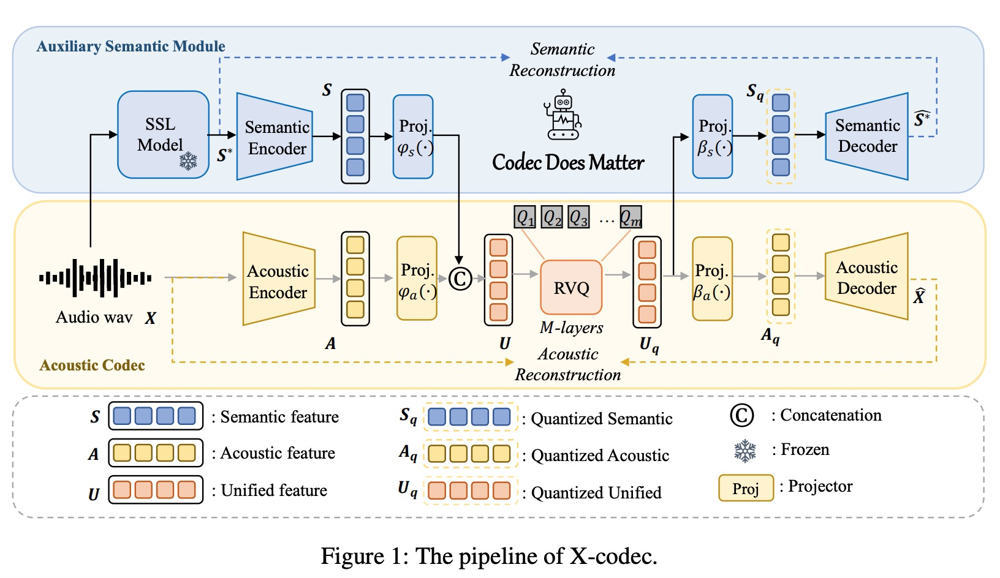

# Codec Does Matter: Exploring the Semantic Shortcoming of Codec for Audio Language Model

摘要：我们的研究旨在解决当前音频 LLM 编解码器的缺点，特别是它们在维护生成音频的语义完整性方面所面临的挑战。例如，现有的方法
像 VALL-E 一样，它根据文本转录来生成声学标记，但由于声学标记的语义误解，经常会出现内容不准确和单词错误率 (WER) 升高的情况，从而导致跳词和错误。

提出了X-code, X-Codec 在残差矢量量化 (RVQ) 阶段之前融合了来自预训练语义编码器的语义特征，并在 RVQ 阶段之后引入了语义重建损失。通过增强编解码器的语义能力，X-Codec 显着降低了语音合成任务中的 WER，并将这些优势扩展到非语音应用，包括音乐和声音生成。

我们在文本到语音、音乐延续和文本到声音任务中的实验表明，集成语义信息可以极大地提高音频生成中语言模型的整体性能。

most audio codecs focus on acoustic reconstruction which ignores the semantic information.

X-Codec 架构采用独特的“X 形”结构，其特点是两个输入和两个输出，将语义和声学信息统一在单个残差矢量量化器 (RVQ) 结构中。这种设计能够同时嵌入语义学习每个令牌的丰富性和声音保真度，导致音频LLM的更好表现。

---

Audio Codec：

reconstruct continuous signals into discrete representations for AR generation.

SoundStream： RVQ+GAN

Encodec：multi-scale discriminator and a loss-balancing strategy 增强压缩率

HiFi-Codec：GRVQ，减少code book

DAC:通过应用改进的码本学习来实现更高的压缩率，解决了码本崩溃（某些代码仍未使用）的问题。

SpeechTokenizer:融合HuBERT to separate speech into distinct VQ components for content and timbre/acoustic details.

SemantiCodec:使用pre-trained AudioMAE来生成语义和声学token。

模型结构：

* acoustic encoder
* quantizer
* acoustic decoder

**Designing Auxiliary Semantic Module**

使用Hubert或者wav2vec2.0作为语义特征编码器

---

实验：

为了确保公平和公正的比较，每个实验都采用了一个基线声学编解码器，该编解码器在训练数据、训练步骤和其他超参数方面与我们的 X-Codec 精确对齐。

评价指标：

WER：

Sim-O：使用speaker verification模型来度量合成音频与原始音频的相似度

UTMOS：Speech MOS (Mean Opinion Score) predictor，自动评测音频的自然程度

---

参考：

HiFiGAN，拥有多尺度和多周期判别器的高效声码器：https://zhuanlan.zhihu.com/p/406341310
