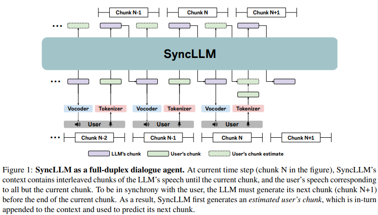
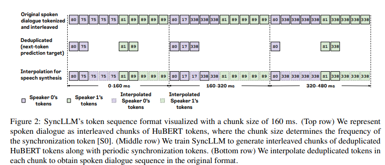

# Beyond Turn-Based Interfaces:  Synchronous LLMs as Full-Duplex Dialogue Agents

摘要：explicit prompting by the user or implicit tracking of inter ruption or silence events.（说话轮的切换，打断以及空白事件）

人类说话：富有同步性的交流形式，包括快速和动态的轮流发言、重叠讲话和回应反馈，作者认为主要的原因是预训练的LLM没有时间的概念。

方案：提出了同步LLM来进行全双工的对话建模。我们设计了一种新颖的机制，将时间信息集成到 Llama3-8b 中，使其能够与现实世界的时钟同步运行。我们还引入了一种训练方案，利用从文本对话数据生成的 212,000 小时的合成口语对话数据，创建一个能够生成有意义且自然的口语对话的模型，仅需 2,000 小时的真实口语对话数据。

全双工对话模型的难点：

* Understanding and generating turn-taking cues in spoken dialogue requires the model to have a common reference clock with the real-world.
* Compared to text-based chat datasets, spoken dialogue data is limited.
* Full-duplex dialogue entails model to be always listening and should always be ready to speak, because backchannels or overlaps could occur at arbitrary points in time. This requires the model to be streaming for the duration of the dialogue.
* 由于口语对话代理可能运行在云基础设施上，因此必须解决互联网传输固有的基本延迟问题。

这意味着我们预期对方接下来会说的几句话，并作出适当的回应。

SyncLLM:自回归的模型，预测与对话双方对应的交错语音单元块。在每个时间步中，模型预测与对话一方对应的固定持续时间的语音单元，这被称为模型的块大小，随后是与用户一方对应的语音单元。（固定时间交错预测说话双方的语音块）

位于第N个chunk但是LLM要输出第N+1个chunk的时候：用户的输入只有N-1个chunk，这是因为只有N个timestamp结束后才能知道用户的N个chunk,首先生成predict_user_chunk_n+1,然后生成llm_chunk_n

user_chunk_n-1 + llm_chunk_n -> predict_user_chunk_n

predict_user_chunk_n + llm_chunk_n -> llm_chunk_n+1

We then append this estimated chunk to the LLM’s context to generate the LLM’s next chunk (N+1)

---

Token sequence format使用HuBERT来表示音频，使用. Spirit-lm: Interleaved spoken and written language model.里面的tokenizer参数将音频离散化。40ms，25HZ。

音频vocabulary size 是501。

If a chunk has multiple deduplicated tokens
, like the second in Fig. 2, we repeat each token by an equal amount.

---

训练：

stage1： Turn-based spoken dialogue model with synthetic speech data.

Given a spoken question, we train the model to generate a spoken response.

[S1][S0][S1]..

Each sentence is randomly chosen to either be text or deduplicated speech token sequences during training.

Stage 2: Full-duplex dialogue assuminFrom each turn in the dialogue, we generate a speech utterance corresponding to one speaker and silence of equal duration corresponding to the other speaker. We then tokenize the parallel speech dialog data in the format shown in the second row of Fig. 2.g no overlaps.

Stage 3: Modeling with real-world spoken dialogue data

We use the Fisher (Cieri et al., 2004) dataset with 2000 hours of spoken dialogues, where each speaker’s speech in a dialogue is separated into independent audio channels.

---
