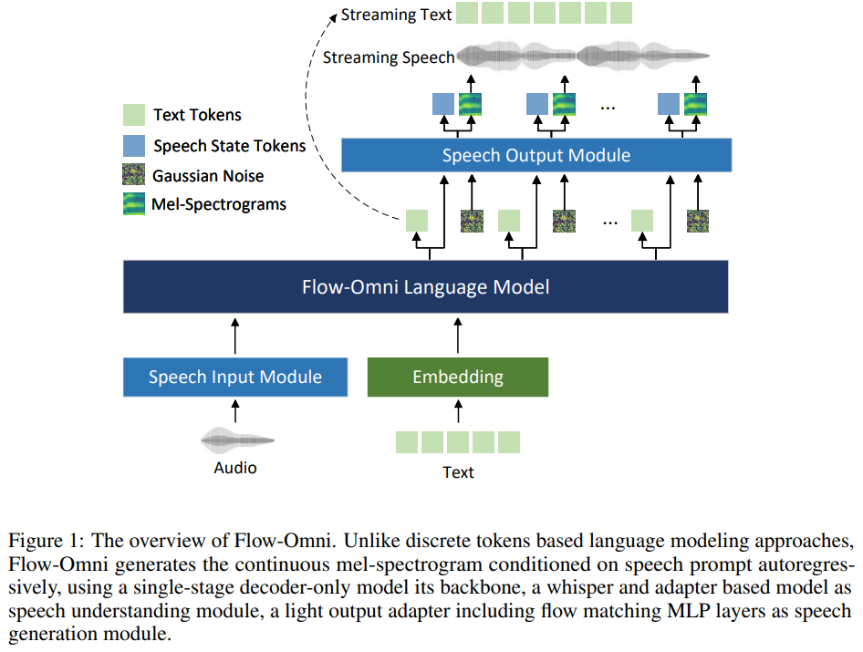
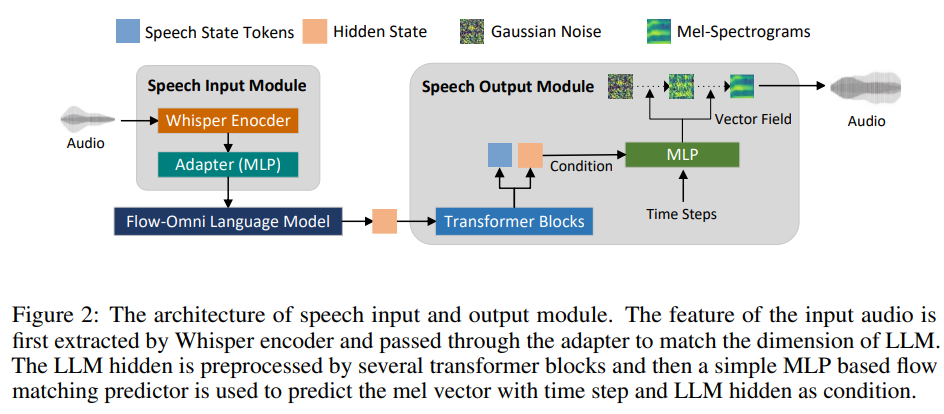
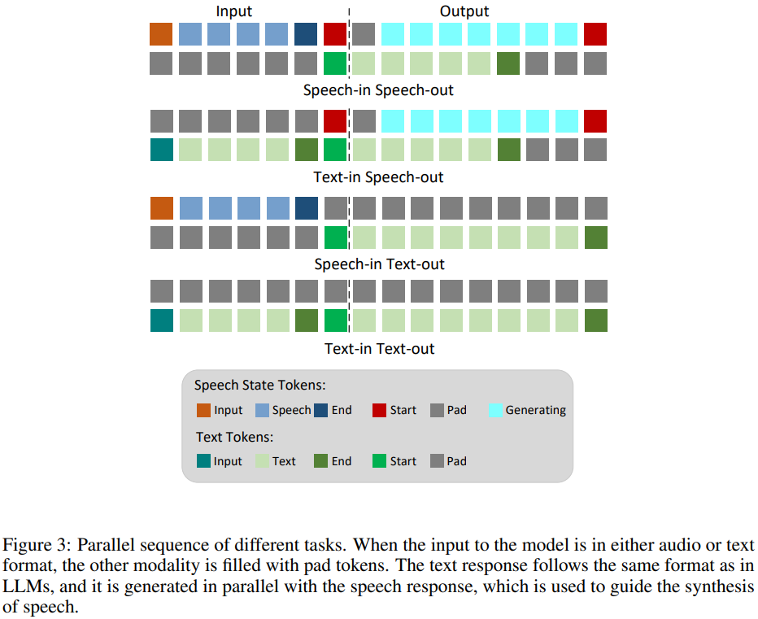

# Continuous Speech Tokens Makes LLMs Robust Multi-Modality Learners

**摘要**：像GPT-4这样的多模态模型的最新进展在直接语音对语音对话方面展现出了显著的进步，具备实时语音交互体验以及强大的语音理解能力。然而，当前的研究侧重于将离散语音标记与离散文本标记进行对齐以用于语言建模，这依赖于带有残差连接或独立分组标记的音频编解码器。这样的编解码器通常利用大规模且多样化的数据集训练，以确保离散语音代码对于不同领域、噪声、风格的数据重建有良好的表示能力，同时也需要精心设计编解码器量化器以及编码器 - 解码器架构来进行离散标记语言建模。

本文介绍了Flow-Omni，一种基于连续语音标记的类似GPT-4的模型，它能够实现实时语音交互并具有较低的流处理延迟。具体而言：（i）我们并非仅使用交叉熵损失，而是将流匹配损失与预训练的自回归大语言模型（LLM）以及一个小型多层感知机（MLP）网络相结合，以便根据语音提示来预测连续值语音标记的概率分布。（ii）**我们将连续语音标记融入到Flow-Omni多模态训练中，从而利用离散文本标记和连续语音标记共同实现稳健的语音对语音性能。**实验表明，与离散文本和语音多模态训练及其变体相比，连续语音标记通过避免离散语音代码在大语言模型表示损失方面的固有缺陷，缓解了稳健性问题。可访问https://cognitivespeech.github.io/flowomni查看我们工作的演示示例。

Introduction：

先做音频和文本得对齐，然后再进行对话训练。

尽管近年来基于离散文本和离散语音标记构建的多模态语言模型已经取得了显著进展，但由于一些固有的局限性，它们的端到端质量仍远不能令人满意。

首先，离散语音标记最初源自音频编解码器，该编解码器存在表示损失的问题，尤其对于训练中未出现过的样本，比如在高音调、有噪声、带情绪的场景下更是如此。

其次，离散标记高度依赖量化器架构来实现高重建质量，通常需要多层残差矢量量化（VQ）或多组并行矢量量化（VQ），这会在同一阶段引入许多量化向量（VQ）标记，或者与诸如字节对编码（BPE）之类的文本分词算法相比，一个序列中的总标记数量过长，难以进行建模。

另一方面，减小码本规模或采用单层码本矢量量化（VQ）方法来生成更短的语音标记序列，会对维持高语音质量构成重大挑战，进而导致可懂度和相似度较差。

此外，当模型与基于文本的大语言模型（LLM）联合训练时，语音标记化方面的这些局限性可能会产生更广泛的影响。不准确或低保真度的语音标记会给训练过程引入噪声，扰乱语音和文本模态之间的对齐。

在这项工作中，为了解决基于离散语音标记的多模态语言模型存在的局限性，我们提出了一种基于连续梅尔频谱（mel-spectrogram）的多模态语言模型（Flow-Omni）。Flow-Omni使用一个预训练的大语言模型（LLM），该模型基于先前的梅尔频谱和语音提示标记，借助流匹配模块以自回归的方式预测梅尔频谱，它继承了离散标记那样的采样能力，同时避免了与不准确的离散编码相关的缺陷。  具体而言，给定语音提示后，Flow-Omni首先利用由Whisper编码器构成的语音输入模块将波形编码为潜在嵌入表示，然后将其作为自回归输入进行投影，以便通过由流匹配预测器构成的语音输出模块有条件地生成梅尔频谱。最后，利用一个24KHz的声码器将梅尔频谱转换为波形。训练过程结合了离散交叉熵损失以及流匹配的连续向量回归损失。我们在收集到的训练数据集上对Flow-Omni进行了评估。实验结果表明，所提出的方法比基于离散语音标记的系统更具鲁棒性。

---

超越这些方法，Mini-Omni（由 Xie 和 Wu 于 2024 年提出）引入了文本和音频的并行生成机制，使模型能够直接基于音频输入和输出进行推理。同样地，Llama-Omni（由 Fang 等人于 2024 年提出）和 Moshi（由 Défossez 等人于 2024 年提出）采用并行处理技术进一步增强了多模态能力。此外，LSLM（由 Ma 等人于 2024 年提出）和 Moshi（由 Défossez 等人于 2024 年提出）通过将同时收听和讲话的信号作为输入，探索了全双工交互。

---

方法：Flow-Omni的模型架构如图1所示。我们在预训练的大语言模型（LLM）基础上添加了用于语音理解和生成的前置与后置模块，特别要说明的是，后置生成模块（由Fan等人于2024年提出）旨在预测连续的梅尔频谱帧，取代了来自音频编解码器量化器的传统离散语音标记。这一修改使得无需单独预训练且精心设计的音频编解码器，从而提高了语音重建的鲁棒性以及多模态能力。在本节中，我们将详细讨论Flow-Omni的架构、用于连续语音标记的语音输出模块，以及同时利用流匹配损失和大语言模型交叉熵损失的训练策略。

音频输入：Whisper + several linear blocks

Speech output module：

Thus, inspired by masked autoregressive model (MAR) [Li et al., 2024b, Wu et al., 2024, Liu et al., 2024], we build a speech output module for predicting continuous-valued mel-spectrogram in Flow-Omni. The mel-spectrogram frame is obtained by modeling the vector field of conditional probability density paths.

它利用Transformer模块从语言模型的输出中获取隐藏状态，将其作为与声学信息相关的条件，并预测当前语音流的状态，例如结束、填充以及生成等状态。条件向量场通过一个小型多层感知机（MLP）网络进行建模，该网络以Transformer模块的输出作为条件，预测条件概率密度路径，以便逐步将随机噪声去噪处理，使其转化为目标梅尔频谱。然后，当前预测出的梅尔频谱标记会通过一个基于生成对抗网络（GAN）的声码器（由Kong等人于2020年、Kumar等人于2019年提出）转换为波形。此外，预测出的梅尔频谱还会被输入到大语言模型（LLM）解码器中，以便以自回归的方式预测下一个梅尔频谱帧。

---

Parallel sequence modeling：

我们通过对并行语音序列和文本序列进行联合建模来扩展语言模型的语音能力（由Xie和Wu于2024年、Défossez等人于2024年提出）。在Flow-Omni中，**我们仅使用一个语音序列，该序列用于表示语音的状态，例如语音开始、填充、停止、生成等状态**，**而梅尔频谱则由语音输出模块进行预测**。该模型可以**接收语音或文本输入，并给出语音或文本响应。**总共有四种任务，其标记序列的构成如图3所示。语音状态序列和文本序列是并行输入和生成的。当输入为语音时，文本输入序列会用填充标记（pad tokens）进行填充，反之亦然。当响应为语音时，文本标记也会并行生成。为了充分利用文本信息，**应用了语音延迟生成技术，即梅尔频谱的第一帧比第一个文本标记晚一步生成。**在语音推理过程中，仅当语音状态为“生成”时，才使用语音输出模块预测梅尔频谱，并将其添加到自回归序列中。

