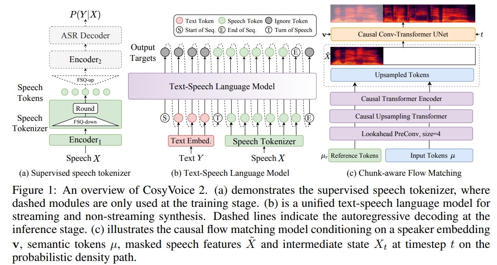
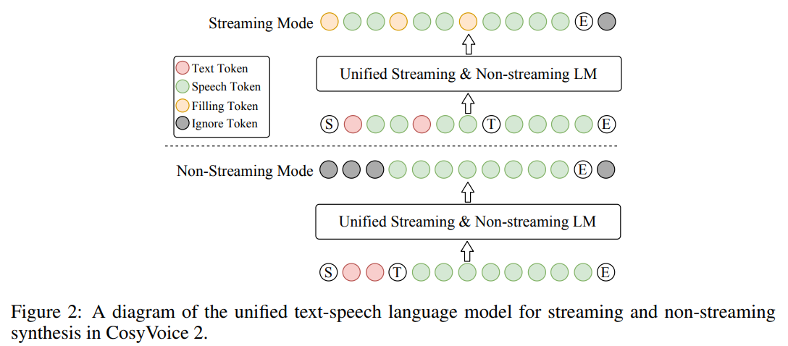
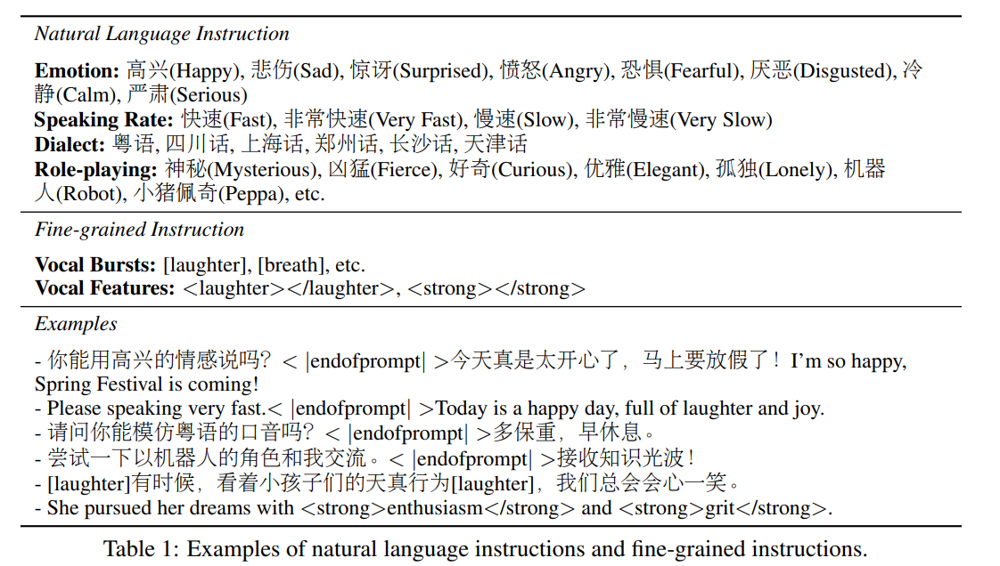

# CosyVoice 2: Scalable Streaming Speech Synthesis with Large Language Models

摘要：在我们之前的工作中，我们推出了 CosyVoice，这是一种基于有监督离散语音标记的多语言语音合成模型。通过采用渐进式语义解码以及两种流行的生成模型 —— 语言模型（LMs）和流匹配（Flow Matching），CosyVoice 在语音语境学习中展现出了韵律自然度高、内容一致性好以及说话人相似度高的特点。近期，多模态大型语言模型（LLMs）取得了重大进展，在这种情况下，语音合成的响应延迟和实时性因素在交互体验中起着至关重要的作用。**因此，在本报告中，我们展示了一种经过改进的流式语音合成模型 ——CosyVoice 2，它融入了全面且系统的优化措施。**

具体而言，我们引入了**有限标量量化来提高语音标记的码本利用率。**对于文语转换语言模型，我们对其模型架构进行了简化，以便能够直接将预训练的语言模型用作主干。此外，我们还开发了**一种分块感知因果流匹配模型**，以支持多种合成场景，**使得单个模型内既能进行流式合成又能进行非流式合成。**

通过在大规模多语言数据集上进行训练，CosyVoice 2 在流式模式下实现了与人类水平相当的自然度、极小的响应延迟以及近乎无损的合成质量。我们邀请读者通过此网址（https URL）试听示例音频。

---

简介：

zero-shot TTS models：

* codec language models
* feature diffusion models
* 上面两者的混合： combine the text-to-codec language model and codec-to-feature diffusion model

贡献：

* 在单一框架内统一流式合成与非流式合成，并提出统一的文语语言模型以及分块感知因果流匹配模型，与离线模式相比，实现了无损的流式合成。
* 通过移除文本编码器和说话人嵌入来简化语言模型架构，使得预训练的文本大型语言模型（LLMs）能够充当主干，增强对语境的理解。
* 用有限标量量化（FSQ）取代语音标记器中的矢量量化（VQ），提高码本利用率并捕捉更多语音信息。
* 提升指令式文本转语音（TTS）能力，以支持更多指令，包括情感、口音、角色风格以及细粒度控制。在 CosyVoice 2 中，指令能力和零样本能力被整合到单个模型内，从而实现更多样且更生动的合成。

通过上述系统性的修改和优化，CosyVoice 2实现了与人类水平相当的合成质量，并且在流式模式下近乎无损。统一框架放宽了部署要求，使得单个模型能够同时支持流式合成和非流式合成。  升级后的指令式文本转语音（TTS）能力为用户生成各类语音提供了一种更强大且更简便的途径。此外，分块感知流匹配设计也可应用于非自回归文本转语音（NAR TTS）模型，这显示出非自回归流式模型的发展潜力。

**设计思路：**

分离语音中的语义和声学信息并独立的建模他们，语音生成过程被重新定义为一个渐进式语义解码流程，在此流程中，条件信息会被逐步纳入其中。

* text-speech language model：关注语义信息，生成语义speech-tokens
* Flow Matching: 声学细节，通过说话人嵌入和参考语音引入，从而将语音标记转换为特定说话人的梅尔频谱。
* 最后一个预训练好的vocoder，将mel频谱转换为原始的语音信号。

### Supervised Semantic Speech Tokenizer

we insert the finite scalar quantization (FSQ) module [42] into the encoder of **SenseVoice-Large ASR model**

FSQ module:

* 中间表征H首先被投射到一个D维的低秩空间中，然后各维度的值通过有界舍入操作（ROUND）被量化到[−K, K]区间内。接着，经过量化的低秩表征$\overline{H}$会被投射回原始维度$\widetilde{H}$，以供后续模块使用。
* At the training stage, the straight-through estimation is used to approximate the gradients of FSQ module and Encoder1.
* The speech token µi can be obtained by calculating **the index of quantized low-rank representation** h¯ i in the (2K + 1)-ary system:

采样率：25 token 每秒

### Unified Text-Speech Language Model

我们移除了说话人嵌入以避免信息泄露。更重要的是，我们发现这种语句层级的向量不仅包含说话人身份信息，还包含语言及副语言信息，这会损害文语语言模型（text-speech LM）的韵律自然度以及跨语言能力。

得益于文语语言模型的简洁性，我们能够构建一个适用于流式合成和非流式合成的统一模型。**在此，“流式模式”意味着输入文本是以连续信息流的形式接收的，而非预先作为完整的句子被知晓。** 在CosyVoice 2中，流式模式和非流式模式之间的区别仅在于为语言模型构建序列的方式：

• 对于非流式模式，“序列起始”标记（S）、所有文本标记、“话语转换”标记（T）、所有语音标记以及“序列结束”标记（E）会按顺序依次连接，如图2底部所示。忽略标记意味着在最小化交叉熵目标函数时，它们对应的损失会被忽略。

• 对于流式模式，**我们按照预先设定的N:M比例混合文本标记和语音标记**，即每N个文本标记后面跟着M个语音标记，如图2顶部所示。如果下一个标记是文本标记，模型需要预测一个填充标记（而非该文本标记），这表明在推理阶段接下来的N个文本标记应被连接起来。一旦文本标记用完，“话语转换”标记（T）和剩余的语音标记就会按顺序依次连接，从而形成流式模式下的混合文语标记序列。在我们的实验中，N和M分别被设置为5和15。

• 语音语境学习（ICL），非流式：在语音语境学习中，语言模型（LM）需要来自参考音频的提示文本和语音标记，以模仿口音、韵律、情感和风格。在非流式模式下，提示文本标记和待合成文本标记会被连接起来作为一个整体，而提示语音标记被视作预生成的结果且保持固定，其序列为“序列起始（S）、提示文本、待合成文本、话语转换（T）、提示语音”。语言模型的自回归生成从这样的序列开始，直至检测到“序列结束”标记（E）。

• 语音语境学习（ICL），流式：在此情形下，我们假定待生成的文本是已知的，并且语音标记应以流式的方式生成。同样地，我们将提示文本和待生成文本视为一个整体，然后按照N:M的比例将其与提示语音标记混合，序列为“序列起始（S）、混合文语、话语转换（T）、剩余语音”。如果文本的长度大于提示语音标记的长度，语言模型将会生成“填充标记”。在这种情况下，我们手动填充N个文本标记。如果文本标记用完了，就会添加“话语转换”标记（T）。在流式模式下，我们每生成M个标记就返回一次生成结果，直至检测到标记E。

• 监督微调（SFT），非流式：在监督微调场景中，语言模型会针对特定说话人进行微调，不再需要提示文本和语音。因此，初始序列非常简单，即“序列起始（S）、待合成文本、话语转换（T）”。以此为起点，文语语言模型能够自回归地生成语音标记，直至遇到标记T。

• 监督微调（SFT），流式：在监督微调的流式模式下，我们从以下序列开始语音生成：“序列起始（S）、前N个文本”。然后，语言模型会生成M个语音标记，我们手动填充接下来的N个文本标记。我们重复上述过程，直至所有文本标记用完，然后添加标记T。需要注意的是，语音转语音多模态大型语言模型也可以采用这种模式来获得极低的延迟。

### Chunk-aware Flow Matching

### Instructed Generation

### Multi-Speaker Fine-tuning

### Reinforcement Learning for SFT

In CosyVoice 2, we employ speaker similarity (SS) and recognition word error rate (WER) from the ASR system as the reward function to improve speaker similarity and pronunciation accuracy in the fine-tuning stage. 使用DPO进行优化。

### 训练

SpeechTokenizer:20W 小时，中文和英文
