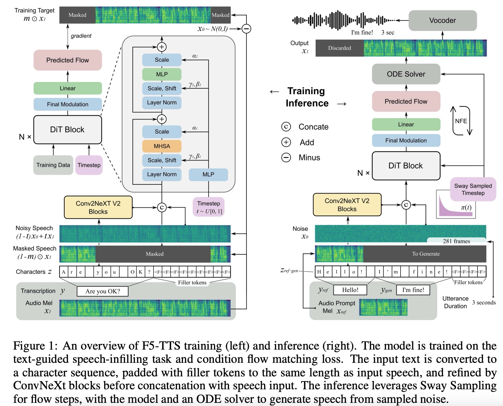

# F5-TTS: A Fairytaler that Fakes Fluent and Faithful Speech with Flow Matching

摘要：基于diffusion transformer 使用流匹配的TTS模型。特点是不需要复杂的设计，比如duration model, text encoder, and phoneme alignment。文本输入简单的padding到和输入音频相同的长度，然后使用denoising来训练音频生成模型。we first model the input with ConvNeXt to refine the text representation, **making it easy to align with the speech.**

We further propose an **inference-time Sway Sampling strategy**, which significantly improves our model’s performance and efficiency

使用100K小时的数据进行训练。

Flow Matching:

目标是匹配一个简单分布P0出发的分布路径Pt;

We trained our model on the **text-guided speech-infilling task;**

The infilling task is to predict a segment of speech given its surrounding audio and full text (for both surrounding transcription and the part to generate).
