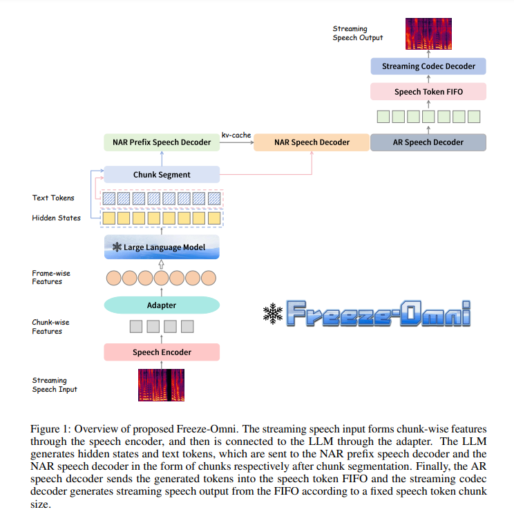
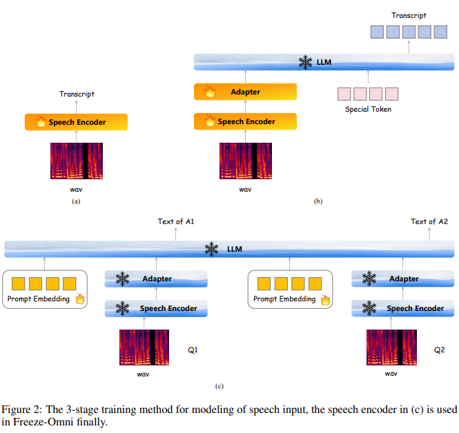
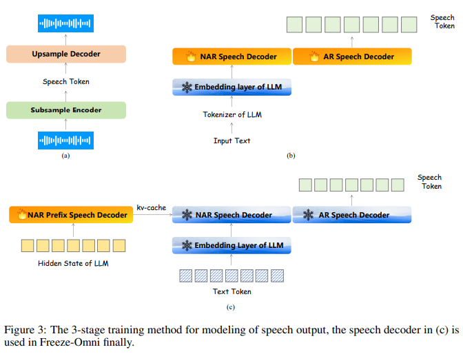
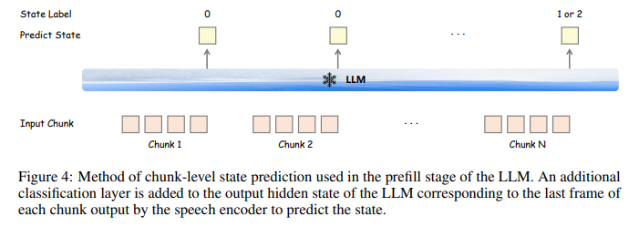

# Freeze-Omni A Smart and Low Latency Speech-to-speech Dialogue Model with Frozen LLM

摘要：快速发展的大语言模型（LLMs）带来了众多智能应用。特别是GPT-4的出色双向语音交互能力为用户带来了令人印象深刻的体验。研究人员近期在这个方向上提出了若干多模态大语言模型，它们能够实现用户与智能体之间的语音对语音对话。  本文提出了一种新颖的语音-文本多模态大语言模型架构，名为Freeze-Omni。我们的主要贡献在于，语音输入和输出模态能够轻松与文本大语言模型相连接，**并且在整个训练过程中可以保持大语言模型的参数冻结不变。**我们设计了一个三阶段训练策略，用于对语音输入和输出进行建模，使得Freeze-Omni能够利用文本-语音配对数据（例如自动语音识别和语音合成数据）以及仅6万条多轮文本问答数据，在8个图形处理器（GPU）上就获得语音对语音对话的能力。  此外，我们能够有效确保Freeze-Omni在语音模态下的智能水平与其主干大语言模型在文本模态下的智能水平处于同一层次，同时实现低延迟的端到端语音回复。另外，我们还设计了**一种通过多任务训练来实现双向对话能力的方法**，赋予了Freeze-Omni一种用户与智能体之间更自然的对话风格能力。  总而言之，Freeze-Omni在大语言模型参数冻结的条件下，基于多模态大语言模型开展语音对语音对话方面有着巨大的潜力，可避免因数据和训练资源有限而导致的灾难性遗忘问题。

---

三阶段的训练：

* Modeling of speech input：我们首先使用大量自动语音识别（ASR）数据来对语音编码器和大语言模型（LLM）进行对齐，使大语言模型能够从语音中理解语义信息。然后，在大语言模型参数冻结的情况下，采用提示嵌入的训练策略，让模型具备将语音输入转换为文本输出的能力，并且仅使用少量问答数据进行训练。
* Modeling of speech output：其次，我们使用大量的文本 - 语音配对数据来训练基于自回归（AR）的语音解码器，该解码器能够依据文本生成语音标记，并且使用基于单码本的编解码器模型将语音标记解码为波形。然后，我们设计了一种前缀键值（kv）缓存微调策略，利用大语言模型（LLM）输出的隐藏状态向量将语音解码器转换到LLM的输出文本空间，在保持LLM参数冻结的同时，实现文本输入转换为语音输出的能力。
* Design for duplex dialogue：最后，我们将上述环节中的语音编码器和语音解码器连接到主干大语言模型上。然后，利用逐块状态预测任务来判断用户是否中断对话，从而实现双向语音对语音对话的能力。

---

模型：具体而言，Freeze-Omni包含一个支持流式语音输入的语音编码器以及一个能生成流式输出语音的语音解码器。在训练过程中，**Freeze-Omni首先实现从语音输入到文本输出的对齐，然后实现从文本输入到语音输出的对齐**。最后，通过将这两个组件与大语言模型（LLM）相连接，便获得了从语音输入到语音输出的能力。本节将对Freeze-Omni的架构、训练策略以及双向对话设计进行详细介绍。

对于音频的建模：

首先使用一个chunk-wise的streaming speech encoder来将输入的音频特征转换为高维的表示，再通过一个adapter模块将其转换为基础LLM的embedding space。speech encoder 由一系列的下采样的卷积层和几个transformer层，adapter只由几个下采样的卷积层构成。

* 输入音频特征，输出标签是转录后的文本，使用CTC loss（只训练speech encoder）。
* 在第二阶段中，我们将第一阶段训练得到的语音编码器作为初始参数，并通过一个适配器将其与大语言模型（LLM）相连。大语言模型的输出仍以与输入语音相对应的文本转录内容作为标签。**在输入部分添加了几个可训练的特殊标记，以引导大语言模型完成本阶段的训练过程。在这个阶段，除了被冻结的大语言模型外，其他网络的参数都是可训练的。**
* 在最后阶段，我们首先**构建一个多轮问答数据集**，并使用训练所依赖的大语言模型主干来生成多轮回答。通过这种方式构建的数据集将与大语言模型主干完全兼容。随后，**我们使用多说话人语音合成（TTS）系统为问题部分生成语音模态的数据，并在多轮问答中的每个问题前添加可训练的提示嵌入，以引导大语言模型实现语音输入到文本输出的能力。在这个阶段，第二阶段中的可训练特殊标记将被舍弃，只有提示嵌入部分是可训练的，且每个问题都使用相同的参数。**语音编码器被冻结以保持在第二阶段获得的声学鲁棒性，大语言模型也被冻结以确保其智能不受影响。

建模音频输出：

采用和VALL-E相似的NAR和AR结构：非自回归（NAR）解码器用于对来自大语言模型（LLM）输出的语义特征进行建模，然后自回归（AR）解码器基于非自回归解码器的输出生成语音标记。最后，编解码器模型的解码器会将语音标记转换为语音流。

* 我们首先仅使用语音数据来训练一个基于单码本的编解码器模型。由于单码本足以从有限数量说话人的语音信号中提取语音标记，因此在此处使用单码本能够尽可能降低系统的复杂度和延迟。
* 我们首先构建大量的文本 - 语音配对数据，并将文本通过主干大语言模型的分词器，把文本转换为文本标记。然后，我们将文本标记通过大语言模型的嵌入层，将其转换为嵌入向量作为语义特征，并将它们发送至非自回归（NAR）语音解码器。自回归（AR）语音解码器以教师强制（teacher force）的形式预测输出语音标记。这里的标签是利用在第一阶段训练的编解码器模型提取出来的。非自回归和自回归语音解码器使用相同的参数，并且大语言模型的嵌入层是被冻结的。
* 在最后阶段，**我们使用与2.2.2节第三阶段相同的多轮问答数据集**，并利用主干大语言模型生成的文本标记和隐藏状态序列。如图3（c）所示，添加了一个额外的非自回归（NAR）前缀语音解码器，用于对大语言模型的隐藏状态进行建模，并将其输出的键值（kv）缓存传递给非自回归语音解码器。然后，文本标记将被输入到在第二阶段训练的非自回归语音解码器中。自回归（AR）语音解码器的文本标记标签是由大语言模型输出文本通过语音合成（TTS）系统生成语音数据，再由第一阶段的编解码器模型转换为语音标记后得到的。在这个阶段，非自回归前缀语音解码器使用与非自回归和自回归语音解码器不同的参数，并且只有非自回归前缀语音解码器的参数是可训练的，而其他网络的参数则是被冻结的。由于大语言模型生成的文本标记的风格与第二阶段可获取的大量文本 - 语音配对数据中的文本风格不同，**第三阶段的意义在于将语音解码器与大语言模型的输出紧密耦合，以减少不良情况的发生。**

---

全双工设计：

为了更好地模拟语音对语音对话的自然形式，我们采用多任务进行逐块级别的状态预测，如图4所示。我们首先使用一个声学语音活动检测（VAD）模块来检测流式语音的起始点。当语音活动检测模块被触发时，语音流将逐块被发送到Freeze-Omni中，并且会在大语言模型（LLM）的最后一层之后添加一个额外的分类层，用于预测不同的状态。这里定义了三种状态，状态0表示当前的大语言模型可以继续接收语音，而状态1或2表示当前语音块是语音的结尾。状态1意味着用户将会中断对话，大语言模型将进入一个新的生成阶段；状态2则表示无需中断对话。这两种状态都会停止向Freeze-Omni发送语音流，并重置语音活动检测模块。这部分的训练过程是在2.2.2节的第三阶段完成的，采用多任务方法来优化状态分类层和大语言模型的交叉熵损失。需要注意的是，这里的状态标签仅在每个语音块的最后一帧有效。  此外，我们采用了“模型即服务器”的策略来实现语音对语音对话系统。首先，我们同时启动多个模型，并将它们视为一个服务器。然后，当用户的语音活动检测模块被触发时，语音将以语音块的形式发送到服务器，服务器将负责调度哪个空闲模型应该对当前语音块做出响应。由于我们在推理过程中分离了语音编码器和大语言模型的所有键值（kv）缓存以及卷积神经网络（CNN）缓存，服务器只需要为每个用户保存推理缓存即可。通过这种方式，服务器中的任何模型都可以对任何用户的任何语音块做出响应，并且无需指定哪个模型用作监控器或生成器。

---

数据集：

we only randomly selected 60,000 multi-round Q&A data from moss-003-sft-data。and used backbone LLM to generate new answers to replace its original one. We used a zero-shot TTS system to synthesize its text into speech.

used 110,000h internal speech-text paired ASR data including both Chinese and English in stage 1 and stage 2.For the modeling of the speech output of Freeze-Omni, we used about 3,000h of text-speech paired data generated by a zero-shot TTS system in stage 1 and stage 2。

音频编码器：

The number of parameters for the speech encoder is approximately 350M, with an output frame rate of 12.5Hz. The input of the speech encoder is the mel-filter bank feature with a 25ms window size and 10ms shift.

音频解码器：We used TiCodec4 [20] as the codec model, and we customized the configuration so that the size of the codebook is 1024 with a single-codebook and the frequency of the speech token 40Hz. For the speech decoder part, both the NAR (Prefix) speech decoder and the AR speech decoder are 4-layer Llama decoder layers with a hidden size of 896. The number of parameters for the speech decoder is approximately 120M and the output sample rate of codec model is 24000Hz.
