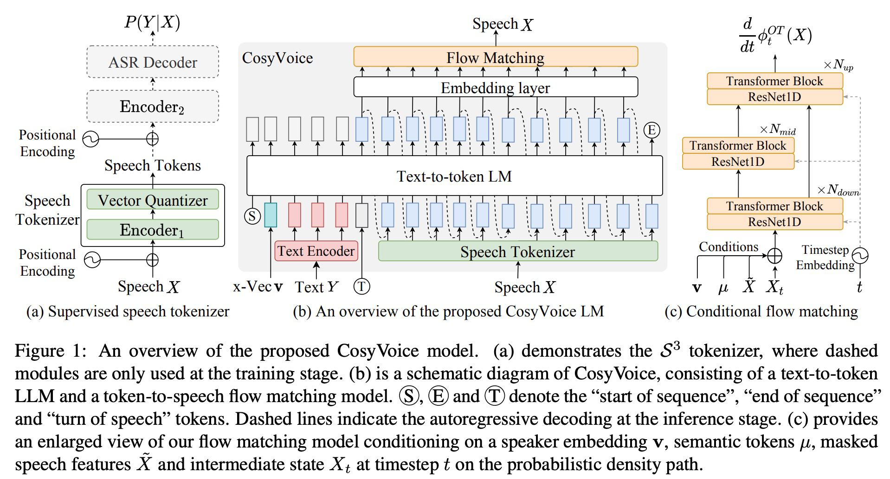
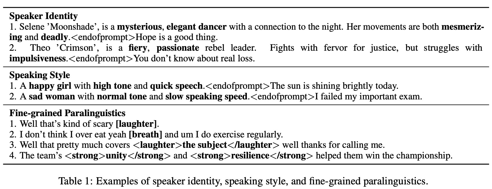

# CosyVoice: A Scalable Multilingual Zero-shot Text-to-speech Synthesizer based on Supervised Semantic Tokens

问题：Current speech tokens are learned in an unsupervised manner, which lacks explicit semantic information and alignment to the text.

方案：represent speech with supervised semantic tokens, which are derived from a multilingual speech recognition model by inserting vector quantization into the encoder.

CosyVoice=Codec-based synthesizer for Voice generation

模型：an LLM for text-to-token generation and a conditional flow matching model for token-to-speech synthesis.

实验结果：**supervised semantic tokens** significantly outperform existing unsupervised tokens in terms of content consistency and speaker similarity for zero-shot voice cloning.

创新点：

* integrate supervised speech tokens into TTS models增强生成语音的内容一致性和说话人相似性
* 提出了LLM+conditional flow matching的模型结构且不需要additional phonemizers and forced aligners
* 在LLM中引入了x-vector将语音建模分离成：语义，说话人以及韵律等成分，The LLM models the semantic content and prosody, while the conditional flow matching model captures timbre and environmental information

方法：

Coditional flow matching: convert speech tokens into a Mel spectrogram via a denoising process on the optimal path

使用HifiGAN vocoder将spectrogram转成音频。

**Supervised Semantic Tokens for Speech**

在ASR模型的基础上微调得到，这里用的是SenseVoice ASR模型。不同与往常的ASR模型，这里将encoder分成两个部分，并且在中间插入一个VQ层。

**Large Language Model for TTS**

speaker embedding vector：使用https://github.com/alibaba-damo-academy/ 3D-Speaker/tree/main/egs/3dspeaker/sv-cam++

训练的时候只使用cross- entropy 损失。

**Optimal-transport Conditional Flow Matching**

**Zero-shot In-context Learning**

*
*
*
* replication of an arbitrary voice with only a brief reference speech sample

  

  Rich Generation with Instruction

  指令微调版本：**CosyVoice-instruct** extends CosyVoice-base with enhanced instructionfollowing capabilities. Specifically, it supports controllability over various aspects such as speaker identity (i.e., speaker’s characteristics), speaking style (including emotion, gender, speaking rate, and pitch), and fine-grained paralinguistic features.

  We fine-tuned CosyVoice-base using this training data **without incorporating speaker embedding** in the autoregressive language model.

  ---

  数据集：

  数据收集：Throughout the collection process, we utilize specialized in-house tools for speech detection, signal-to-noise ratio (SNR) estimation, speaker diarization, and separation.

  训练数据集：

  Language Duration (hr)
* ZH 130,000
* EN 30,000
* Yue 5,000
* JP 4,600
* KO 2,200

Instruction training data

* Speaker Identity 101

* Speaking Style 407

* Fine-grained Paralinguistics 48

模型结构：

在ASR模型的前6层后加入VQ（使用单个4096大小的codebook），A800 8卡训练了21W步。

验证说话人相似度的时候使用：ERes2Net

评价语音情绪：使用emo2vec

开源的AED模型：https://github.com/qiuqiangkong/audioset_tagging_cnn/tree/master

标注150 million数据

情感模型：https://modelscope.cn/models/iic/emotion2vec_plus_large

标注30 million数据
