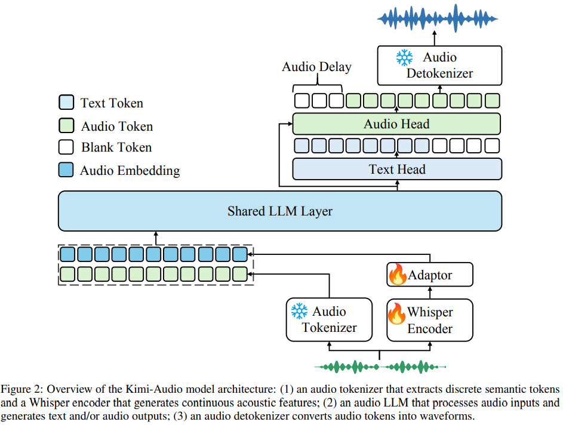
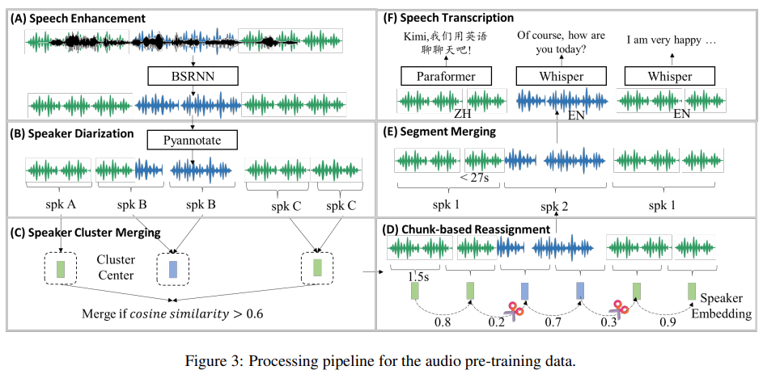
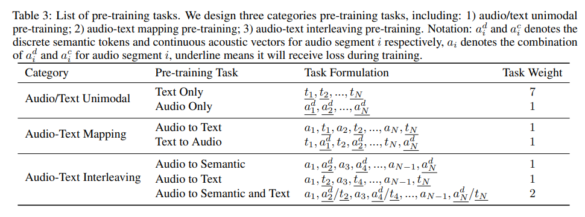

# Kimi-Audio Technical Report

202504最新音频理解sota模型的技术报告，包含模型结构，数据构建，训练方法，推理开发和效果评估等内容。

模型：12.5Hz的音频编码器，基于LLM的架构（输入连续特征输出离散的token），基于flow-matching的chunk-wise的detokenizer。

数据：1300W小时的预训练数据，包含speech，sound，music，构建高质量和多样的后训练数据pipline.

训练：基于LLM初始化，再音频和文本数据上进行继续预训练（carefully designed task），然后再一系列的音频相关任务上fine-turn.

评估：speech recognition, audio understanding, audio question answering, and speech conversation 多个方面的评估

---

* **架构**。我们的模型由三个部分组成：一个作为音频输入输出（I/O）的音频分词器和解分词器，以及一个作为核心处理部分的音频大语言模型（详见 2.1 节）。我们使用离散的语义音频标记作为音频大语言模型输入和输出的基本表示形式。同时，在输入时，我们将语义音频标记与连续的声学向量连接起来，以增强感知能力；在输出时，将其与离散的文本标记连接起来，以增强生成能力。通过这种方式，我们能够同时实现良好的音频感知和生成能力，便于进行通用的音频建模。我们减少了音频中每秒的标记数量，以弥合文本和音频序列之间的差距，并将语义音频标记和声学音频标记的压缩率都设置为 12.5 赫兹。关于离散语义标记和连续声学向量的音频分词器的详细设计，以及离散语义标记和文本标记的生成方法，将分别在 2.2 节和 2.3 节中介绍
* **数据**。为了实现当前最优（SOTA）的通用音频建模，我们需要在大量音频数据上对模型进行预训练，以便涵盖各种不同的场景。为此，我们爬取并处理了一个大规模的音频预训练数据集。我们开发了一个包括语音增强、说话人分离、转录、筛选等步骤的数据处理流程，以确保数据的高质量（详见 3.1 节）。为了支持多样化的音频处理任务，我们精心整理了大量特定任务的数据，用于有监督的微调（SFT）。我们展示了一种经济实惠的方法，即利用完全开放且可获取的数据源和处理工具来构建大部分的有监督微调数据，从而实现当前最优的性能，而无需依赖任何数据购买（详见 3.2 节）
* **训练**。为了在保持高知识容量和智能水平的同时，实现出色的音频理解/生成能力，我们使用预训练的大语言模型来初始化音频大语言模型，并精心设计了一系列预训练任务，以充分学习音频数据并弥合文本和音频之间的差距。具体而言，这些预训练任务可分为三类： 1) 纯文本和纯音频预训练，旨在分别从文本和音频领域学习知识； 2) 音频到文本映射，鼓励在音频和文本之间进行转换； 3) 音频 - 文本交错，进一步缩小文本和音频之间的差距（详见4.1节）。 在有监督微调阶段，我们开发了一种训练方法，以提高微调效率和任务泛化能力（详见4.2节）

---

### 架构

#### Audio Tokenizer

混合策略：整合离散语义token和完全连续的声学向量来表示音频信号。This tokenization allows the model to leverage the efficiency and semantic focus of discrete tokens while benefiting from the rich acoustic details captured by continuous representations.

我们引入了由GLM-4-Voice[84]提出的离散语义标记。这一组件采用了一个基于自动语音识别（ASR）模型的有监督语音分词器。

为了补充离散语义标记，我们引入了一种基于预训练的Whisper模型得到的连续特征表示，以增强我们模型的感知能力。由于Whisper特征的帧率为50赫兹，我们在Whisper特征提取器的基础上额外引入了一个适配器，将特征从50赫兹下采样到12.5赫兹。**下采样后的特征会被添加到离散语义标记的嵌入向量中，作为音频大语言模型的输入。**通过将离散语义标记与连续的Whisper特征相结合，我们的模型能够受益于高效且具有语义基础的表示以及细致的声学建模，从而为多样化的音频处理任务提供全面的基础。

#### Audio LLM

include the discrete semantic tokens of audio and the corresponding text tokens to improve the generation capability.

为了使模型既能生成音频语义标记，又能生成相应的文本回复，我们对标准的大语言模型架构进行了调整，将其构建为由具有共享功能和特定功能的组件组成。原始Transformer底层的很大一部分，即前几层，被用作共享层。这些层对输入序列进行处理，并学习跨模态表示，整合输入或上下文中来自文本和音频两种模态的信息。**在这些共享层的基础上，架构分化为两个包含Transformer层的并行头部**。第一个头部是文本头部，专门负责自回归地预测文本标记，从而形成模型的文本输出。第二个头部是音频头部，用于预测离散的音频语义标记。这些预测出的音频标记随后会被传递到音频解分词器模块，以合成最终的输出音频波形。

为了利用预训练的文本大语言模型 [76, 24, 13] 的强大语言能力，共享的Transformer层和文本头部的参数直接使用预训练的文本大语言模型的权重进行初始化。音频头部的各层则随机初始化。这种初始化策略确保了模型在学习有效处理和生成音频信息的同时，还能保留强大的文本理解和生成能力。

#### Audio Detokenizer

我们采用了与MoonCast [32] 相同的解分词器架构，该架构包含两个部分：1）一个流匹配模块，它将12.5赫兹的语义标记转换为50赫兹的梅尔频谱图；2）一个声码器，它从梅尔频谱图生成波形。为了减少语音生成延迟，我们设计了一种逐块流式解分词器。直观地说，我们可以将语义标记分割成块并分别进行解码，但在我们的初步实验中，这种方法在块边界处会出现不连贯的问题。**因此，我们提出了一种带有前瞻机制的逐块自回归流式框架。**

**逐块自回归流式框架。**我们将音频分割成若干块（例如，每块时长为1秒）：{c1, c2, …, ci, …, cN }，其中N是块的数量。首先，为了使语义标记（12.5赫兹）和梅尔频谱图（50赫兹）的序列长度相匹配，我们将语义标记以4倍的速率进行上采样。其次，在训练和推理过程中，我们应用逐块因果掩码，也就是说，对于块ci，所有之前的块cj（j < i）都作为提示信息。我们将块ci的梅尔频谱图记为mi，相应的离散语义音频标记记为adi。流匹配模型的前向步骤会将mi与高斯噪声混合，而后向步骤会去除噪声，**从而在条件adi和提示信息cj（j < i，且cj包含mj和adj）下得到干净的mi**。通过这样的设计，在推理过程中，当大语言模型生成一个块时，我们使用流匹配模型对其进行解分词，以得到梅尔频谱图。最后，我们使用一个基于BigVGAN [38] 的声码器为每个块生成波形。

**前瞻机制。**通过初步研究，我们发现生成的音频在块的边界处仍然存在不连贯的问题。尽管在扩散去噪过程中已经考虑了较长范围的历史上下文信息，但由于逐块因果注意力的特性，**边界位置的未来上下文信息无法被考虑到，这就导致了音频质量的下降**。因此，我们提出了一种前瞻机制。**具体来说，对于块ci，我们从块ci+1中取出未来的n个（例如4个）语义标记，并将它们连接到ci的末尾，形成cˆi。然后我们对cˆi进行解分词以生成梅尔频谱图，但只保留与ci对应的梅尔频谱图。这种机制无需训练，并且只会使第一个块的生成延迟n个标记的时间。**

### Data

#### Pretrain-Data

纯文本，纯音频，文本-音频混合数据，纯音频预训练数据涵盖了广泛的现实场景，包括有声读物、播客和访谈等，由大约1300万小时的原始音频组成，其中包含丰富的声学事件、音乐、环境声音、人类发声以及多语言信息。

**大多数音频语料库只包含原始音频，没有相应的文字转录内容、语言类型、说话人标注信息以及分割边界。此外，原始音频通常还包含不需要的干扰因素，比如背景噪音、回声以及说话人声音重叠等情况。**

我们开发了一种高效的音频数据自动处理流程，**以生成高质量的标注信息**，从而得到我们的多模态（音频-文本）数据。与之前主要侧重于生成没有上下文信息的高质量短音频片段的那些数据处理流程不同，我们的处理流程旨在提供带有连贯长程上下文信息的长音频标注。该处理流程按步骤包含以下关键部分，如图3所示，具体描述如下。

Speech Enhancement：为了抑制不必要的背景噪音和回声，我们基于频带分割循环神经网络（BSRNN）架构 [49] 开发了一个语音增强模型，如图3（A）所示。我们采用了与 [82] 中相同的超参数配置，运用该模型来进行48千赫兹的语音增强处理。根据经验，我们发现语音增强会去除环境声音和音乐，这可能对音频理解产生不利影响。因此，**在预训练阶段，我们以1:1的比例随机选择原始音频或增强后的音频。**

Segmentation by Diarization：

我们采用一种基于说话人分割驱动的方法来分割长音频。**我们使用PyAnnote工具包1进行说话人分割，该工具包可对音频进行分割并分配说话人标签。**然而，原始输出结果并非最优，因此我们开发了一个后处理流程，以解决先前分割结果中存在的问题：

* 说话人聚类合并。我们注意到，PyAnnote有时会给同一个实际说话人分配多个说话人标签，这就导致了说话人片段的碎片化。我们为每个初始聚类计算具有代表性的说话人嵌入向量，并将嵌入向量的余弦相似度大于0.6的聚类对进行合并。
* 基于分块的重新分配。初始的说话人分割偶尔会产生包含多个说话人的片段。为了提纯这些片段，1）我们首先将所有片段划分为1.5秒的块，然后2）对于每一对相邻的块，如果它们的余弦相似度低于0.5，我们就将它们视为属于不同的说话人，并将每个块重新分配给相似度最高的说话人聚类，如图3（D）所示。
* 片段合并。初始的说话人分割可能会导致片段长度变化很大，而且有时长度不切实际（短于1秒或长于100秒）。因此，我们迭代地合并标记为同一说话人的相邻片段（在重新分配步骤之后）。如果累积的片段长度超过27秒，或者两个片段之间的静音间隔大于2秒，合并过程就会终止，如图3（E）所示。 与基线的说话人分割输出相比，这个经过优化的说话人分割过程所得到的分割结果，能提供更准确且长度更一致的说话人轮次信息。

语音转录。为了获取每个语音片段的语言类型和文本转录内容，我们首先使用Whisper-large-v3模型 来检测所讲语言的类型。在这项工作中，我们仅保留英语和普通话片段以便进一步转录。对于英语片段，我们直接使用Whisper-large-v3模型来生成转录文本和标点标注。对于普通话片段，我们使用来自FunASR工具包3的Paraformer-Zh [20] 模型来生成转录文本以及字符级别的时间戳。由于Paraformer-Zh模型无法输出标点标注，我们采用以下策略添加标点标注：如果两个连续字符之间的时间间隔大于0.5秒但小于1.0秒，我们插入一个“逗号”；如果间隔超过1.0秒，我们插入一个“句号”。

In total, the cluster provides 3, 840 vCores, 30 TB of memory,**and 240 NVIDIA L20 GPUs**. Following extensive optimization, the pipeline achieves **a daily processing throughput of approximately 200, 000 hours of raw audio data.**

#### SFT Data

在预训练阶段之后，我们进行有监督微调（SFT），以提升Kimi-Audio在指令跟随和音频处理方面的性能。有监督微调的数据主要可分为三个部分：音频理解、语音对话以及音频转文本聊天。

Audio Understanding: 我们主要利用开源数据集来进行音频理解相关的工作。收集到的数据集涵盖6项任务：自动语音识别（ASR）、音频问答（AQA）、自动音频字幕生成（AAC）、语音情感识别（SER）、声音事件分类（SEC）以及音频场景分类（ASC）。这些数据集的详细信息以及在有监督微调（SFT）阶段相应的训练轮数见表1。除了这些开源数据集之外，我们还使用了55000小时的内部自动语音识别（ASR）数据，以及5200小时涵盖自动音频字幕生成（AAC）和音频问答（AQA）任务的内部音频数据。

Speech Conversation:

为了激发Kimi-Audio模型在不同对话场景中生成多样风格且富有表现力语音的能力，我们构建了大量的语音对话数据，这些数据由一系列用户查询和助手回复组成的多轮对话构成。对于用户查询，我们让大语言模型生成用户查询的文本内容，然后通过我们的Kimi-TTS系统将其转换为语音，其中提示语音是从一个包含超过12.5万种音色的大型音色库中随机选取的。对于助手回复，我们首先选择一位配音演员作为Kimi-Audio的发声者，并使用这单一音色合成具有合适风格和情感的助手回复内容。接下来，我们将介绍Kimi-Audio发声者的数据录制过程，以及用于合成多样风格和富有表现力的助手回复的Kimi-TTS和Kimi-VC系统。

**Kimi-Audio发声者的数据录制。** 为了在生成的语音中实现多样且极具表现力的风格和情感，我们选择了一位配音演员作为Kimi-Audio的发声者，并在专业录音棚中精心录制了这位发声者的数据集。我们预先定义了20多种用于录制的风格和情感，每种情感又进一步细分为5个等级，以体现不同的情感强度。对于每种风格和情感等级，我们都录制一段音频作为参考，以确保不同文本句子之间情感和风格的一致性。整个录制过程由一位专业录音导演指导。

**Kimi-TTS。** 我们开发了一个零样本语音合成（TTS）系统，名为Kimi-TTS，它仅需3秒的提示语音，就能生成语音，同时保留提示语音的音色、情感和风格。借助Kimi-TTS，我们能够为以下内容合成语音：1）利用大型音色库，为不同说话人/音色的查询文本合成语音；2）为具有Kimi选定的配音演员（即Kimi-Audio发声者）所录制的风格和情感的回复文本合成语音。与MoonCast [32] 的架构类似，Kimi-TTS使用大语言模型，根据提示语音和输入文本生成语音标记。然后，使用基于流匹配的语音解分词器生成高质量的语音波形。我们使用自动数据处理流程（3.1节）生成的约**100万小时的数据对Kimi-TTS进行训练，并应用强化学习进一步增强生成语音的鲁棒性和质量。**

Kimi-VC。由于配音演员很难录制出各种风格、情感和口音的语音，我们开发了一个语音转换（VC）系统，名为Kimi-VC，**它能够将不同说话人/音色的多样真实语音转换为Kimi-Audio发声者的音色，同时保留其风格、情感和口音。Kimi-VC基于Seed-VC框架 [46] 构建，在训练过程中通过音色转换模型引入了源音色扰动，这减轻了信息泄露问题，并确保了训练阶段和推理阶段的一致性。为了确保语音转换的高质量，我们使用Kimi选定的配音演员（即Kimi-Audio发声者）录制的语音数据对Kimi-VC模型进行微调。**

Audio-to-Text Chat:

为了帮助Kimi-Audio具备基本的聊天能力，我们从文本领域收集了开源的有监督微调数据，详见表2。然后，我们将用户的查询内容转换成具有多种音色的语音，从而得到了音频转文本聊天数据，其中用户的查询是语音形式，而助手的回复是文本形式。考虑到有些文本不容易转换为语音，我们对文本进行了几个预处理步骤：1）过滤掉包含复杂数学内容、代码、表格、复杂多语言内容或过长的文本；2）进行口语化改写；**3）将带有复杂指令的单轮问答数据转换为指令简单明了的多轮数据。**

### Train

Kimi-Audio的预训练阶段旨在从现实世界的音频和文本领域中学习知识，并在模型的潜在空间中使两者对齐，从而助力于诸如音频理解、音频转文本聊天以及语音对话等复杂任务。为此，我们从以下几个方面设计了一些预训练任务：1）在单模态（即音频和文本）中进行预训练，以便在4.1.1节中分别学习每个领域的知识；2）在4.1.2节中学习音频与文本之间的映射关系；3）**在4.1.3节中通过三个音频-文本交错任务来进一步弥合两种模态之间的差距。**

正式地说，给定一段原始音频A，数据预处理流程（见3.1节）会将其分割成一系列片段{S1, S2, …, SN }，每个片段Si（i ∈ [1, N]）由一段音频ai和相应的转录文本ti组成。此外，如2.2节所述，对于音频片段ai，我们会提取连续的声学向量aci和离散的语义标记adi。

为了符合我们在第2节中模型架构的设计，即采用离散的语义音频标记作为输入和输出的主要表示形式，同时在输入中添加连续的声学音频标记，在输出中添加离散的文本标记，我们将训练序列表示为{ac1/ad1/t1, ac2/ad2/t2, …, acN/adN/tN }，其中aci/adi/ti表示片段i的语义音频、声学音频和文本序列。我们通过在较短的序列后追加空白标记，来确保音频和文本序列的长度相同。实际的预训练片段可以是aci/adi/ti中的一个或两个，例如adi、ti、aci/adi或adi/ti。对于aci/adi，我们将连续向量aci和语义标记adi（语义标记将通过查找表转换为嵌入向量）相加，以得到最终的音频特征ai。因此，我们用ai来简记aci/adi。对于adi/ti，我们将语义标记和文本标记的查找嵌入向量作为输入添加进去，并如第2节所述，使用各自的头部来生成每个标记。

基于这种表示方法，我们在表3中制定了以下预训练任务，并介绍如下。

pretrain: We pre-train Kimi-Audio using 585B audio tokens and 585B text tokens with 1 epoch, use 1% tokens for learning rate warmup.

whisper参数在前20%的token是固定的，之后也会加入训练。

For a d i /ti , as the semantic audio token sequence is always longer than the text token sequence, the prediction of the semantic token is like a streaming text-to-speech task as in Section 4.1.2. Empirically, we find that the prediction of the first few semantic tokens is hard because the model needs to concurrently predict the next text token and its semantic audio token. We address this issue by delaying the prediction of the first several semantic audio tokens by prepending 6 special blank tokens (6 is determined by trading off the generation quality and latency according to preliminary experiments) to the semantic audio tokens.

SFT：

* considering the downstream tasks are diverse, we do not set special task switching operations, but use natural language as instructions for each task（每个任务有对应的instruction）;
* for instruction, we construct both the audio and text versions (i.e., the audio is generated by Kimi-TTS in a zero-shot way given the text) and randomly choose one during training;(可以是语音指令也可以是文本指令)
* to enhance the robustness of instruction following capability, we construct 200 instructions for ASR task and 30 instructions for other tasks by LLM and randomly choose one for each training sample.

300K hours of data for supervised fine-tuning.

训练流程：

we fine-tune Kimi-Audio on each data source with 2-4 epochs based on comprehensive ablation experiments.

Training of Audio Detokenizer：

use about 1M hours of audio from the pre-training data described in Section 3.1 and pre-train both the flow-matching model and the vocoder to learn audio with diverse timbre, prosody, and quality. Secondly, we adopt the chunk-wise fine-tuning strategy with a dynamic chunk size from 0.5 seconds to 3 seconds on the same pre-training data [32]. Finally, we fine-tune on the high-quality single-speaker recording data from the Kimi-Audio speaker.

**挑战与未来趋势**

尽管Kimi-Audio在构建通用音频基础模型方面取得了重大进展，但在追求构建更强大、更智能的音频处理系统的道路上，仍然存在一些挑战。我们在此阐述这些挑战，并指出一些令人期待的未来发展方向，具体如下：

• 从音频转录到音频描述。当前音频基础模型的预训练范式通常利用音频-文本预训练来弥合文本和音频之间的差距，其中的文本是通过自动语音识别（ASR）转录从音频（语音）中获取的。然而，文本转录侧重于口语内容（说了什么），却忽略了音频中的重要信息，比如副语言信息（例如，情感、风格、音色、语调）、声学场景以及非语言声音。因此，引入描述性文本（即音频字幕）来在更丰富的情境中描绘音频就显得尤为重要。将音频的转录文本和描述性文本都纳入其中，能使模型不仅更好地理解和生成口语语言，还能更好地处理复杂的声学环境，为开发更精细的多模态音频处理系统铺平道路，进而实现更通用、更灵活的音频智能。

• 更好的音频表示形式。目前的音频利用语义标记或声学标记作为其表示形式。语义标记通常是通过基于自动语音识别的辅助损失函数得到的，这种方式侧重于面向转录的信息，却无法捕捉对于理解和生成至关重要的丰富声学细节。声学标记通常是通过音频重建损失函数学习得到的，它侧重于面向描述的声学细节，却无法捕捉对于连接到文本智能至关重要的抽象语义信息。一个有价值的研究方向是开发一种既能整合面向转录的语义信息，又能融合面向描述的声学特征的表示形式，这种表示形式要涵盖诸如说话人身份、情感和环境声音等细微差别，同时还要保留高层次的抽象信息，这对于更复杂的音频理解和生成来说至关重要。

• 在音频建模中摒弃自动语音识别（ASR）和语音合成（TTS）。当前的音频基础模型在预训练和微调阶段都严重依赖自动语音识别（ASR）和语音合成（TTS）来生成训练数据。训练数据的质量受到自动语音识别的文本识别准确率以及语音合成中合成语音的表现力、多样性和质量的限制。这样一来，音频模型的表现就像是对现有自动语音识别和语音合成系统的一种复杂提炼。结果是，它们很难实现远超自动语音识别/语音合成上限的性能，也无法实现真正自主的音频智能。一个重要的未来发展方向是在不依赖基于自动语音识别/语音合成的伪音频数据，而是依赖原生音频数据的情况下训练音频模型，这有可能带来更高的性能上限。

---
