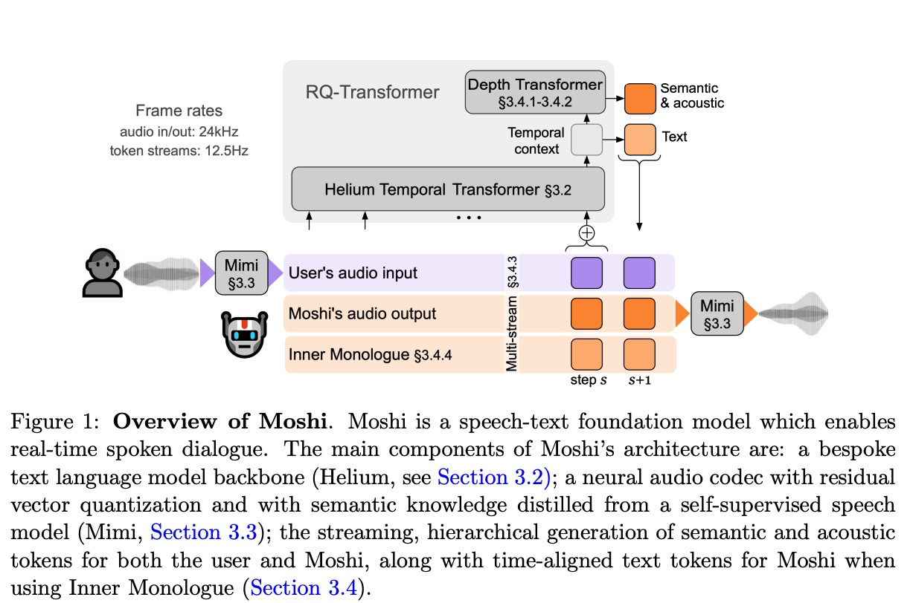
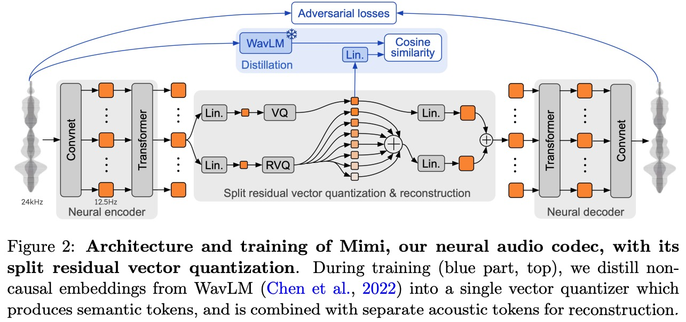
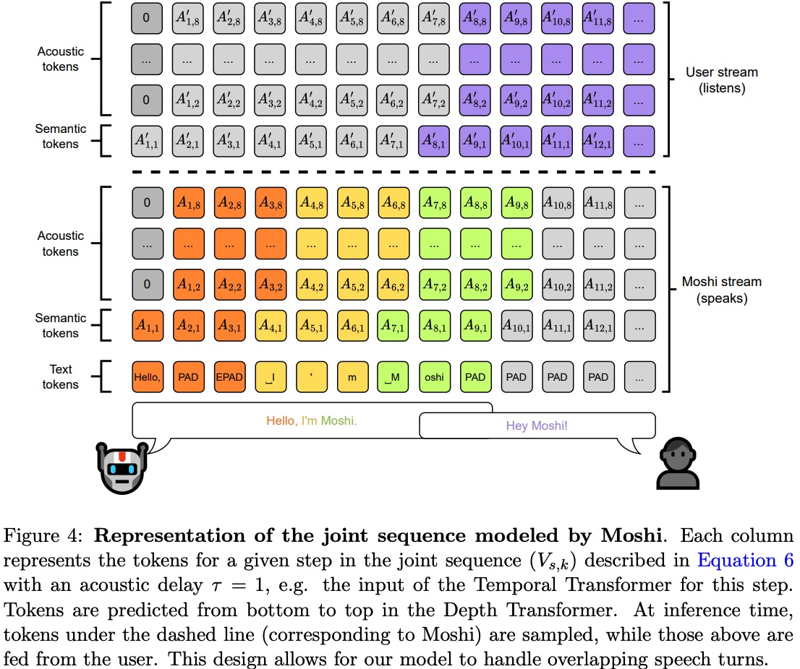

# Moshi: a speech-text foundation model for real-time dialogue

摘要：moshi 语音对话基础模型+全双工对话框架，传统的基于pipeline的方法：

* latency，高延迟（高达数秒的延迟）
* textual information bottleneck，文本作为交换的中间模态会丢失情感以及非语义的语音信息
* turn-based modeling，依赖于将对话划分为不同的轮次，没有考虑到语音重叠，打断和交互等情况

将对话视为独立的speech-to-speech生成问题，对于自己的语音和用户的语音分别建模构建并行的stream。

首先生成时间上对齐的文本token，并将其作为语音token的prefix。这种“内心独白”方法不仅显着提高了生成语音的语言质量，而且我们还说明了它如何提供流式语音识别和文本转语音。**延迟160ms, 低于真实对话的230ms延迟**

multi-stream audio language model：显式地将输入和输出音频流联合处理为两个自回归token流。

音频语言模型通常将此类声学标记与来自自监督语音模型的语义标记相结合，因为有必要在没有文本条件的情况下产生可理解的语音；从粗到细的生成（从语义到声学标记）对于生成一致的语音至关重要，

**我们将此层次结构扩展为使用文本标记作为语义标记的每个时间步前缀。**我们的实验表明，这不仅极大地提高了生成语音的长度和质量，而且还展示了如何在文本和音频标记之间强制延迟，以便从 Moshi 模型导出流式 ASR 和流式 TTS。

**旨在将文本模型的知识和推理能力与音频模型的生成能力结合起来。**

Inner Monologue decomposes speech into a chain of text, semantic and acoustic tokens, and predicts this structured sequence in a hierarchical manner.

---

模型：

Audio Tokenization:

Semantic tokens are typically not causal and can thus only be computed in an offline manner.

With 4 convolutional blocks and respective striding factors (4, 5, 6, 8), and a final 1D convolution with stride 2, Mimi’s encoder projects a 24kHz waveform to a latent representation of 12.5 frames per second and dimension D = 512.

quantizer dropout：only apply quantization 50% of the time, on a per-sequence basis, during training.

a multi-scale melspectrogram reconstruction loss along with a multi-scale STFT discriminator.

**Generative Audio Modeling**

RQ-Transformer：使用一个小的transformer网络在深度方向执行，一个正常的网络在时间方向上执行。

we find that introducing **a slight delay between the semantic and acoustic tokens** led to more stable generations，a delay of 1 or 2 steps between the semantic and acoustic features greatly improves the quality of the generation.

We insert W as the first sub-sequence in V , such that it acts as a prefix to the generation of semantic tokens.

Aligning text and audio tokens ？？

At any time step s, the model is input with 0, V1, . . . , Vs−1 and output an estimated probability distribution Vˆ s(0, V1, . . . , Vs−1).

Audio Data:

7 million hours 无监督使用Whisper做ASR，use a single stream of audio representing all speakers at once.

对话数据：Fisher 2000 hours of phone conversations，已经划分成了不同的stream（speak和listen）

source 170 hours of natural and scripted conversations between multiple pairs of participants, recorded with separate channels per speaker。

For both Fisher and this last dataset, we sample one speaker randomly as the main speaker (i.e., Moshi speaking), and put the other speaker on the second audio stream. For Fisher, the text stream only contains the transcription of the main speaker. **To obtain reliable timestamps, despite long silences in each stream, we use transcription obtained with the whisper-timestamped package (Louradour, 2023), along with the medium Whisper model.**
