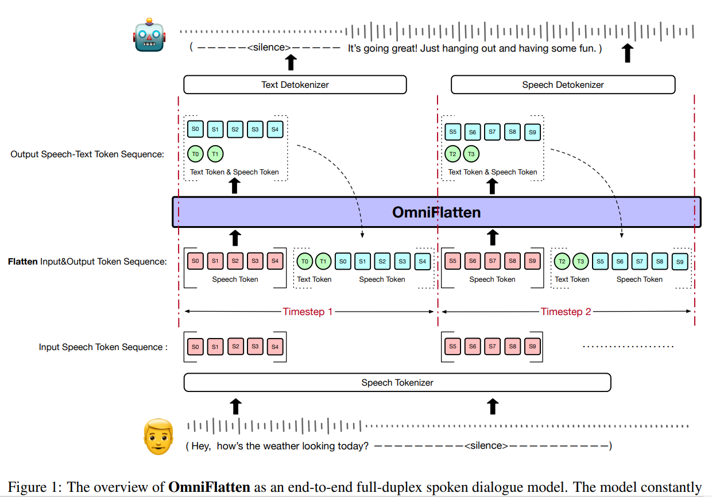
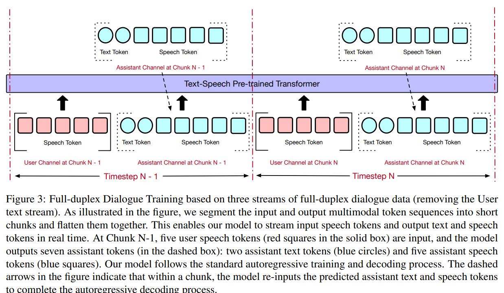

# OmniFlatten: An End-to-end GPT Model for Seamless Voice Conversation

全双工的人机交互：低延迟和自然交互，估计人类交流中的：打断、反馈语和重叠话语。本文提出了一个新的端到端的全双工对话模型，
能够以低延迟有效地对自然对话中固有的复杂行为进行建模。
为了实现全双工通信能力，我们提出了一种多阶段的后训练方案，该方案逐步将基于文本的大型语言模型（LLM）主干调整为一个语音-文本对话的大型语言模型，能够实时生成文本和语音，而无需修改主干大型语言模型的架构。训练过程包括三个阶段：模态对齐、半双工对话学习和全双工对话学习。

在所有的训练阶段中，我们使用展平操作对数据进行标准化，这使我们能够在不同的模态和任务中统一训练方法和模型架构。
我们的方法为开发高效、自然的端到端全双工口语对话系统提供了一种直接的建模技术和一个有前景的研究方向。

---

最近相关工作（全双工对话）：

* SyncLM：to predict interleaved chunks of User and Assistant speech units，通过时间分块方法实现了实时全双工交互。然而，对音频离散序列采用了去重策略。虽然这种方法降低了建模复杂性，但在重建过程中会引入错误。相比之下，我们不对离散化的音频标记应用任何额外的操作，避免了音频重建中的质量下降。。
* Moshi：Moshi models multiple streams of user’s speech input and system’s text and speech output in parallel, simplifying handling of full-duplex dialogues.但是这种方法：**not supported natively by GPT-based models and hence requires sophisticated designs such as acoustic delay and inner monologue.**
* VITA：这涉及一种由两个独立模块组成的双工方案：一个模型生成对用户查询的响应，而另一个模型则持续监测环境输入以有选择地提供更新的交互。

---

三阶段的训练方法：

第一阶段使用：speech-text modality alignment，使用ASR和TTS任务。

第二阶段微调：

**第一阶段：半双工对话训练**

* 将用户输入的文本流和语音流以及系统输出的文本流和语音流都展平为单个序列，即处理为四流数据并展平。
* 此阶段作为初步步骤，训练模型学习半双工对话能力，让模型初步适应同时处理文本和语音信息并进行对话交互。

**第二阶段：进一步训练以实现实时多流预测**

* 我们进一步移除用户输入文本流，对剩余的三个流进行细粒度的分块和对齐，展平这些块，并使用得到的展平三流数据继续训练模型。。
* 这一步旨在训练模型学习实时多流预测能力，从而实现全双工通信。

**第三阶段：专注语音到语音生成**

* 构建仅包含输入和输出语音的展平二流数据，并继续训练模型以专注于语音到语音的生成，从而消除对中间文本的依赖，进而减少延迟并使系统更接近实时交互。

**注意：移除文本的中间表示，是否会影响最终生成的效果？有没有其他更好的提升模型生成速度的方法**

评估：ASR和TTS的效果，using highperforming LLMs as evaluators，评估turn-taking performance，OmniFlatten is much better at handling system taking turn than user taking turn, with average response time of 160ms and 805ms for system taking turn and user taking turn, respectively.

---

方法：

**Audio Tokenization And Detokenization**

使用和**CosyVoice**中一样的tokenizer,The tokenizer utilizes an encoder and a Vector Quantization (VQ) layer to discretize audio signals into speech tokens with a single codebook of 4096 codes.

**Modality Alignment**

LLM: Qwen2-0.5B

训练ASR和TTS：

ASR Sample: [ASR][SOS]S\_seq[EOS][SOT]T\_seq[EOT]

TTS Sample: [T T S][SOT]T\_seq[EOT][SOS]S\_seq[EOS]

**Dialogue Learning**

三个阶段的训练：

两种模式基于turn和基于chunk的：

* 基于语音和文本标记的所有四个流进行半双工对话训练。如图所示，该模型在根据对话中实际说话者轮次组织的数据上进行训练。我们将对话中的多轮语音和文本标记展平为单个序列，按照以下模式：第 N - 1 轮中的用户语音标记（用红色方块表示）和用户文本标记（用红色圆圈表示），第 N 轮中的助手文本标记（用蓝色圆圈表示）和助手语音标记（用蓝色方块表示）。
* 基于三流全双工对话数据（移除用户文本流）的全双工对话训练。如图所示，我们将输入和输出的多模态标记序列分割成短块，并将它们一起展平。**这使得我们的模型能够实时流式传输输入语音标记以及输出文本和语音标记。**在块 N - 1 处，输入五个用户语音标记（实心框中的红色方块），模型输出七个助手标记（在虚线框中）：两个助手文本标记（蓝色圆圈）和五个助手语音标记（蓝色方块）。我们的模型遵循标准的自回归训练和解码过程。图中的虚线箭头表示在一个块内，模型重新输入预测的助手文本和语音标记以完成自回归解码过程。（**如何分割成对应的短块？**）
* 基于两流全双工对话数据的全双工对话训练（进一步移除助手文本流）。如图所示，与三流实验相比，我们进一步去除了助手文本标记。具体来说，我们将用户和助手的语音标记一起展平输入到模型中。在块 N - 1 中，我们输入 5 个用户语音标记（实心框中的红色方块），并且模型在块 N - 1 中输出 5 个助手语音标记（虚线框中的蓝色方块）。

  

  ---

  实验：
* 训练数据：

  * ASR和TTS：open-source and proprietary data
    * 公开数据：Aishell-3，LibriTTS，TED-LIUM，VoxPopuli，Librispeech，MLS
    * 10W小时的内部数据；
    * 30%公开数据，70%内部数据
  * Simulated Voice Chat Dataset：
    * 基于高质量的文本对话数据：
      * Alpaca，Moss，BelleCN，ultraChat
    * 然后，我们使用启发式规则并过滤掉不适合用于语音合成（TTS）的样本，例如，包含高比例非文本元素（如代码和数学表达式）的样本、英文或中文超过 200 个单词的样本，以及包含罕见或不寻常符号的样本。最后，我们保留了大约 36 万个基于轮次的多轮对话会话（半双工对话）。

我们基于这些文本的、多轮的基于轮次的对话创建伪全双工语音聊天。我们使用 CosyVoice 为经过过滤的文本对话中的每一轮合成音频。具体来说，我们首先从 Librispeech（Panayotov 等人，2015）和 3DSpeaker（Zheng 等人，2023b）数据集采样说话人嵌入，以获得用于音频合成的不同音色。在为每一轮合成语音后，我们使用一种模拟策略，将每个说话人的轮次音频安排在每个说话人通道中的适当时间点，以便这种对话模仿自然的交互，即每个说话人交替说话，偶尔有打断和停顿，并且上下文流畅。详细过程如下。

* 我们将合成的对话音频组织成两个通道，第一个通道是用户通道，另一个通道是助手通道。请注意，文本对话总是从用户开始，然后用户和助手交替说话。在用户语音结束后，我们立即开始下一个助手语音，以便助手迅速回答用户的提示。**在助手语音结束后，我们从正态分布中采样助手轮次结束时间和下一个用户轮次开始时间之间的停顿持续时间。**通过这种方式，我们创建了与用户和助手之间交错对话相对应的音频。
* 为了模拟用户音频通道的真实场景，我们还从 MUSAN 噪声数据集（Snyder 等人，2015）中采样背景噪声，并将噪声添加到用户音频通道中。我们将信噪比（SNR）控制在 15 分贝到 25 分贝之间。基于这个数据合成和模拟管道，我们总**共生成了 2000 小时的多通道口语对话数据**。基于这个数据集，我们将数据集的 1%用作验证集，另外 1%用作测试集，其余数据用作训练集。

**TODO：搭建一个自己的数据集合成管道！！**
