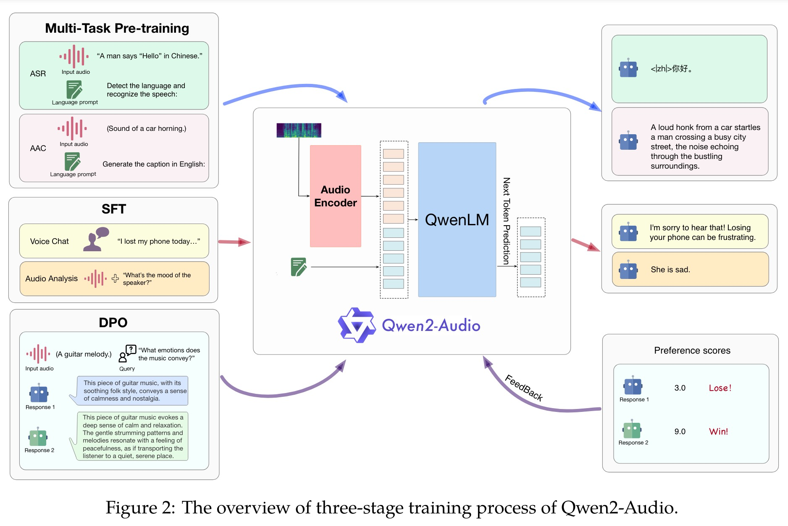

# Qwen2-Audio Technical Report

今年7月刚出的Qwen2-audio的技术报告，相较于之前的版本，简化了预训练的步骤（不需要复杂的分层tags）直接使用prompt来处理不同的任务和数据，并且扩大了训练数据量；通过实现两种不同的语音交互模式（语音对话，语音理解）来增强Qwen2-Audio的指令跟随能力；此外，还使用了DPO来增强回复的事实性以及友好性；在以语音指令为中心的评测上超过了SOTAs的模型，包括Gemini-1.5-pro；

* **在voice chat mode：用户可以直接通过语音沟通而不需要额外输入文字指令；**
* audio analysis mode：在交互过程中用户提供音频和文本指令；
  注意：这里没有使用任何的system prompt用于切换理解模式和对话模式；**由着强大的指令跟随能力，比如在一个同时包含环境生，多人对话以及一个语音指令，它能够正确识别出语音指令直接进行回复(自动识别其中的音频指令)；**同时，用户可以在对话中任意切换这两种模式，比如先是音频对话，后面使用

## Introduction

pre-train, post-train, 指令微调, DPO

## 方法

### 模型结构

音频编码+文本编码+Next-token-predict

音频编码部分：16K采样率，128-channel mel-spectrogram using a window size of 25ms and a hop size of 10ms. a pooling layer with a stride of two, 每一帧相当于40ms的音频长度；文本基座是Qwen-7B，总计8.2B parameters.使用的是whisper-large-v3.

**Pre-training**:将分层的tage转换为自然语言的prompt，提升泛化和指令跟随的能力；Speech 370K小时，sound：10K小时，music：140K小时；

**Supervised Fine-tuning：**

Our prelimilary study emphasizes the critical influence of the quality and complexity of SFT data on the model’s performance. Accordingly, a meticulously curated set of high-quality SFT data was collected, with rigorous quality control procedures implemented.（数据多样性和数据质量）

* Audio Analysis: 离线数据分析
* Voice Chat：在线交互
  他们是一起训练的，实际使用中这两种模式也是交叉的；

## 实验和评测

主要是在：AIR-Bench上进行评测；
